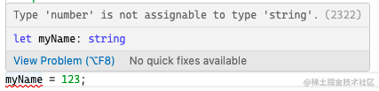

# TypeScript 概览

:::tip 来自
前端瓶子君 [来吧，一起对 TypeScript 扫盲吧！](https://mp.weixin.qq.com/s/WwaqNMVnI_uxXrJptYX1LA)
:::

## TypeScript 是什么？

简单理解就是 TypeScript 是增加了类型约束的 JavaScript，并且可以被编译成原生 JavaScript。 

+ 为什么需要 TypeScript？
  - a. 与弱类型的 JS 结合，在编译期间增强类型检查，提前发现可能的缺陷
  - b. 通过强类型约束可以放心地进行多人协作开发，保证项目的可维护性
  - c. 与代码编辑器集成，提供自动补全、引用跳转等实用功能，提升开发效率


## 基本用法
下面来看看 TypeScript 的基本用法

### 基本类型
#### 简单类型介绍
对于简单类型呢，就是 string、number、boolean、symbol、undefined 和 null，比较基础:

```ts
const str: string = 'hello';
const num: number = 1;
const isAfternoon: boolean = true;
let result: undefined = undefined;
let variable: null = null;
````
#### 自动推断类型
在某些场景，ts 是可以自己推断出类型的，比如:

```ts
// 初始化赋值的时候
let myName = 'Daniel Yang';

myName = 123; // 让我们看看将数字类型赋值给 myName 会发生什么？
```
duang~ ts 发出了报错:👇



对函数的返回值
