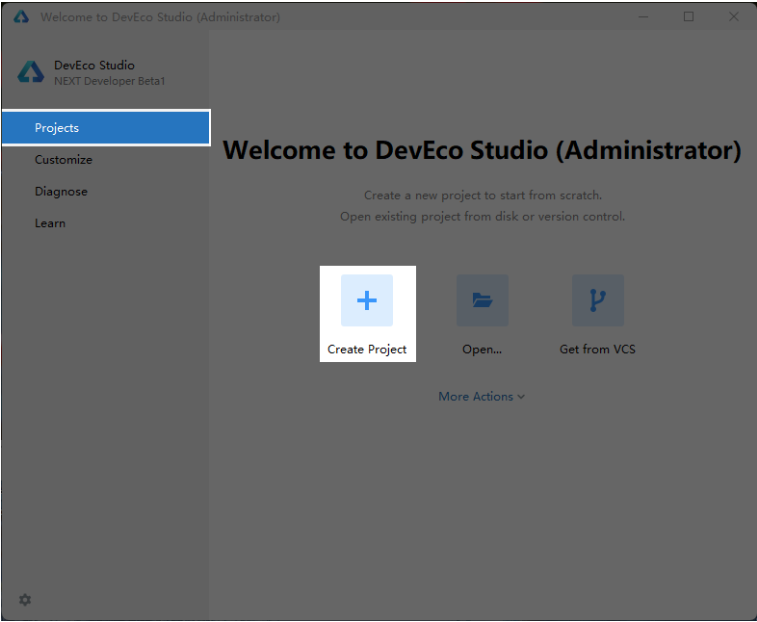
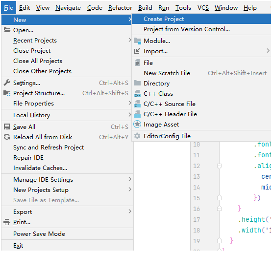
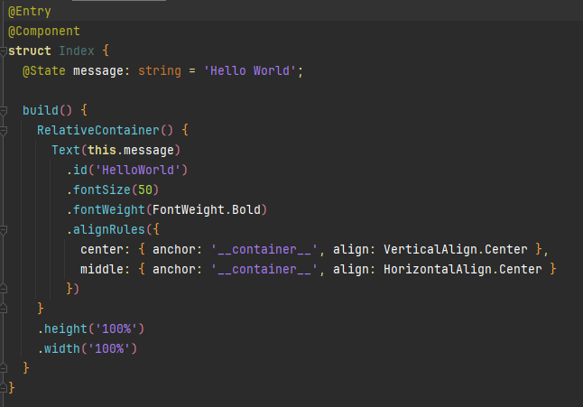

# 项目创建

## Step 1
打开DevEco Studio，通过如下两种方式，打开工程创建向导界面：

> 如果当前未打开任何工程，可以在DevEco Studio的欢迎页，选择Create Project开始创建一个新工程。
> 

> 如果已经打开了工程，可以在菜单栏选择File > New > Create Project来创建一个新工程。
> 

## Step 2
根据工程创建向导，选择创建Application。选择Empty Ability模板，然后单击Next，进入配置界面。

## Step 3
配置项目名称。

::: tip 注意
检查Bundle name和Save location是否与命名一致，一般会根据Project name自行更新，也可以根据需要自行更改。
:::

选择Compatible SDK为5.0.0(12)，在编译构建时，DevEco Studio会根据指定的Compatible SDK版本进行编译打包。

其中，Compatible SDK需要跟随版本变化变更选择。

DevEco Studio会默认勾选除‘Car’以外的全部Device type，保持该选项即可。

## Step 4
单击Finish，工具会自动生成示例代码和相关资源。

## Step 5
在Project导航栏中选中 entry -> src -> main -> ets -> pages -> Index.ets，即可看到初始创建项目的模板代码。

其中，
- @Component装饰器装饰了struct关键字声明的数据结构Index。Index被@Component装饰后具备组件化的能力，通过实现build方法描述UI。
- @Entry装饰的@Component将作为UI页面的入口。在单个UI页面中，最多可以使用@Entry装饰一个自定义组件。
- 界面由RelativeContainer相对布局容器作为根容器，RelativeContainer支持容器内部的子元素设置相对位置关系，适用于界面复杂场景的情况，对多个子组件进行对齐和排列。
- 通过Text组件展示一段文本
- 文本信息由@State装饰器装饰的状态变量message驱动。
- Text组件定义了组件标识id为HelloWorld，用于唯一指定组件。
- 定义字体大小fontSize取值为50；定义文本的字体粗细fontWeight取值为Bold，即字体较粗。
- alignRules属性用于指定设置在相对容器中子组件的对齐规则，仅当父容器为RelativeContainer时生效，在这里定义Text组件横向居中和纵向居中。

## 修改APP的名称
修改entry/src/main/resources/zh_CN/element/string.json文件，修改EntryAbility_label的value。

## 修改APP的图标
替换entry/src/main/resources/base/media文件夹中的background.png和foreground.png图片。