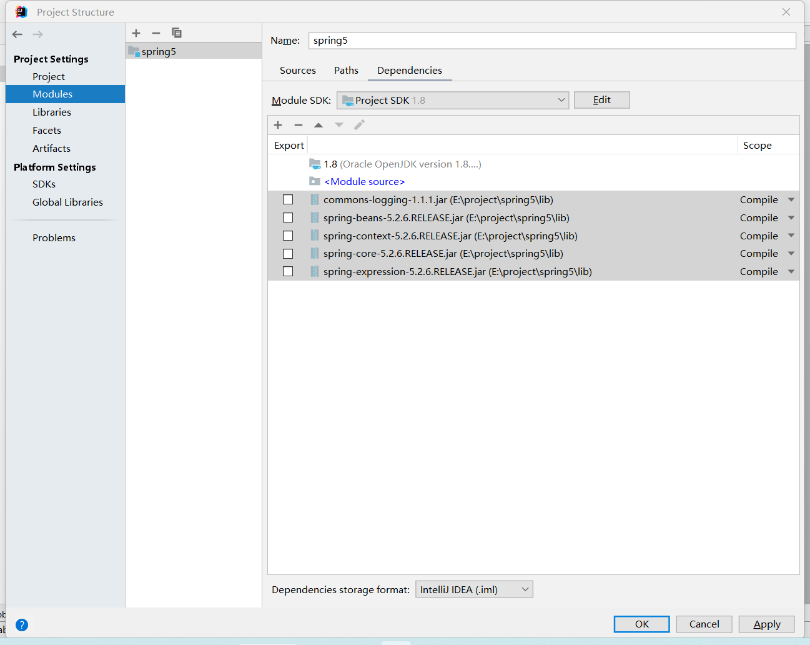

# 概述
1. 轻量级 JavaEE框架
2. 解决企业应用的复杂性
3. 核心部分： IOC AOP
   1. IOC：控制反转，把创建对象交给spring 进行管理
   2. AOP：  面向切面，不修改源代码进行功能增强
4. 特点
   1. 方便解耦，简化开发
   1. Aop编程支持
   1. 方便程序测试
   1. 方便和其他框架进行整合
   1. 方便进行事务操作
   1. 降低API开发难度


下载地址：[repo.spring.io](https://repo.spring.io/ui/native/release/org/springframework/spring/5.2.6.RELEASE/)

## 创建spring5 工程
1. 创建java工程

2. 导入jar包，基本功能至少包括 beans、context、core、expression、日志

   

3. 实现普通代码

   ```java
   public class User {
     public void add(){
       System.out.println("add...");
     }
   }
   
   ```

   

4. 创建spring配置文件，配置文件中配置创建的对象

   1. 创建项xml文件

   2. 配置对象创建（我认为是对象的代理）

      ```xml
      <?xml version="1.0" encoding="UTF-8"?>
      <beans xmlns="http://www.springframework.org/schema/beans"
             xmlns:xsi="http://www.w3.org/2001/XMLSchema-instance"
             xsi:schemaLocation="http://www.springframework.org/schema/beans http://www.springframework.org/schema/beans/spring-beans.xsd">
          <!--配置user对象-->
          <bean id="user" class="com.spring5.study.User"></bean>
      </beans>
      ```

5. 进行测试代码编写

   ```java
   package com.spring5.study.test;
   
   import com.spring5.study.User;
   import org.junit.Test;
   import org.springframework.context.ApplicationContext;
   import org.springframework.context.support.ClassPathXmlApplicationContext;
   
   public class TestSpring5 {
     @Test
     public void testAdd() {
       // 1. 加载配置文件
       ApplicationContext context = new ClassPathXmlApplicationContext("bean1.xml");
   
       // 2. 获取配置创建的对象
       User user = context.getBean("user", User.class);
       System.out.println(user);
       user.add();
     }
   }
   
   ```

   

