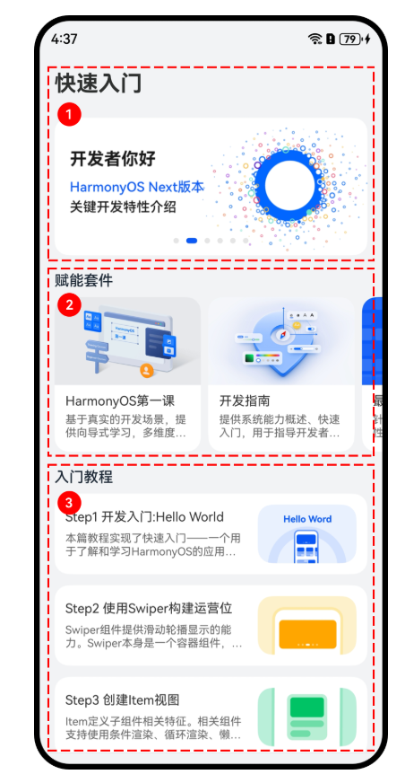

# 应用架构设计基础

## MVVM模式
ArkUI采取MVVM = Model + View + ViewModel模式，其中状态管理模块起到的就是ViewModel的作用，将数据与视图绑定在一起，更新数据的时候直接更新视图。

:::tip
ArkUI中，model为我们定义的数据结构和数据来源，通过ArkUI提供的装饰器@State等装饰对应的数据，就提供了响应式能力，model数据的变化能够触发UI的更新。
:::

### 目录
:::info 目录结构
为了让代码更加清晰，容易维护，我们需要对代码进行分层管理，常见的数据结构放置在model文件夹中，UI组件放置在view文件夹中，并以对应的组件名命名。
:::

- 建立model文件夹。在entry/src/main/ets文件夹下点击右键 - > new - > Directory。文件夹命名为model。
  > model文件夹用于存储数据模型。它表示组件或其他相关业务逻辑之间传输的数据，是对原始数据的进一步处理。
- 创建view文件夹，用于存储UI组件.在entry/src/main/ets文件夹下点击右键 - > new - > Directory，命名为view，用于存放页面相关的自定义组件。

## 三层架构
:::tip
[官网三层架构介绍](https://developer.huawei.com/consumer/cn/codelabsPortal/carddetails/tutorials_Next-BasicArchitectureDesignPart2)
:::

前面我们介绍了MVVM的目录组织方式，一般适用于单个模块内文件组织，为了更好地适配复杂应用的开发，建议采用三层架构的方式对整个应用的功能进行模块化，实现高内聚、低耦合开发。前面我们介绍了MVVM的目录组织方式，一般适用于单个模块内文件组织，为了更好地适配复杂应用的开发，建议采用三层架构的方式对整个应用的功能进行模块化，实现高内聚、低耦合开发。

### 三层架构设计
“一次开发，多端部署”推荐在应用开发过程中使用如下的“三层工程结构”

:::info 三层工程结构如下

 - commons（公共能力层）：用于存放公共基础能力集合（如工具库、公共配置等）。commons层可编译成一个或多个HAR包或HSP包，只可以被products和features依赖，不可以反向依赖。
 - features（基础特性层）：用于存放基础特性集合（如应用中相对独立的各个功能的UI及业务逻辑实现等）。各个feature高内聚、低耦合、可定制，供产品灵活部署。不需要单独部署的feature通常编译为HAR包或HSP包，供products或其它feature使用。需要单独部署的feature通常编译为Feature类型的HAP包，和products下Entry类型的HAP包进行组合部署。features层可以横向调用及依赖common层，同时可以被products层不同设备形态的HAP所依赖，但是不能反向依赖products层。
 - products（产品定制层）：用于针对不同设备形态进行功能和特性集成。products层各个子目录各自编译为一个Entry类型的HAP包，作为应用主入口。products层不可以横向调用。

:::