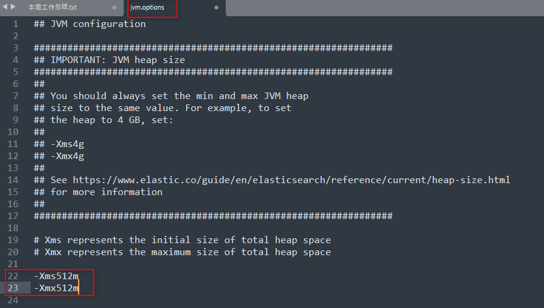
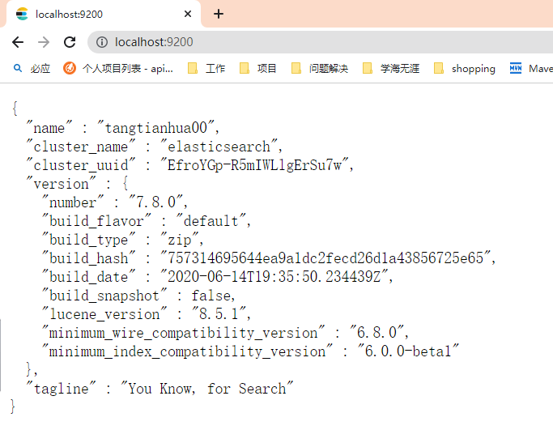
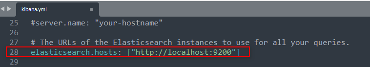
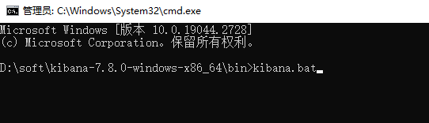
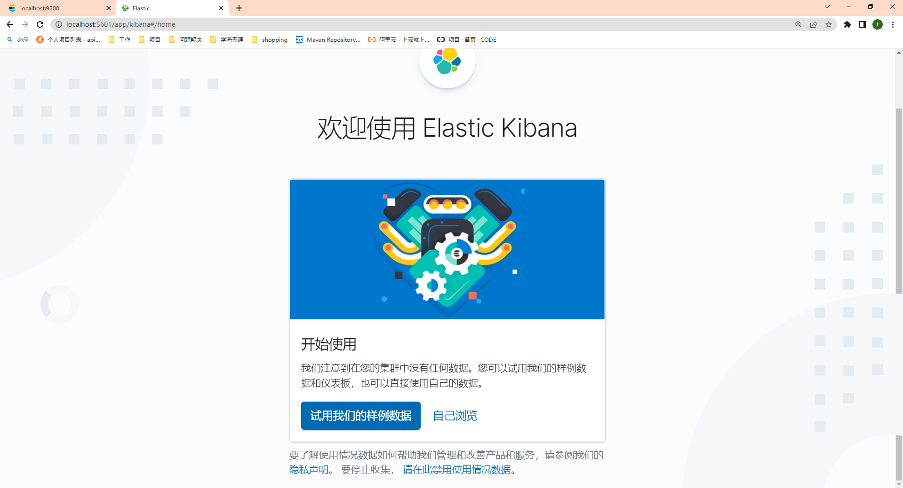
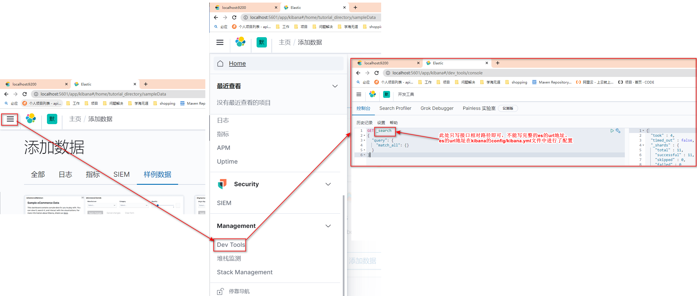
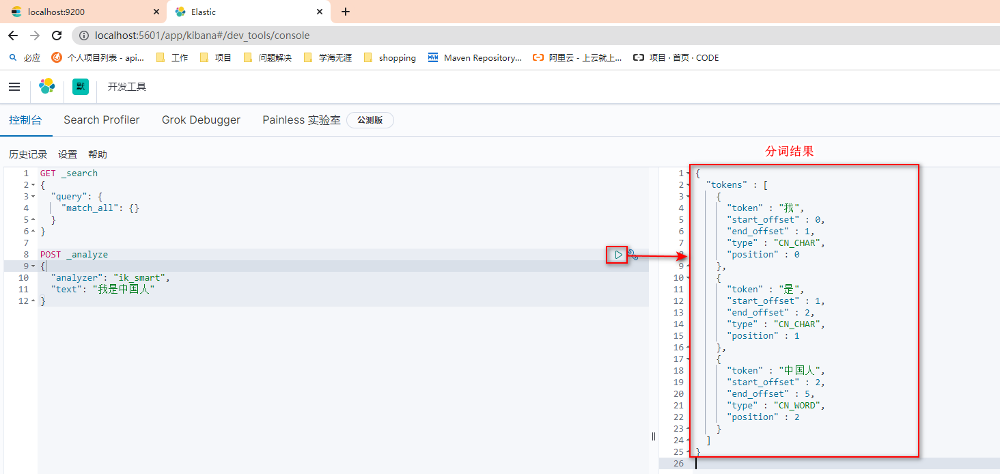

# 2 ES相关工具的安装与使用

## 2.1 Elasticsearch：7.8.0

* 解压即可使用。
* 可以在config/jvm.options修改虚拟机配置：在22行和23行改成“512m”
  

* 双击bin/elasticsearch.bat即可完成启动
* 通过 http://localhost:9200 进行访问测试

## 2.2 Kibana：7.8.0

Kibana是Elastic · stack官方提供的客户端，有自动补全的代码提示功能。

* 解压即可使用。
* 修改配置文件config/kibana.yml：
  
* 使用cmd命令行启动：
  
* 通过 http://localhost:5601 访问测试：
  
* 使用：
  

## 2.3 安装ik分词器：7.8.0

下载地址：https://github.com/medcl/elasticsearch-analysis-ik/releases/download/v7.8.0/elasticsearch-analysis-ik-7.8.0.zip

* 安装：将压缩包复制到es安装路径下的plugins文件夹下，解压，并将文件夹名称改为“ik”，最后删除压缩包，如下：
  

* 重启es和kibana
* 测试：
  