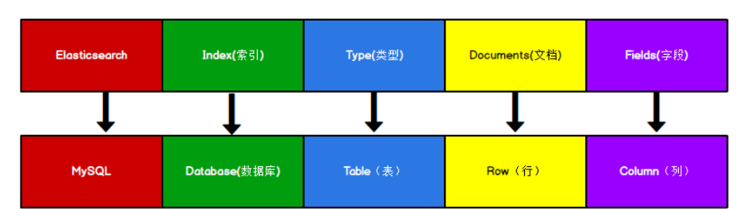

# 3 核心概念

## 3.1 ES VS MySQL

其中，Index可以看做一个库，Types相当于表，Documents相当于表的行。但是Types的概念已被逐渐弱化，ES6.X中，一个index下已经只能包含一个type，ES7.X中Types中的概念已被删除。

## 3.2 索引（库） Index
一个索引就是一个拥有几分相似特征的文档的集合

## 3.3 类型 Type
在7.x中默认不再支持自定义索引类型，默认类型为_doc

## 3.4 文档 Document
一个文档是一个可被索引的基础信息单元，也就是一条数据。

文档以JSON格式来存储。

在一个index/type中可以存放任意多个文档。

## 3.5 字段 Field
相当于数据表的字段，对文档数据根据不同属性进行的分类标识。

## 3.6 映射 Mapping
mapping是处理数据的方式和规则方面做一些限制，如某个字段的数据类型、默认值、分析器、是都被索引等。

可以类比于MySQL创建表字段时，给字段添加的约束。