# 4 es基本操作

## 4.1 分词器

常用的是ik中文分词器。

## 4.2 索引操作

### 4.2.1 创建索引
> 直接指定索引名

```
PUT /索引名
```
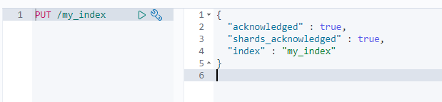

> 指定主副分片数

**分片只有在集群中才有效果，且主副分片分布在不同节点中。**

```
// 当未指定主副分片时，es7.X均默认为1
PUT /索引名
{
  "settings": {
    "number_of_shards": 3, // 分片数
    "number_of_replicas": 2 // 备份数
  }
}
```

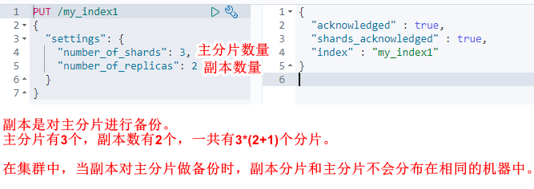

### 4.2.2 查看索引

>查看所有索引
```
GET /_cat/indices?v
```
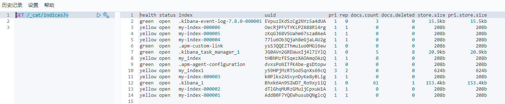


>查单个索引
```
GET /索引名
```
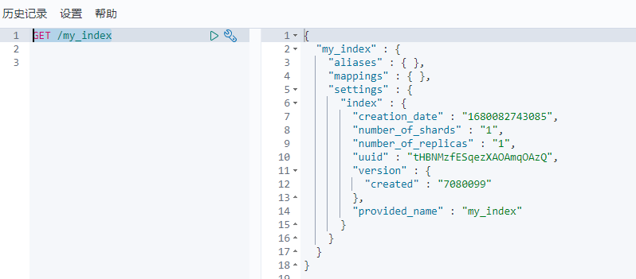

### 4.2.3 删除索引
```
DELETE /索引名
```
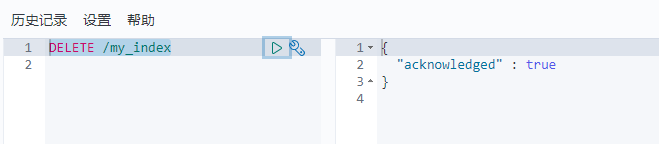

## 4.3 文档操作
### 4.3.1 创建文档
```
PUT /索引名/类型/id
{
    json类型的数据
}
// 类型：默认为_doc
// id： 文档的主键
```
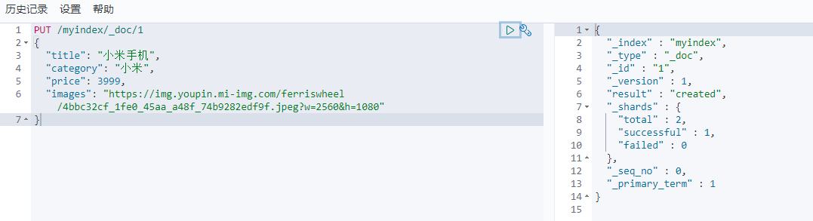

### 4.3.2 查看文档
```
GET /索引名/类型/id
// 类型：默认为_doc
// id： 文档的主键
```
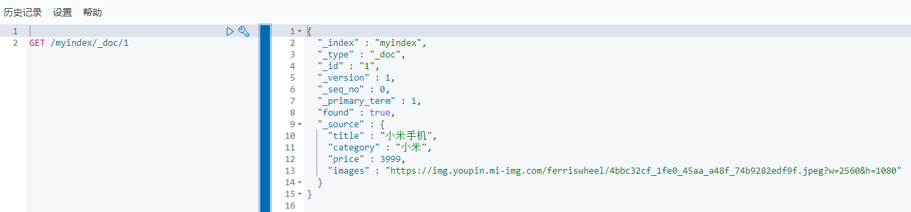

### 4.3.3 修改文档
```
PUT /索引名/类型/id
{
    json类型的数据
}
// 类型：默认为_doc
// id： 文档的主键
```
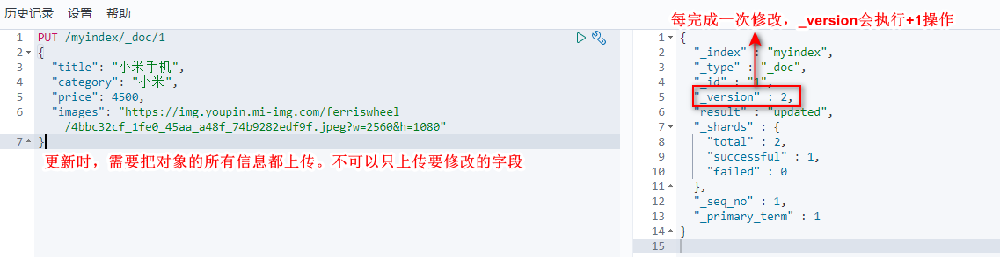

### 4.3.4 修改局部属性
```
POST /索引名/_update/id
{
    "doc" {
        "属性名": "属性值"
    }
}

// id： 文档的主键
```
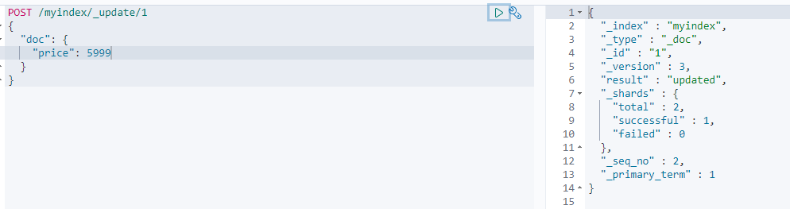


### 4.3.5 删除文档
```
DELETE /索引名/类型/id

// 类型：默认为_doc
// id： 文档的主键
```
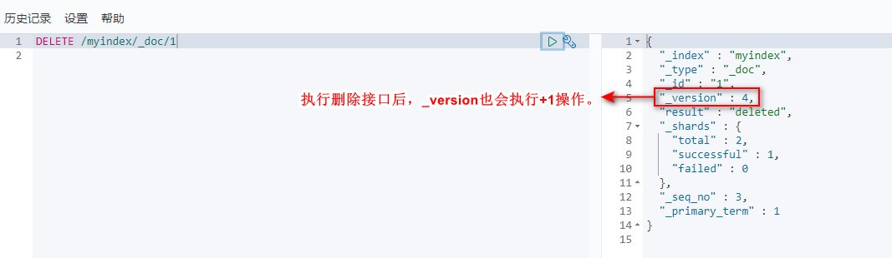

注意：

* 删除后，调用文档查看接口，返回的found值为false
* 调用查询所有索引接口，可看到当前索引下的文档数为1。
* 以上说明，**执行删除文档操作后，es并没有立刻将数据删除**。
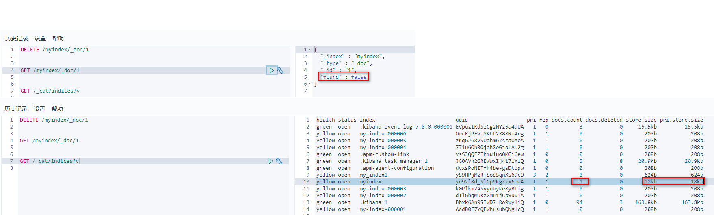

### 4.3.6 批量操作
```
POST _bulk
{"actionName": {"index": "indexName","type": "typeName","_id": "id"}}
{"field1": "value1","field2": "value2",...}
{"actionName": {"index": "indexName","type": "typeName","_id": "id"}}
{"field1": "value1","field2": "value2",...}
...
// actionName：create、delete等增删改查都可以
// index： 值为索引名称
// type： 可省
// _id： 索引id
```
**注意：以上单个json对象不允许换行**

>批量添加

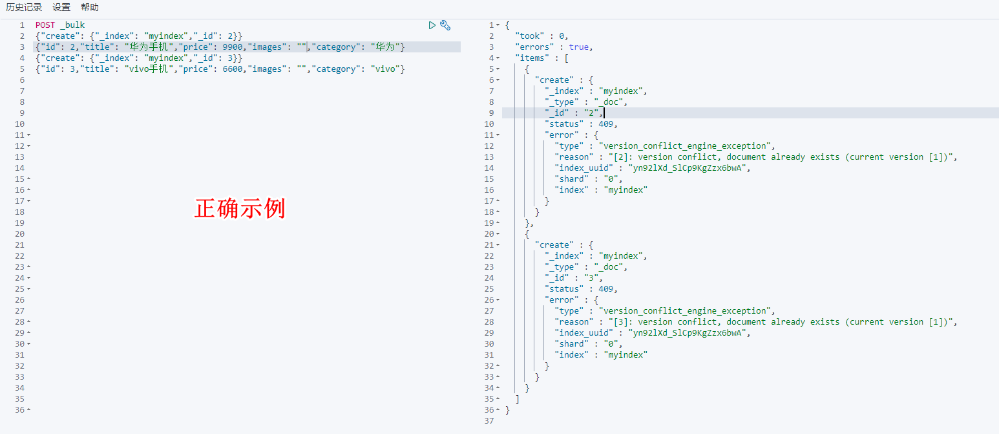
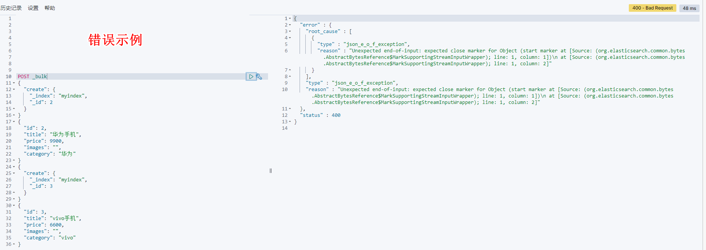

> 批量删除

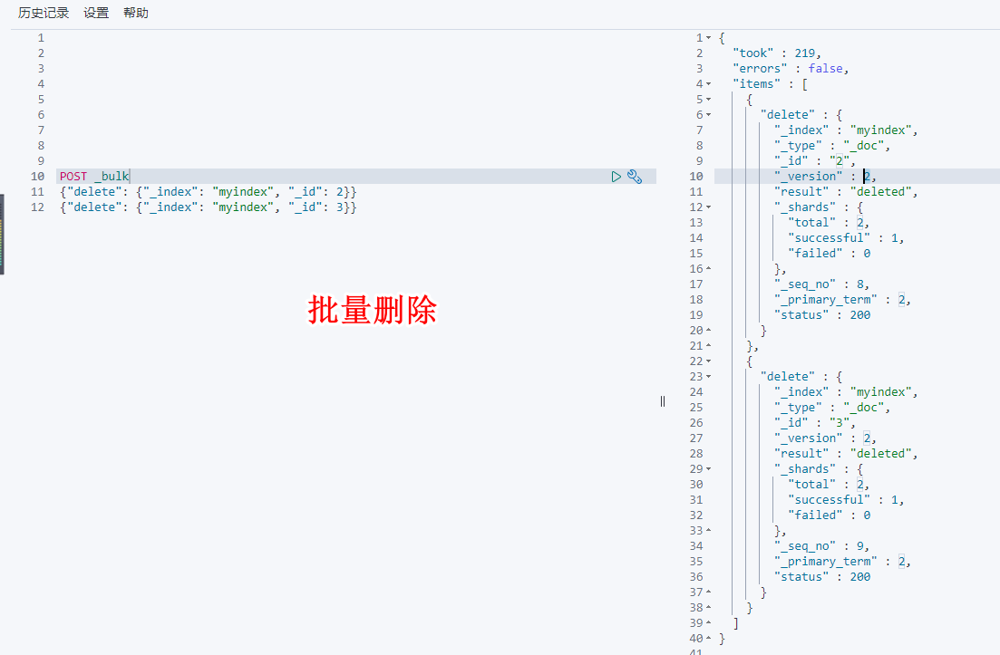

## 4.4 映射
>概念

有了索引，就相当于有了数据库中的database。

索引库中的映射，类似于database中的表结构（table）。创建数据库表需要设置字段名称、类型、长度、约束等，索引库也一样，需要知道这个类型下有哪些字段，每个字段都有哪些约束信息，这就叫做映射。

**映射是可以自动创建的。** 在向文档中插入第一条数据的时候，默认创建映射。

### 4.4.1 查看映射

```
GET /索引名/_mapping
```
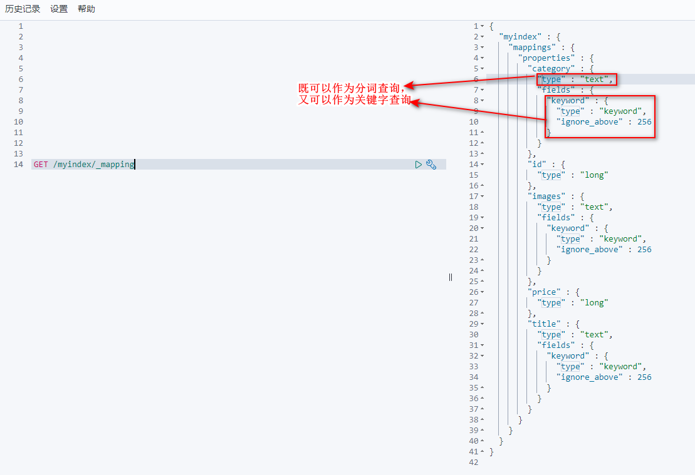

### 4.4.2 动态映射

>概念

映射是可以自动创建的。在文档写入ES时，会根据文档字段**自动识别类型**，这种机制被称为**动态映射**。

> 映射规则对应


| 数据      | 对应类型       |
| --------- | ---------------|
|  null      | 字段不添加    |
| true或false  | boolean  |
| 字符串 |text  |
| 数值 | long |
| 小数  | float  |
| 日期  | date |

> 注意

很少有使用动态映射的

### 4.4.3 静态映射

>概念

静态映射是指在ES中事先定义好映射，即手动映射，包含文档的各终端类型、分词器等，这就是静态映射。

一般都会选择使用静态映射。

>创建映射举例

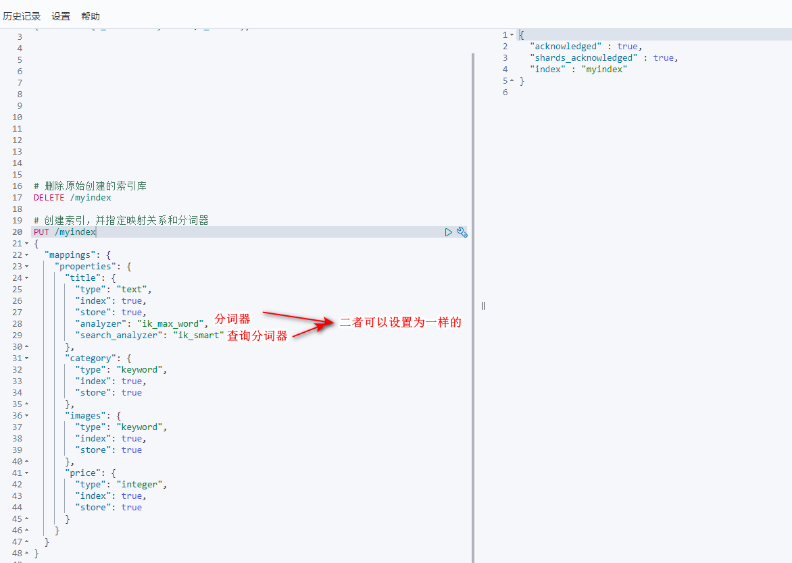

>说明：type分类如下

* 字符串类型：text（支持分词）、keyword（不支持分词）
    * text：字符串类型。该类型被用来索引长文本，在创建索引前就会将这些文本进行分词，转化为词的组合，建立索引；允许es来检索这些词，text类型不能用来排序和聚合。
    * keyword：字符串类型。该类型不能分词，可以被用来检索过滤、排序和聚合。keyword不可用text进行分词模糊检索。
* 数值型：long、integer、short、byte、double、float
* 日期型：date
* 布尔型：boolean
