# 5 DSL高级查询

## 5.1 DSL 概述

> 定义

Query DSL概述：领域专用语言，es提供了基于JSON的DSL来定义查询。即ES专用查询语句。

> 关键字概览

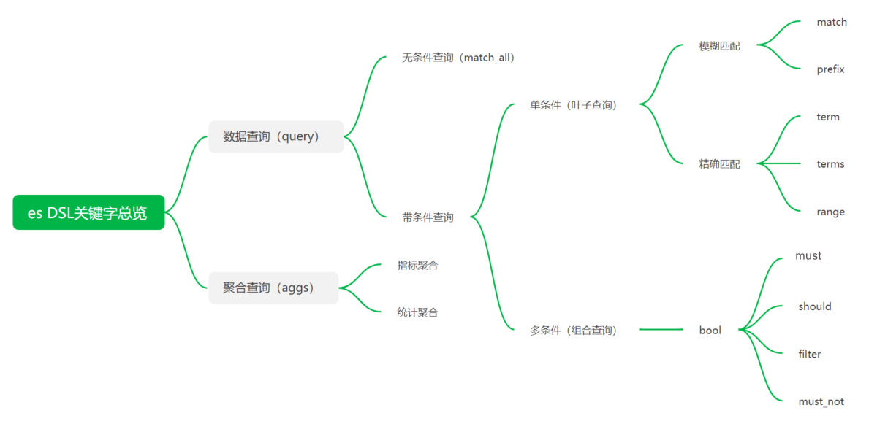


> 准备数据

```
# 创建索引
PUT /my_index
{
  "mappings": {
    "properties": {
      "title": {
        "type": "text",
        "index": true,
        "store": true,
        "analyzer": "ik_max_word", 
        "search_analyzer": "ik_smart"
      },
      "category": {
        "type": "keyword",
        "index": true,
        "store": true
      },
      "images": {
        "type": "keyword",
        "index": true,
        "store": true
      },
      "price": {
        "type": "integer",
        "index": true,
        "store": true
      }
    }
  }
}

# 批量插入
POST _bulk
{"create": {"_index": "my_index", "_id": "1"}}
{"id": 1, "title": "华为笔记本电脑", "category": "华为", "image": "https://res.vmallres.com/pimages//uomcdn/CN/pms/202207/gbom/6941487272235/800_800_87118CF3AD83118D78E55054E46F7B6Bmp_tds.png", "price": 9999}
{"create": {"_index": "my_index", "_id": "2"}}
{"id": 2, "title": "华为手机", "category": "华为", "image": "https://res.vmallres.com/pimages//uomcdn/CN/pms/202303/gbom/6941487294084/800_800_0DF324603CC084E9EB48C50FBB9CF94Amp.png", "price": 12999}
{"create": {"_index": "my_index", "_id": "3"}}
{"id": 3, "title": "VIVO手机", "category": "vivo", "image": "https://shopstatic.vivo.com.cn/vivoshop/commodity/43/10008043_1671156911639_750x750.png", "price": 12999}
```

## 5.2 DSL使用-单条件查询

### 5.2.1 查询所有（match_all）

```
GET /索引名/_search
```

或

```
GET /索引名/_search
{
  "query": {
    "match_all": {}
  }
}
```

### 5.2.2 匹配查询（match）

```
GET /索引名/_search
{
  "query": {
    "match": {
      "字段名": "字段值"
    }
  }
}
```

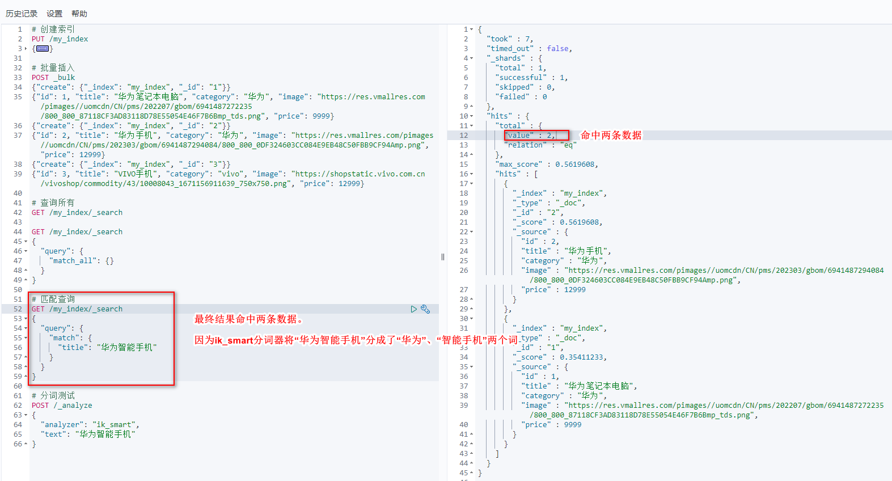

### 5.2.3 补充：条件删除

将查询到的记录删除

```
POST /索引名/_delete_by_query
{
  "query": {
    "match": {
      "字段名": "要查询的信息"
    }
  }
}
```

### 5.2.4 多字段匹配

```
POST /索引名/_search
{
  "query": {
    "multi_match": {
      "query": "要查询的信息",
      "fields": ["字段1", "字段2", ...]
    }
  }
}
```

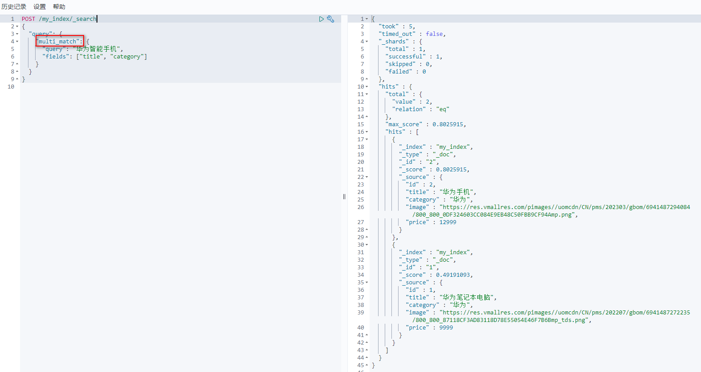

### 5.2.5 前缀匹配

> 概念

前缀匹配是说，在分词结果中，如果某个分词的前缀和要查询的信息一样，就会将该记录返回。

比如，“华为手机”的分词结果是[“华为”、“手机”]。当使用前缀查询输入的查询信息是“手机”或者“手”等时，会将该记录返回；当输入的查询信息是“机”时，该记录无法返回。

```
POST /索引名/_search
{
  "query": {
    "prefix": {
      "字段名": {
        "value": "要查询的信息"
      }
    }
  }
}
```


## 5.2.6 关键字精确查询（term）

> term

查询信息不会进行分词

```

POST /索引名/_search
{
  "query": {
    "term": {
      "字段名": {
        "value": "查询信息"
      }
    }
  }
}
```

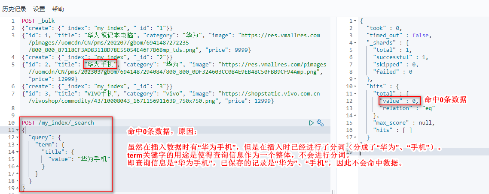

### 5.2.7 多关键字精确查询（terms）

```
POST /索引名/_search
{
  "query": {
    "terms": {
      "字段名": [
        "查询关键字1",
        "查询关键字2"
      ]
    }
  }
}
```

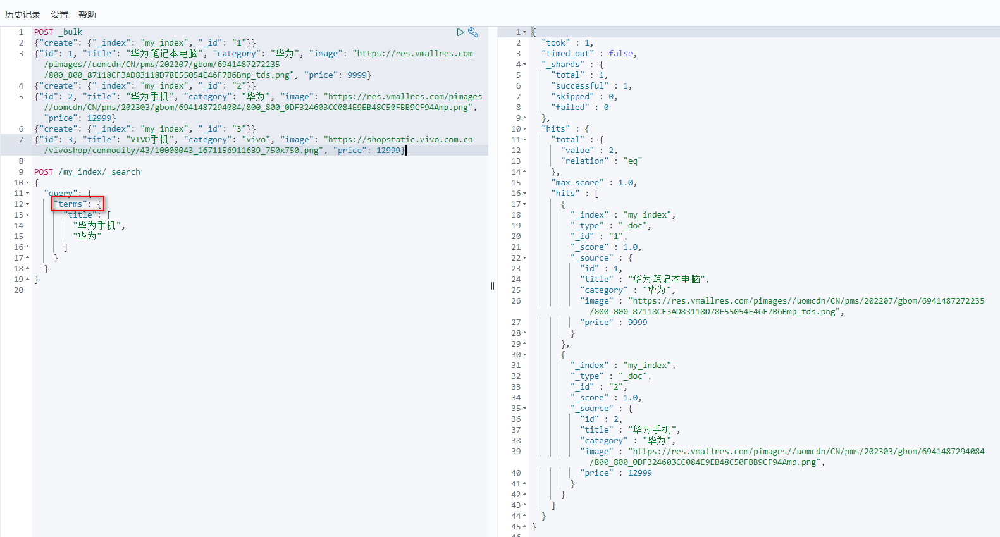

### 5.2.8 范围查询（range）

> range

* gte：大于等于
* lte：小于等于
* gt：大于
* lt：小于

```
POST /索引名/_search
{
  "query": {
    "range": {
      "字段名": {
        "gte": 值1,
        "lte": 值2
      }
    }
  }
}
```

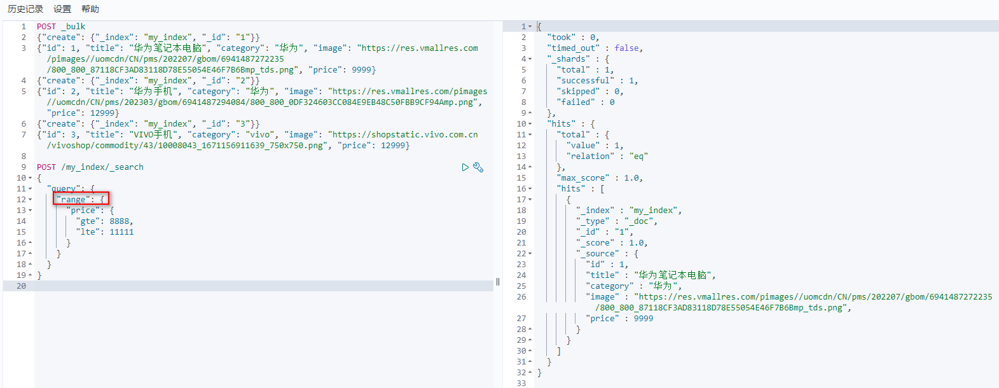

### 5.2.9 指定返回字段

**query同级增加_source进行过滤。**

```
POST /索引名/_search
{
  "query": {
    "range": {
      "字段名": {
        "gte": 值1,
        "lte": 值2
      }
    }
  },
  "_source": ["字段名1", "字段名2",...]
}
```

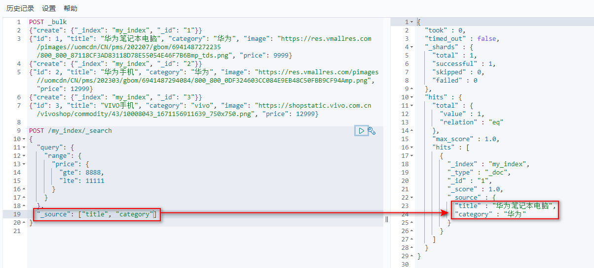

## 5.3 DSL使用-组合条件查询

> 语法

bool各条件之间都有and、or或no的关系。

* must：各个条件都必须满足，即所有条件是and关系
* should：各个条件有一个满足即可，即各条件是or关系
* must_not：不满足所有条件，即各条件是no关系
* filter：与must效果等同，但不计算得分，效率更高点
* 如果must和should同时存在，会对must结果和should结果取交集

### 5.3.1 must

```
POST /my_index/_search
{
  "query": {
    "bool": {
      "must": [
        {条件1},
        {条件2},
        ...
      ]
    }
  }
}
```

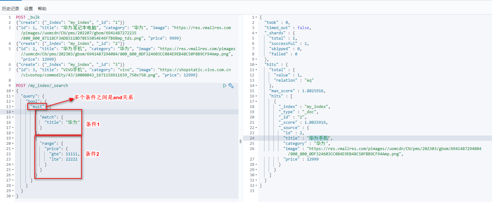

### 5.3.2 should

```
POST /my_index/_search
{
  "query": {
    "bool": {
      "should": [
        {条件1},
        {条件2},
        ...
      ]
    }
  }
}
```

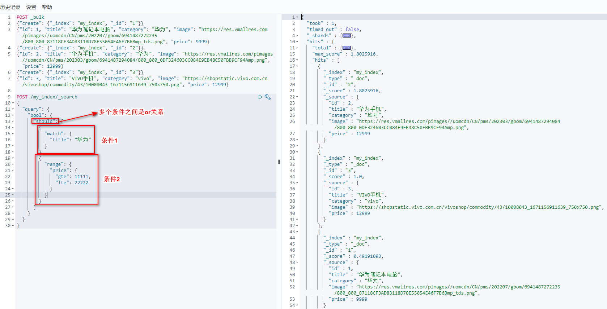

### 5.3.3 must_not

很少用

```
POST /索引名/_search
{
  "query": {
    "bool": {
      "must_not": [
        {条件1},
        {条件2},
        ...
      ]
    }
  }
}
```

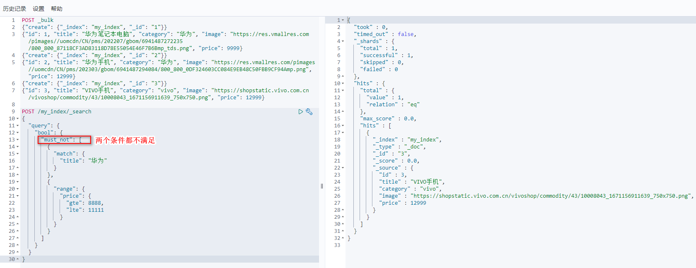

### 5.3.4 filter

不会计算分数。在不需要排名的时候才使用，效率比must快一些。

```
POST /索引名/_search
{
  "query": {
    "bool": {
      "filter": [
        {条件1},
        {条件2},
        ...
      ]
    }
  }
}
```

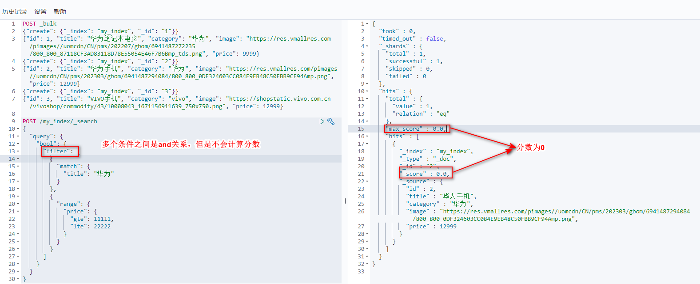

## 5.4 DSL使用-聚合查询（指标聚合）

> 概念

允许使用者对es文档进行统计分析，类似于关系型数据库中的group by。此外还有许多其他聚合查询，如取最大值、平均值等。

es的聚合查询和MySQL的group by效率差不多，但是es的优点是它是分布式的。真正做数据分析的时候，还需要考虑具体情况：

* 如果是非结构化的数据，如日志分析、用户行为分析，则考虑使用es的聚合查询
* 如果是结构化数据，考虑使用关系型数据库

> 指标聚合关键字

* max 最大值
* min 最小值
* avg 平均值
* sum 求和
* stats 统计

> 语法

```
POST /索引名/_search
{
  "query": {...}, // 查询语法
  "size": 0, // 表示不显示命中记录的明细信息。如果想显示，将该参数去掉即可
  "aggs": { // 聚合查询配置
    "字段名": { // 自定义字段名，来存储聚合结果
      "聚合函数": { // 聚合函数
        "field": "字段名"
      }
    }
  }
}
```

> 举例：max

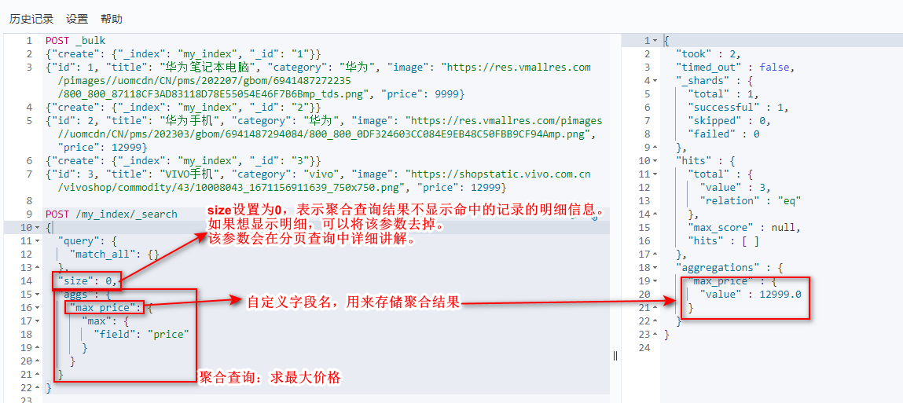

> 举例：stats

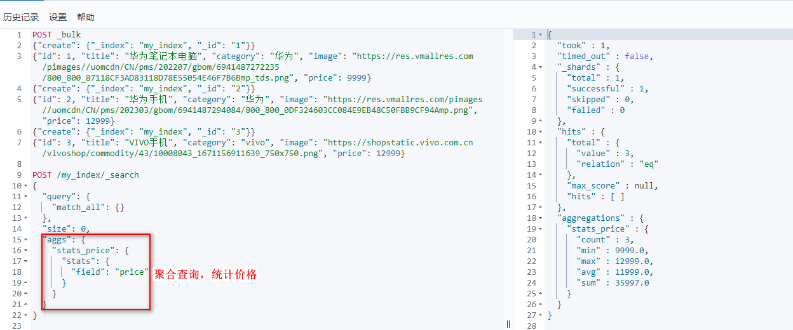

## 5.5 DSL使用-聚合查询（桶聚合）

> 概念

桶聚合相当于mysql的group by

> 桶聚合关键字

* terms

### 5.5.1 桶聚合的基本使用

> 语法

```
POST /索引名/_search
{
  "query": {...},
  "size": 0,
  "aggs": {
    "字段名": { // 自定义字段名，存储聚合结果
      "terms": { // 桶聚合关键字
        "field": "字段名",
        "size": 10 // 当前查询记录数量
      },
    }
  }
}
```

> 举例：terms基本使用

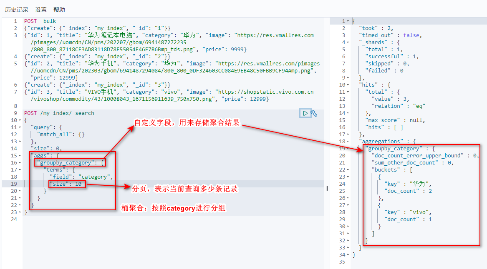

### 5.5.2 桶聚合的下钻

对桶聚合还可以继续下钻，即桶聚合和指标聚合的组合使用

> 语法

 ```
 POST /索引名/_search
 {
   "query": {...},
   "size": 0,
   "aggs": {
     "字段名": { // 自定义字段名，存储聚合结果
       "terms": { // 桶聚合关键字
         "field": "字段名",
         "size": 10 // 当前查询记录数量
       },
       "aggs": {
        "字段名2": { // 自定义字段名，存储聚合结果
          "指标聚合关键字": {
            "field": "字段名"
          }
        }
      }
     }
   }
 }
 ```

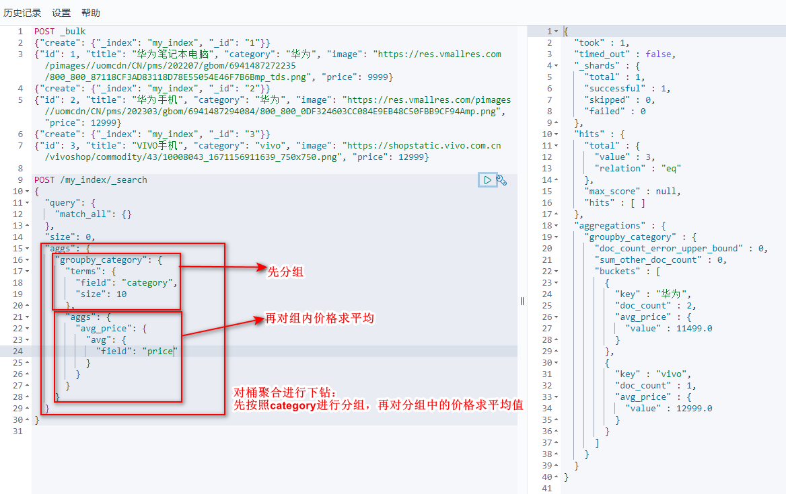
