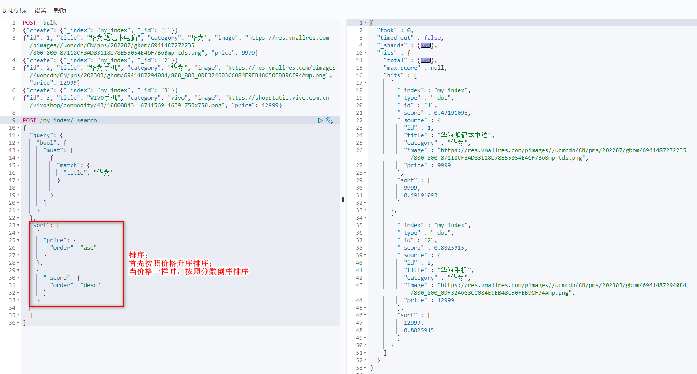
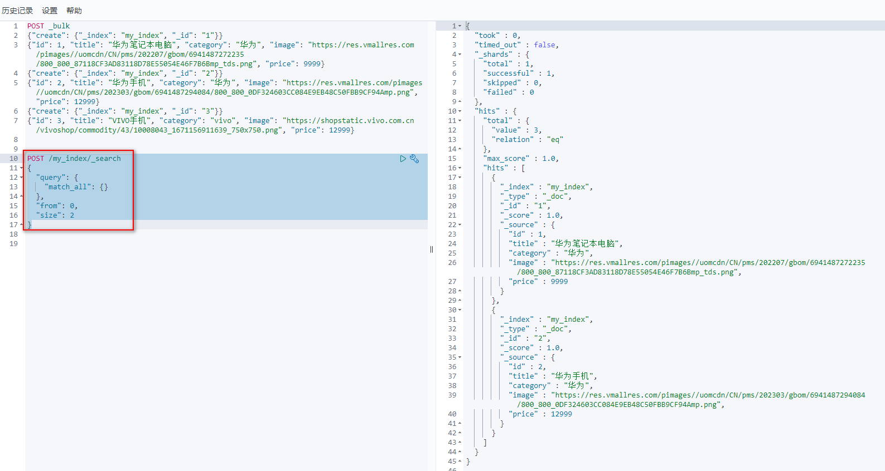
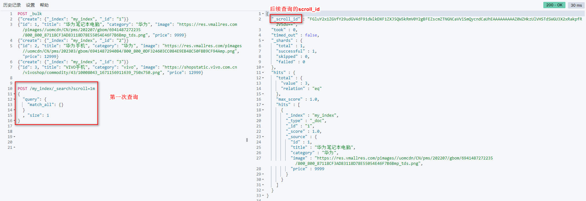
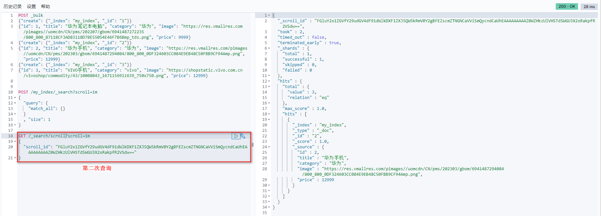
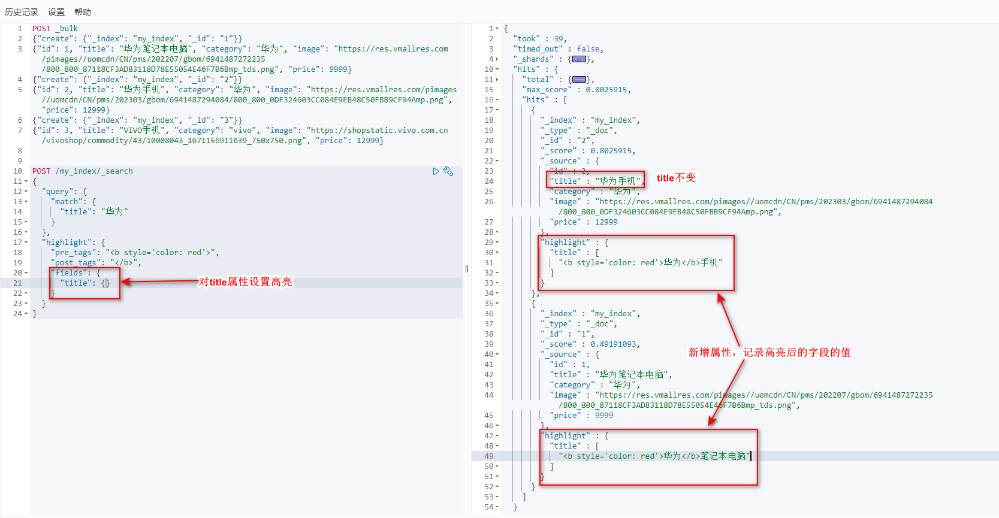
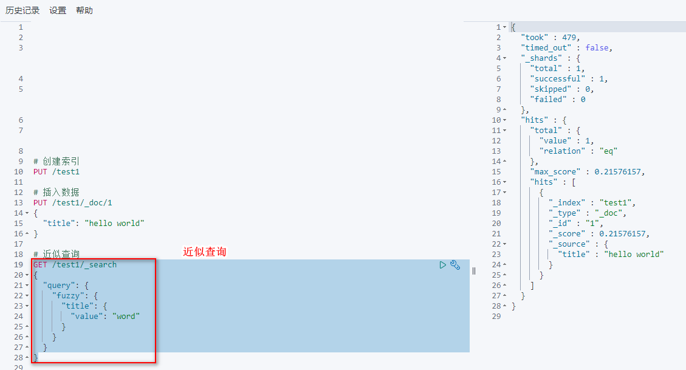

# 6 进阶查询

## 6.1 排序

>关键字

sort

>语法

```
POST /索引名/_search
{
  "query": {...},
  "sort": [ // 排序关键字，与query同级
    {
      "字段1": {
        "order": "asc或desc"
      }
    },
    {
      "字段2": {
        "order": "asc或desc"
      }
    }
    ...
  ]
}
```

>举例



## 6.2 分页

### 6.2.1 from、size分页

> 关键字
* from：起始索引值，默认从0开始。from = (pageNum - 1) * size
* size：每页显示多少条

> 语法

```
POST /索引名/_search
{
  "query": {...},
  "from": 0, // 起始索引值
  "size": 2 // 每页显示多少条
}
```

> 举例



### 6.2.2 scoll分页

>概念

滚动查询的意思是指如果获取的数据特别多，那我们可以分批获取数据。
给服务器一个处理请求的时间，在该时间内，一次性查询出来所有满足条件的数据，保存到内存中，分批次进行获取。所以每次进行查询的时候都要传递一个系统的处理时间。类似于关系型数据库中的游标 。

第一次查询：返回相关数据的同时，还是返回一个_scroll_id，该时间内，数据有变动不受影响。

第n次查询（n>1）：在相关时间内，body体只传_scroll_id即可实现翻页效果

> 关键字
* scroll：指明服务器处理时间
* size：每页显示多少条

> 语法

注意：两次查询接口不一样

```
# 第一次查询
POST /索引名/_search?scroll=1m
{
  "query": {...}, 
  "size": 1 // 每页多少条数据
}

# 第n次查询（n>1）：
GET /_search/scroll?scroll=1m
{
  "scroll_id": "第一次查询时返回的_scroll_id"
}
```

> 举例





## 6.3 高亮

>关键字
* highlight
* highlight.pre_tags：高亮前缀。
* highlight.post_tags：高亮后缀。
* highlight.fields：配置需要高亮的属性

>语法

注意：highlight.fields中的字段必须是query中被检索的字段
```
POST /索引名/_search
{
  "query": {...},
  "highlight": {
    "pre_tags": "高亮前缀",
    "post_tags": "高亮后缀",
    "fields": {
      "字段名1": {},
      "字段名2": {},
      ...
    }
  }
}
```

>举例



## 6.4 近似查询

简单了解，中文用不上。

>概念

近似查询指的是返回包含与搜索字词相似的字词的文档。如百度搜索中，某个单词拼写错误，但是会返回正确单词对应的记录。

对中文不适用，只适用于英文。

**编辑距离**是将一个术语转换为另一个术语所需的一个字符更改的次数。这些更改可以包括：
* 更改字符，如box改为fox
* 删除字符，如black改为lack
* 插入字符，如sic改为sick
* 转置两个相邻字符，如act改为cat

为了找到相似的术语，fuzzy会在指定的编辑距离内创建一组搜索词的所有可能的变体或扩展。然后查询返回每个扩展的完全匹配。
通过fuzziness修改编辑距离，一般使用默认值AUTO，根据术语的长度生成编辑距离。

>关键字

* fuzzy

> 语法

```
GET /索引名/_search
{
  "query": {
    "fuzzy": {
      "字段名": {
        "value": "字段值"
      }
    }
  }
}
```

>举例

