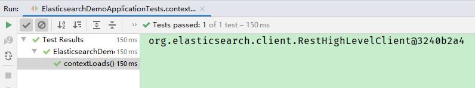
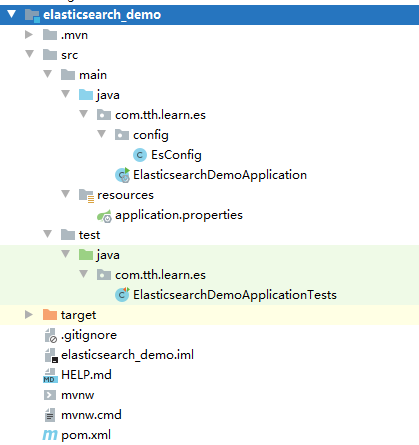

# 7 Java API 操作 es

> 官方文档

[elasticsearch7.8 API 手册](https://www.elastic.co/guide/en/elasticsearch/client/java-rest/7.8/java-rest-high.html)

## 7.1 搭建Elasticsearch项目

### 7.1.1 创建elasticsearch_demo工程

使用SpringBoot创建elasticsearch_demo项目

### 7.1.2 编写pom.xml文件
```xml
<?xml version="1.0" encoding="UTF-8"?>
<project xmlns="http://maven.apache.org/POM/4.0.0" xmlns:xsi="http://www.w3.org/2001/XMLSchema-instance"
	xsi:schemaLocation="http://maven.apache.org/POM/4.0.0 https://maven.apache.org/xsd/maven-4.0.0.xsd">
	<modelVersion>4.0.0</modelVersion>
	<parent>
		<groupId>org.springframework.boot</groupId>
		<artifactId>spring-boot-starter-parent</artifactId>
		<version>2.4.4</version>
		<relativePath/> <!-- lookup parent from repository -->
	</parent>
	<groupId>com.tth.learn</groupId>
	<artifactId>elasticsearch_demo</artifactId>
	<version>0.0.1-SNAPSHOT</version>
	<name>elasticsearch_demo</name>
	<description>Elasticsearch Demo project for Spring Boot</description>
	<properties>
		<java.version>8</java.version>
		<fastjson.version>1.2.83</fastjson.version>
	</properties>
	<dependencies>

		<!--elasticsearch依赖-->
		<dependency>
			<groupId>org.springframework.boot</groupId>
			<artifactId>spring-boot-starter-data-elasticsearch</artifactId>
		</dependency>

		<!--测试依赖-->
		<dependency>
			<groupId>org.springframework.boot</groupId>
			<artifactId>spring-boot-starter-test</artifactId>
			<scope>test</scope>
		</dependency>

		<!--配置注解执行器：当执行类中已经定义了对象和该对象的字段后，在配置文件中对该类赋值时，便会非常方便的弹出提示信息-->
		<dependency>
			<groupId>org.springframework.boot</groupId>
			<artifactId>spring-boot-configuration-processor</artifactId>
		</dependency>

		<dependency>
			<groupId>com.alibaba</groupId>
			<artifactId>fastjson</artifactId>
			<version>${fastjson.version}</version>
		</dependency>

		<dependency>
			<groupId>org.projectlombok</groupId>
			<artifactId>lombok</artifactId>
		</dependency>
	</dependencies>

	<build>
		<plugins>
			<plugin>
				<groupId>org.springframework.boot</groupId>
				<artifactId>spring-boot-maven-plugin</artifactId>
			</plugin>
		</plugins>
	</build>

</project>
```

### 7.1.3 编写配置文件application.properties

```properties
elasticsearch.host=localhost
elasticsearch.port=9200
elasticsearch.scheme=http
```

### 7.1.4 创建Elasticsearch配置类

```java
@Configuration
public class EsConfig extends AbstractElasticsearchConfiguration {
    @Value(value = "${elasticsearch.host}")
    private String host;

    @Value(value = "${elasticsearch.port}")
    private Integer port;

    @Value(value = "${elasticsearch.scheme}")
    private String scheme;


    @Override
    public RestHighLevelClient elasticsearchClient() {
        RestHighLevelClient client = new RestHighLevelClient(RestClient.builder(new HttpHost(host, port, scheme)));
        return client;
    }
}
```

### 7.1.5 创建测试类

```java
/**
 * springboot2.4.0之后spring-boot-starter-test去掉了Junit4，改为支持Junit5。
 * Junit5使用@ExtendWith(SpringExtension.class)表明运行环境，
 * 而Junit4使用@RunWith(SpringRunner.class)表明运行环境。
 */
@ExtendWith(SpringExtension.class)
@SpringBootTest
class ElasticsearchDemoApplicationTests {

	@Qualifier("elasticsearchClient")
	@Autowired
	RestHighLevelClient restHighLevelClient;

	@Test
	void contextLoads() {
		System.out.println(restHighLevelClient);
	}

}
```

>测试方法测试结果：



### 7.1.6 项目结构




## 7.2 索引操作

[索引操作API](https://www.elastic.co/guide/en/elasticsearch/client/java-rest/7.8/_index_apis.html)

### 7.2.1 创建索引

```java
@ExtendWith(SpringExtension.class)
@SpringBootTest
public class ElasticsearchIndexTest {

    @Qualifier("elasticsearchClient")
    @Autowired
    RestHighLevelClient restHighLevelClient;

    /**
     * 创建索引
     */
    @Test
    public void create() {
        CreateIndexRequest request = new CreateIndexRequest("person");
        request.mapping("{\n" +
                "    \"properties\": {\n" +
                "      \"name\": {\n" +
                "        \"type\": \"keyword\",\n" +
                "        \"index\": true,\n" +
                "        \"store\": true\n" +
                "      },\n" +
                "      \"age\": {\n" +
                "        \"type\": \"integer\",\n" +
                "        \"index\": true,\n" +
                "        \"store\": true\n" +
                "      },\n" +
                "      \"remark\": {\n" +
                "        \"type\": \"text\",\n" +
                "        \"index\": true,\n" +
                "        \"store\": true,\n" +
                "        \"analyzer\": \"ik_max_word\",\n" +
                "        \"search_analyzer\": \"ik_smart\"\n" +
                "      }\n" +
                "    }\n" +
                "  }", XContentType.JSON);
        try {
            CreateIndexResponse createIndexResponse = restHighLevelClient.indices().create(request, RequestOptions.DEFAULT);
            System.out.println(createIndexResponse.isAcknowledged());
        } catch (IOException e) {
            e.printStackTrace();
        }
    }
}
```


### 7.2.2 查询索引

```java
@ExtendWith(SpringExtension.class)
@SpringBootTest
public class ElasticsearchIndexTest {

    @Qualifier("elasticsearchClient")
    @Autowired
    RestHighLevelClient restHighLevelClient;

    /**
     * 查询索引
     */
    @Test
    public void get() {
        GetIndexRequest request = new GetIndexRequest("person");
        try {
            GetIndexResponse response = restHighLevelClient.indices().get(request, RequestOptions.DEFAULT);
            response.getMappings().forEach((s, mappingMetadata) -> {
                System.out.println(mappingMetadata.getSourceAsMap());
            });
            System.out.println(response.getSettings());
        } catch (Exception e) { // 注意：此处最好捕获Exception。如果捕获的是IOException，当查询的索引不存在时，无法捕获异常
            e.printStackTrace();
        }
    }
}
```


### 7.2.3 删除索引

```java
@ExtendWith(SpringExtension.class)
@SpringBootTest
public class ElasticsearchIndexTest {

    @Qualifier("elasticsearchClient")
    @Autowired
    RestHighLevelClient restHighLevelClient;

    /**
     * 删除索引
     */
    @Test
    public void del() {
        DeleteIndexRequest request = new DeleteIndexRequest("person");
        try {
            AcknowledgedResponse response = restHighLevelClient.indices().delete(request, RequestOptions.DEFAULT);
            System.out.println(response.isAcknowledged());
        } catch (Exception e) {
            e.printStackTrace();
        }

    }
}
```

## 7.3 文档操作

[文档操作API](https://www.elastic.co/guide/en/elasticsearch/client/java-rest/7.8/java-rest-high-supported-apis.html)

### 7.3.1 创建文档

```java
/**
 * springboot2.4.0之后spring-boot-starter-test去掉了Junit4，改为支持Junit5。
 * Junit5使用@ExtendWith(SpringExtension.class)表明运行环境，
 * 而Junit4使用@RunWith(SpringRunner.class)表明运行环境。
 */
@ExtendWith(SpringExtension.class)
@SpringBootTest
public class ElasticsearchDocTest {

    @Qualifier("elasticsearchClient")
    @Autowired
    RestHighLevelClient restHighLevelClient;

    /**
     * 创建文档
     */
    @Test
    public void createDoc() {
        // 带参初始化，参数为索引名称
        IndexRequest request = new IndexRequest("student");
        request.id("1");

        Student student = new Student();
        student.setName("小明");
        student.setAge(5);
        student.setRemark("辅助");
        request.source(JSONObject.toJSONString(student), XContentType.JSON);

        try {
            IndexResponse response = restHighLevelClient.index(request, RequestOptions.DEFAULT);
            System.out.println(response.getResult()); // 输出结果：CREATED
        } catch (IOException e) {
            e.printStackTrace();
        }

    }
}
```

### 7.3.2 修改文档

**修改文档时，只会修改传入的属性，未传入的属性保持不变**

```java
/**
 * springboot2.4.0之后spring-boot-starter-test去掉了Junit4，改为支持Junit5。
 * Junit5使用@ExtendWith(SpringExtension.class)表明运行环境，
 * 而Junit4使用@RunWith(SpringRunner.class)表明运行环境。
 */
@ExtendWith(SpringExtension.class)
@SpringBootTest
public class ElasticsearchDocTest {

    @Qualifier("elasticsearchClient")
    @Autowired
    RestHighLevelClient restHighLevelClient;

    /**
     * 修改文档
     */
    @Test
    public void updateDoc() {
        // 带参初始化。参数分别为 索引名、数据的id
        UpdateRequest request = new UpdateRequest("student", "1");
        Student student = new Student();
        student.setRemark("攻击型");
        // 此处是为doc赋值，修改时只会修改本次设置的属性，对其他属性值无影响。
        // 如本次只修改remark属性，原remark属性值会被覆盖，其他属性值不变
        request.doc(JSONObject.toJSONString(student), XContentType.JSON);

        try {
            UpdateResponse response = restHighLevelClient.update(request, RequestOptions.DEFAULT);
            System.out.println(response.getResult());
        } catch (IOException e) {
            e.printStackTrace();
        }
    }
}
```

### 7.3.3 查询文档

```java
/**
 * springboot2.4.0之后spring-boot-starter-test去掉了Junit4，改为支持Junit5。
 * Junit5使用@ExtendWith(SpringExtension.class)表明运行环境，
 * 而Junit4使用@RunWith(SpringRunner.class)表明运行环境。
 */
@ExtendWith(SpringExtension.class)
@SpringBootTest
public class ElasticsearchDocTest {

    @Qualifier("elasticsearchClient")
    @Autowired
    RestHighLevelClient restHighLevelClient;

    /**
     * 查询文档
     */
    @Test
    public void getDoc() {
        // 带参初始化，参数分别为：索引名、数据的主键
        GetRequest request = new GetRequest("student", "1");
        try {
            GetResponse response = restHighLevelClient.get(request, RequestOptions.DEFAULT);
            if (response.isExists()) {
                long version = response.getVersion(); // 获取数据的版本号
                String source = response.getSourceAsString(); // 获取数据的内容，以String格式返回，还可以使用map格式和byte[]格式返回
                System.out.println(version);
                System.out.println(source);
            }
        } catch (IOException e) {
            e.printStackTrace();
        }

    }
}
``` 

### 7.3.4 查询文档中的数据

仅获取指定id的数据内容，不返回索引信息

```java
/**
 * springboot2.4.0之后spring-boot-starter-test去掉了Junit4，改为支持Junit5。
 * Junit5使用@ExtendWith(SpringExtension.class)表明运行环境，
 * 而Junit4使用@RunWith(SpringRunner.class)表明运行环境。
 */
@ExtendWith(SpringExtension.class)
@SpringBootTest
public class ElasticsearchDocTest {

    @Qualifier("elasticsearchClient")
    @Autowired
    RestHighLevelClient restHighLevelClient;

    @Test
    public void getDocSource() {
        GetSourceRequest request = new GetSourceRequest("student", "1");
        try {
            GetSourceResponse response = restHighLevelClient.getSource(request, RequestOptions.DEFAULT);
            System.out.println(response.getSource()); // 获取数据内容
        } catch (IOException e) {
            e.printStackTrace();
        }
    }
}
```

### 7.3.5 删除文档 

```java
/**
 * springboot2.4.0之后spring-boot-starter-test去掉了Junit4，改为支持Junit5。
 * Junit5使用@ExtendWith(SpringExtension.class)表明运行环境，
 * 而Junit4使用@RunWith(SpringRunner.class)表明运行环境。
 */
@ExtendWith(SpringExtension.class)
@SpringBootTest
public class ElasticsearchDocTest {

    @Qualifier("elasticsearchClient")
    @Autowired
    RestHighLevelClient restHighLevelClient;

    /**
     * 删除文档
     */
    @Test
    public void deleteDoc() {
        DeleteRequest request = new DeleteRequest("student", "11");
        try {
            DeleteResponse response = restHighLevelClient.delete(request, RequestOptions.DEFAULT);
            System.out.println(response.getResult()); // 输出结果：DELETED
        } catch (IOException e) {
            e.printStackTrace();
        }
    }
}
```

### 7.3.6 批量操作

```java
/**
 * springboot2.4.0之后spring-boot-starter-test去掉了Junit4，改为支持Junit5。
 * Junit5使用@ExtendWith(SpringExtension.class)表明运行环境，
 * 而Junit4使用@RunWith(SpringRunner.class)表明运行环境。
 */
@ExtendWith(SpringExtension.class)
@SpringBootTest
public class ElasticsearchDocTest {

    @Qualifier("elasticsearchClient")
    @Autowired
    RestHighLevelClient restHighLevelClient;

    /**
     * 文档的批量操作
     */
    @Test
    public void bulkDoc() {
        BulkRequest bulkRequest = new BulkRequest();
        Student student = new Student();
        for (int i = 1; i <= 10; i++) {
            student.setAge(18 + i);
            student.setName("张"+i+"白");
            student.setRemark("我在家排行第"+(i));
            // 循环添加10次“添加”操作
            bulkRequest.add(new IndexRequest("student")
                                .id(String.valueOf(10+i))
                                .source(JSONObject.toJSONString(student), XContentType.JSON));
        }

        // 添加“更新”操作
        Student studentUpt = new Student();
        studentUpt.setRemark("攻击型");
        bulkRequest.add(new UpdateRequest("student", "1").doc(JSONObject.toJSONString(studentUpt), XContentType.JSON));
    
        // 添加“删除”操作
        bulkRequest.add(new DeleteRequest("student", "1"));

        try {
            BulkResponse responses = restHighLevelClient.bulk(bulkRequest, RequestOptions.DEFAULT);
            for (BulkItemResponse itemResponse : responses.getItems()) {
                System.out.println(itemResponse.isFailed()); // 输出false，表示请求成功
            }
        } catch (IOException e) {
            e.printStackTrace();
        }
    }
}
```


## 7.4 DSL查询

[DSL查询API](https://www.elastic.co/guide/en/elasticsearch/client/java-rest/7.8/_search_apis.html)

> 关键方法

* `SearchRequest request = new SearchRequest()`：创建request请求。参数为索引名，可不传，可传多个。如果不传参数，表示查询所有索引。

* `SearchSourceBuilder searchSourceBuilder = new SearchSourceBuilder()`：用来存放request请求的参数。只能存放大部分参数，少部分不支持。

* `request.source(searchSourceBuilder)`将参数设置到request请求中。

* `restHighLevelClient.search(request, RequestOptions.DEFAULT)`：发送请求。其中`restHighLevelClient`是高级客户端`RestHighLevelClient`的实例。

> 示例代码

* 对所有索引使用match_all查询

```java
/**
 * springboot2.4.0之后spring-boot-starter-test去掉了Junit4，改为支持Junit5。
 * Junit5使用@ExtendWith(SpringExtension.class)表明运行环境，
 * 而Junit4使用@RunWith(SpringRunner.class)表明运行环境。
 */
@ExtendWith(SpringExtension.class)
@SpringBootTest
public class ElasticsearchDSLTest {

    @Qualifier("elasticsearchClient")
    @Autowired
    RestHighLevelClient restHighLevelClient;


    /**
     * 对所有索引进行查询
     *  使用match_all查询
     */
    @Test
    public void matchALL() {
        // 没有参数，表示查询所有索引
        SearchRequest request = new SearchRequest();
        // SearchSourceBuilder 用来存放大多数的搜索参数
        SearchSourceBuilder searchSourceBuilder = new SearchSourceBuilder();
        // 使用match_all查询
        searchSourceBuilder.query(QueryBuilders.matchAllQuery());
        // 将SearchSourceBuilder添加到request中
        request.source(searchSourceBuilder);

        try {
            SearchResponse response = restHighLevelClient.search(request, RequestOptions.DEFAULT);
            RestStatus status = response.status();
            System.out.println(status);
            TimeValue took = response.getTook();
            System.out.println(took);
            // 获取命中记录
            SearchHit[] hits = response.getHits().getHits();
            for (int i = 0; i < hits.length; i++) {
                System.out.println(hits[i]);
            }
        } catch (IOException e) {
            e.printStackTrace();
        }
    }
}
```

* 对my_index索引使用terms多关键字精确查询，并进行分页、对命中的title进行高亮显示

```java
/**
 * springboot2.4.0之后spring-boot-starter-test去掉了Junit4，改为支持Junit5。
 * Junit5使用@ExtendWith(SpringExtension.class)表明运行环境，
 * 而Junit4使用@RunWith(SpringRunner.class)表明运行环境。
 */
@ExtendWith(SpringExtension.class)
@SpringBootTest
public class ElasticsearchDSLTest {

    @Qualifier("elasticsearchClient")
    @Autowired
    RestHighLevelClient restHighLevelClient;

    /**
     * 混合查询
     *  terms多关键字精确查询、分页、高亮
     */
    @Test
    public void mixedSearch() {
        SearchRequest request = new SearchRequest("my_index");
        SearchSourceBuilder searchSourceBuilder = new SearchSourceBuilder();
        // terms多关键字精确查询
        searchSourceBuilder.query(QueryBuilders.termsQuery("title", "华为", "华为手机"));
        // 分页
        searchSourceBuilder.from(0);
        searchSourceBuilder.size(1);
        // 高亮
        HighlightBuilder highlightBuilder = new HighlightBuilder();
        highlightBuilder.preTags("<b style='color: red'>");
        highlightBuilder.postTags("</b>");
        highlightBuilder.field("title");
        searchSourceBuilder.highlighter(highlightBuilder);
        // 将参数信息传入request中
        request.source(searchSourceBuilder);

        try {
            SearchResponse response = restHighLevelClient.search(request, RequestOptions.DEFAULT);
            // 获取命中记录
            SearchHit[] hits = response.getHits().getHits();
            for (int i = 0; i < hits.length; i++) {
                System.out.println(hits[i]);
            }
        } catch (IOException e) {
            e.printStackTrace();
        }
    }
}
```