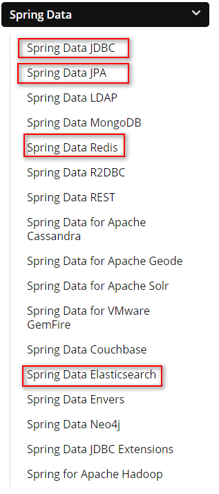
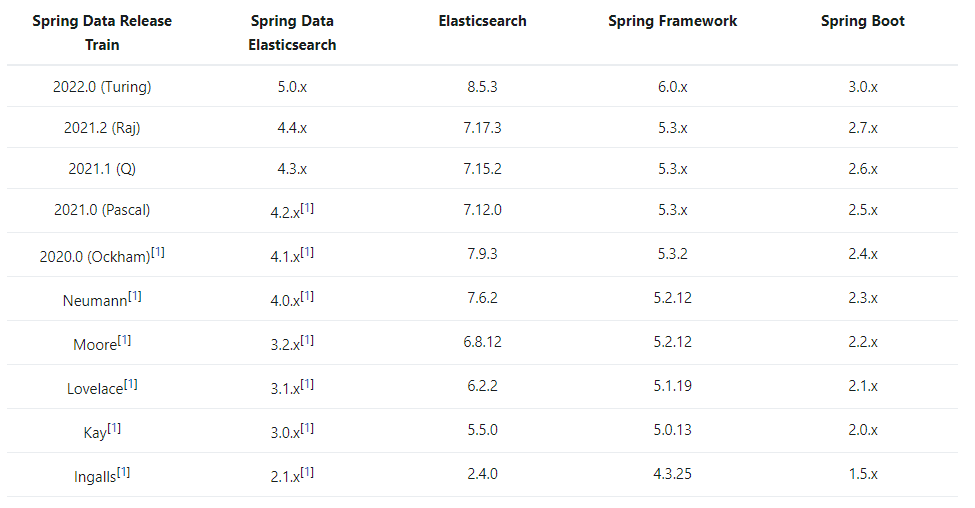
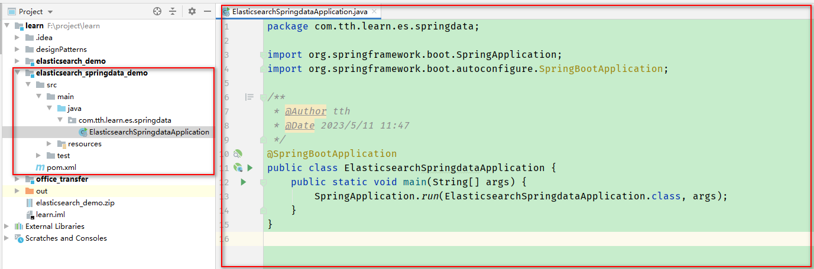

# 8 Spring Data Elasticsearch

## 8.1 Spring Data 框架介绍

Spring Data是一个用于简化数据库、非关系型数据库、索引库访问，并支持云服务的开源框架。其主要目标是使得对数据的访问变得更加便捷。
Spring Data可以极大简化JPA（Elasticsearch）的写法，可以在几乎不用写实现的情况下，实现对数据库的访问和操作。
除了CRUD(Create 新增、Retrieve 检索、Update 更新、 Delete 删除)外，还包括分页、排序等一些常用功能。

Spring Data官网：[https://spring.io/projects/spring-data](https://spring.io/projects/spring-data)



## 8.2 Spring Data Elasticsearch 介绍

Spring Data Elasticsearch基于Spring Data API简化Elasticsearch操作，将原始操作Elasticsearch的客户端API进行封装。
Spring Data Elasticsearch的关键功能领域是一个以POJO为中心的模型，用于和Elasticsearch文档进行交互，并轻松编写Repository风格的数据库访问。

## 8.3 Spring Data Elasticsearch 版本



因本教程使用的Elasticsearch版本号是7.8，但是上图中没有刚好对应的版本号，基于向下兼容的想法，
考虑使用7.6.2版本的Elasticsearch对应的Spring Data Elasticsearch、Spring Framework、 Spring Boot

## 8.4 Spring Data Elasticsearch 使用

### 8.4.1 创建maven项目


### 8.4.2 引入依赖

```xml
<?xml version="1.0" encoding="UTF-8"?>
<project xmlns="http://maven.apache.org/POM/4.0.0" xmlns:xsi="http://www.w3.org/2001/XMLSchema-instance"
	xsi:schemaLocation="http://maven.apache.org/POM/4.0.0 https://maven.apache.org/xsd/maven-4.0.0.xsd">
	<modelVersion>4.0.0</modelVersion>
	<parent>
		<groupId>org.springframework.boot</groupId>
		<artifactId>spring-boot-starter-parent</artifactId>
		<version>2.4.4</version>
		<relativePath/> <!-- lookup parent from repository -->
	</parent>
	<groupId>com.tth.learn</groupId>
	<artifactId>elasticsearch_demo</artifactId>
	<version>0.0.1-SNAPSHOT</version>
	<name>elasticsearch_demo</name>
	<description>Elasticsearch Demo project for Spring Boot</description>
	<properties>
		<java.version>8</java.version>
		<fastjson.version>1.2.83</fastjson.version>
	</properties>
	<dependencies>

		<!--elasticsearch依赖-->
		<dependency>
			<groupId>org.springframework.boot</groupId>
			<artifactId>spring-boot-starter-data-elasticsearch</artifactId>
		</dependency>

		<!--测试依赖-->
		<dependency>
			<groupId>org.springframework.boot</groupId>
			<artifactId>spring-boot-starter-test</artifactId>
			<scope>test</scope>
		</dependency>

		<!--配置注解执行器：当执行类中已经定义了对象和该对象的字段后，在配置文件中对该类赋值时，便会非常方便的弹出提示信息-->
		<dependency>
			<groupId>org.springframework.boot</groupId>
			<artifactId>spring-boot-configuration-processor</artifactId>
		</dependency>

		<dependency>
			<groupId>com.alibaba</groupId>
			<artifactId>fastjson</artifactId>
			<version>${fastjson.version}</version>
		</dependency>

		<dependency>
			<groupId>org.projectlombok</groupId>
			<artifactId>lombok</artifactId>
		</dependency>
	</dependencies>

	<build>
		<plugins>
			<plugin>
				<groupId>org.springframework.boot</groupId>
				<artifactId>spring-boot-maven-plugin</artifactId>
			</plugin>
		</plugins>
	</build>

</project>
```

### 8.4.3 创建配置文件

```properties
elasticsearch.host=localhost
elasticsearch.port=9200
elasticsearch.scheme=http
# 配置日志级别
logging.level.com.tth.learn=debug
```

### 8.4.4 创建启动类和主目录



### 8.4.5 创建配置类

ElasticsearchRestTemplate是Spring Data Elasticsearch中的一个类，和其他spring项目中的Template类似。
ElasticsearchRestTemplate是基于RestHighLevelClient客户端的，需要继承AbstractElasticsearchConfiguration，并实现elasticsearchClient()抽象方法，创建RestHighLevelClient客户端。

```java
/**
 * Elasticsearch配置类
 * @Author tth
 * @Date 2023/5/11 11:50
 */
@ConfigurationProperties(prefix = "elasticsearch")
@Configuration
@Data
public class ElasticsearchConfig extends AbstractElasticsearchConfiguration {

    private String host;
    private Integer port;

    @Override
    public RestHighLevelClient elasticsearchClient() {
        RestClientBuilder builder = RestClient.builder(new HttpHost(host, port));
        RestHighLevelClient client = new RestHighLevelClient(builder);
        return client;
    }
}
```

### 8.4.6 添加document映射实体

```java
/**
 * 产品映射
 * @Author tth
 * @Date 2023/5/11 13:40
 */
@Data
@Document(indexName = "product", shards = 1, replicas = 1)
public class Product {
    @Id
    private Long id;

    @Field(type = FieldType.Text, analyzer = "ik_max_word")
    private String productName;

    @Field(type = FieldType.Integer)
    private Integer store;

    @Field(type = FieldType.Double, index = true, store = false)
    private double price;
}
```
### 8.4.7 创建Dao层数据访问

```java
/**
 * Procuct dao层接口
 * @author tth
 * @description 
 * @date 2023/5/11 13:45
 */
@Repository
public interface ProductDao extends ElasticsearchRepository<Product, Long> {
}
```

### 8.4.8 创建测试类，进行测试

```java
/**
 * @RunWith(SpringRunner.class): 让测试运行于Spring测试环境
 * @SpringBootTest(classes = ElasticsearchSpringdataApplication.class)：使用class属性指定启动类，使JUnit单元测试运行在Springboot环境中
 */
@RunWith(SpringRunner.class)
@SpringBootTest(classes = ElasticsearchSpringdataApplication.class)
public class ElasticsearchTest {
    @Autowired
    private ProductDao productDao;


    /**
     * 添加数据
     */
    @Test
    public void saveProductTest() {
        Product product = new Product();
        product.setId(1L);
        product.setProductName("华为手机");
        product.setStore(100);
        product.setPrice(5000.00);
        productDao.save(product);
        System.out.println("添加成功");
    }

    /**
     * 根据id查询
     */
    @Test
    public void findById() {
        Optional<Product> optional = productDao.findById(1L);
        Product product = optional.get();
        System.out.println(product);
    }

    /**
     * 查询全部，并按照价格倒序排序
     */
    @Test
    public void findAll() {
        Iterable<Product> products = productDao.findAll(Sort.by(Sort.Direction.DESC, "price"));
        products.forEach(p -> System.out.println(p));
    }
}
```

### 8.4.9 使用Spring Data查询方法命名规范自定义查询方法

Spring Data强大的功能之一就是从存储库方法名称派生动态查询。
Spring Data致力于减少数据访问层（DAO）的开发量。开发者唯一要做的，就只是声明持久层的接口，其他都交给Spring Data JPA 来完成！
如果想要实现简单查询条件（即查询某一个实体类或是集合），只要在Dao层接口中按照Spring Data JPA规范对方法进行命名，就可以不用写实现方法，Spring Data会将结果直接返回。

> Spring Data Repository 查询方法命名规范

**只能用于实现简单查询条件，即查询某一个实体类或是集合。**

* 查询方法以 find | read | get 开头 
* 涉及条件查询时，条件的属性用条件关键字连接
* 条件的属性首字母大写
* 支持属性的级联查询。若当前类有符合条件的属性，则优先使用，而不使用级联属性。若需要使用级联属性，则属性之间使用_连接

> Spring Data 查询命名规则

| 关键字            | 例子                                                         | JPA查询语句（JPQL）                                          |
| ----------------- | ------------------------------------------------------------ | ------------------------------------------------------------ |
| And               | findByLastnameAndFirstName(String lastname, String firstname) | where x.lastname = ?0 and x.firstname= ?1                    |
| Or                | findByLastnameOrFirstName(String lastname, String firstname) | where x.lastname = ?0 or x.firstname= ?1                     |
| Between           | findByPriceBetween(double lowerPrice, double higherPrice)    | where x.price between ?0 and ?1                              |
| LessThan          | findByPriceLessThan(double price)                            | where x.price < ?0                                           |
| GreaterThan       | findByPriceGreaterThan(double price)                         | where x.price > ?0                                           |
| After             | findCreateTimeAfter(Date date)                               | where x.createTime > ?0                                      |
| Before            | findCreateTimeBefore(Date date)                              | where x.createTime < ?0                                      |
| IsNull            | findByAddressIsNull(String address)                          | where x.address is null                                      |
| IsNotNull,NotNull | findByAddress(Is)NotNull(String address)                     | where x.address is not null                                  |
| Like              | findByLastnameLike(String lastname)                          | where x.lastname like ?0 <br/><br/>(参数需要手动添加%)                  |
| NotLike           | findByLastnameNotLike(String lastname)                       | where x.lastname not like ?0 <br/><br/>(参数需要手动添加%)              |
| StartingWith      | findByLastnameStartingWith(String prefix)                    | where x.lastname like ?0 <br/><br/>(参数不需手动添加%，Spring Data会在JPQL语句中自动将%添加到字段的最前面) |
| EndingWith        | findByLastnameEndingWith(String postfix)                     | where x.lastname like ?0 <br/><br/>(参数不需手动添加%，Spring Data会在JPQL语句中自动将%添加到字段的最后面) |
| Containing        | findByLastnameContaining(String centerStr)                   | where  x.lastname like ?0 <br/><br/>(Spring Data会在JPQL语句中自动将%添加到字段的最前边和最后面) |
| OrderBy           | findByLastnameLikeOrderByAgeDesc(String lastname)            | where x.lastname like ?0 order by x.age desc                 |
| Not               | findByLastnameNot(String lastname)                           | where x.lastname <> ?0                                       |
| In                | findByAgeIn(Collection ages)                                 | where x.age in ?0                                            |
| NotIn             | findByAgeNotIn(Collection ages)                              | where x.age not in ?0                                        |
| True              | findByActiveTrue()                                           | where x.active = true                                        |
| False             | findByActiveFalse()                                          | where x.active = false                                       |

> 自定义方法举例

* 在Dao层类中按照Spring Data Repository 查询方法命名规范定义方法
```java
@Repository
public interface ProductDao extends ElasticsearchRepository<Product, Long> {

    /**
     * 自定义方法--按照Spring Data JPA规范命名方法
     * 按照产品名称查询，并按价格降序排序
     * @param productName
     * @return
     */
    List<Product> findByProductNameOrderByPriceDesc(String productName);
}
```

* 在测试方法中测试上述方法
```java
/**
 * @RunWith(SpringRunner.class): 让测试运行于Spring测试环境
 * @SpringBootTest(classes = ElasticsearchSpringdataApplication.class)：使用class属性指定启动类，使JUnit单元测试运行在Springboot环境中
 */
@RunWith(SpringRunner.class)
@SpringBootTest(classes = ElasticsearchSpringdataApplication.class)
public class ElasticsearchTest {
    @Autowired
    private ProductDao productDao;

    /**
     * 自定义方法：按照商品名称查询，并按价格倒序排序
     */
    @Test
    public void findByProductNameOrderByPriceDesc() {
        List<Product> products = productDao.findByProductNameOrderByPriceDesc("华为");
        products.forEach(p -> System.out.println(p));
    }
}
```

### 8.4.10 使用@Query自定义DSL查询语句

* 在Dao层类中定义查询方法，并使用@Query注解

```java
/**
 * Procuct dao层接口
 * @author tth
 * @description
 * @date 2023/5/11 13:45
 */
@Repository
public interface ProductDao extends ElasticsearchRepository<Product, Long> {
    /**
     * 自定义方法，@Query自定义语句进行查询（分页的使用）
     * @param productName
     * @return
     */
    @Query("{\"match\":{\"productName\":\"?0\"}}")
    Page<Product> getByProductName(String productName, Pageable pageable);
}
```

* 在测试方法中测试上述方法
```java
/**
 * @RunWith(SpringRunner.class): 让测试运行于Spring测试环境
 * @SpringBootTest(classes = ElasticsearchSpringdataApplication.class)：使用class属性指定启动类，使JUnit单元测试运行在Springboot环境中
 */
@RunWith(SpringRunner.class)
@SpringBootTest(classes = ElasticsearchSpringdataApplication.class)
public class ElasticsearchTest {
    @Autowired
    private ProductDao productDao;

    /**
     * 使用@Query自定义DSL查询
     */
    @Test
    public void getByProductName() {
        PageRequest pageRequest = PageRequest.of(0, 2);
        Page<Product> page = productDao.getByProductName("华为", pageRequest);
        // 元素总个数
        long totalElements = page.getTotalElements();
        System.out.println(totalElements);
        // 总页数
        int totalPages = page.getTotalPages();
        System.out.println(totalPages);
        // 元素列表
        List<Product> products = page.getContent();
        products.forEach(p -> System.out.println(p));
    }

}
```

### 8.4.11 使用ElasticsearchRestTemplate进行查询

```java
/**
 * @RunWith(SpringRunner.class): 让测试运行于Spring测试环境
 * @SpringBootTest(classes = ElasticsearchSpringdataApplication.class)：使用class属性指定启动类，使JUnit单元测试运行在Springboot环境中
 */
@RunWith(SpringRunner.class)
@SpringBootTest(classes = ElasticsearchSpringdataApplication.class)
public class ElasticsearchTest {

    @Autowired
    private ElasticsearchRestTemplate template;

    @Test
    public void getByProductNameWithElasticsearchRestTemplate() {
        Page<Product> page = pageAndSort("华为手机", 3900.00, 5900.00);
        // 元素总个数
        long totalElements = page.getTotalElements();
        System.out.println(totalElements);
        // 总页数
        int totalPages = page.getTotalPages();
        System.out.println(totalPages);
        // 元素列表
        List<Product> products = page.getContent();
        products.forEach(p -> System.out.println(p));
    }
    
    /**
     * 使用ElasticsearchRestTemplate查询
     * @param productName
     * @param price1
     * @param price2
     * @return
     */
    private Page<Product> pageAndSort(String productName, double price1, double price2) {
        PageRequest pageRequest = PageRequest.of(0, 2);

        NativeSearchQueryBuilder query = new NativeSearchQueryBuilder();
        BoolQueryBuilder boolQueryBuilder = QueryBuilders.boolQuery();

        if (StringUtils.isNotBlank(productName)) {
            boolQueryBuilder.must(QueryBuilders.matchQuery("productName", productName));
        }
        boolQueryBuilder.must(QueryBuilders.rangeQuery("price").gte(price1).lte(price2));

        query.withQuery(boolQueryBuilder);
        query.withPageable(pageRequest);
        query.withSort(SortBuilders.fieldSort("price").order(SortOrder.DESC));

        SearchHits<Product> searchHits = template.search(query.build(), Product.class);

        List<Product> Products = new ArrayList<>();
        for (SearchHit<Product> searchHit : searchHits) {
            Products.add(searchHit.getContent());
        }

        return new PageImpl<Product>(Products, pageRequest, searchHits.getTotalHits());
    }
}
```