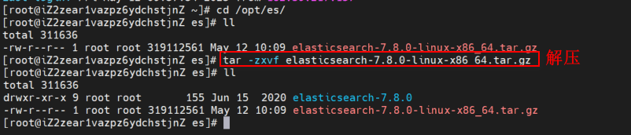
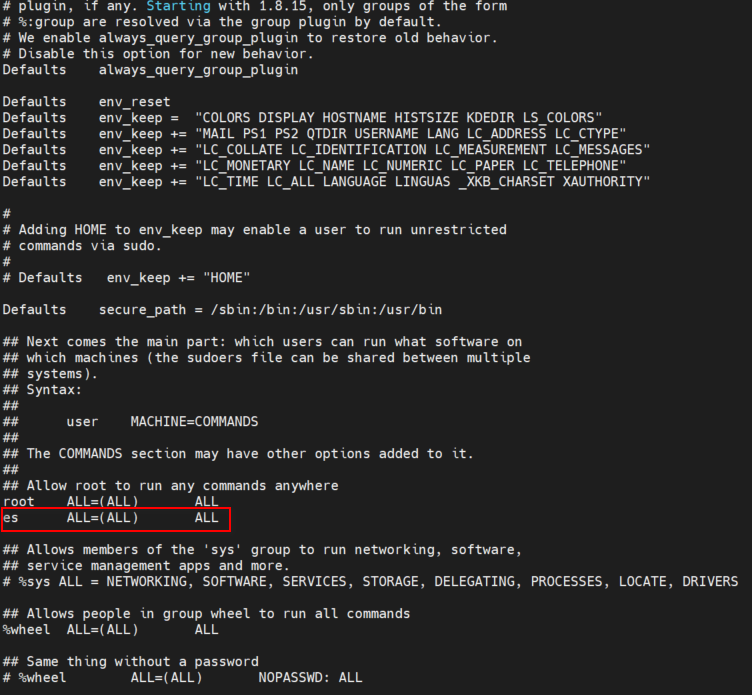
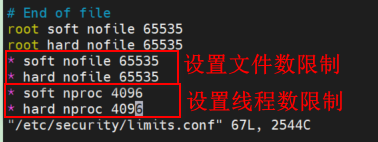
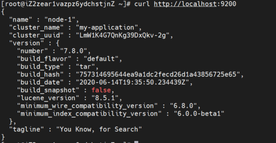

# 9 Linux安装ES相关工具

## 9.1 安装Elasticsearch

在Linux服务器上创建/opt/es文件夹，下载Elasticsearch7.8安装包，上传到该文件夹，进行解压即可。



## 9.2 配置Elasticsearch环境参数

### 9.2.1 创建用户
**Elasticsearch不能直接通过root用户启动**，所以需要先创建一个普通用户。
```shell script
# 创建用户
useradd es
# 设置密码（输入如下命令后，按照提示输入密码）
passwd es
# 授权（授权后，/opt/es 文件夹的Owner由root用户变为es用户）
chown -R es /opt/es
```

### 9.2.2 给用户设置sudo权限

相当于临时给某个用户类似于管理员的权限
```shell script
# 使用root用户执行visudo（相当于vim /etc/sudoers）
visudo
# 在root    ALL=(ALL)       ALL下面新增如下命令
es      ALL=(ALL)       ALL
```


### 9.2.3 修改普通用户打开文件最大数限制、启动线程数限制

```shell script
vim /etc/security/limits.conf
# 在文件中添加入下内容（*表示所有用户）
* soft nofile 65535
* hard nofile 65535
* soft nproc 4096
* hard nproc 4096
```



### 9.2.4 为普通用户增大虚拟内存

```shell script
vim /etc/sysctl.conf
# 在文件中添加以下内容
vm.max_map_count = 262144
```

### 9.2.5 使以上配置生效

```shell script
sysctl -p
```

**以上步骤完成后，需要重新打开终端，重新登入，才可看到配置生效。**

### 9.2.6 修改elasticsearch.yml文件

**需要使用es用户执行以下操作**

```shell script
# 切换es用户（由root用户切换到普通用户，不需要密码）
su - es
# 编辑elasticsearch.yml文件
vim  /opt/es/elasticsearch-7.8.0/config/elasticsearch.yml
# 按照如下内容进行修改
# 集群名称
cluster.name: my-application
# 节点名
node.name: node-1
# 配置文件
path.data: ./data
# 日志文件
path.logs: ./logs
# 0.0.0.0表示允许任意ip访问，如此，便可以远程访问
network.host: 0.0.0.0
http.port: 9200
# 集群初始化时的master节点
cluster.initial_master_nodes: ["node-1"]
```

### 9.2.7 修改jvm配置

**需要使用es用户执行以下操作**

```shell script
vim /opt/es/elasticsearch-7.8.0/config/jvm.options
# 按照如下内容进行修改
-Xms512m
-Xmx512m
```

## 9.3 启动Elasticsearch

**需要使用es用户执行以下操作**

```shell script
# 执行/opt/es/elasticsearch-7.8.0/bin/elasticsearch
/opt/es/elasticsearch-7.8.0/bin/elasticsearch
# 若想后台启动，可加-d参数
/opt/es/elasticsearch-7.8.0/bin/elasticsearch -d
```

## 9.4 访问Elasticsearch
```shell script
curl http://localhost:9200
```



## 9.5 安装Kibana

下载Kibana7.8安装包，上传到/opt/es文件夹，进行解压即可。

## 9.6 配置Kibana环境参数

### 9.6.1 授权

将kibana-7.8.0的操作权限赋给es用户

```shell script
chown -R es /opt/es/kibana-7.8.0
```

### 9.6.2 修改kibana配置

修改/opt/es/kibana-7.8.0/config/kibana.yml，内容如下：

```yaml 
# 服务端口
server.port: 5601
# 访问IP设置，0.0.0.0表示可以远程访问
server.host: "0.0.0.0"
# 配置es访问地址（使用ip不要用localhost。以后使用集群的时候，必须得用ip）
elasticsearch.hosts: ["http://192.168.1.11:9200"]
```

## 9.7 后台运行kibana

**需要使用es用户执行以下操作**

```shell script
nohup /opt/es/kibana-7.8.0/bin/kibana &
```

## 9.8 访问kibana

```shell script
curl http://localhost:5601
```

## 9.9 安装ik分词器

在/opt/es/elasticsearch-7.8.0/plugins/文件夹创建ik文件夹。
下载ik安装包，上传到/opt/es/elasticsearch-7.8.0/plugins/ik文件夹，进行解压。**解压后，将安装包删除**

## 9.8 ik分词器文件夹授权

将ik分词器的操作权限赋给es用户

```shell script
chown -R es /opt/es/elasticsearch-7.8.0/plugins/ik
```

## 9.9 重启es和kibana

重启后，ik分词器生效。