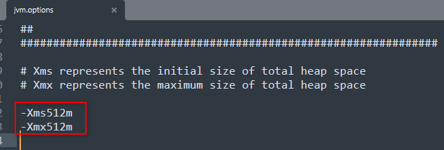
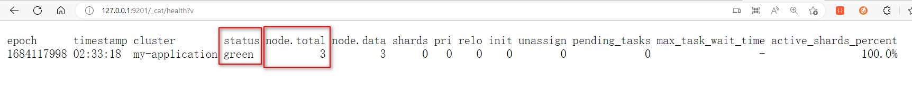
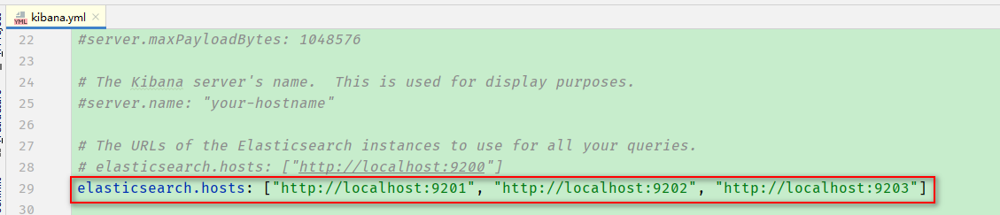
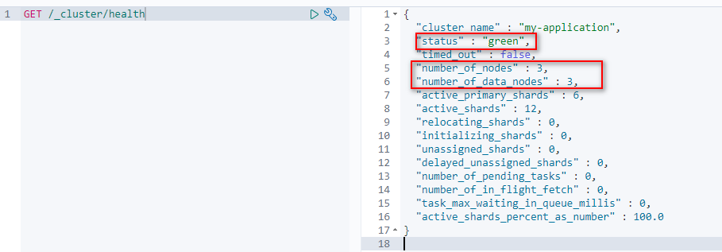
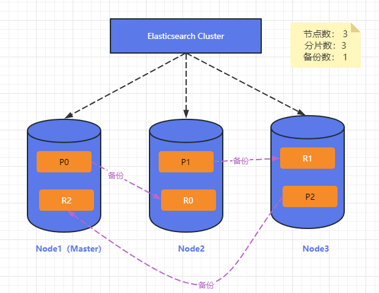

# 11 Elasticsearch集群

**Elasticsearch天生就是分布式的系统。**

配置服务器集群时，集群中节点数量没有限制，大于等于2个节点就是集群了。
一般处于高性能及高可用的方面来考虑，集群中的节点数量都是3个以上。

> 为什么要搭建集群

* 单台机器存储容量有限
* 单服务器容易出现单点故障，无法实现高可用性
* 单服务的并发处理能力有限

## 11.1 集群安装

### 11.1.1 搭建方案

一般集群建议3台机器以上。这里我们就是用3台机器来安装集群环境。

### 11.1.2 复制ES程序

* 创建elasticsearch-cluster文件夹，重新解压elasticsearch安装包到当前路径下，并将文件夹重命名node1。

* 将ik分词器解压到elasticsearch-cluster/node1/plugins/ik文件夹下，同时删除ik分词器的压缩包文件。

* 修改elasticsearch-cluster/node1/config/jvm.options文件：

   

* 复制node1两份，分别重命名为node2，node3

   

### 11.1.3 修改es配置文件

修改elasticsearch-cluster/node*/config/elasticsearch.yml文件

> node1

    ```yaml
    # 集群名称
    cluster.name: my-application
    
    # 默认为true。设置为false禁用磁盘分配决定器(禁用的原因：集群环境对磁盘的要求比较高，在启动集群时会检测磁盘大小。如果磁盘太小，集群就会启动失败)
    cluster.routing.allocation.disk.threshold_enabled: false
  
    # 节点名称
    node.name: node-1
    
    # 将node1节点设置为主节点（是否为主节点，默认为true）
    node.master: true
    
    # 将node1节点设置为数据节点（是否为数据节点，默认为true）
    node.data: true
  
    path.data: ./data
    path.logs: ./logs
  
    # 允许所有ip访问，即允许远程访问
    network.host: 0.0.0.0
  
    # 因为是一台机器启动3个es服务，每个节点的端口号都不能重复，所以需要修改一下
    http.port: 9201
    
    # 集群间通信端口号，在同一台机器下必须不一样
    transport.tcp.port: 9301
  
    # 发现集群中的节点
    discovery.seed_hosts: ["127.0.0.1:9301", "127.0.0.1:9302", "127.0.0.1:9303"]
    
    # 初始配置选举主节点
    cluster.initial_master_nodes: ["node-1"]
  
    # elasticsearch-head解决跨域
    http.cors.allow-origin: "*"
    http.cors.enabled: true
    ```

> node2

    ```yaml
    # 集群名称
    cluster.name: my-application
    
    # 默认为true。设置为false禁用磁盘分配决定器(禁用的原因：集群环境对磁盘的要求比较高，在启动集群时会检测磁盘大小。如果磁盘太小，集群就会启动失败)
    cluster.routing.allocation.disk.threshold_enabled: false
    
    # 节点名称
    node.name: node-2
    
    # 将node2节点设置为主节点（是否为主节点，默认为true）
    node.master: true
    
    # 将node1节点设置为数据节点（是否为数据节点，默认为true）
    node.data: true
    
    path.data: ./data
    path.logs: ./logs
    
    # 允许所有ip访问，即允许远程访问
    network.host: 0.0.0.0
    #
    # Set a custom port for HTTP:
    # 因为是一台机器启动3个es服务，每个节点的端口号都不能重复，所以需要修改一下
    http.port: 9202
    
    # 集群间通信端口号，在同一台机器下必须不一样
    transport.tcp.port: 9302
    
    # 发现集群中的节点
    discovery.seed_hosts: ["127.0.0.1:9301", "127.0.0.1:9302", "127.0.0.1:9303"]
    
    # 初始配置选举主节点
    cluster.initial_master_nodes: ["node-1"]
    
    # elasticsearch-head解决跨域
    http.cors.allow-origin: "*"
    http.cors.enabled: true
    ```
  
> node3

    ```yaml
     # 集群名称
     cluster.name: my-application
     
     # 默认为true。设置为false禁用磁盘分配决定器(禁用的原因：集群环境对磁盘的要求比较高，在启动集群时会检测磁盘大小。如果磁盘太小，集群就会启动失败)
     cluster.routing.allocation.disk.threshold_enabled: false
     
     # 节点名称
     node.name: node-3
     
     # 将node2节点设置为主节点（是否为主节点，默认为true）
     node.master: true
     
     # 将node1节点设置为数据节点（是否为数据节点，默认为true）
     node.data: true
     
     path.data: ./data
     path.logs: ./logs
     
     # 允许所有ip访问，即允许远程访问
     network.host: 0.0.0.0
     #
     # Set a custom port for HTTP:
     # 因为是一台机器启动3个es服务，每个节点的端口号都不能重复，所以需要修改一下
     http.port: 9203
     
     # 集群间通信端口号，在同一台机器下必须不一样
     transport.tcp.port: 9303
     
     # 发现集群中的节点
     discovery.seed_hosts: ["127.0.0.1:9301", "127.0.0.1:9302", "127.0.0.1:9303"]
     
     # 初始配置选举主节点
     cluster.initial_master_nodes: ["node-1"]
     
     # elasticsearch-head解决跨域
     http.cors.allow-origin: "*"
     http.cors.enabled: true
    ```
 
### 11.1.4 集群的启动与访问测试

> 集群启动

依次启动node1、node2、node3 3个节点。

注意：不能一块都启动，要保证上一个启动成功，再启动下一个

> 访问测试

浏览器输入[http://127.0.0.1:9201/_cat/health?v](http://127.0.0.1:9201/_cat/health?v)，查看节点状态。
如果status=green 且 total.node=3，表示集群启动后成功。



### 11.1.5 kibana的配置与访问测试

> 修改kibana配置文件并启动

修改kibana-7.8.0-windows-x86_64/config/kibana.yml文件，使kibana指向当前集群。


> kibana访问测试



### 11.1.6 集群中节点的状态

> Green

表示所有的主分片和副本分片都已分配，集群100%是可用的。

> Yellow

表示所有的主分片已经分片了，但至少还有一个副本是缺失的。该情况下，不会有数据丢失，搜索结果依然是完整的。

但是，集群的高可用在某种程度上被弱化了。如果更多的分片消失，数据就会丢失了。

可以将该状态想象成一个需要及时调查的**警告**。

> Red

至少有一个主分片以及它的全部副本分片都在缺失，搜索只能返回部分数据，且分配到这个分片上的写入请求会返回一个异常。


## 11.2 Elasticsearch集群中的核心概念

### 11.2.1 集群Cluster

* 一个集群就是由一个或多个服务器节点组织在一起，共用持有整个数据，并一起提供索引和搜索功能。
* 一个集群有一个唯一的名字表示。当一个新的节点需要加入某个集群时，只能通过该集群的名字加入。

### 11.2.2 节点Node

* 集群中包含多台服务器，一个节点就是其中的一台服务器。作为集群的一部分，它存储数据，参与集群的索引和搜索功能。
* 节点也是由名字来标识的。名字会在启动时赋予节点。
* 一个节点可以通过配置集群名称的方式加入指定的集群。
* 一个集群中可以有任意多个节点。

### 11.2.3 分片Shards

* 一个索引可以存储超出单个节点硬件限制的大量数据。比如，一个具有10亿文档数据的索引占据1TB的磁盘空间，而任一节点都可能没有这样大的磁盘空间，
或者单个节点处理索引请求时响应太慢。为了解决这个问题，**Elasticsearch提供了将索引划分为多份的能力，每一份就称为一个分片。** 
当创建索引时，可以指定分片数量。每个分片本身也是一个功能完善且独立的“索引”，这个“索引”可以被放置到集群中的任何节点上。

* 分片的作用
    * 允许水平分割/扩展内容量
    * 允许在分片上进行分布式的、并行的操作，进而提高性能/吞吐量
    
* 用户无需关心分片怎样分布、文档怎样聚合和搜索请求，这些都是Elasticsearch管理的。

### 11.2.4 副本Replicas

* 在一个网络/云环境中，失败随时都有可能发生，在某个分片/节点处于离线状态，或者由于某个原因消失了，这种情况下，有一个故障转移机制是非常必要的。
**Elasticsearch允许创建分片的一份或多分拷贝，这些拷贝就叫做复制分片，即副本。**

* 副本的作用：
    * 在分片/节点失败的情况下，提供了高可用性。这是因为**副本不会与主分片置于同一节点中。**
    * 扩展搜索量/吞吐量，这是因为**搜索可以在所有副本上并行运行。**
    
* 可以在创建索引时指定主分片和副本数量。索引创建后，可以改变副本数量，但不能改变主分片数量。默认情况下，在创建索引的时候会被分配1个主分片1个副本。

* 数据的总份数 = 主分片数量 + 主分片数量 * 副本数量

### 11.2.5 分配Allocation

将分片分配给某个节点的过程，包括分配主分片或者副本。如果是副本，还包含从主分片复制数据的过程。这个过程由master节点完成。即Elasticsearch的分片分配和均衡机制。

### 11.2.6 节点类型

es中的节点分为Master节点、DataNode节点。

* Master节点：
    * Elasticsearch启动时，会选举出一个master节点。当某个节点启动后，使用Zen Discovery机制找到集群中的其他节点并建立连接（`discovery.seed_hosts:["host1", "host2", "host3"]`）,
    并从候选主节点中选举出一个主节点（`cluster.initial_master_nodes: ["node1", "node2", "node3"]`）。
    * master节点功能：
        * 管理索引（创建索引、删除索引），分配分配
        * 维护元数据
        * 管理集群节点状态
    * master不负责写入和查询，比较轻量级。一个Elasticsearch集群中，只有一个master节点。在生产环境中，内存可以相对小一点，但是要确保机器的稳定。
    
* DataNode节点：
    * DataNode主要功能：
        * 数据写入
        * 数据检索
    * 大部分Elasticsearch的压力都在DataNode节点上，在生产环境中，内存最好分配大一些。


## 11.3 系统架构



一个运行中的Elasticsearch实例称为一个节点，而集群是由一个或多个拥有相同集群名称（cluster.name配置相同）的节点组成。
它们**共同承担数据和负载的压力**。当有节点**加入**集群或者从集群中**移除**时，集群将会**重新平均分布**所有数据。

当一个节点被选举为主节点时，它将负责管理集群范围内的所有变更，如增加、删除索引，或者增加、移除节点等。
作为用户，我们可以将请求发送到集群的任何节点，包括主节点。
每个节点都知道任意文档所处的位置，并且能够将我们的请求直接转发到存储我们所需文档的节点。
无论将请求发送到哪个节点，它都能负责从各个包含我们所需文档的节点收集回数据，并将最终结果返回给客户端。
Elasticsearch对这一切的管理都是透明的。
