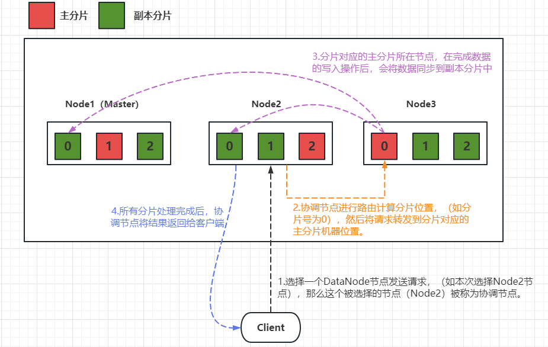
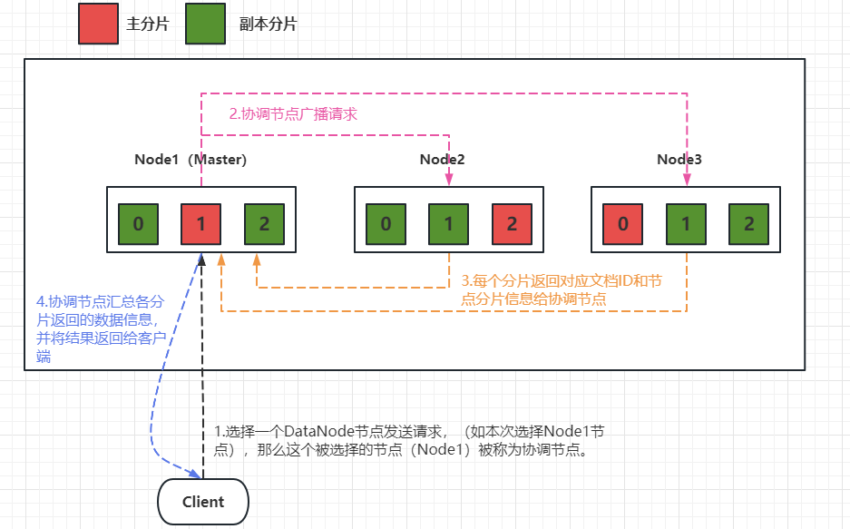
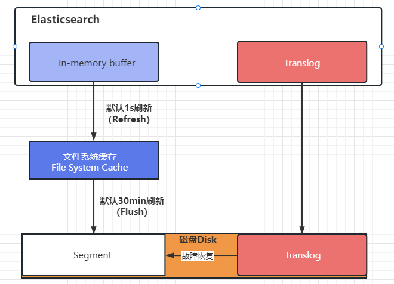

# 12 Elasticsearch分片控制与原理

## 12.1 分片操作

> 创建索引时，设置主分片为3，副本为3

```text
PUT /user
{
  "settings": {
    "number_of_shards": 3,
    "number_of_replicas": 3
  }
}
```

> 修改副本数量

**主分片数量不能修改，只能修改副本数量。**

```text
PUT /user/_settings
{
  "number_of_replicas": 0
}
```

## 12.2 分片控制

### 12.2.1 写流程

**新建和删除都属于写流程，必须在主分片上完成写操作之后，再复制到相关的副本分片中。**

> 写流程示意图




### 12.2.2 读流程

> 读流程示意图




## 12.3 分片原理

### 12.3.1 倒排索引

> 倒排索引概念

倒排索引适用于快速的全文检索。

> 正排索引 VS 倒排索引

* 正排索引：搜索引擎会将待搜索的文件第一对应一个文件ID，搜索时将这个ID和搜索关键字进行对应，行程K-V对，然后对关键字进行统计计数。**根据ID找词。**

* 倒排索引：一个倒排索引由文档中所有不重复词的列表组成，对于每一个词，都有一个包含它的文档的列表。**根据词找ID。**

> 说明

不论是正排索引还是倒排索引，都是存在磁盘中的，在使用的时候需要先读取到内存中。 

> 倒排索引步骤

* 假设有两个文档，文档内容分别如下：
    * 文档一：The quick brown fox jumped over the lazy dog
    * 文档二：Quick brown foxes leap over lazy dogs in summer

* 建立倒排索引表，过程如下：
    * 将两个文档拆分成单独的词，这些词被称为**词条**或**tokens**
    * 创建一张包含所有不重复词条的排序列表（倒排表），然后列出词条出现在哪个文档
    * 倒排表内容如下：
    
    | 单词   | 文档列表 |
    | ------ | -------- |
    | The    | 1        |
    | quick  | 1,2      |
    | brown  | 1        |
    | fox    | 1        |
    | jumped | 1        |
    | over   | 1        |
    | the    | 1        |
    | lazy   | 1        |
    | dog    | 1        |
    | Quick  | 2        |
    | foxes  | 2        |
    | leap   | 2        |
    | dogs   | 2        |
    | in     | 2        |
    | summer | 2        |

* 搜索(假设搜索`quick brown`)，过程如下：
  
  * 首先分别搜索`qucik`、`brown`，结果如下
  
      | 单词   | 文档列表 |
      | ------ | -------- |
      | quick  | 1,2      |
      | brown  | 1        |
  * 以上结果说明两个文档都匹配。如果使用仅计算匹配词条数量的简单相似性算法，那么，我们可以说文档一比文档二的匹配度更高，文档一的排名比文档二排名更靠前。
  
### 12.3.2 固定不变的倒排索引

**早期的**全文检索会为整个文档集合建立一个很大的倒排索引并将其写入磁盘。一旦新的索引就绪，旧索引就会被替换，这样最近的变化便可以被检测到。

**早期的倒排索引被写入磁盘后是不可变的**。

> 不变性有重要的价值：

* 不需要锁。如果从来不更新索引，就不用担心多进程同时修改数据的问题。
* 一旦索引被读入内核的文件系统缓存，便会留在那里。只要文件系统缓存中还有足够的空间，那么大部分读请求会直接请求内存，而不会命中磁盘。**这提供了很大的性能提升。**
* 其他缓存（如filter缓存），在索引的生命周期内始终有效。它们不需要再每次数据改变时被重建。
* 写入单个大的倒排索引允许数据被压缩，减少磁盘I/O和需要被缓存到内存的索引的使用量。

> 不变性的缺点：

最主要的问题是不能修改。如果想要让一个新的文档可以被索引，则需要重建整个索引。
这要么对一个索引所能包含的数据量造成了很大的限制，要么对所以呢可被更新的频率造成了很大的限制。

### 12.3.3 动态更新索引

**现阶段使用的是动态更新索引**。如微博、哔哩哔哩、各大商城，每天都会有大量新的数据产生，如果固定不变，无法满足互联网用户的需求。

> 如何在保留不变性的前提下，实现倒排索引的更新？

**用更多的索引**。通过增加新的**补充索引**来反应新的修改，而不是重写整个倒排索引。每一个倒排索引都会被轮流查询到，从最早的开始查询完后再对结果进行合并。

> 按段索引概念

Elasticsearch基于Lucene，Lucene引入了**按段索引**的概念。
每一段本身都是一个倒排索引。
索引在Lucene中除了表示所有段的集合外，还增加了**提交点**的概念，即一个列出了所有已知段的文件。

> 按段索引写入流程

* 1.新文档被收集到内存索引缓存
* 2.不时地，缓存被提交
    * 一个新的**段**（即一个追加的倒排索引）被写入磁盘
    * 一个新的包含新段名字的**提交点**被写入磁盘
    * 磁盘进行同步（所有在文件系统缓存中等待写入的都刷新到磁盘中，以确保它们被写入物理文件）
* 3.新的段被开启，让它包含的文档可见以被搜索
* 4.内存缓存被清空，等待接收新的文档

> 按段索引的搜索

当一个查询被触发时，所有已知的端按顺序被查询。
词项统计会对所有段的结果进行聚合，以保证每个词和每个文档的关联都被准确计算，这种方式可以用相对较低的成本将新的文档添加到索引。

> 按段索引的删除与修改

段是不可以改变的，所以既不能把文档从段中移除，也不能修改旧的段来反应文档的更新。
取而代之的是，每个提交点都会包含一个`.del`文件，文件中会列出这些被删除文档的段信息。

* **删除**
    
    当一个文档被“删除”时，实际上知识在`.del`文件中被标记删除。
    一个被标记删除的文档仍然可以被查询匹配到，但是它会在最终结果被返回前从结果集中移除。
    
* **更新**
    
    当一个文档被更新时，旧版文档被标记删除，文档的新版本被所引导一个新的段中。
    可能两个版本的文档都会被一个查询匹配到，但被标记删除的文档在结果集返回前被移除。
    
### 12.3.4 近实时搜索

> 数据写入流程



* 分段数据先写入到es内存缓存中，同事文档操作也会记录translog日志
* es内存的数据对查询不可见，默认间隔1s将内存中的数据写入到文件系统缓存中，这里边的数据对查询可见
* 文件系统缓存数据间隔30min再将数据刷入磁盘中
* 如果文件系统缓存数据在没有刷新到磁盘的时候宕机了，可以从translog中恢复数据到磁盘。数据恢复完成后，translog数据也会被清理

### 12.3.5 段合并

> 背景

由于自动刷新流程每秒都会创建一个新的段，这样会导致短时间内段的数量暴增。
而段数太多会带来较大的麻烦。
每一个段都会消耗文件的句柄（句柄概念详见本章最后一节）、内存和cpu运行周期。
更重要的是，**每个搜索请求都必须轮流检查每个段，所以段越多，搜索越慢。**


> 段合并概念

Elasticsearch通过在后台进行**段合并**来解决这个问题。小的段被合并到大的段，然后这些大的段再合并到更大的段。

段合并的时候会将旧的已标记删除的文档从文件系统中清除，被标记删除的文档不会被拷贝的新的大段中。

> 段合并流程

段合并不需要用户做任何事，会在进行索引和搜索时自动进行。
* 1.当索引的时候，刷新操作会创建新的段，并将段打开以供搜索使用
* 2.合并进程选择一小部分大小相似的段，并在后台将它们合并到更大的段中，这并不会终端索引和搜索
* 3.合并一旦结束，老的段被删除。过程如下：
    * 新的段被刷入磁盘，写入一个包含新段且排除旧的和较小的段的新提交点
    * 新的段被打开，用来搜索
    * 老的段被删除

合并大的段需要消耗大量的I/O和CPU资源。如果任其发展，会影响搜索性能。
Elasticsearch在默认情况下会对合并流程进行资源限制，所以搜索仍然有足够的资源很好地执行。


## 12.4 附：句柄

> 概念

文件句柄（File Handle）是操作系统中用于访问文件的一种数据结构，通常是一个整数或指针。
文件句柄用于表示打开的文件，每个打开的文件都有一个唯一的句柄。

在Linux或Unix系统中，文件句柄是通过系统调用`open()`打开文件时返回的。
当打开一个文件时，操作系统会为该文件分配一个文件句柄，并将其返回给应用程序。
应用程序可以使用文件句柄来读取、写入、关闭文件等操作。


> 句柄的组成

* 文件描述符（File Descriptor）：它是一个非负整数，用于表示打开的文件。在Linux和Unix系统中，标准输入、标准输出、标准错误输出的文件描述符分别是0、 1、 2
* 文件状态标志（File Status Flags）：描述文件的状态，如是否可读、可写、是否为阻塞模式等
* 文件位置指针（File Position Pointer）：标识文件中的当前位置。应用程序可以用它来读取或写入文件。

> 句柄使用注意事项

避免打开过多的文件句柄，从而导致系统的文件描述符资源紧张。