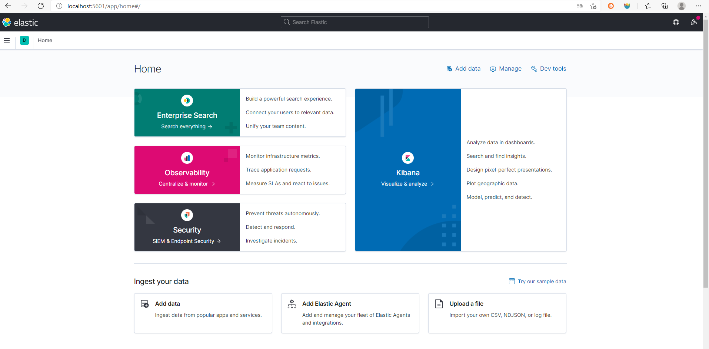

# jetlinks项目初体验
## 1 环境准备

须安装以下软件：

**jdk 1.8.0_2xx+**

**nodeJS v12.xx**

**npm v6.xx**

**Elasticsearch 6.8+**，

**Kibana 6.8+**

**mysql 5.7+**

**redis 5.x**

其中**Elasticsearch 和 Kibana版本需要保持一致**。

此外，编码工具后端使用**IntelliJ IDEA**，前端使用**WebStorm**。

## 2 代码下载

```shell
# 后端代码
git clone https://github.com/jetlinks/jetlinks-community.git

# 前端代码
git clone https://github.com/jetlinks/jetlinks-ui-antd.git
```

## 3 配置文件

### 3.1 后端代码配置文件

配置文件地址：`jetlinks-standalone/src/main/resources/application.yml`

```yaml
server:
  port: 8848 #端口号
spring:
  redis: #redis配置
    host: 10.1.93.168
    port: 6379
    password: _bd@20cube19!
    lettuce:
      pool:
        max-active: 1024
    timeout: 20s
    serializer: jdk # 设置fst时,redis key使用string序列化,value使用 fst序列化.
    
  r2dbc: #mysql数据库配置
    url: r2dbc:mysql://localhost:3306/oil?useUnicode=true&characterEncoding=utf8&zeroDateTimeBehavior=convertToNull&allowMultiQueries=true
    username: root
    password: 123456
    pool:
      max-size: 32
  reactor:
    debug-agent:
      enabled: false
  data:
    elasticsearch:
      client:
        reactive:
          endpoints: ${elasticsearch.client.host}:${elasticsearch.client.port}
          max-in-memory-size: 100MB
          socket-timeout: ${elasticsearch.client.socket-timeout}
          connection-timeout: ${elasticsearch.client.socket-timeout}

easyorm:
  default-schema: oil # 此处和数据库名称要一致
  dialect: mysql #数据库方言
```

### 3.2 前端配置文件

配置后台接口的配置文件：`config/proxy.ts`

```yaml
/**
 * 在生产环境 代理是无法生效的，所以这里没有生产环境的配置
 */
export default {
  dev: {
    '/jetlinks': {
      target: '后台地址',
      changeOrigin: true,
      pathRewrite: { '^/jetlinks': '' },
    },
  },
  test: {
    '/jetlinks': {
      target: '后台地址',
      changeOrigin: true,
      pathRewrite: { '^/jetlinks': '' },
    },
  },
  pre: {
    '/jetlinks': {
      target: '后台地址',
      changeOrigin: true,
      pathRewrite: { '^/jetlinks': '' },
    },
  },
};
```

## 4 运行

### 4.1 启动mysql与redis

### 4.2 启动elasticsearch

执行`elasticsearch/bin/elasticsearch.bat`。

浏览器访问`http://localhost:9200/`，页面如下即可：


### 4.3启动kibana

执行kibana/bin/kibana.bat。

浏览器访问`http://localhost:5601/`，页面如下即可：



### 4.4 通过idea启动后端代码

> 配置

点击`file` --> `Project Structure` --> `Project`,配置`SDK`为`jdk1.8`，`Project language level`为`8`。


> 启动

运行`jetlinks-standalone/src/main/java/org...../JetLinksApplication.java`

### 4.5 通过webstorm启动前端代码

```shell
# 我的项目文件是D:\project\oil-iot\jetlinks-ui-antd
cd D:\project\oil-iot\jetlinks-ui-antd

# 安装依赖
npm install
# 运行
npm start
# 启动成功后直接访问http://localhost:8080/即可。默认账号(密码)为admin(admin)
```

## 5 开发协议包