# k8s部署prometheus + grafana

k8s以Deployment方式部署prometheus + grafana：

------

- 主机说明：

| 系统       | ip             | 角色   | cpu  | 内存 | hostname |
| :--------- | :------------- | :----- | :--- | :--- | :------- |
| CentOS 7.8 | 192.168.30.128 | master | >=2  | >=2G | master1  |
| CentOS 7.8 | 192.168.30.129 | master | >=2  | >=2G | master2  |
| CentOS 7.8 | 192.168.30.130 | node   | >=2  | >=2G | node1    |
| CentOS 7.8 | 192.168.30.131 | node   | >=2  | >=2G | node2    |
| CentOS 7.8 | 192.168.30.132 | node   | >=2  | >=2G | node3    |

```shell
[root@master ~]# kubectl get node
NAME     STATUS   ROLES    AGE    VERSION
master   Ready    master   141d   v1.19.2
node1    Ready    <none>   141d   v1.19.2
```

- 采集方案：

```yaml
1.通过prometheus-node-exporter采集主机的性能指标数据，并通过暴露的 /metrics 接口用prometheus抓取 

2.通过kube-apiserver、kube-controller-manager、kube-scheduler、etcd、kubelet、kube-proxy自身暴露的 /metrics 获取节点上与k8s集群相关的一些指标数据 

3.通过cadvisor采集容器、Pod相关的性能指标数据，并通过暴露的 /metrics 接口用prometheus抓取 通过blackbox-exporter采集应用的网络性能(http、tcp、icmp等)数据，并通过暴露的 /metrics 接口用prometheus抓取 

4.通过kube-state-metrics采集k8s资源对象的状态指标数据，并通过暴露的 /metrics 接口用prometheus抓取 

5.应用自己采集容器中进程主动暴露的指标数据（暴露指标的功能由应用自己实现，并添加约定的annotation，prometheus负责根据annotation实现抓取）
```

- 抓取介绍：

Kubernetes可以约定好带哪些annotation前缀的服务是自主暴露监控指标的服务。应用添加约定的这些annotations，Prometheus可以根据annotation实现抓取。例如：

```json
prometheus.io/scrape: 'true'    # 获知对应的endpoint是需要被scrape的 
prometheus.io/app-metrics: 'true'   # 获知对应的endpoint中有应用进程暴露的metrics 
prometheus.io/app-metrics-port: '8080'  # 获知进程暴露的metrics的端口 
prometheus.io/app-metrics-path: '/metrics'  # 获知进程暴露的metrics的具体路径
```

应用可以在service中指定约定的annotation，实现Prometheus对该应用的网络服务进行探测：

```json
http探测:
	prometheus.io/scrape: 'true'    
	prometheus.io/http-probe: 'true'    
	prometheus.io/http-probe-port: '8080'    
	prometheus.io/http-probe-path: '/healthz' 
tcp探测:
	prometheus.io/scrape: 'true'    
	prometheus.io/tcp-probe: 'true'    
	prometheus.io/tcp-probe-port: '80'
```

Prometheus根据这些annotations可以获知相应service是需要被探测的，探测的网络协议可以是http、tcp或其他，以及具体的探测端口。http探测需要知道探测的具体url。

------

### namespace

```shell
mkdir -p /home/k8s/monitoring/{node-exporter,k8s,kube-state-metrics,blackbox-exporter,dingtalk,alertmanager,prometheus,grafana} 

cd /home/k8s/monitoring 

vim namespace.yaml

```

```yaml
apiVersion: v1
kind: Namespace
metadata:  
  name: monitoring
```


------

### node-exporter

```shell
vim node-exporter/node-exporter.yaml
```

```yaml
apiVersion: v1
kind: Service
metadata:
  name: node-exporter
  namespace: monitoring
  labels:
    app: node-exporter
  annotations:
    prometheus.io/scrape: 'true'
spec:
  selector:
    app: node-exporter
  ports:
  - name: node-exporter
    port: 9100
    protocol: TCP
    targetPort: 9100
  type: NodePort
 
---
apiVersion: apps/v1
kind: DaemonSet
metadata:
  name: node-exporter
  namespace: monitoring
  labels:
    app: node-exporter
spec:
  selector:
    matchLabels:
      app: node-exporter
  template:
    metadata:
      name: node-exporter
      labels:
        app: node-exporter
    spec:
      containers:
      - name: node-exporter
        image: prom/node-exporter:latest
        imagePullPolicy: IfNotPresent
        ports:
        - containerPort: 9100
          hostPort: 9100
      hostNetwork: true
      hostPID: true
      tolerations:
      - key: node-role.kubernetes.io/master
        operator: Exists
        effect: NoSchedule
```

------

### k8s组件

==controller-manager：==

```shell
vim k8s/kube-controller-manager-prometheus-discovery.yaml
```

```yaml
apiVersion: v1
kind: Service
metadata:
  name: kube-controller-manager-prometheus-discovery
  namespace: kube-system
  labels:
    component: kube-controller-manager
  annotations:
    prometheus.io/scrape: 'true'
spec:
  selector:
    component: kube-controller-manager
  ports:
  - name: http-metrics
    port: 10252
    targetPort: 10252
    protocol: TCP
  type: NodePort
```

==kube-scheduler：==

```shell
vim k8s/kube-scheduler-prometheus-discovery.yaml
```

```yaml
apiVersion: v1
kind: Service
metadata:
  name: kube-scheduler-prometheus-discovery
  namespace: kube-system
  labels:
    component: kube-scheduler
  annotations:
    prometheus.io/scrape: 'true'
spec:
  selector:
    component: kube-scheduler
  ports:
  - name: http-metrics
    port: 10251
    protocol: TCP
    targetPort: 10251
  type: NodePort
```

==kube-proxy：==

```shell
vim k8s/kube-proxy-prometheus-discovery.yaml
```

```yaml
apiVersion: v1
kind: Service
metadata:
  name: kube-proxy-prometheus-discovery
  namespace: kube-system
  labels:
    k8s-app: kube-proxy
  annotations:
    prometheus.io/scrape: 'true'
spec:
  selector:
    k8s-app: kube-proxy
  ports:
  - name: http-metrics
    port: 10249
    protocol: TCP
    targetPort: 10249
  type: NodePort
```

------

### kube-state-metrics

```shell
vim kube-state-metrics/rbac.yaml
```

```yaml
apiVersion: v1
kind: ServiceAccount
metadata:
  name: kube-state-metrics
  namespace: monitoring
  labels:
    app: kube-state-metrics
 
--- 
apiVersion: rbac.authorization.k8s.io/v1
kind: ClusterRole
metadata:
  name: kube-state-metrics
  labels:
    app: kube-state-metrics
rules:
- apiGroups:
  - ""
  resources:
  - configmaps
  - secrets
  - nodes
  - pods
  - services
  - resourcequotas
  - replicationcontrollers
  - limitranges
  - persistentvolumeclaims
  - persistentvolumes
  - namespaces
  - endpoints
  verbs:
  - list
  - watch
- apiGroups:
  - extensions
  resources:
  - daemonsets
  - deployments
  - replicasets
  - ingresses
  verbs:
  - list
  - watch
- apiGroups:
  - apps
  resources:
  - statefulsets
  - daemonsets
  - deployments
  - replicasets
  verbs:
  - list
  - watch
- apiGroups:
  - batch
  resources:
  - cronjobs
  - jobs
  verbs:
  - list
  - watch
- apiGroups:
  - autoscaling
  resources:
  - horizontalpodautoscalers
  verbs:
  - list
  - watch
- apiGroups:
  - authentication.k8s.io
  resources:
  - tokenreviews
  verbs:
  - create
- apiGroups:
  - authorization.k8s.io
  resources:
  - subjectaccessreviews
  verbs:
  - create
- apiGroups:
  - policy
  resources:
  - poddisruptionbudgets
  verbs:
  - list
  - watch
- apiGroups:
  - certificates.k8s.io
  resources:
  - certificatesigningrequests
  verbs:
  - list
  - watch
- apiGroups:
  - storage.k8s.io
  resources:
  - storageclasses
  - volumeattachments
  verbs:
  - list
  - watch
- apiGroups:
  - admissionregistration.k8s.io
  resources:
  - mutatingwebhookconfigurations
  - validatingwebhookconfigurations
  verbs:
  - list
  - watch
- apiGroups:
  - networking.k8s.io
  resources:
  - networkpolicies
  verbs:
  - list
  - watch
- apiGroups:
  - coordination.k8s.io
  resources:
  - leases
  verbs:
  - list
  - watch
  
---
apiVersion: rbac.authorization.k8s.io/v1
kind: ClusterRoleBinding
metadata:
  name: kube-state-metrics
  labels:
    app: kube-state-metrics
roleRef:
  apiGroup: rbac.authorization.k8s.io
  kind: ClusterRole
  name: kube-state-metrics
subjects:
- kind: ServiceAccount
  name: kube-state-metrics
  namespace: monitoring
```


```shell
vim kube-state-metrics/kube-state-metrics.yaml
```

```yaml
apiVersion: v1
kind: Service
metadata:
  name: kube-state-metrics
  namespace: monitoring
  labels:
    app: kube-state-metrics
  annotations:
    prometheus.io/scrape: 'true'
    prometheus.io/http-probe: 'true'
    prometheus.io/http-probe-path: '/healthz'
    prometheus.io/http-probe-port: '8080'
spec:
  selector:
    app: kube-state-metrics
  ports:
  - name: kube-state-metrics
    port: 8080
    protocol: TCP
    targetPort: 8080
  type: NodePort
   
---
apiVersion: apps/v1
kind: Deployment
metadata:
  name: kube-state-metrics
  namespace: monitoring
  labels:
    app: kube-state-metrics
spec:
  replicas: 1
  selector:
    matchLabels:
      app: kube-state-metrics
  template:
    metadata:
      labels:
        app: kube-state-metrics
    spec:
      serviceAccountName: kube-state-metrics
      containers:
      - name: kube-state-metrics
        image: quay.mirrors.ustc.edu.cn/coreos/kube-state-metrics:v1.8.0                # kube-state-metrics:v1.9.7 适用于Kubernetes 1.16以上版本
        imagePullPolicy: IfNotPresent
        ports:
        - containerPort: 8080
      nodeSelector:
        node-role.kubernetes.io/master: ""
        kubernetes.io/hostname: "master"
      tolerations:
      - key: node-role.kubernetes.io/master
        operator: Exists
        effect: NoSchedule
```

------

### blackbox-exporter

blackbox-exporter是一个黑盒探测工具，可以对服务的http、tcp、icmp等进行网络探测。

```shell
vim blackbox-exporter/config.yaml
```

```yaml
apiVersion: v1
kind: ConfigMap
metadata:
  name: blackbox-exporter
  namespace: monitoring
  labels:
    app: blackbox-exporter
data:
  blackbox.yml: |-
    modules:
      http_2xx:
        prober: http
        timeout: 10s
        http:
          valid_http_versions: ["HTTP/1.1", "HTTP/2"]
          valid_status_codes: []
          method: GET
          preferred_ip_protocol: "ip4"
      http_post_2xx:
        prober: http
        timeout: 10s
        http:
          valid_http_versions: ["HTTP/1.1", "HTTP/2"]
          method: POST
          preferred_ip_protocol: "ip4"
      tcp_connect:
        prober: tcp
        timeout: 10s
      icmp:
        prober: icmp
        timeout: 10s
        icmp:
          preferred_ip_protocol: "ip4"
```


```shell
vim blackbox-exporter/blackbox-exporter.yaml
```

```yaml
apiVersion: v1
kind: Service
metadata:
  name: blackbox-exporter
  namespace: monitoring
  labels:
    app: blackbox-exporter
  annotations:
    prometheus.io/scrape: 'true'
spec:
  selector:
    app: blackbox-exporter
  ports:
  - name: blackbox
    port: 9115
    protocol: TCP
    targetPort: 9115
    nodePort: 30115
  type: NodePort
  
---  
apiVersion: apps/v1
kind: Deployment
metadata:
  name: blackbox-exporter
  namespace: monitoring
spec:
  replicas: 1
  selector:
    matchLabels:
      app: blackbox-exporter
  template:
    metadata:
      labels:
        app: blackbox-exporter
    spec:
      containers:
      - name: blackbox-exporter
        image: prom/blackbox-exporter:latest
        imagePullPolicy: IfNotPresent
        ports:
        - containerPort: 9115
        readinessProbe:
          tcpSocket:
            port: 9115
          initialDelaySeconds: 10
          timeoutSeconds: 5
        resources:
          requests:
            memory: 50Mi
            cpu: 100m
          limits:
            memory: 60Mi
            cpu: 200m
        volumeMounts:
        - name: config
          mountPath: /etc/blackbox_exporter
        args:
        - '--config.file=/etc/blackbox_exporter/blackbox.yml'
        - '--web.listen-address=:9115'
      volumes:
      - name: config
        configMap:
          name: blackbox-exporter
      nodeSelector:
        node-role.kubernetes.io/master: ""
      tolerations:
      - key: node-role.kubernetes.io/master
        operator: Exists
        effect: NoSchedule

```

> 注意：
> blackbox-exporter的配置文件为 `/etc/blackbox_exporter/blackbox.yml`， 运行时可以动态重载配置文件，当重新加载配置文件失败时，不影响运行中的配置。
>
> 重载方式：`curl -XPOST http://ip:9115/-/reload`

------

### dingtalk

未验证！！

```shell
vim dingtalk/config.yaml
```

```yaml
apiVersion: v1
kind: ConfigMap
metadata:
  name: dingtalk-config
  namespace: monitoring
data:
  config.yml: |-
    targets:
      webhook:
        url: https://oapi.dingtalk.com/robot/send?access_token=xxxxxxxxxxxx             #修改为钉钉机器人的webhook
        mention:
          all: true             #@所有
```

```shell
vim dingtalk/dingtalk.yaml
```

```yaml
apiVersion: v1
kind: Service
metadata:
  name: dingtalk
  namespace: monitoring
  labels:
    app: dingtalk
  annotations:
    prometheus.io/scrape: 'false'
spec:
  selector:
    app: dingtalk
  ports:
  - name: dingtalk
    port: 8060
    protocol: TCP
    targetPort: 8060
  
---
apiVersion: apps/v1
kind: Deployment
metadata:
  name: dingtalk
  namespace: monitoring
spec:
  replicas: 1
  selector:
    matchLabels:
      app: dingtalk
  template:
    metadata:
      name: dingtalk
      labels:
        app: dingtalk
    spec:
      containers:
      - name: dingtalk
        image: timonwong/prometheus-webhook-dingtalk:latest
        imagePullPolicy: IfNotPresent
        ports:
        - containerPort: 8060
        volumeMounts:
        - name: config
          mountPath: /etc/prometheus-webhook-dingtalk
      volumes:
      - name: config
        configMap:
          name: dingtalk-config
```


### alertmanager

```shell
vim alertmanager/templates.yaml
```

```yaml
apiVersion: v1
kind: ConfigMap
metadata:
  name: alertmanager-templates
  namespace: monitoring
data:
  default.tmpl: |
    {{ define "__alertmanager" }}AlertManager{{ end }}
    {{ define "__alertmanagerURL" }}{{ .ExternalURL }}/#/alerts?receiver={{ .Receiver }}{{ end }}
    {{ define "__subject" }}[{{ .Status | toUpper }}{{ if eq .Status "firing" }}:{{ .Alerts.Firing | len }}{{ end }}] {{ .GroupLabels.SortedPairs.Values | join " " }} {{ if gt (len .CommonLabels) (len .GroupLabels) }}({{ with .CommonLabels.Remove .GroupLabels.Names }}{{ .Values | join " " }}{{ end }}){{ end }}{{ end }}
    {{ define "__description" }}{{ end }}
    {{ define "__text_alert_list" }}{{ range . }}Labels:
    {{ range .Labels.SortedPairs }} - {{ .Name }} = {{ .Value }}
    {{ end }}Annotations:
    {{ range .Annotations.SortedPairs }} - {{ .Name }} = {{ .Value }}
    {{ end }}Source: {{ .GeneratorURL }}
    {{ end }}{{ end }}
    {{ define "slack.default.title" }}{{ template "__subject" . }}{{ end }}
    {{ define "slack.default.username" }}{{ template "__alertmanager" . }}{{ end }}
    {{ define "slack.default.fallback" }}{{ template "slack.default.title" . }} | {{ template "slack.default.titlelink" . }}{{ end }}
    {{ define "slack.default.pretext" }}{{ end }}
    {{ define "slack.default.titlelink" }}{{ template "__alertmanagerURL" . }}{{ end }}
    {{ define "slack.default.iconemoji" }}{{ end }}
    {{ define "slack.default.iconurl" }}{{ end }}
    {{ define "slack.default.text" }}{{ end }}
    {{ define "hipchat.default.from" }}{{ template "__alertmanager" . }}{{ end }}
    {{ define "hipchat.default.message" }}{{ template "__subject" . }}{{ end }}
    {{ define "pagerduty.default.description" }}{{ template "__subject" . }}{{ end }}
    {{ define "pagerduty.default.client" }}{{ template "__alertmanager" . }}{{ end }}
    {{ define "pagerduty.default.clientURL" }}{{ template "__alertmanagerURL" . }}{{ end }}
    {{ define "pagerduty.default.instances" }}{{ template "__text_alert_list" . }}{{ end }}
    {{ define "opsgenie.default.message" }}{{ template "__subject" . }}{{ end }}
    {{ define "opsgenie.default.description" }}{{ .CommonAnnotations.SortedPairs.Values | join " " }}
    {{ if gt (len .Alerts.Firing) 0 -}}
    Alerts Firing:
    {{ template "__text_alert_list" .Alerts.Firing }}
    {{- end }}
    {{ if gt (len .Alerts.Resolved) 0 -}}
    Alerts Resolved:
    {{ template "__text_alert_list" .Alerts.Resolved }}
    {{- end }}
    {{- end }}
    {{ define "opsgenie.default.source" }}{{ template "__alertmanagerURL" . }}{{ end }}
    {{ define "victorops.default.message" }}{{ template "__subject" . }} | {{ template "__alertmanagerURL" . }}{{ end }}
    {{ define "victorops.default.from" }}{{ template "__alertmanager" . }}{{ end }}
    {{ define "email.default.subject" }}{{ template "__subject" . }}{{ end }}
    {{ define "email.default.html" }}
    <!DOCTYPE html PUBLIC "-//W3C//DTD XHTML 1.0 Transitional//EN" "http://www.w3.org/TR/xhtml1/DTD/xhtml1-transitional.dtd">
    <!--
    Style and HTML derived from https://github.com/mailgun/transactional-email-templates
    The MIT License (MIT)
    Copyright (c) 2014 Mailgun
    Permission is hereby granted, free of charge, to any person obtaining a copy
    of this software and associated documentation files (the "Software"), to deal
    in the Software without restriction, including without limitation the rights
    to use, copy, modify, merge, publish, distribute, sublicense, and/or sell
    copies of the Software, and to permit persons to whom the Software is
    furnished to do so, subject to the following conditions:
    The above copyright notice and this permission notice shall be included in all
    copies or substantial portions of the Software.
    THE SOFTWARE IS PROVIDED "AS IS", WITHOUT WARRANTY OF ANY KIND, EXPRESS OR
    IMPLIED, INCLUDING BUT NOT LIMITED TO THE WARRANTIES OF MERCHANTABILITY,
    FITNESS FOR A PARTICULAR PURPOSE AND NONINFRINGEMENT. IN NO EVENT SHALL THE
    AUTHORS OR COPYRIGHT HOLDERS BE LIABLE FOR ANY CLAIM, DAMAGES OR OTHER
    LIABILITY, WHETHER IN AN ACTION OF CONTRACT, TORT OR OTHERWISE, ARISING FROM,
    OUT OF OR IN CONNECTION WITH THE SOFTWARE OR THE USE OR OTHER DEALINGS IN THE
    SOFTWARE.
    -->
    <html xmlns="http://www.w3.org/1999/xhtml" xmlns="http://www.w3.org/1999/xhtml" style="font-family: 'Helvetica Neue', Helvetica, Arial, sans-serif; box-sizing: border-box; font-size: 14px; margin: 0;">
    <head style="font-family: 'Helvetica Neue', Helvetica, Arial, sans-serif; box-sizing: border-box; font-size: 14px; margin: 0;">
    <meta name="viewport" content="width=device-width" style="font-family: 'Helvetica Neue', Helvetica, Arial, sans-serif; box-sizing: border-box; font-size: 14px; margin: 0;" />
    <meta http-equiv="Content-Type" content="text/html; charset=UTF-8" style="font-family: 'Helvetica Neue', Helvetica, Arial, sans-serif; box-sizing: border-box; font-size: 14px; margin: 0;" />
    <title style="font-family: 'Helvetica Neue', Helvetica, Arial, sans-serif; box-sizing: border-box; font-size: 14px; margin: 0;">{{ template "__subject" . }}</title>
    </head>
    <body itemscope="" itemtype="http://schema.org/EmailMessage" style="font-family: 'Helvetica Neue', Helvetica, Arial, sans-serif; box-sizing: border-box; font-size: 14px; -webkit-font-smoothing: antialiased; -webkit-text-size-adjust: none; height: 100%; line-height: 1.6em; width: 100% !important; background-color: #f6f6f6; margin: 0; padding: 0;" bgcolor="#f6f6f6">
    <table style="font-family: 'Helvetica Neue', Helvetica, Arial, sans-serif; box-sizing: border-box; font-size: 14px; width: 100%; background-color: #f6f6f6; margin: 0;" bgcolor="#f6f6f6">
      <tr style="font-family: 'Helvetica Neue', Helvetica, Arial, sans-serif; box-sizing: border-box; font-size: 14px; margin: 0;">
        <td style="font-family: 'Helvetica Neue', Helvetica, Arial, sans-serif; box-sizing: border-box; font-size: 14px; vertical-align: top; margin: 0;" valign="top"></td>
        <td width="600" style="font-family: 'Helvetica Neue', Helvetica, Arial, sans-serif; box-sizing: border-box; font-size: 14px; vertical-align: top; display: block !important; max-width: 600px !important; clear: both !important; width: 100% !important; margin: 0 auto; padding: 0;" valign="top">
          <div style="font-family: 'Helvetica Neue', Helvetica, Arial, sans-serif; box-sizing: border-box; font-size: 14px; max-width: 600px; display: block; margin: 0 auto; padding: 0;">
            <table width="100%" cellpadding="0" cellspacing="0" style="font-family: 'Helvetica Neue', Helvetica, Arial, sans-serif; box-sizing: border-box; font-size: 14px; border-radius: 3px; background-color: #fff; margin: 0; border: 1px solid #e9e9e9;" bgcolor="#fff">
              <tr style="font-family: 'Helvetica Neue', Helvetica, Arial, sans-serif; box-sizing: border-box; font-size: 14px; margin: 0;">
                <td style="font-family: 'Helvetica Neue', Helvetica, Arial, sans-serif; box-sizing: border-box; font-size: 16px; vertical-align: top; color: #fff; font-weight: 500; text-align: center; border-radius: 3px 3px 0 0; background-color: #E6522C; margin: 0; padding: 20px;" align="center" bgcolor="#E6522C" valign="top">
                  {{ .Alerts | len }} alert{{ if gt (len .Alerts) 1 }}s{{ end }} for {{ range .GroupLabels.SortedPairs }}
                    {{ .Name }}={{ .Value }}
                  {{ end }}
                </td>
              </tr>
              <tr style="font-family: 'Helvetica Neue', Helvetica, Arial, sans-serif; box-sizing: border-box; font-size: 14px; margin: 0;">
                <td style="font-family: 'Helvetica Neue', Helvetica, Arial, sans-serif; box-sizing: border-box; font-size: 14px; vertical-align: top; margin: 0; padding: 10px;" valign="top">
                  <table width="100%" cellpadding="0" cellspacing="0" style="font-family: 'Helvetica Neue', Helvetica, Arial, sans-serif; box-sizing: border-box; font-size: 14px; margin: 0;">
                    <tr style="font-family: 'Helvetica Neue', Helvetica, Arial, sans-serif; box-sizing: border-box; font-size: 14px; margin: 0;">
                      <td style="font-family: 'Helvetica Neue', Helvetica, Arial, sans-serif; box-sizing: border-box; font-size: 14px; vertical-align: top; margin: 0; padding: 0 0 20px;" valign="top">
                        <a href="{{ template "__alertmanagerURL" . }}" style="font-family: 'Helvetica Neue', Helvetica, Arial, sans-serif; box-sizing: border-box; font-size: 14px; color: #FFF; text-decoration: none; line-height: 2em; font-weight: bold; text-align: center; cursor: pointer; display: inline-block; border-radius: 5px; text-transform: capitalize; background-color: #348eda; margin: 0; border-color: #348eda; border-style: solid; border-width: 10px 20px;">View in {{ template "__alertmanager" . }}</a>
                      </td>
                    </tr>
                    {{ if gt (len .Alerts.Firing) 0 }}
                    <tr style="font-family: 'Helvetica Neue', Helvetica, Arial, sans-serif; box-sizing: border-box; font-size: 14px; margin: 0;">
                      <td style="font-family: 'Helvetica Neue', Helvetica, Arial, sans-serif; box-sizing: border-box; font-size: 14px; vertical-align: top; margin: 0; padding: 0 0 20px;" valign="top">
                        <strong style="font-family: 'Helvetica Neue', Helvetica, Arial, sans-serif; box-sizing: border-box; font-size: 14px; margin: 0;">[{{ .Alerts.Firing | len }}] Firing</strong>
                      </td>
                    </tr>
                    {{ end }}
                    {{ range .Alerts.Firing }}
                    <tr style="font-family: 'Helvetica Neue', Helvetica, Arial, sans-serif; box-sizing: border-box; font-size: 14px; margin: 0;">
                      <td style="font-family: 'Helvetica Neue', Helvetica, Arial, sans-serif; box-sizing: border-box; font-size: 14px; vertical-align: top; margin: 0; padding: 0 0 20px;" valign="top">
                        <strong style="font-family: 'Helvetica Neue', Helvetica, Arial, sans-serif; box-sizing: border-box; font-size: 14px; margin: 0;">Labels</strong><br style="font-family: 'Helvetica Neue', Helvetica, Arial, sans-serif; box-sizing: border-box; font-size: 14px; margin: 0;" />
                        {{ range .Labels.SortedPairs }}{{ .Name }} = {{ .Value }}<br style="font-family: 'Helvetica Neue', Helvetica, Arial, sans-serif; box-sizing: border-box; font-size: 14px; margin: 0;" />{{ end }}
                        {{ if gt (len .Annotations) 0 }}<strong style="font-family: 'Helvetica Neue', Helvetica, Arial, sans-serif; box-sizing: border-box; font-size: 14px; margin: 0;">Annotations</strong><br style="font-family: 'Helvetica Neue', Helvetica, Arial, sans-serif; box-sizing: border-box; font-size: 14px; margin: 0;" />{{ end }}
                        {{ range .Annotations.SortedPairs }}{{ .Name }} = {{ .Value }}<br style="font-family: 'Helvetica Neue', Helvetica, Arial, sans-serif; box-sizing: border-box; font-size: 14px; margin: 0;" />{{ end }}
                        <a href="{{ .GeneratorURL }}" style="font-family: 'Helvetica Neue', Helvetica, Arial, sans-serif; box-sizing: border-box; font-size: 14px; color: #348eda; text-decoration: underline; margin: 0;">Source</a><br style="font-family: 'Helvetica Neue', Helvetica, Arial, sans-serif; box-sizing: border-box; font-size: 14px; margin: 0;" />
                      </td>
                    </tr>
                    {{ end }}
                    {{ if gt (len .Alerts.Resolved) 0 }}
                      {{ if gt (len .Alerts.Firing) 0 }}
                    <tr style="font-family: 'Helvetica Neue', Helvetica, Arial, sans-serif; box-sizing: border-box; font-size: 14px; margin: 0;">
                      <td style="font-family: 'Helvetica Neue', Helvetica, Arial, sans-serif; box-sizing: border-box; font-size: 14px; vertical-align: top; margin: 0; padding: 0 0 20px;" valign="top">
                        <br style="font-family: 'Helvetica Neue', Helvetica, Arial, sans-serif; box-sizing: border-box; font-size: 14px; margin: 0;" />
                        <hr style="font-family: 'Helvetica Neue', Helvetica, Arial, sans-serif; box-sizing: border-box; font-size: 14px; margin: 0;" />
                        <br style="font-family: 'Helvetica Neue', Helvetica, Arial, sans-serif; box-sizing: border-box; font-size: 14px; margin: 0;" />
                      </td>
                    </tr>
                      {{ end }}
                    <tr style="font-family: 'Helvetica Neue', Helvetica, Arial, sans-serif; box-sizing: border-box; font-size: 14px; margin: 0;">
                      <td style="font-family: 'Helvetica Neue', Helvetica, Arial, sans-serif; box-sizing: border-box; font-size: 14px; vertical-align: top; margin: 0; padding: 0 0 20px;" valign="top">
                        <strong style="font-family: 'Helvetica Neue', Helvetica, Arial, sans-serif; box-sizing: border-box; font-size: 14px; margin: 0;">[{{ .Alerts.Resolved | len }}] Resolved</strong>
                      </td>
                    </tr>
                    {{ end }}
                    {{ range .Alerts.Resolved }}
                    <tr style="font-family: 'Helvetica Neue', Helvetica, Arial, sans-serif; box-sizing: border-box; font-size: 14px; margin: 0;">
                      <td style="font-family: 'Helvetica Neue', Helvetica, Arial, sans-serif; box-sizing: border-box; font-size: 14px; vertical-align: top; margin: 0; padding: 0 0 20px;" valign="top">
                        <strong style="font-family: 'Helvetica Neue', Helvetica, Arial, sans-serif; box-sizing: border-box; font-size: 14px; margin: 0;">Labels</strong><br style="font-family: 'Helvetica Neue', Helvetica, Arial, sans-serif; box-sizing: border-box; font-size: 14px; margin: 0;" />
                        {{ range .Labels.SortedPairs }}{{ .Name }} = {{ .Value }}<br style="font-family: 'Helvetica Neue', Helvetica, Arial, sans-serif; box-sizing: border-box; font-size: 14px; margin: 0;" />{{ end }}
                        {{ if gt (len .Annotations) 0 }}<strong style="font-family: 'Helvetica Neue', Helvetica, Arial, sans-serif; box-sizing: border-box; font-size: 14px; margin: 0;">Annotations</strong><br style="font-family: 'Helvetica Neue', Helvetica, Arial, sans-serif; box-sizing: border-box; font-size: 14px; margin: 0;" />{{ end }}
                        {{ range .Annotations.SortedPairs }}{{ .Name }} = {{ .Value }}<br style="font-family: 'Helvetica Neue', Helvetica, Arial, sans-serif; box-sizing: border-box; font-size: 14px; margin: 0;" />{{ end }}
                        <a href="{{ .GeneratorURL }}" style="font-family: 'Helvetica Neue', Helvetica, Arial, sans-serif; box-sizing: border-box; font-size: 14px; color: #348eda; text-decoration: underline; margin: 0;">Source</a><br style="font-family: 'Helvetica Neue', Helvetica, Arial, sans-serif; box-sizing: border-box; font-size: 14px; margin: 0;" />
                      </td>
                    </tr>
                    {{ end }}
                  </table>
                </td>
              </tr>
            </table>
            <div style="font-family: 'Helvetica Neue', Helvetica, Arial, sans-serif; box-sizing: border-box; font-size: 14px; width: 100%; clear: both; color: #999; margin: 0; padding: 20px;">
              <table width="100%" style="font-family: 'Helvetica Neue', Helvetica, Arial, sans-serif; box-sizing: border-box; font-size: 14px; margin: 0;">
                <tr style="font-family: 'Helvetica Neue', Helvetica, Arial, sans-serif; box-sizing: border-box; font-size: 14px; margin: 0;">
                  <td style="font-family: 'Helvetica Neue', Helvetica, Arial, sans-serif; box-sizing: border-box; font-size: 12px; vertical-align: top; text-align: center; color: #999; margin: 0; padding: 0 0 20px;" align="center" valign="top"><a href="{{ .ExternalURL }}" style="font-family: 'Helvetica Neue', Helvetica, Arial, sans-serif; box-sizing: border-box; font-size: 12px; color: #999; text-decoration: underline; margin: 0;">Sent by {{ template "__alertmanager" . }}</a></td>
                </tr>
              </table>
            </div></div>
        </td>
        <td style="font-family: 'Helvetica Neue', Helvetica, Arial, sans-serif; box-sizing: border-box; font-size: 14px; vertical-align: top; margin: 0;" valign="top"></td>
      </tr>
    </table>
    </body>
    </html>
    {{ end }}
    {{ define "pushover.default.title" }}{{ template "__subject" . }}{{ end }}
    {{ define "pushover.default.message" }}{{ .CommonAnnotations.SortedPairs.Values | join " " }}
    {{ if gt (len .Alerts.Firing) 0 }}
    Alerts Firing:
    {{ template "__text_alert_list" .Alerts.Firing }}
    {{ end }}
    {{ if gt (len .Alerts.Resolved) 0 }}
    Alerts Resolved:
    {{ template "__text_alert_list" .Alerts.Resolved }}
    {{ end }}
    {{ end }}
    {{ define "pushover.default.url" }}{{ template "__alertmanagerURL" . }}{{ end }}
  slack.tmpl: |
    {{ define "slack.devops.text" }}
    {{range .Alerts}}{{.Annotations.DESCRIPTION}}
    {{end}}
    {{ end }}
```

```shell
vim alertmanager/config.yaml
```

```yaml
apiVersion: v1
kind: ConfigMap
metadata:
  name: alertmanager-config
  namespace: monitoring
data:
  config.yml: |-
    global:
      resolve_timeout: 5m
      smtp_smarthost: 'smtp.163.com:465'                #邮箱smtp服务器代理，启用SSL发信, 端口一般是465
      smtp_from: 'alert@163.com'                #发送邮箱名称
      smtp_auth_username: 'alert@163.com'               #邮箱名称
      smtp_auth_password: 'password'                #邮箱密码或授权码
      smtp_require_tls: false
    templates:
    - '/etc/templates/*.tmpl'
    route:
      receiver: 'default'
      group_wait: 10s
      group_interval: 1m
      repeat_interval: 1h
      group_by: ['alertname', 'instance', 'cluster', 'service']
      routes:
      - receiver: 'default'
        match:
          severity: 'warning'
      - receiver: 'dingtalk'
        match:
          severity: 'critical'
    inhibit_rules:
    - source_match:
        severity: 'critical'
      target_match:
        severity: 'warning'
      equal: ['alertname', 'instance', 'cluster', 'service']
    receivers:
    - name: 'default'
      email_configs:
      - to: 'receiver@163.com'
        send_resolved: true
    - name: 'dingtalk'
      webhook_configs:
      - url: 'http://dingtalk:8060/dingtalk/webhook/send'
        send_resolved: true
```


```shell
vim alertmanager/alertmanager.yaml
```

```yaml
apiVersion: v1
kind: Service
metadata:
  name: alertmanager
  namespace: monitoring
  labels:
    name: alertmanager
  annotations:
    prometheus.io/scrape: 'true'
spec:
  selector:
    app: alertmanager
  ports:
  - name: alertmanager
    port: 9093
    protocol: TCP
    targetPort: 9093
  type: NodePort 
---
apiVersion: apps/v1
kind: Deployment
metadata:
  name: alertmanager
  namespace: monitoring
spec:
  replicas: 1
  selector:
    matchLabels:
      app: alertmanager
  template:
    metadata:
      name: alertmanager
      labels:
        app: alertmanager
    spec:
      containers:
      - name: alertmanager
        image: prom/alertmanager:latest
        imagePullPolicy: IfNotPresent
        ports:
        - containerPort: 9093
        env:
        - name: POD_IP
          valueFrom:
            fieldRef:
              apiVersion: v1
              fieldPath: status.podIP
        args:
          - "--config.file=/etc/alertmanager/config.yml"
          - "--storage.path=/alertmanager"
          - "--cluster.advertise-address=$(POD_IP):6783"                #没有该参数会报错：Failed to get final advertise address
        volumeMounts:
        - name: config
          mountPath: /etc/alertmanager
        - name: templates
          mountPath: /etc/templates
        - name: alertmanager
          mountPath: /alertmanager
      volumes:
      - name: config
        configMap:
          name: alertmanager-config
      - name: templates
        configMap:
          name: alertmanager-templates
      - name: alertmanager
        emptyDir: {}
```

------

### prometheus

```shell
vim prometheus/rbac.yaml
```

```yaml
---         
apiVersion: v1
kind: Service
metadata:
  name: prometheus
  namespace: monitoring
  labels:
    app: prometheus
  annotations:
    prometheus.io/scrape: 'true'
spec:
  selector:
    app: prometheus
  ports:
  - name: prometheus
    port: 9090
    protocol: TCP
    targetPort: 9090
  type: NodePort
          
---
apiVersion: apps/v1
kind: Deployment
metadata:
  name: prometheus
  namespace: monitoring
  labels:
    app: prometheus
spec:
  replicas: 1
  selector:
    matchLabels:
      app: prometheus
  template:
    metadata:
      name: prometheus
      labels:
        app: prometheus
    spec:
      serviceAccountName: prometheus
      containers:
      - name: prometheus
        image: prom/prometheus:latest
        imagePullPolicy: IfNotPresent
        args:
          - '--storage.tsdb.path=/prometheus'
          - '--storage.tsdb.retention.time=30d'
          - '--config.file=/etc/prometheus/prometheus.yml'
        ports:
        - containerPort: 9090
        resources:
          requests:
            cpu: 500m
            memory: 500M
          limits:
            cpu: 500m
            memory: 500M
        volumeMounts:
        - name: config
          mountPath: /etc/prometheus
        - name: rules
          mountPath: /etc/prometheus-rules
        - name: prometheus
          mountPath: /prometheus
      volumes:
      - name: config
        configMap:
          name: prometheus-config
      - name: rules
        configMap:
          name: prometheus-rules
      - name: prometheus
        emptyDir: {}
      nodeSelector:
        node-role.kubernetes.io/master: ""
        kubernetes.io/hostname: "master"
      tolerations:
      - key: node-role.kubernetes.io/master
        operator: Exists
        effect: NoSchedule

```

==prometheus配置文件说明：==

> annotations将任何非标识metadata附加到对象，而labels可用于选择对象并查找满足某些条件的对象集合。相比之下，annotations不用于标识和选择对象，虽然它也是键值形式。annotations不会被Kubernetes直接使用，其主要目的是方便用户阅读查找。
>
> 
>
> Kubernetes的API SERVER会暴露API服务，Promethues集成了对Kubernetes的自动发现，它有5种模式：node、service、pod、endpoints、ingress。 上面是Prometheus官方给出的对Kubernetes服务发现的配置。可以看到大量的relabel_configs，其实把所有的relabel_configs去掉一样可以对kubernetes做服务发现。 relabel_configs仅仅是对采集过来的指标做二次处理，比如要什么、不要什么以及替换什么等等。而以 __meta_ 开头的这些元数据标签都是实例中包含的， 而relabel则是动态的修改、覆盖、添加删除这些标签或者这些标签对应的值。而且以 __ 开头的标签通常是系统内部使用的，因此这些标签不会被写入样本数据中， 如果我们要收集这些东西那么则要进行relabel操作。当然relabel操作也不仅限于操作以 __ 开头的标签。
>
> 
>
> **action的行为：**
>
> ---->replace：默认行为，不配置action的话就采用这种行为，它会根据regex来去匹配source_labels标签上的值，并将并将匹配到的值写入target_label中;
>
> ---->labelmap：它会根据regex去匹配标签名称，并将匹配到的内容作为新标签的名称，其值作为新标签的值;
>
> ---->keep：仅收集匹配到regex的源标签，而会丢弃没有匹配到的所有标签，用于选择;
>
> ---->drop：丢弃匹配到regex的源标签，而会收集没有匹配到的所有标签，用于排除;
>
> ---->labeldrop：使用regex匹配标签，符合regex规则的标签将从target实例中移除，其实也就是不收集不保存;
>
> ---->abelkeep：使用regex匹配标签，仅收集符合regex规则的标签，不符合的不收集。


```shell
vim prometheus/config.yaml
```

```yaml
apiVersion: v1
kind: ConfigMap
metadata:
  name: prometheus-config
  namespace: monitoring
data:
  prometheus.yml: |
    global:
      scrape_interval: 10s
      scrape_timeout: 10s
      evaluation_interval: 10s
    alerting:
      alertmanagers:
      - static_configs:
        - targets:
          - alertmanager:9093
    rule_files:
      - "/etc/prometheus-rules/*.rules"
    scrape_configs:
      - job_name: 'node-exporter'                #node节点性能指标数据
        tls_config:
          ca_file: /var/run/secrets/kubernetes.io/serviceaccount/ca.crt
        bearer_token_file: /var/run/secrets/kubernetes.io/serviceaccount/token
        kubernetes_sd_configs:
        - role: endpoints
        relabel_configs:
        - source_labels: [__meta_kubernetes_service_annotation_prometheus_io_scrape, __meta_kubernetes_endpoint_port_name]
          regex: true;node-exporter
          action: keep
        - source_labels: [__meta_kubernetes_service_annotation_prometheus_io_scheme]
          action: replace
          target_label: __scheme__
          regex: (https?)
        - source_labels: [__meta_kubernetes_service_annotation_prometheus_io_path]
          action: replace
          target_label: __metrics_path__
          regex: (.+)
        - source_labels: [__address__, __meta_kubernetes_service_annotation_prometheus_io_port]
          action: replace
          target_label: __address__
          regex: (.+)(?::\d+);(\d+)
          replacement: $1:$2
        - action: labelmap
          regex: __meta_kubernetes_service_label_(.+)
        - source_labels: [__meta_kubernetes_namespace]
          action: replace
          target_label: kubernetes_namespace
        - source_labels: [__meta_kubernetes_service_name]
          action: replace
          target_label: kubernetes_name

      - job_name: 'k8s-nodes'
        scheme: https
        tls_config:
          ca_file: /var/run/secrets/kubernetes.io/serviceaccount/ca.crt
        bearer_token_file: /var/run/secrets/kubernetes.io/serviceaccount/token
        kubernetes_sd_configs:
        - role: node
        relabel_configs:
        - action: labelmap
          regex: __meta_kubernetes_node_label_(.+)
        - target_label: __address__
          replacement: 10.1.93.190:6443
        - source_labels: [__meta_kubernetes_node_name]
          regex: (.+)
          target_label: __metrics_path__
          replacement: /api/v1/nodes/${1}/proxy/metrics

      - job_name: 'kubernetes-cadvisor'                #容器、Pod相关的性能指标数据
        scheme: https
        tls_config:
          ca_file: /var/run/secrets/kubernetes.io/serviceaccount/ca.crt
        bearer_token_file: /var/run/secrets/kubernetes.io/serviceaccount/token
        kubernetes_sd_configs:
        - role: node
        relabel_configs:
        - action: labelmap
          regex: __meta_kubernetes_node_label_(.+)
        - target_label: __address__
          replacement: 10.1.93.190:6443
        - source_labels: [__meta_kubernetes_node_name]
          regex: (.+)
          target_label: __metrics_path__
          replacement: /api/v1/nodes/${1}/proxy/metrics/cadvisor
        metric_relabel_configs:
        - source_labels: [id]
          action: replace
          regex: '^/machine\.slice/machine-rkt\\x2d([^\\]+)\\.+/([^/]+)\.service$'
          target_label: rkt_container_name
          replacement: '${2}-${1}'
        - source_labels: [id]
          action: replace
          regex: '^/system\.slice/(.+)\.service$'
          target_label: systemd_service_name
          replacement: '${1}'

      - job_name: 'kube-state-metrics'              #资源对象(Deployment、Pod等)的状态
        tls_config:
          ca_file: /var/run/secrets/kubernetes.io/serviceaccount/ca.crt
        bearer_token_file: /var/run/secrets/kubernetes.io/serviceaccount/token
        kubernetes_sd_configs:
        - role: endpoints
        relabel_configs:
        - source_labels: [__meta_kubernetes_service_annotation_prometheus_io_scrape, __meta_kubernetes_endpoint_port_name]
          regex: true;kube-state-metrics
          action: keep
        - source_labels: [__meta_kubernetes_service_annotation_prometheus_io_scheme]
          action: replace
          target_label: __scheme__
          regex: (https?)
        - source_labels: [__meta_kubernetes_service_annotation_prometheus_io_path]
          action: replace
          target_label: __metrics_path__
          regex: (.+)
        - source_labels: [__address__, __meta_kubernetes_service_annotation_prometheus_io_port]
          action: replace
          target_label: __address__
          regex: (.+)(?::\d+);(\d+)
          replacement: $1:$2
        - action: labelmap
          regex: __meta_kubernetes_service_label_(.+)
        - source_labels: [__meta_kubernetes_namespace]
          action: replace
          target_label: kubernetes_namespace
        - source_labels: [__meta_kubernetes_service_name]
          action: replace
          target_label: kubernetes_name

      - job_name: 'kubernetes-service-http-probe'               #通过http方式探测Service状态
        tls_config:
          ca_file: /var/run/secrets/kubernetes.io/serviceaccount/ca.crt
        bearer_token_file: /var/run/secrets/kubernetes.io/serviceaccount/token
        kubernetes_sd_configs:
        - role: service
        metrics_path: /probe
        params:
          module: [http_2xx]
        relabel_configs:
        - source_labels: [__meta_kubernetes_service_annotation_prometheus_io_scrape, __meta_kubernetes_service_annotation_prometheus_io_http_probe]
          regex: true;true
          action: keep
        - source_labels: [__meta_kubernetes_service_name, __meta_kubernetes_namespace, __meta_kubernetes_service_annotation_prometheus_io_http_probe_port, __meta_kubernetes_service_annotation_prometheus_io_http_probe_path]
          action: replace
          target_label: __param_target
          regex: (.+);(.+);(.+);(.+)
          replacement: $1.$2:$3$4
        - target_label: __address__
          replacement: 10.1.93.190:30115
        - source_labels: [__param_target]
          target_label: instance
        - action: labelmap
          regex: __meta_kubernetes_service_annotation_prometheus_io_app_info_(.+)

      - job_name: 'kubernetes-service-tcp-probe'                #通过tcp方式探测Service状态
        tls_config:
          ca_file: /var/run/secrets/kubernetes.io/serviceaccount/ca.crt
        bearer_token_file: /var/run/secrets/kubernetes.io/serviceaccount/token
        kubernetes_sd_configs:
        - role: service
        metrics_path: /probe
        params:
          module: [tcp_connect]
        relabel_configs:
        - source_labels: [__meta_kubernetes_service_annotation_prometheus_io_scrape, __meta_kubernetes_service_annotation_prometheus_io_tcp_probe]
          regex: true;true
          action: keep
        - source_labels: [__meta_kubernetes_service_name, __meta_kubernetes_namespace, __meta_kubernetes_service_annotation_prometheus_io_tcp_probe_port]
          action: replace
          target_label: __param_target
          regex: (.+);(.+);(.+)
          replacement: $1.$2:$3
        - target_label: __address__
          replacement: 10.1.93.190:30115
        - source_labels: [__param_target]
          target_label: instance
        - action: labelmap
          regex: __meta_kubernetes_service_annotation_prometheus_io_app_info_(.+)

      - job_name: 'kubernetes-ingresses'              #通过http方式探测ingresses状态
        kubernetes_sd_configs:
        - role: ingress
        metrics_path: /probe
        params:
          module: [http_2xx]
        relabel_configs:
        - source_labels: [__meta_kubernetes_ingress_scheme, __address__, __meta_kubernetes_ingress_path]
          regex: (.+);(.+);(.+)
          replacement: ${1}://${2}${3}
          target_label: __param_target
        - target_label: __address__
          replacement: 10.1.93.190:30115
        - source_labels: [__param_target]
          target_label: instance
        - action: labelmap
          regex: __meta_kubernetes_ingress_label_(.+)
        - source_labels: [__meta_kubernetes_namespace]
          target_label: kubernetes_namespace
        - source_labels: [__meta_kubernetes_ingress_name]
          target_label: kubernetes_name
```


```shell
vim prometheus/rules.yaml
```

```yaml
apiVersion: v1
kind: ConfigMap
metadata:
  name: prometheus-rules
  namespace: monitoring
data:
  node.rules: |
    groups:
    - name: node
      rules:
      - alert: NodeDown
        expr: up == 0
        for: 3m
        labels:
          severity: critical
        annotations:
          summary: "{{ $labels.instance }}: down"
          description: "{{ $labels.instance }} has been down for more than 3m"
          value: "{{ $value }}"
      - alert: NodeCPUHigh
        expr: (1 - avg by (instance) (irate(node_cpu_seconds_total{mode="idle"}[5m]))) * 100 > 75
        for: 5m
        labels:
          severity: warning
        annotations:
          summary: "{{$labels.instance}}: High CPU usage"
          description: "{{$labels.instance}}: CPU usage is above 75%"
          value: "{{ $value }}"
 
      - alert: NodeCPUIowaitHigh
        expr: avg by (instance) (irate(node_cpu_seconds_total{mode="iowait"}[5m])) * 100 > 50
        for: 5m
        labels:
          severity: warning
        annotations:
          summary: "{{$labels.instance}}: High CPU iowait usage"
          description: "{{$labels.instance}}: CPU iowait usage is above 50%"
          value: "{{ $value }}"
 
      - alert: NodeMemoryUsageHigh
        expr: (1 - node_memory_MemAvailable_bytes / node_memory_MemTotal_bytes) * 100 > 90
        for: 5m
        labels:
          severity: warning
        annotations:
          summary: "{{$labels.instance}}: High memory usage"
          description: "{{$labels.instance}}: Memory usage is above 90%"
          value: "{{ $value }}"
 
      - alert: NodeDiskRootLow
        expr: (1 - node_filesystem_avail_bytes{fstype=~"ext.*|xfs",mountpoint ="/"} / node_filesystem_size_bytes{fstype=~"ext.*|xfs",mountpoint ="/"}) * 100 > 80
        for: 10m
        labels:
          severity: warning
        annotations:
          summary: "{{$labels.instance}}: Low disk(the / partition) space"
          description: "{{$labels.instance}}: Disk(the / partition) usage is above 80%"
          value: "{{ $value }}"
        
      - alert: NodeDiskBootLow
        expr: (1 - node_filesystem_avail_bytes{fstype=~"ext.*|xfs",mountpoint ="/boot"} / node_filesystem_size_bytes{fstype=~"ext.*|xfs",mountpoint ="/boot"}) * 100 > 80
        for: 10m
        labels:
          severity: warning
        annotations:
          summary: "{{$labels.instance}}: Low disk(the /boot partition) space"
          description: "{{$labels.instance}}: Disk(the /boot partition) usage is above 80%"
          value: "{{ $value }}"
 
      - alert: NodeLoad5High
        expr: (node_load5) > (count by (instance) (node_cpu_seconds_total{mode='system'}) * 2)
        for: 5m
        labels:
          severity: warning
        annotations:
          summary: "{{$labels.instance}}: Load(5m) High"
          description: "{{$labels.instance}}: Load(5m) is 2 times the number of CPU cores"
          value: "{{ $value }}"
```


```shell
vim prometheus/prometheus.yaml
```

```yaml
---         
apiVersion: v1
kind: Service
metadata:
  name: prometheus
  namespace: monitoring
  labels:
    app: prometheus
  annotations:
    prometheus.io/scrape: 'true'
spec:
  selector:
    app: prometheus
  ports:
  - name: prometheus
    port: 9090
    protocol: TCP
    targetPort: 9090
  type: NodePort
          
---
apiVersion: apps/v1
kind: Deployment
metadata:
  name: prometheus
  namespace: monitoring
  labels:
    app: prometheus
spec:
  replicas: 1
  selector:
    matchLabels:
      app: prometheus
  template:
    metadata:
      name: prometheus
      labels:
        app: prometheus
    spec:
      serviceAccountName: prometheus
      containers:
      - name: prometheus
        image: prom/prometheus:latest
        imagePullPolicy: IfNotPresent
        args:
          - '--storage.tsdb.path=/prometheus'
          - '--storage.tsdb.retention.time=30d'
          - '--config.file=/etc/prometheus/prometheus.yml'
        ports:
        - containerPort: 9090
        resources:
          requests:
            cpu: 500m
            memory: 500M
          limits:
            cpu: 500m
            memory: 500M
        volumeMounts:
        - name: config
          mountPath: /etc/prometheus
        - name: rules
          mountPath: /etc/prometheus-rules
        - name: prometheus
          mountPath: /prometheus
      volumes:
      - name: config
        configMap:
          name: prometheus-config
      - name: rules
        configMap:
          name: prometheus-rules
      - name: prometheus
        emptyDir: {}
      nodeSelector:
        node-role.kubernetes.io/master: ""
        kubernetes.io/hostname: "master"
      tolerations:
      - key: node-role.kubernetes.io/master
        operator: Exists
        effect: NoSchedule
```

------

### grafana

```shell
vim grafana/secret.yaml
```

```yaml
apiVersion: v1
kind: Secret
metadata:
  name: grafana
  namespace: monitoring
data:
  admin-password: YWRtaW4=              # base64 加解密
  admin-username: YWRtaW4=
type: Opaque
```


```shell
vim grafana/grafana.yaml
```

```yaml
---
apiVersion: v1
kind: Service
metadata:
  name: grafana
  namespace: monitoring
  labels:
    app: grafana
  annotations:
    prometheus.io/scrape: 'true'
    prometheus.io/path: '/metrics'
spec:
  selector:
    app: grafana
  ports:
  - name: grafana
    port: 3000
    protocol: TCP
    targetPort: 3000
  type: NodePort
---
apiVersion: apps/v1
kind: Deployment
metadata:
  name: grafana
  namespace: monitoring
  labels:
    app: grafana
spec:
  replicas: 1
  selector:
    matchLabels:
      app: grafana
  template:
    metadata:
      labels:
        app: grafana
    spec:
      containers:
      - name: grafana
        image: grafana/grafana:latest
        imagePullPolicy: IfNotPresent
        ports:
        - containerPort: 3000
          name: grafana
        resources:
          limits:
            cpu: 100m
            memory: 100Mi
          requests:
            cpu: 100m
            memory: 100Mi
        env:
          - name: GF_AUTH_BASIC_ENABLED
            value: "true"
          - name: GF_AUTH_ANONYMOUS_ENABLED
            value: "false"
          - name: GF_AUTH_ANONYMOUS_ORG_ROLE
            value: Admin
          - name: GF_DASHBOARDS_JSON_ENABLED
            value: "true"
          - name: GF_INSTALL_PLUGINS
            value: grafana-kubernetes-app               #安装grafana-kubernetes-app插件
          - name: GF_SECURITY_ADMIN_USER
            valueFrom:
              secretKeyRef:
                name: grafana
                key: admin-username
          - name: GF_SECURITY_ADMIN_PASSWORD
            valueFrom:
              secretKeyRef:
                name: grafana
                key: admin-password
        readinessProbe:
          httpGet:
            path: /login
            port: 3000
          initialDelaySeconds: 10
          timeoutSeconds: 5
        volumeMounts:
        - name: grafana-storage
          mountPath: /var/lib/grafana
      volumes:
      - name: grafana-storage
        emptyDir: {}

```


------

### 部署

```shell
# 文件目录结构
[root@master prometheus2]# tree
.
├── alertmanager
│   ├── alertmanager.yaml
│   ├── config.yaml
│   └── templates.yaml
├── blackbox-exporter
│   ├── blackbox-exporter.yaml
│   └── config.yaml
├── dingtalk
│   ├── config.yaml
│   └── dingtalk.yaml
├── grafana
│   ├── grafana.yaml
│   └── secret.yaml
├── k8s
│   ├── kube-controller-manager-prometheus-discovery.yaml
│   ├── kube-proxy-prometheus-discovery.yaml
│   └── kube-scheduler-prometheus-discovery.yaml
├── kube-state-metrics
│   ├── kube-state-metrics.yaml
│   └── rbac.yaml
├── node-exporter
│   └── node-exporter.yaml
└── prometheus
    ├── config.yaml
    ├── nc.yaml
    ├── prometheus.yaml
    ├── rbac.yaml
    └── rules.yaml

8 directories, 20 files

```

```shell
# 部署
kubectl apply -f namespace.yaml
 
kubectl apply -f node-exporter/
 
kubectl apply -f k8s/
 
kubectl apply -f kube-state-metrics/
 
kubectl apply -f blackbox-exporter/
 
kubectl apply -f dingtalk/
 
kubectl apply -f alertmanager/
 
kubectl apply -f prometheus/
 
kubectl apply -f grafana/
```

```shell
# 查看部署结果
[root@master prometheus2]# kubectl get all -n monitoring
NAME                                      READY   STATUS    RESTARTS   AGE
pod/alertmanager-59f9ddcccf-kbbvc         1/1     Running   0          22h
pod/blackbox-exporter-b74677477-f2sf5     1/1     Running   0          23h
pod/grafana-74bfb44dbf-6rtrn              1/1     Running   0          22h
pod/kube-state-metrics-5f6f7c9fbb-zcf6k   1/1     Running   0          23h
pod/node-exporter-4nxpb                   1/1     Running   0          23h
pod/node-exporter-xz5kq                   1/1     Running   0          23h
pod/prometheus-7f99f9888d-kdn9d           1/1     Running   0          16h

NAME                         TYPE        CLUSTER-IP      EXTERNAL-IP   PORT(S)          AGE
service/alertmanager         NodePort    10.96.167.209   <none>        9093:31973/TCP   22h
service/blackbox-exporter    NodePort    10.96.179.56    <none>        9115:30115/TCP   23h
service/dingtalk             ClusterIP   10.96.168.175   <none>        8060/TCP         23h
service/grafana              NodePort    10.96.158.146   <none>        3000:31170/TCP   22h
service/kube-state-metrics   NodePort    10.96.106.100   <none>        8080:31493/TCP   23h
service/node-exporter        NodePort    10.96.215.144   <none>        9100:30181/TCP   22h
service/prometheus           NodePort    10.96.229.43    <none>        9090:32343/TCP   22h

NAME                           DESIRED   CURRENT   READY   UP-TO-DATE   AVAILABLE   NODE SELECTOR   AGE
daemonset.apps/node-exporter   1         1         1       1            1           <none>          23h

NAME                                 READY   UP-TO-DATE   AVAILABLE   AGE
deployment.apps/alertmanager         1/1     1            1           22h
deployment.apps/blackbox-exporter    1/1     1            1           23h
deployment.apps/dingtalk             1/1     1            1           23h
deployment.apps/grafana              1/1     1            1           22h
deployment.apps/kube-state-metrics   1/1     1            1           23h
deployment.apps/prometheus           1/1     1            1           22h

NAME                                            DESIRED   CURRENT   READY   AGE
replicaset.apps/alertmanager-59f9ddcccf         1         1         1       22h
replicaset.apps/blackbox-exporter-b74677477     1         1         1       23h
replicaset.apps/dingtalk-77d475cc8              1         1         1       23h
replicaset.apps/grafana-74bfb44dbf              1         1         1       22h
replicaset.apps/kube-state-metrics-5f6f7c9fbb   1         1         1       23h
replicaset.apps/kube-state-metrics-7d4b4fb7c8   1         1         1       23h
replicaset.apps/prometheus-7f99f9888d           1         1         1       22h

```


==访问prometheus：==浏览器输入http://10.1.93.190:32343/targets   （端口号视service而定）

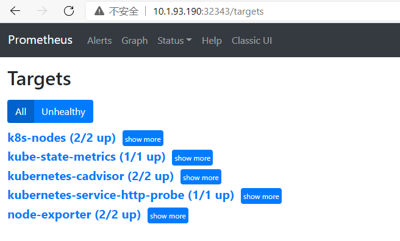

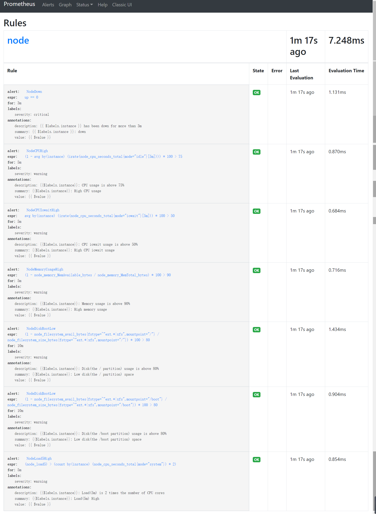


==访问grafana：==浏览器输入http://10.1.93.190:31170/targets  （端口号视service而定）

以下均未验证！！！

数据源是`http://prometheus:32343`，导入`主机详情`模板8919，

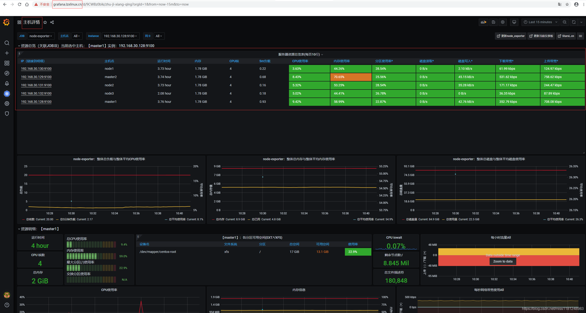

------

### grafana配置kubernetes数据源

启动插件：`Plugins` → `kubernetes` → `Enable`，然后配置集群访问地址及访问证书：

如果是通过kubeadm方式搭建的k8s集群，会有一个 `/etc/kubernetes/admin.conf` 文件，里面包含了客户端的证书和密码base64编码。

```

```


```
cat /etc/kubernetes/admin.conf
apiVersion: v1clusters:- cluster:    certificate-authority-data: LS0tLS1CRUdJTiBDRVJUSUZJQ0FURS0tLS0tCk1JSUN5RENDQWJDZ0F3SUJBZ0lCQURBTkJna3Foa2lHOXcwQkFRc0ZBREFWTVJNd0VRWURWUVFERXdwcmRXSmwKY201bGRHVnpNQjRYRFRJd01EVXhNakV3TURBek1Gb1hEVE13TURVeE1ERXdNREF6TUZvd0ZURVRNQkVHQTFVRQpBeE1LYTNWaVpYSnVaWFJsY3pDQ0FTSXdEUVlKS29aSWh2Y05BUUVCQlFBRGdnRVBBRENDQVFvQ2dnRUJBTDVpCmYxTGcxUUlqN0VlWlZ0cVFmS3dGZjg4V3NVbVVialZldll5NDZTUittMWpwRWdvM2wxWEIvZHBFNzRWOGtqTGQKZkdGdmVWZkVxNy8rMzdyamNGMXRpSm1BbThLZnMrMW9QdEpLOE0yZjNTSm5FZVVIQUlBeFl2cUE4ZFNsbThTQwpmSkJWU2J3K1pROTBTelpKNzdQUzFuZTBmYnRod0Y2VHE0Uy9FV3h3cUZZMzF5cENub05lVUNtcElsSjVnYWdtCnJ2QmhkTmFNb2oyQlRrMWNDVjh3dkRVS3RlbXFVYVE4R2ZCalZLeHhkdWtwcjJ3S3RPbXZkem1vMEdLSE11MFcKWmQ1TVd0dStIQVZrTXhzcE95Yk41NkFkNnloUkN5YkFJbTN2ZWJlTFV5cjBEY2JhNzJXNVlPRHRCY3ZBOEJxOAoxR1JQc1EwaXBUdGtYbDVCZEhzQ0F3RUFBYU1qTUNFd0RnWURWUjBQQVFIL0JBUURBZ0trTUE4R0ExVWRFd0VCCi93UUZNQU1CQWY4d0RRWUpLb1pJaHZjTkFRRUxCUUFEZ2dFQkFJS0lIb25wVllFWWpwR3JrN2wraGJyeGlxZXkKeGFQT1M3UW5TZEVZMC94TWtiUWxKcy9rUFcxU2lVemdoUk4wQWJxMnFtTXVuNHhlZ0pLdGVPNXhYRGJZNEhZbgpVVCtPWG0rQ1hBQjd3S3pYcDlmUTZBUDk3cmY0L2FRaXlGZEtsZUJ6Y3JNUkErZHZWTjk3NGlHUW94aFh3T1FNCmZXeGNrMDNhU0Qvc2s5UnJrcFhlL1g2NHQrV3BkUlFGRjE2YVFlSHVxNnJQRWZTR2VPUWVpcVIrQVgvdWpIOHoKZzJZY2JKWE85U3ZheXcyb3oxSlozTUx6K0FpeE5RTHFNYU00Tm43TklvMExxUHFqNzZoU3d1Qk1nREE0VnFtZAowZHRtS211OVZjTGZHcW9ITnZnajlTYlVlZ1crL3VEbzcwVXdvb2NGTmlnSnRnOVVSZWpEUXJJSm4rUT0KLS0tLS1FTkQgQ0VSVElGSUNBVEUtLS0tLQo=    server: https://192.168.30.188:6443  name: kubernetescontexts:- context:    cluster: kubernetes    user: kubernetes-admin  name: kubernetes-admin@kubernetescurrent-context: kubernetes-admin@kuberneteskind: Configpreferences: {}users:- name: kubernetes-admin  user:    client-certificate-data: LS0tLS1CRUdJTiBDRVJUSUZJQ0FURS0tLS0tCk1JSUM4akNDQWRxZ0F3SUJBZ0lJZWtMYS9Fc1ZDSGd3RFFZSktvWklodmNOQVFFTEJRQXdGVEVUTUJFR0ExVUUKQXhNS2EzVmlaWEp1WlhSbGN6QWVGdzB5TURBMU1USXhNREF3TXpCYUZ3MHlNVEExTVRJeE1EQXdNekphTURReApGekFWQmdOVkJBb1REbk41YzNSbGJUcHRZWE4wWlhKek1Sa3dGd1lEVlFRREV4QnJkV0psY201bGRHVnpMV0ZrCmJXbHVNSUlCSWpBTkJna3Foa2lHOXcwQkFRRUZBQU9DQVE4QU1JSUJDZ0tDQVFFQXJ2a084MUg0ZW9zak5kM3oKSy9UUEhHcGtCR1FvZm1hbm9ldjRlWXNmUTlPZW0wYzBvVUJ3cXoxM2JabmJUbmJweFFqbmdZMkc4bHF4UmkwaQpCdlA2ZmtmS0ZFQlZzUTd4dGlqZXBrdnByWEdPL08wUUE1U0k4NHJzTjVHOVhOa2pQbWdzYTBlblZxNUVvRTBGClRaNXpRRjlwUlkxWUZZZXYrTDE1bU5FaXlScUg4UDJRY3BoUmxWK09IUXVHaVdLNEhIRVB2QWw2QUpJeWN6d3MKWWMrdk1IdHlZbmF5NUMwUldVWHhyUmc0ZytKMksrY1h1YlF0elhXdjdxaTNhNjFDekpaZi9TZkNOd0Jyam9zRwp0b215WEJWNVZTVGJUYVk1OFZrLzFPK1NSc3BybjF3TDc0djdXUXVEaE9ydXhBRXpuYmRXWWxOMEZBMm5MTjlZCmwxWkVKUUlEQVFBQm95Y3dKVEFPQmdOVkhROEJBZjhFQkFNQ0JhQXdFd1lEVlIwbEJBd3dDZ1lJS3dZQkJRVUgKQXdJd0RRWUpLb1pJaHZjTkFRRUxCUUFEZ2dFQkFHazlIRDAxRmRRUnd4THhGUi8yRjdPM2ZpdGRFV3pDTC9UawpsZUxZaGlQaVh3NjNwOGtWU0VabEIyNEYzNEd2WlB3YS9LWnNUQnZXM0Mwek9uNGpHQ2hueHEvaVdqTWFnVEdBCktPUFV2bUI2VzhvVzhlb0lrSStOOEs0NFhSRnZzeGIwNUtqaCtwd0VZZzJUQXpBNEFlQzlnSjZYaTBzbHpnVnIKcWRzbXZtV0QzNEdXYzJOcVIzSDA3cW43RlJwRHIrTjlrTHE4Ukt4L0YwMWNCV1I3VVRZcnJTLzJEQ2t1N3lsWgptdTcwcXZicndYWnF6TkI5b05hQk82SHJsZXpuU2JQbnFKZUo0Q1czc2NMNmJ1N3A3bEppV1VQb0VHT0xic3YvCnFjT0xqdnZSRFF6eC9Xak5DWFZLNFhxbzJjVERGYitXeFJ1U2xGaUlQclk1QjlkQlFJWT0KLS0tLS1FTkQgQ0VSVElGSUNBVEUtLS0tLQo=    client-key-data: LS0tLS1CRUdJTiBSU0EgUFJJVkFURSBLRVktLS0tLQpNSUlFb2dJQkFBS0NBUUVBcnZrTzgxSDRlb3NqTmQzeksvVFBIR3BrQkdRb2ZtYW5vZXY0ZVlzZlE5T2VtMGMwCm9VQndxejEzYlpuYlRuYnB4UWpuZ1kyRzhscXhSaTBpQnZQNmZrZktGRUJWc1E3eHRpamVwa3ZwclhHTy9PMFEKQTVTSTg0cnNONUc5WE5ralBtZ3NhMGVuVnE1RW9FMEZUWjV6UUY5cFJZMVlGWWV2K0wxNW1ORWl5UnFIOFAyUQpjcGhSbFYrT0hRdUdpV0s0SEhFUHZBbDZBSkl5Y3p3c1ljK3ZNSHR5WW5heTVDMFJXVVh4clJnNGcrSjJLK2NYCnViUXR6WFd2N3FpM2E2MUN6SlpmL1NmQ053QnJqb3NHdG9teVhCVjVWU1RiVGFZNThWay8xTytTUnNwcm4xd0wKNzR2N1dRdURoT3J1eEFFem5iZFdZbE4wRkEybkxOOVlsMVpFSlFJREFRQUJBb0lCQUI4OHI0S1krN2RFNThCUwpJM3VSZFBncHRqbGllQ2c0dzJ5UTZBY3E0eVlFdmFnVENqNVBkczNiWjFyVndPVTlMWGJUcENEbzExS2xCa2owCi9jSW9CR3hPL0xDbzI2T0VlM3A5eVdIKzQzVG5kUk9LYnZWMHF3NXZtc1JBN0lHSzhsUE4zVUE1eHBJZkFubHIKeHFxWXd4S1c5Z0JJdjVUNGFGNEwxWTJHcUtNbUlhenVjLzVleU5rZjk3bnRyOFJncXQxcDJyaWJIVS9nRzFlYgpIWktyNm01UWx2MWJpYTFIYms2SWI2b1pYTVFIWWJSckpVemJSaWp6eE1RVkRmZ2tpalhSR3pSRjdZeVFZbTk5CmwwUzI1bDYzY1dIT3J6czM5R21xRmQ4Z0JJc0M3SkxuUThUY01nb1Axb0M5WXUzMGRrSDBvUi95M2lOTnFxRW8KZVJ2d0w0RUNnWUVBeG1tY2JDZXRlRDI5VWZDTE1kKzByTU14aVV4bHI3TTdrYUJOeWxPK2lOZWxKbUk5UHRXcwpkUzQzS2hkeElnSVNIQVRTdWxpR3VKMStEekxTWWNGZ2FkSmQxd25NNHppOUc2cW9NOXZTTVN2ZGtvK28ydXRqCmNscVBZcnVRbC9nK252dkE2N1ZyZzAyUXF0NFlqcmkrYmxQL1RNaDZGS3NGa0VQeXZPTHUxOTBDZ1lFQTRjSFgKUm43WUl2TWtMNGQrR3dkUmRwcXl5YStxVC9nbUtKTnNwb3VLUVZlaUd3aW9vR21BR0E0MEJBR2hyN24vMXB6Rwo5VkVQb201VDdPRnVmVWxGaUNURmJBblN2RWU5RTREUHJ3SDNhazlXR0JzcWxYcUZwMjdwWWFyZ3NSS2JDWU9UCm9Nc1FJR0wxelN4NEpkdFArMUxDQ1BuRnowMTNkajhRbmc4TVBPa0NnWUFwczF5cTVwUHc1NWo0dGNPcmtjYloKWUpUeXRGblMyYXExYXFtdTBuY0RMNytJRjdHam1Ta0wzOUM4U2Z6L0ZzeFRremZ1N2xneVNQZUxualRWVXQwKwpvSFlVa2Z5NzdOcmlDN1lhWUNNSExwNzlCTENLZ2xwK1dFWTJqQkZSdjF6NThST1U5cVpJREc5UldpaHpKcVR2CmJ6d0RHVWQvUElxSXpaOGd6OWsvQ1FLQmdIbEFRaDVEdkZReElNdENTM0c2NFg4QklXdC9wTXFrcmVIM0pGRGkKKzFPUy9LYm1aS01iWnNnRXdOMHgveVJCa3U0eWNBMk1Cd2lubHYzUUtpYXlOdDBqV3NGbkdUODBqSkd3Q2x1bApnN3dlZGxBbUx4M3ZtMTlOQzU0QVNBUHl5VUEzNGc5bllQYjBENjZ0NXEzMmQ2TzFWQys3N3dralF6bElMK1drCmtWOFpBb0dBVk01R1lLbnpNVjUzVzNXT3I0dFdLSm5XUHFiaHVlUEt5SXMzbTNkUzhGUE56SDU2UHhNKzRUM24Ka2NzT1VsZTlkQkFENXRXT3E5eHFmNWF4MXpaU2s1SzFhdUphSzRaa3RzNkdMRUgrU09WckdoK1JXQWtRcUFVbgo0Qmk4ZVA4MmR5M3N2RmV1UkNvTWFXRVQ0QlFHaGRQaFFCd1NNdlYrSWI2R3U0VldwN289Ci0tLS0tRU5EIFJTQSBQUklWQVRFIEtFWS0tLS0tCg==
```

其中属性`certificate-authority-data`、`client-certificate-data`、`client-key-data` 对应 CA 证书、Client 证书、Client 私钥，文件里面的内容是base64编码过后的，分别执行 `echo "" | base64 -d` 就能还原成证书源文件。

首先将`Datasource`设置为`Prometheus`，

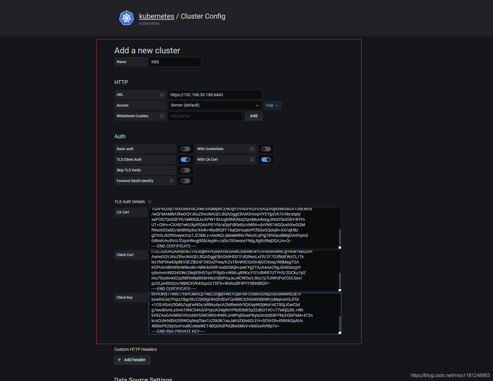

点击`Save`保存即可，grafana中自动出现下图中的dashboard，

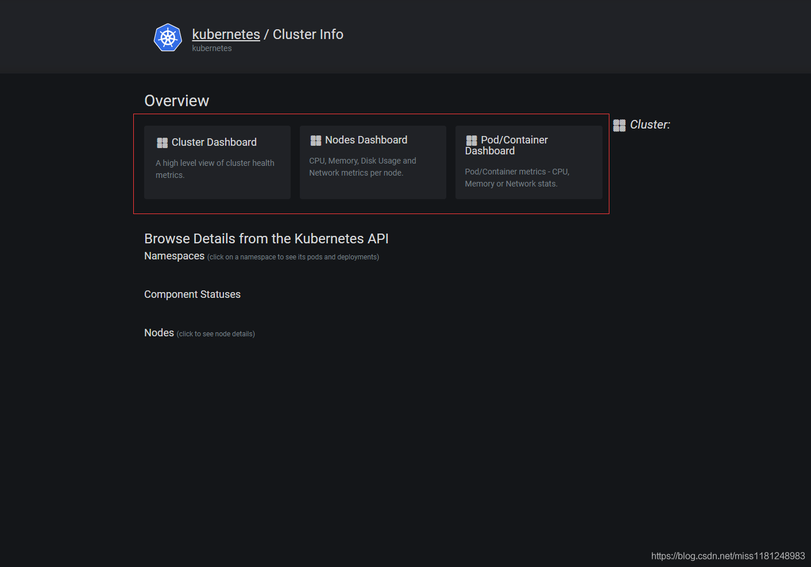

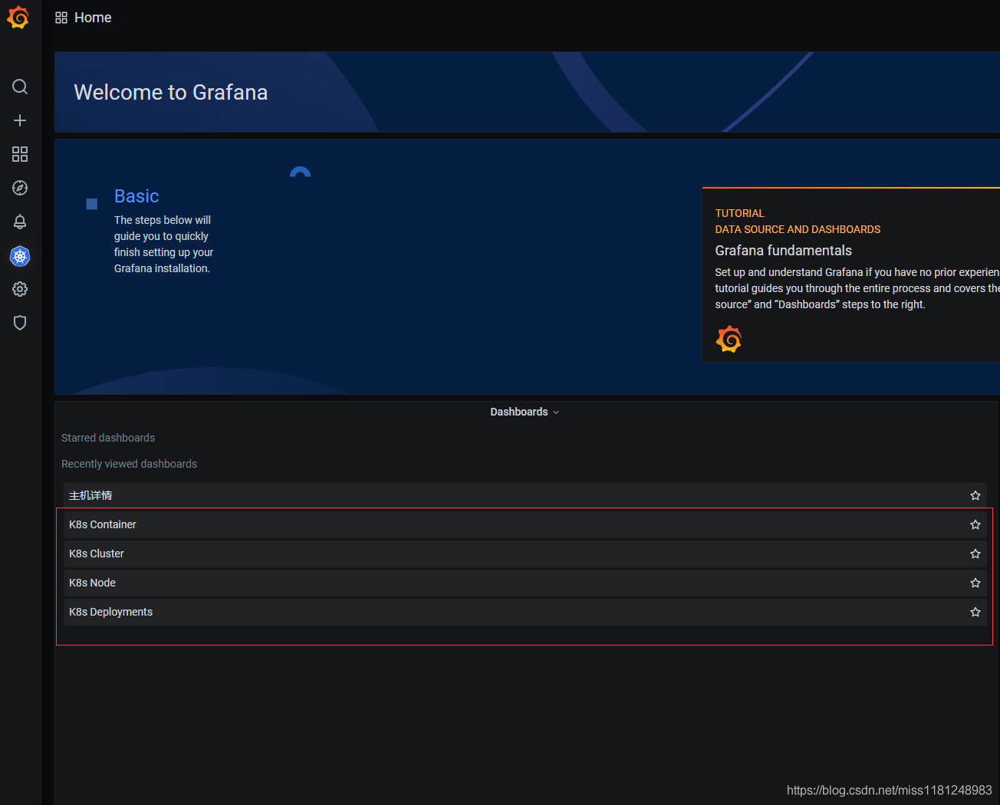

K8s Cluster：

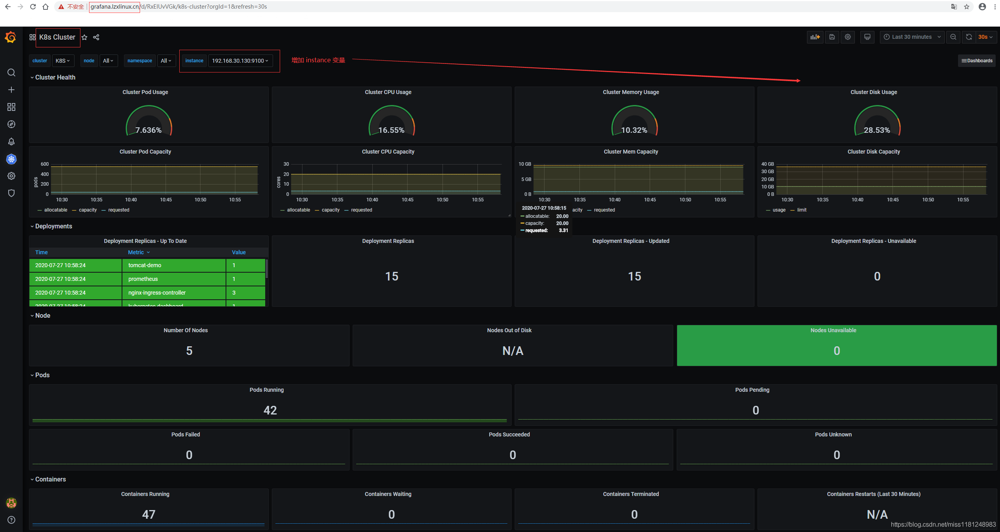

K8s Node：

没有显示是因为prometheus的metric有更新，比如`node_cpu`改成了`node_cpu_seconds_total`。可以重新定义该dashboard的变量（可以参考8919 dashboard的变量），然后根据prometheus界面的metrics来调试。调试完毕示图：

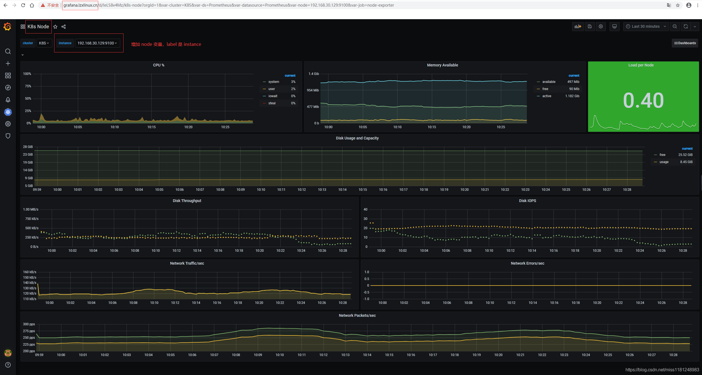

K8s Deployments：

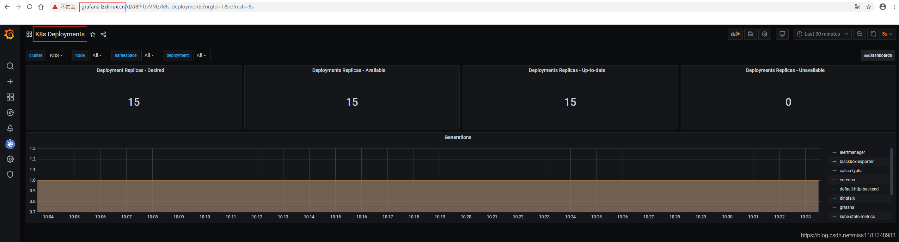

K8s Container：

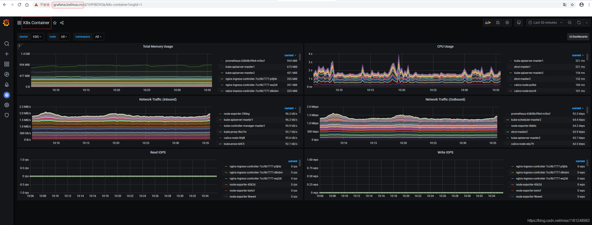

grafana配置kubernetes数据源完成，接下来测试告警。

------

### 告警测试

- 宕机测试：

模拟node-exporter宕机，测试钉钉告警（`critical`）是否正常。这里选择`node3`作为测试机器。

```shell
vim kill_node-exporter.sh
```

```shell
#!/bin/bash
 
nodepid=`netstat -lntp | grep 9100 | awk '{print $NF}' | awk -F '/' '{print $1}'`
nodenum=`netstat -lntp | grep 9100 | grep -v pause | wc -l`
 
if [ $nodenum -eq 0 ];then
    exit
else
    kill -9 $nodepid
    exit
fi
```


等待3m，收到钉钉故障告警和恢复告警，

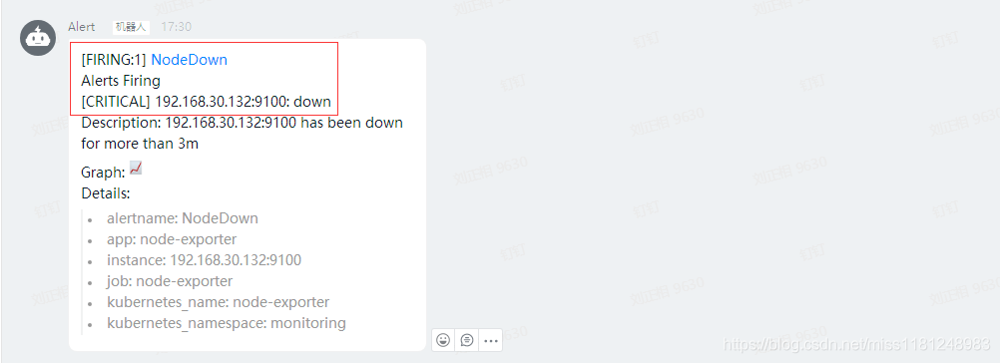

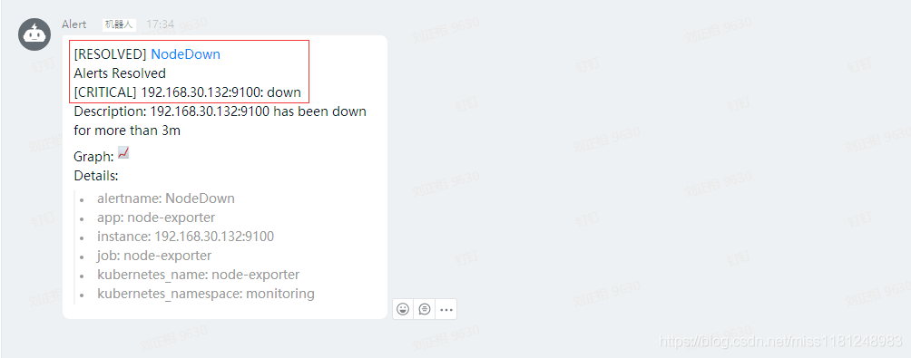

- CPU测试：

模拟CPU使用率为80%，测试邮件告警（`warning`)是否正常。这里选择`node3`作为测试机器。

```shell
yum install -y stress-ng stress-ng -c 0 -l 80            
# -c 指定压力源进程的数量，以匹配在线CPU的数量，0表示加载每个cpu；-l 指定CPU使用率；Ctrl + C 退出
```

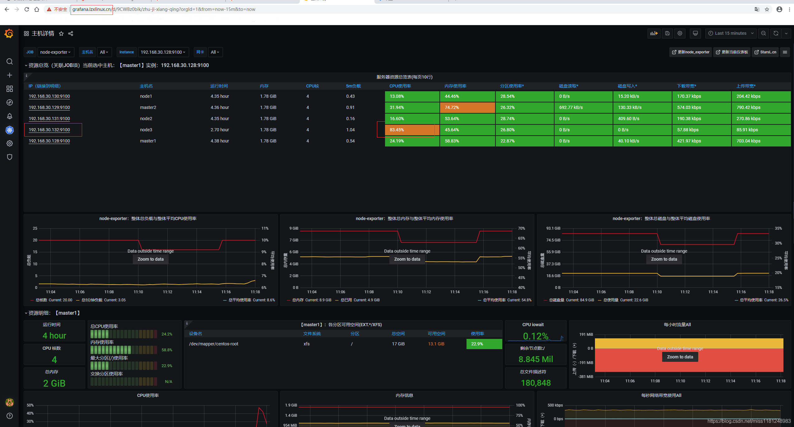

等待5m，收到邮件故障告警和恢复告警，


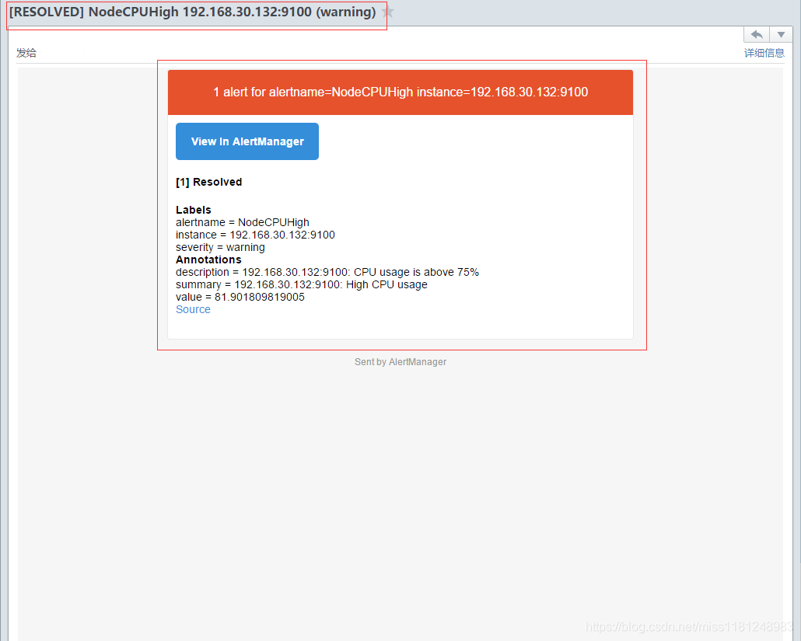

测试钉钉和邮件告警均没有问题。更多关于k8s集群的指标监控可以自行配置，此处仅作为演示。

k8s以Deployment方式部署 prometheus + grafana 完成。生产环境建议使用StatefulSet方式部署集群，大致过程与上面类似。已存放至个人gitee：https://gitee.com/xinbadayt/prometheus.git

转载至https://blog.csdn.net/miss1181248983/article/details/107673128