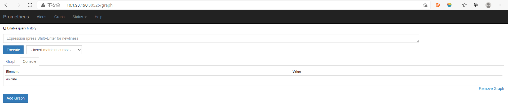
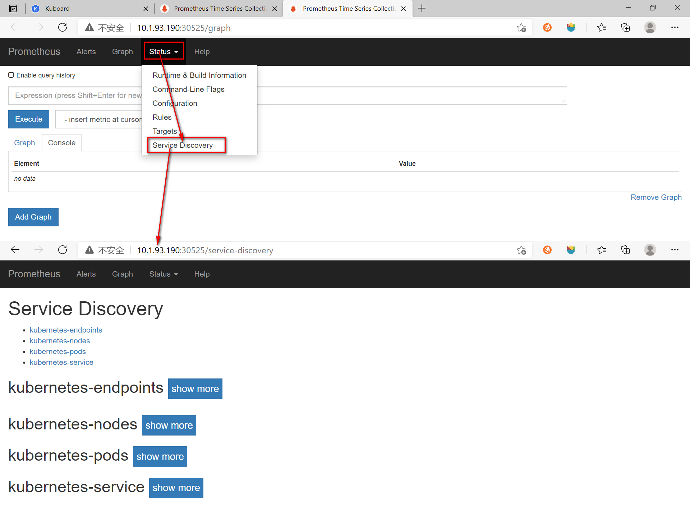
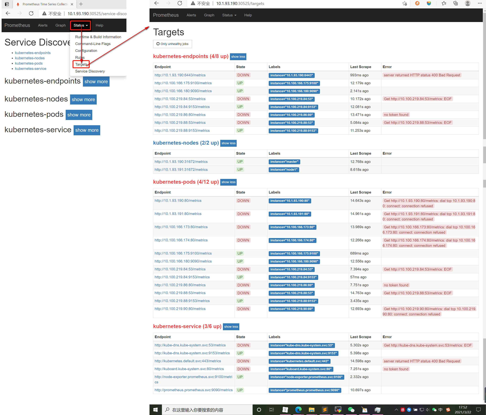

# 使用Prometheus监控Kubernetes

<span style="color: red">以下操作均是在prometheus名称空间内进行。</span>

```shell
kubectl create namespace prometheus
```

# 1.部署Prometheus

## 1.1 使用ConfigMap管理Prometheus配置

### 1.1.1创建config.yaml文件

```yaml
apiVersion: v1
kind: ConfigMap
metadata:
  name: prometheus-config
  namespace: prometheus
data:
  prometheus.yml: |
    global:
      scrape_interval:     15s 
      evaluation_interval: 15s
    scrape_configs:
      - job_name: 'prometheus'
        static_configs:
        - targets: ['localhost:9090']
```


### 1.1.2创建ConfigMap

```shell
kubectl apply -f config.yaml
```


## 1.2 使用Deployment部署Prometheus

### 1.2.1创建prometheus_deploy.yaml文件

```yaml
# 创建service
apiVersion: v1
kind: "Service"
metadata:
  name: prometheus
  namespace: prometheus
  labels:
    name: prometheus
spec:
  ports:
  - name: prometheus
    protocol: TCP
    port: 9090
    targetPort: 9090
  selector:
    app: prometheus
  type: NodePort
---
# 创建deployment
apiVersion: apps/v1
kind: Deployment
metadata:
  labels:
    name: prometheus
  name: prometheus
  namespace: prometheus
spec:
  replicas: 1
  selector:
    matchLabels:
      app: prometheus
  template:
    metadata:
      labels:
        app: prometheus
    spec:
      containers:
      - name: prometheus
        image: prom/prometheus:v2.2.1
        command:
        - "/bin/prometheus"
        args:
        - "--config.file=/etc/prometheus/prometheus.yml"
        ports:
        - containerPort: 9090
          protocol: TCP
        volumeMounts:
        - mountPath: "/etc/prometheus"
          name: prometheus-config
      volumes:
      - name: prometheus-config
        configMap:
          name: prometheus-config
```

### 1.2.2 创建prometheus Deployment与Service

```shell
kubectl apply -f prometheus_deploy.yaml
```


## 1.3访问Prometheus服务

```shell
# 查看Prometheus服务
kubectl get svc -n prometheus

NAME         TYPE       CLUSTER-IP     EXTERNAL-IP   PORT(S)          AGE
prometheus   NodePort   10.96.165.65   <none>        9090:30525/TCP   25m
```

至此，可以通过http://10.1.93.190:30525/ 查看部署的Prometheus服务。




# 2.Kubernetes下的服务发现

原理：==Prometheus通过与kubernetes API的交互，实现动态发现kubernetes中部署的所有可监控的目标资源。==

## 2.1kubernetes访问授权

为了能够让Prometheus能够访问受到认证保护的Kubernetes API，我们需要对Prometheus进行访问授权。授权方法为：**定义ClusterRole并赋予相应访问权限 --->创建ServiceAccount --->将ServiceAccount与ClusterRole进行绑定(即创建ClusterRoleBinding)**。可以通过yaml文件完成以上操作。

### 2.2.1创建rbac.yaml文件

<span style="color: red">注意：ClusterRole是全局的，不需要指定namespace；ServiceAccount是属于特定名称空间的，需要指定名称空间(prometheus)。</span>

```yaml
apiVersion: rbac.authorization.k8s.io/v1
kind: ClusterRole
metadata:
  name: prometheus
rules:
- apiGroups: [""]
  resources:
  - nodes
  - nodes/proxy
  - services
  - endpoints
  - pods
  verbs: ["get", "list", "watch"]
- apiGroups:
  - extensions
  resources:
  - ingresses
  verbs: ["get", "list", "watch"]
- nonResourceURLs: ["/metrics"]
  verbs: ["get"]
---
apiVersion: v1
kind: ServiceAccount
metadata:
  name: prometheus
  namespace: prometheus
---
apiVersion: rbac.authorization.k8s.io/v1
kind: ClusterRoleBinding
metadata:
  name: prometheus
roleRef:
  apiGroup: rbac.authorization.k8s.io
  kind: ClusterRole
  name: prometheus
subjects:
- kind: ServiceAccount
  name: prometheus
  namespace: prometheus
```

### 2.2.2 访问授权

```shell
kubectl apply -f rbac.yaml
```

## 2.2使用指定的ServiceAccount创建Pod

### 2.2.1修改prometheus_deploy.yaml文件

```yaml
spec:
  replicas: 1
  selector:
    matchLabels:
      app: prometheus
  template:
    metadata:
      labels:
        app: prometheus
    spec:
      # 添加ServiceAccountName和ServiceAccount
      serviceAccountName: prometheus
      serviceAccount: prometheus
```

### 2.2.2 升级Deployment

```yaml
kubectl apply -f prometheus_deploy.yaml
```

### 2.2.3 查看证书

指定ServiceAccount创建的Pod，会自动将用于访问Kubernetes API的CA证书以及当前账户对应的访问令牌文件挂载到Pod实例的 /var/run/secrets/kubernetes.io/serviceaccount/ 目录下：

```shell
# 查看pod名字
[root@master prometheus]# kubectl get pod -n prometheus
NAME                          READY   STATUS    RESTARTS   AGE
prometheus-5674f89f9f-shcqw   1/1     Running   0          5m45s

# 查看pod的/var/run/secrets/kubernetes.io/serviceaccount/目录下文件列表
[root@master prometheus]# kubectl exec -it prometheus-5674f89f9f-shcqw -n prometheus -- ls /var/run/secrets/kubernetes.io/serviceaccount/
ca.crt     namespace  token
```

## 2.3服务发现

目前，Prometheus通过Kubernetes API目前主要支持5种服务发现模式，包括`Node`、`Service`、`Pod`、`Endpoints`、`Ingress`。

### 2.3.1部署Node Exporter

在Prometheus的架构设计中，Prometheus server并不直接服务监控的特定目标，其主要负责数据的收集、存储以及对外提供数据查询支持。因此，为了能够监控到某些东西(如主机的CPU使用率)，我们需要使用Node Exporter。==Prometheus周期性的从Node Exporter暴露的HTTP服务地址(通常是http://IP:port/netrices)拉取监控样本数据。==

#### 2.3.1.1创建node_exporter.yaml文件

```yaml
apiVersion: apps/v1
kind: DaemonSet
metadata:
  name: node-exporter
  namespace: prometheus
  labels:
    k8s-app: node-exporter
spec:
  selector:
    matchLabels:
      k8s-app: node-exporter
  template:
    metadata:
      labels:
        k8s-app: node-exporter
    spec:
      containers:
      - image: prom/node-exporter
        name: node-exporter
        ports:
        - containerPort: 9100
          protocol: TCP
          name: http
---
apiVersion: v1
kind: Service
metadata:
  labels:
    k8s-app: node-exporter
  name: node-exporter
  namespace: prometheus
spec:
  ports:
  - name: http
    port: 9100
    nodePort: 31672
    protocol: TCP
  type: NodePort
  selector:
    k8s-app: node-exporter
```

#### 2.3.1.2创建Node Exporter DaemonSet与Service

```shell
# 部署
[root@master prometheus]kubectl apply -f node_exporter.yaml

# 查看服务：Node Exporter服务外部访问端口号为31672
[root@master prometheus]# kubectl get service -n prometheus
NAME            TYPE       CLUSTER-IP     EXTERNAL-IP   PORT(S)          AGE
node-exporter   NodePort   10.96.55.154   <none>        9100:31672/TCP   43m
prometheus      NodePort   10.96.165.65   <none>        9090:30525/TCP   6h34m
```

### 2.3.2修改config.yaml文件

以下通过修改config.yaml文件实现Prometheus对以上5种服务的监控：

```yaml
apiVersion: v1
kind: ConfigMap
metadata:
  name: prometheus-config
  namespace: prometheus
data:
  prometheus.yml: |-
    global:
      scrape_interval:     15s 
      evaluation_interval: 15s
    scrape_configs:

    - job_name: 'kubernetes-nodes'
      tls_config:
        ca_file: /var/run/secrets/kubernetes.io/serviceaccount/ca.crt
      bearer_token_file: /var/run/secrets/kubernetes.io/serviceaccount/token
      kubernetes_sd_configs:
      - role: node
      # Prometheus在发现Node模式的服务时，访问端口默认是10250，是需要认证的https协议才有权访问的。实际上我们并不是希望访问10250端口的/metrics，而是访问Node Exporter的/metrics。以下是将10250端口替换为Node Exporter的端口(即31672，端口查询方法在标题2.3.1.2中)
      relabel_configs:
      - source_labels: [__address__]
        regex: '(.*):10250'
        replacement: '${1}:31672'
        target_label: __address__
        action: replace

    - job_name: 'kubernetes-service'
      tls_config:
        ca_file: /var/run/secrets/kubernetes.io/serviceaccount/ca.crt
      bearer_token_file: /var/run/secrets/kubernetes.io/serviceaccount/token
      kubernetes_sd_configs:
      - role: service

    - job_name: 'kubernetes-endpoints'
      tls_config:
        ca_file: /var/run/secrets/kubernetes.io/serviceaccount/ca.crt
      bearer_token_file: /var/run/secrets/kubernetes.io/serviceaccount/token
      kubernetes_sd_configs:
      - role: endpoints

    - job_name: 'kubernetes-ingress'
      tls_config:
        ca_file: /var/run/secrets/kubernetes.io/serviceaccount/ca.crt
      bearer_token_file: /var/run/secrets/kubernetes.io/serviceaccount/token
      kubernetes_sd_configs:
      - role: ingress

    - job_name: 'kubernetes-pods'
      tls_config:
        ca_file: /var/run/secrets/kubernetes.io/serviceaccount/ca.crt
      bearer_token_file: /var/run/secrets/kubernetes.io/serviceaccount/token
      kubernetes_sd_configs:
      - role: pod
```

### 2.3.3更新Prometheus

```shell
# 更新Prometheus配置文件
kubectl apply -f config.yaml
configmap/prometheus-config configured

# 查看pod名称，删除pod实例
[root@master prometheus]# kubectl get pod -n prometheus
NAME                          READY   STATUS    RESTARTS   AGE
prometheus-5674f89f9f-shcqw   1/1     Running   0          21m
[root@master prometheus]# kubectl delete pod prometheus-5674f89f9f-shcqw -n prometheus
pod "prometheus-5674f89f9f-shcqw" deleted

# 再次查看pod名称，与上方不一致，Prometheus实例重建成功
[root@master prometheus]# kubectl get pod -n prometheus
NAME                          READY   STATUS    RESTARTS   AGE
prometheus-5674f89f9f-2s48w   1/1     Running   0          20s

```

### 2.3.4访问Prometheus服务

#### 2.3.4.1 访问Service Discovery页面

Prometheus更新完成后，访问http://10.1.93.190:30525/，通过`Status --->Service Discovery`页面，可以查看到Prometheus监控到Kubernetes的`Node`、`Service`、`Pod`、`Endpoints`、`Ingress` 5种资源对象了。



#### 2.3.4.2访问Targets页面



附：关于以上红色错误信息，可以后期研究prometheus.yml文件中的`relabel_configs`编写规则进行改正。

# 3.其他参考文档

k8s 部署prometheus+grafana：https://blog.csdn.net/vic_qxz/article/details/109347645

其中`prometheus/config.yaml` 文件中的IP需要改成自己的IP。