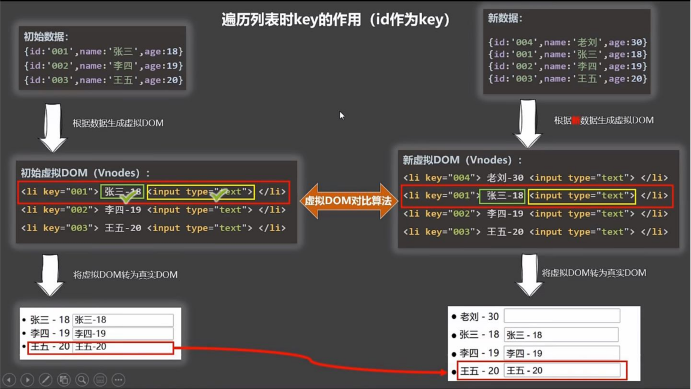

# Vue基础知识
# 1.单向绑定与双向绑定

==单项绑定与双向绑定的区别==：例如在input标签中，修改输入内容。如果输入内容改变时，Vue实例中对应的属性随之改变，则为双向绑定；否则是单向绑定。

- v-bind：单项绑定。`v-bind:`简写为`:`
- v-model：双向绑定。`v-model:value`简写为`v-model`
  - v-model只能应用在表单元素上，如input、radio、checkBox、textarea等具有value属性的标签。

# 2.Vue绑定容器的两种方法

- 方法一：在创建Vue实例时，直接指定容器

  ```js
  // 方法一：在创建Vue实例时，直接指定容器
  new Vue ({
      el: '#containerId',
      data: {
          name: 'hello'
      }
  });
  ```

- 方法二：使用$mount方法指定容器

  ```js
  // 方法二：使用$mount方法指定容器
  const v = new Vue({
      data: {
          name: 'hello'
      }
  });
  v.$mount('root')
  ```


# 3.Vue实例中data的两种写法

- 方法一：对象式

  ```js
  // 方法一：对象式
  new Vue ({
      el: '#containerId',
      data: {
          name: 'hello'
      }
  });
  ```

- 方法二：函数式

  ```js
  // 方法二：函数式
  new Vue ({
      el: '#containerId',
      data: function() {// 此处function必须是普通函数，不能是箭头函数(箭头函数没有自己的this，会一直往外找找到全局的Window实例)。
         console.log('=====', this) // 此处this是Vue实例对象
         return {
              name: 'hello'
         }
      }
  });
  ```

> 注意事项

- 在创建Vue实例时，以上两种写法都可以。但是当创建组件时，data必须使用函数式，否则会报错。
- Vue管理的函数(比如方法二中的data函数)，一定不要写箭头函数，一旦写了箭头函数，this就不再是Vue实例了。

# 4.Vue的MVVM模型

- M(模型Model)：对应data中的数据

- V(视图View)：模板(页面)

- VM(视图模型ViewModel)：Vue实例

  

> 总结

- data中所有的属性最后都出现在了vm身上。
- vm身上所有的属性及Vue原型上所有的属性，在Vue模板中都可以直接使用。

# 5.数据代理

==ES6语法==

## 5.1 Object.defineproperty方法

```js
let num = 18;
let person = {
    name: '张三',
    sex: '男'
}

Object.defineProperty(person, 'age', {
    // value: 18, // 可以在这里直接给age赋值
    // enumerable: true, // 控制属性是否可以被枚举(Object.keys(person)是否能获取到属性)，默认false
    // writable: true, // 控制属性是否可以被修改，默认false
    // configurable: true, // 控制属性是否可以被删除，默认false

    // 当有人读取person的age属性时，get函数就会被调用，且返回值就是age的值
    get() {
        console.log('有人读取age属性了');
        return num;
    },

    // 当有人修改普洱送的age属性时，set函数就会被调用，且会受到修改的具体值
    set(value) {
        console.log('有人修改age属性了');
        num = value;
    }
})
```

## 5.2 数据代理


> 定义

通过一个对象，代理对另一个对象中属性的操作（读/写）。

> 例子：通过obj2对象对obj的x属性进行修改

```js
let obj = {x: 100};
let obj2 = {y: 200};

// 当读取obj2.x时，返回obj.x的值；当修改obj2.x时，对obj.x进行修改
Object.defineProperty(obj, 'x', {
   get() {
       return obj.x;
   },
   set(value) {
       obj.x = value;
   }
});
```

## 5.3  Vue中的数据代理

==只有写在data中的对象，才会进行数据代理。==


# 6.事件处理

## 6.1 事件的基本使用

- 使用`v-on`或者`@`绑定事件

- 传参

  - 无参调用

    ```html
    <button @click.stop="showInfo">点我提示信息</button><br>
    
    <script text="text/javascript">
    showInfo(e) {
        // e是默认参数$event
        console.log(e)
    }
    </script>
    ```

  - 有参调用

    ```html
    <button @click.stop="showInfo($event, 'abc')">点我提示信息</button><br>
    
    <script text="text/javascript">
    showInfo(e, str) {
        // e是默认参数$event
        console.log(e)
        // str是第二个参数，'abc'
        console.log(str)
    }
    </script>
    ```

## 6.2 事件修饰符

- ==prevent==：阻止默认事件

  ```html
  <!-- 阻止默认事件 -->
  <h2>阻止默认事件</h2>
  <div class="tip">点击a标签，只弹出alert，不跳转</div>
  <a href="http://www.biying.com" @click.prevent="showInfo">点我提示信息</a>
  
  <script text="text/javascript">
  	showInfo(e) {
          console.log(e)
          alert('同学你好')
      }
  </script>
  ```

- ==stop==：阻止事件冒泡

  ```html
  <!-- 阻止冒泡事件 -->
  <h2>阻止冒泡事件</h2>
  <div class="tip">外层div和内层button都有点击事件showInfo。点击button时，只调用一次showInfo函数</div>
  <div class="demo1" @click="showInfo">
      <button @click.stop="showInfo">点我提示信息</button>
  </div>
  
  <script text="text/javascript">
  	showInfo(e) {
          console.log(e)
          alert('同学你好')
      }
  </script>
  ```

- ==once==：事件只触发一次

  ```html
  <!-- 事件只触发一次 -->
  <h2>事件只触发一次</h2>
  <div class="tip">只有在第一次点击button时，才会调用showInfo函数</div>
  <button @click.once="showInfo">点我提示信息</button>
  
  <script text="text/javascript">
  	showInfo(e) {
          console.log(e)
          alert('同学你好')
      }
  </script>
  ```

- ==capture==：使用事件的捕获模式

  ```html
  <!-- 使用事件捕获模式 -->
  <h2>使用事件捕获模式</h2>
  <div class="tip">外层div和内层button都有点击事件showMsg。点击button时，先调用外层div的点击事件，再调用内层button的点击事件</div>
  <div class="demo1" @click.capture="showMsg('div')">
      <button @click="showMsg('button')">点我提示信息</button>
  </div>
  
  <script text="text/javascript">
      showMsg(msg) {
          console.log(msg)
      },
  </script>
  ```

- ==self==：只有event.target是当前操作的元素才触发事件

  个人感觉该修饰符和stop修饰符的作用相同，但是需要注意的是stop用来修饰内部标签，self用来修饰外部标签。

  ```html
  <!-- 只有event.target是当前操作的元素时，才触发事件 -->
  <h2>只有event.target是当前操作的元素时，才触发事件</h2>
  <div class="tip">外层div和内层button都有点击事件showMsg。点击button时，不会调用外层div的点击事件，只有点击外层div时才会触发</div>
  <div class="demo1" @click.self="showMsg('div')">
      <button @click="showMsg('button')">点我提示信息</button>
  </div>
  <hr>
  
  <script text="text/javascript">
      showMsg(msg) {
          console.log(msg)
      },
  </script>
  ```

- ==passive==：事件的默认行为立即执行，无需等待事件回调执行完毕

  `.passive` 修饰符尤其能够提升移动端的性能。

  ```html
  <!-- 事件的默认行为立即执行，无需等待事件回调执行完毕 -->
  <h2>事件的默认行为立即执行，无需等待事件回调执行完毕</h2>
  <ul class="demo-rl" @wheel.passive="myWheel">
      <li>1</li>
      <li>2</li>
      <li>3</li>
      <li>4</li>
      <li>5</li>
      <li>6</li>
      <li>7</li>
      <li>8</li>
  </ul>
  
  <script text="text/javascript">
     myWheel() {
         for (let index = 0; index < 100000; index++) {
             console.log('*')
         }
         console.log('累死个人')
     }
  </script>
  ```

==修饰符可以连续写，且顺序无所谓==

```html
<!-- 修饰符可以连续写，且顺序无所谓 -->
<h2>阻止冒泡事件</h2>
<div class="tip">外层div和内层button都有点击事件showInfo。点击button时，只调用一次showInfo函数</div>
<div class="demo1" @click="showInfo">
    <!-- 先组织a标签的默认行为，再组织冒泡 -->
    <a href="http://www.biying.com" @click.prevent.stop="showInfo">点我提示信息</a>
</div>
<hr>
```

> 源码

```html
<!DOCTYPE html>
<html lang="en">
<head>
    <meta charset="UTF-8">
    <meta http-equiv="X-UA-Compatible" content="IE=edge">
    <meta name="viewport" content="width=device-width, initial-scale=1.0">
    <title>事件的修饰符</title>
    <script src="../js/vue.js"></script>
    <style>
        *{
            margin-top: 10px;
        }
        .demo1 {
            height: 50px;
            background-color: skyblue;
        }
        .tip {
            color: gray;
            margin-bottom: 5px;
        }
        .demo-rl {
            height: 200px;
            background-color: orange;
            overflow: auto;
        }
        .demo-rl li {
            height: 100px;
        }
    </style>
</head>
<body>
    <div id="root">
        <h1>事件的修饰符</h1>
        <hr>

        <!-- 阻止默认事件 -->
        <h2>阻止默认事件</h2>
        <div class="tip">点击a标签，只弹出alert，不跳转</div>
        <a href="http://www.biying.com" @click.prevent="showInfo">点我提示信息</a>
        <hr>

        <!-- 阻止冒泡事件 -->
        <h2>阻止冒泡事件</h2>
        <div class="tip">外层div和内层button都有点击事件showInfo。点击button时，只调用一次showInfo函数</div>
        <div class="demo1" @click="showInfo">
            <button @click.stop="showInfo">点我提示信息</button>
        </div>
        <hr>
        
        <!-- 事件只触发一次 -->
        <h2>事件只触发一次</h2>
        <div class="tip">只有在第一次点击button时，才会调用showInfo函数</div>
        <button @click.once="showInfo">点我提示信息</button>
        <hr>

        <!-- 使用事件捕获模式 -->
        <h2>使用事件捕获模式</h2>
        <div class="tip">外层div和内层button都有点击事件showMsg。点击button时，先调用外层div的点击事件，再调用内层button的点击事件</div>
        <div class="demo1" @click.capture="showMsg('div')">
            <button @click="showMsg('button')">点我提示信息</button>
        </div>
        <hr>

        <!-- 只有event.target是当前操作的元素时，才触发事件 -->
        <h2>只有event.target是当前操作的元素时，才触发事件</h2>
        <div class="tip">外层div和内层button都有点击事件showMsg。点击button时，不会调用外层div的点击事件，只有点击外层div时才会触发</div>
        <div class="demo1" @click.self="showMsg('div')">
            <button @click="showMsg('button')">点我提示信息</button>
        </div>
        <hr>

        <!-- 事件的默认行为立即执行，无需等待事件回调执行完毕 -->
        <h2>事件的默认行为立即执行，无需等待事件回调执行完毕</h2>
        <ul class="demo-rl" @scroll="myWheel">
            <li>1</li>
            <li>2</li>
            <li>3</li>
            <li>4</li>
            <li>5</li>
            <li>6</li>
            <li>7</li>
            <li>8</li>
        </ul>
    </div>
</body>
<script text="text/javascript>">
    new Vue({
        el: '#root',
        data: {
            name: "name",
        },
        methods: {
            showInfo(e) {
                console.log(e)
                alert('同学你好')
            },
            showMsg(msg) {
                console.log(msg)
            },
            myWheel() {
                for (let index = 0; index < 100000; index++) {
                    console.log('*')
                }
                console.log('累死个人')
            }
        }
    })
</script>
</html>
```

## 6.3 按键修饰符

Vue允许使用`v-on:keyon`或者`v-on:keydown`对键盘按键添加修饰符，从而起到对按键监听的作用。

> 使用方法

```html
<!-- 只有在按下 `Enter` 键时调用 `vm.submit()` -->
<input v-on:keyup.enter="submit">
```

- Vue中常用的按键别名

  - 回车: enter
  - 删除（包括delete键和backspace键）：delete
  - 退出：esc
  - 空格：space
  - 制表符：tab(该键只能配合keydown事件使用，对keyup无效)
  - 上：up
  - 下：down
  - 左：left
  - 右：right

- Vue中未提供别名的按键的使用

  可以使用按键原始的key值去绑定（大驼峰命名需要转为短横线命名），也可以使用按键的编码值keyCode去绑定。但是使用keyCode不推荐，因为不同电脑按键的keyCode值有可能不一样，并且该特性已经在web标准中移除，将来随时可能移除。

  ==获取按键的key值和keyCode值：==

  ```html
  <div id="root">
      <input type="text" @keyup="showInfo">
  </div>
  
  <script text="text/javascript">
      showInfo(e) {
          console.log('按键key值',e.key);
          console.log('按键keyCode值',e.keyCode);
      }
  </script>
  
  <!-- 运行结果 -->
  <!-- 
      按下shift键时输出：
          按键key值 Shift
          按键keyCode值 16
      按下caps lock键（大小写转换键）时输出：
          按键key值 CapsLock
          按键keyCode值 20
  -->
  
  ```

  ==大驼峰命名的键的使用：==大驼峰命名改为短横线命名

  ```html
  <!-- caps lock键的key值是CapsLock，在使用时需要转为短横线命名 -->
  <input v-on:keyup.caps-lock="submit">
  ```

- 系统修饰键的使用

  ==系统修饰键：==ctrl、alt 、shift、meta（windows键）

  ==用法：==

  - 配合keyup使用：按下修饰键的同事，再按下其他键，随后释放其他键，事件才会触发
  - 配合keydown使用：正常触发事件

  ==配合keyup使用时，按下指定按键时才会触发事件：==

  ```html
  <!-- 只有在按下ctrl+y时，才会触发事件 -->
  <input type="text" @keyup.ctrl.y="showInfo">
  ```

- 自定义键名(不推荐)

  ```html
  <div id="root">
      <input type="text" @keyup.huiche="showInfo">
  </div>
  
  <script text="text/javascript">
      Vue.config.keyCodes.huiche = 13
  </script>
  ```


# 7.计算属性

> 计算属性定义

要用的属性在Vue的data中不存在，需要通过已有的属性计算出来。使用计算属性时，必须定义计算属性的get函数。

> 原理

底层借助了`Object.defineProperty`方法提供的`getter`和`setter`。

> getter执行时机

- 初次读取时会执行一次
- 当依赖的数据发生变化时会被再次调用

==计算属性被读取后，会存到缓存中，后续的读取都是在缓存中读取数据==

> setter注意事项

如果不修改计算属性，可以不写set函数。但是如果修改计算属性，set函数中必须引起其所依赖的属性发生变化。

> 与methods相比的优势

计算属性内部有缓存机制，效率更高，调试方便。

> 计算属性的简写

==当确定计算属性只读不改的时候，才可以用简写形式。==

```html
<div id="root">
    姓：<input type = "text" v-model="familyName"> <br><br>
    名：<input type = "text" v-model="firstName"> <br><br>
    全名2：<span>{{fullName2}}</span>
</div>

<script text="text/javascript">
    const vm = new Vue({
        el: '#root',
        data: {
            familyName: '张',
            firstName: '三'
        },
        computed: {
             // 简写
            fullName2() {
                return this.familyName + '-' + this.firstName
            }
        }
    })
</script>
```

> 其他

- 计算属性最终会出现在Vue实例中，直接读取即可。

  

- 计算属性不会出现在Vue._data属性中。

  

- 如果计算属性要被修改，必须写set函数去响应修改，且set函数中要引起计算式依赖的属性发生变化。

> 本小节完整代码

```html
<body>
    <div id="root">
        姓：<input type = "text" v-model="familyName"> <br><br>
        名：<input type = "text" v-model="firstName"> <br><br>
        全名1：<span>{{fullName1}}</span> <br><br>
        全名2：<span>{{fullName2}}</span>
    </div>
</body>
<script text="text/javascript">
    const vm = new Vue({
        el: '#root',
        data: {
            familyName: '张',
            firstName: '三'
        },
        computed: {
            // 完整写法
            fullName1: {
                get() {
                    return this.familyName + '-' + this.firstName
                },
                set(value) {
                    const arr = value.split('-');
                    this.familyName = arr[0];
                    this.firstName = arr[1]
                }
            },
            // 简写
            fullName2() {
                return this.familyName + '-' + this.firstName
            }
        }
    })
</script>
```

# 8.监视属性

## 8.1 基础监视

> 基本知识

- 当被监视的属性变化时，回调函数(handler)自动调用，进行相关操作

- 监视的属性必须存在，才能进行监视。<span style="color: red">被监视的属性不存在，控制台不会报错。</span>

- 监视有两种写法

  - 通过new Vue()时传入watch配置

    ```js
    const vm = new Vue({
        el: '#root',
        data: {
            isHot: true
        },
        methods: {
            changeWeather() {
                this.isHot = !this.isHot
            }
        },
        computed: {
            info() {
                return this.isHot?'炎热':'凉爽'
            }  
        },
        // 方法一
        watch: {
            isHot: {
                immediate: true, //作用：初始化时让handler调用一次，默认为false
                handler(newValue, oldValue) {
                    console.log('isHost被修改了', '新值为'+newValue, '原值为'+oldValue)
                }
            }
        }
    });
    ```

  - 通过vm.$watch监视

    ```js
    // 方法二
    const vm = new Vue({
    	// 此处省略
    });
    vm.$watch('isHot', { 
        immediate: true, //作用：初始化时让handler调用一次，默认为false
        handler(newValue, oldValue) {
        console.log('isHost被修改了', '新值为'+newValue, '原值为'+oldValue)
        }
    })
    ```

> 监视属性的简写

==在确定被监视的属性只使用handler()函数时，才可以简写。==

- 方法一：

  ```js
  const vm = new Vue({
      el: '#root',
      data: {
          isHot: true
      },
      methods: {
          changeWeather() {
              this.isHot = !this.isHot
          }
      },
      computed: {
          info() {
              return this.isHot?'炎热':'凉爽'
          }  
      },
      // 方法一
      watch: {
          isHot(newValue, oldValue) {
              console.log('isHost被修改了', '新值为'+newValue, '原值为'+oldValue)
          }
      }
  });
  ```

- 方法二：

  ```js
  // 方法二
  const vm = new Vue({
  	// 此处省略
  });
  
  vm.$watch('isHot', function(newValue, oldValue) {
      console.log('isHost被修改了', '新值为'+newValue, '原值为'+oldValue)
  })
  ```


> 完整案例

```html
<body>
    <div id="root">
        <h2>今天天气很{{info}}</h2>
        <button @click="changeWeather">切换天气</button>
    </div>
</body>
<script text="text/javascript">
    const vm = new Vue({
        el: '#root',
        data: {
            isHot: true
        },
        methods: {
            changeWeather() {
                this.isHot = !this.isHot
            }
        },
        computed: {
          info() {
            return this.isHot?'炎热':'凉爽'
          }  
        },
        // 方法一
        // watch: {
        //     isHot: {
        //         immediate: true, //作用：初始化时让handler调用一次，默认为false
        //         handler(newValue, oldValue) {
        //             console.log('isHost被修改了', '新值为'+newValue, '原值为'+oldValue)
        //         }
        //     }
        // }
    });

    // 方法二
    vm.$watch('isHot', { 
        immediate: true, //作用：初始化时让handler调用一次，默认为false
        handler(newValue, oldValue) {
            console.log('isHost被修改了', '新值为'+newValue, '原值为'+oldValue)
        }
     })
</script>
```

## 8.2 深度监视

> 实现

Vue中的watch默认不检测对象内部值的改变，但是可以通过修改`Vue.watch.deep`为`true`来实现监测对象内部值的改变。

> 完整代码

```html
<body>
    <div id="root">
        <h2>msg.a的值为：{{msg.a}}</h2>
        <button @click="msg.a++">点我执行a+1</button>
    </div>
</body>
<script text="text/javascript">
    const vm = new Vue({
        el: '#root',
        data: {
            msg: {
                a: 1,
                b: 'hello'
            }
        },
        watch: {
            // 监视多级结构中所有属性的变化
            msg: {
                deep: true, //开启深度监视
                handler(newValue, oldValue) {
                    console.log('msg被修改了', newValue, oldValue)
                }
            },
            // 监视多级结构中某个属性的变化
            'msg.a': {
                handler(newValue, oldValue) {
                    console.log('msg.a被修改了', newValue, oldValue)
                }
            }
        }
    });
</script>
```

## 8.3 监视属性和计算属性的对比

> 区别

- computed能完成的功能，watch都可以完成。
- watch能完成的功能，computed不一定可以完成。例如：watch可以进行异步操作。

> 两个重要小原则

- 所有被Vue管理的函数，最好写成普通函数，这样this的指向才是Vue实例对象或者组件实例对象。
- 所有不被Vue管理的函数（如定时器的回调函数、ajax回调函数、Promise的回调函数等），最好写成箭头函数，这样this的指向才是Vue实例对象或者组件实例对象。

# 9.绑定样式

## 9.1 绑定class样式

- 使用字符串绑定

  适用于==样式的类名不确定，需要动态指定==的场景

  ```html
  <!-- 字符串写法，使用场景：样式的类名不确定，需要动态指定 -->
  <div class="basic" :class="mood" @click="changeMood">Hello, Vue</div>
  ```

- 使用数组绑定

  适用于==要绑定的样式个数不确定、名字也不确定==的场景

  ```html
  <!-- 数组写法，使用场景：要绑定的样式个数不确定、名字也不确定 -->
  <div class="basic" :class="classArr">Hello, Vue</div>
  ```

- 使用对象绑定

  适用于==要绑定的样式确定、名字确定，但是需要动态决定是否使用==的场景

  ```html
  <!-- 对象写法，使用场景：要绑定的样式确定、名字确定，但是需要动态决定是否使用 -->
  <div class="basic" :class="classObj">Hello, Vue</div>
  ```

## 9.2 绑定style样式

绑定style样式时，需要为style绑定对象，==对象中的key值是css中样式名，但是需要把短横线命名改为小驼峰命名==。

- 对象写法

  ```html
  <!-- 单个style样式 -->
  <div class="basic" :style="{fontSize: fSize + 'px'}">Hello, Vue</div><br>
  <!-- 多个style样式 -->
  <div class="basic" :style="myStyle">Hello, Vue</div><br>
  ```

- 数组写法(不常用)

  ```html
  <!-- 绑定class-> 数组写法 -->
  <div class="basic" :style="styleArr">Hello, Vue</div><br>
  ```

> 本小节完整代码

```html
<style>
    .basic {
        border: 1px solid gray;
        height: 50px;
        width: 40%;
        line-height: 50px;
    }

    .happy {
        background-color: rgb(235, 134, 76);
    }

    .normal {
        background-color: grey;
    }

    .sad {
        background-color: aquamarine;
    }

    .class1 {
        font-size: 20px;
    }

    .class2 {
        background-color: greenyellow;
    }

    .class3 {
        border-radius: 10px;
    }

</style>
<body>
    <div id="root" >
        <!-- 绑定class-> 字符串写法，使用场景：样式的类名不确定，需要动态指定 -->
        <div class="basic" :class="mood" @click="changeMood">Hello, Vue</div><br>
        <!-- 绑定class-> 数组写法，使用场景：要绑定的样式个数不确定、名字也不确定 -->
        <div class="basic" :class="classArr">Hello, Vue</div><br>
        <!-- 绑定class-> 对象写法，使用场景：要绑定的样式确定、名字确定，但是需要动态决定是否使用 -->
        <div class="basic" :class="classObj">Hello, Vue</div><br>

        <!-- 绑定style-> 对象写法1 -->
        <div class="basic" :style="{fontSize: fSize + 'px'}">Hello, Vue</div><br>
        <!-- 绑定class-> 对象写法2 -->
        <div class="basic" :style="myStyle">Hello, Vue</div><br>
        <!-- 绑定class-> 数组写法 -->
        <div class="basic" :style="styleArr">Hello, Vue</div><br>
    </div>
</body>
<script text="text/javascript">
    new Vue({
        el: '#root',
        data() {
            return {
                mood: 'normal',
                classArr: ['class1', 'class2', 'class3'],
                classObj: {
                    class1: false,
                    class2: false
                },
                fSize: 40,
                myStyle: {
                    fontSize: '40px',
                    color: 'orange',
                    backgroundColor: 'gray'
                },
                styleArr: [
                {
                    fontSize: '40px',
                    color: 'orange'
                },{
                    backgroundColor: 'gray'
                },
                ]
            }
        },
        methods: {
            changeMood() {
                const moodArr = ['happy', 'normal', 'sad'];
                this.mood = moodArr[Math.floor(Math.random() * 3)]
            }
        },
    })
</script>
```

# 10.条件渲染

> v-if

- 写法：`v-if="表达式"`、`v-else-if="表达式"`、 `v-else`
- 使用场景：切换频率较低的场景
- 特点：==不展示的DOM元素直接被移除==
- 注意：`v-if`可以和`v-else-if`、 `v-else`一起使用，但是要求结构不能被“打断”

> v-show

- 写法：`v-show="表达式"`
- 使用场景：切换频率较高的场景
- 特点：==不展示的DOM元素未被移除，只是将其display设置为none==

> v-if与v-show对比

- 使用`v-if`时，元素可能无法获取到，而使用`v-show`一定可以获取到
- `v-if`可以结合`<template>`标签使用，`v-show`不可以

# 11.列表渲染

## 11.1 v-for基本用法

- 作用：用于展示列表数据
- 语法：`v-for="(item, index) in xxx" :key="yyy"`
- 可遍历：数组、对象、字符串（用的很少）、指定次数（用的很少）

## 11.2 key内部原理

> 面试题：react、vue中key有什么作用（key的内部原理）？

- 虚拟DOM中key的作用

  key是虚拟DOM对象的标识，当数据发生变化时，Vue会根据【新数据】生成【新的虚拟DOM】，随后Vue进行【新虚拟DOM】与【旧虚拟DOM】的差异比较。==比较规则==如下：

  （1）旧虚拟DOM中找到了与新虚拟DOM相同的key：

             1) 如果虚拟DOM内容没变，直接使用之前的真实DOM；
             2) 如果虚拟DOM内容发生改变，则生成新的真实DOM，随后替换掉页面中之前的真实DOM。

  （2）旧虚拟DOM中未找到与新虚拟DOM相同的key：

  ​		直接创建新的真实DOM，随后渲染到页面。

- 用index作为key可能会引发的问题

  - 对数据进行逆序添加、逆序删除等破坏顺序操作：

    会产生没必要的真实DOM更新 ===> 界面没有问题，但是效率低

  -  如果结构中还包含输入类DOM：

    会产生错误DOM更新 ===> 界面有问题

  - 例子如下：

    在原有list的第一个对象之前插入一个新的数据，观察页面变化。

    $/textcolor{red}{错误示范：遍历时使用index作为key}$

    

    $/textcolor{green}{正确例子：遍历时使用list中对象的唯一标识作为key}$

    

- 并发中如何选择key？

  - 最好使用每条数据的唯一标识作为key
  - 如果不存在数据的逆序添加、逆序删除等破坏顺序操作，仅用于渲染列表用来展示，使用index作为key是没有问题的。

## 11.3 列表过滤

需求：按照输入框输入的名字，过滤掉不匹配的对象。

> 使用watch实现

```html
	<!DOCTYPE html>
<html lang="en">
<head>
    <meta charset="UTF-8">
    <meta http-equiv="X-UA-Compatible" content="IE=edge">
    <meta name="viewport" content="width=device-width, initial-scale=1.0">
    <script src="../js/vue.js"></script>
    <title>列表过滤</title>
</head>
<body>
    <div id="root">
        <h2>人员列表</h2>
        <input type="text" placeholder="请输入名字" v-model="name">
        <ul>
            <li v-for="p in personArr" :key="p.id">
                {{p.name}} -- {{p.age}} -- {{p.sex}}
            </li>
        </ul>
    </div>
</body>
<script text="text/javascript">
    const vm = new Vue({
        el: '#root',
        data() {
            return {
                name: '',
                persons: [
                    {id: '001', name: '马冬梅', age: 18, sex: '女'},
                    {id: '002', name: '周冬雨', age: 19, sex: '女'},
                    {id: '003', name: '周杰伦', age: 20, sex: '男'},
                    {id: '004', name: '温兆伦', age: 21, sex: '男'}
                ],
                personArr: []
            }
        },
        watch: {
            name: {
                immediate: true,
                handler(val) {
                    this.personArr = this.persons.filter(item => {
                        return item.name.indexOf(val) !== -1
                    })
                }
            }
        }
    })
</script>
</html>
```

> 使用computed实现

```html
<!DOCTYPE html>
<html lang="en">
<head>
    <meta charset="UTF-8">
    <meta http-equiv="X-UA-Compatible" content="IE=edge">
    <meta name="viewport" content="width=device-width, initial-scale=1.0">
    <script src="../js/vue.js"></script>
    <title>列表过滤</title>
</head>
<body>
    <div id="root">
        <h2>人员列表</h2>
        <input type="text" placeholder="请输入名字" v-model="name">
        <ul>
            <li v-for="p in personArr" :key="p.id">
                {{p.name}} -- {{p.age}} -- {{p.sex}}
            </li>
        </ul>
    </div>
</body>
<script text="text/javascript">
    const vm = new Vue({
        el: '#root',
        data() {
            return {
                name: '',
                persons: [
                    {id: '001', name: '马冬梅', age: 18, sex: '女'},
                    {id: '002', name: '周冬雨', age: 19, sex: '女'},
                    {id: '003', name: '周杰伦', age: 20, sex: '男'},
                    {id: '004', name: '温兆伦', age: 21, sex: '男'}
                ],
            }
        },
        computed: {
            personArr() {
                return this.persons.filter(item => {
                    return item.name.indexOf(this.name) !== -1
                })
            }
        }
    })
</script>
</html>
```

> 小结

观察以上代码，使用`computed`实现比`watch`更简单，所以一般来说，`computed`和`watch`都能实现的，优先使用`computed`.

## 11.4 列表排序 

 需求：对列表中对象的年龄进行排序。

主要考察数组的`sort()`方法。

> arr.sort简介：

$\textcolor{Red}{arr.sort之后会改变原数组}$

- 升序：arr.sort((a,b) => {return a-b})
- 降序：arr.sort((a,b) => {return b-a})

```html
<!DOCTYPE html>
<html lang="en">
<head>
    <meta charset="UTF-8">
    <meta http-equiv="X-UA-Compatible" content="IE=edge">
    <meta name="viewport" content="width=device-width, initial-scale=1.0">
    <script src="../js/vue.js"></script>
    <title>列表排序</title>
</head>
<body>
    <div id="root">
        <h2>人员列表</h2>
        <input type="text" placeholder="请输入名字" v-model="name">
        <button @click="sortType=2">年龄升序</button>
        <button @click="sortType=1">年龄降序</button>
        <button @click="sortType=0">原顺序</button>
        <ul>
            <li v-for="p in personArr" :key="p.id">
                {{p.name}} -- {{p.age}} -- {{p.sex}}
            </li>
        </ul>
    </div>
</body>
<script text="text/javascript">
    const vm = new Vue({
        el: '#root',
        data() {
            return {
                name: '',
                persons: [
                    {id: '001', name: '马冬梅', age: 18, sex: '女'},
                    {id: '002', name: '周冬雨', age: 17, sex: '女'},
                    {id: '003', name: '周杰伦', age: 40, sex: '男'},
                    {id: '004', name: '温兆伦', age: 21, sex: '男'}
                ],
                sortType: 0
            }
        },
        computed: {
            personArr() {
                const arr = this.persons.filter(item => {
                    return item.name.indexOf(this.name) !== -1
                })
                
                /**
                 * arr.sort简介：
                 * 升序：arr.sort((a,b) => {return a-b})
                 * 降序：arr.sort((a,b) => {return b-a})
                 * arr.sort之后会改变原数组
                 * */
                if(this.sortType) {
                    arr.sort((p1,p2) => {
                        return this.sortType == 1?p2.age-p1.age:p1.age-p2.age;
                    });
                }

                return arr;
            }
        }
    })
</script>
</html>
```

## 11.5 Vue数据监测原理

> Vue监测数据的原理

- Vue会监测data所有层次的数据

- Vue监测对象中的数据

  $\textcolor{Red}{通过setter实现监视，需要在创建Vue实例时就传入要监测的数据。}$

  - 对象中后追加的属性，Vue默认不做响应式处理

  - 如需为后添加的属性做响应式，可以使用Vue.set() API，如：

    `Vue.set(target, propertyName/index, value)`或`vm.$set(target, propertyName/index, value)`

- Vue监测数组中的数据

  $\textcolor{Red}{通过包裹数组更新元素的方法实现，本质就是做了两件事：}$

  - 调用原生对应的方法对数组进行更新
  - 重新解析模板，进而更新页面

- 在Vue中修改数组中的某个元素，一定要使用如下方法：

  - 使用Vue封装的API：`push()`, `pop()`, `shift()`, `unshift()`, `splice()`, `sort()`, `reverse()`
  - 或者使用`Vue.set()`或`vm.$set()`

  $\textcolor{Red}{特别注意：}$`Vue.set()`或`vm.$set()`不能给vm或者vm的根数据对象添加属性

# 12.收集表单数据

- `<input type="text"/>`： v-model收集的是`value`值，用户输入的就是`value`值
- `<input type="radio"/>`：v-model收集的就是`value`值，且要给标签配置`value`值
- `<input type="checkbox"/>:`
  - 没有配置`value`属性，收集的就是checked状态，选中则为`true`, 未选中则是`false`
  - 配置了`value`属性：
    - ==v-model的初始值不是数组==，收集的就是checked状态，选中则为`true`, 未选中则是`false`
    - ==v-model的初始值是数组==，收集的就是value值组成的数组

> v-model三个修饰符

- `lazy`：失去焦点再收集数据
- `number`：输入字符串转为有效的数字
- `trim`：去掉首尾空格

# 13.过滤器

> 定义

对要显示的数据进行特定的格式化后再显示（适用于一些简单逻辑的处理，复杂的可以使用计算属性或者方法）

> 语法

- 注册过滤器：Vue.filter(name, callback) （全局注册）或 new Vue{filters:{}}（局部注册）
- 使用过滤器：{{xxx | 过滤器名}} 或 v-bind:属性="xxx | 过滤器名"， $\textcolor{Red}{v-model不能使用过滤器。}$

> 备注

- 过滤器也可以接收额外参数，第一个参数默认为要过滤的数据，可以不用写
- 多个过滤器可以串联。第一个过滤器默认参数为要过滤的数据，第二个过滤器默认参数为第一个过滤器的返回值
- 过滤器并没有改变原本的数据，而是产生了新的数据

> 例子

```html
<!DOCTYPE html>
<html lang="en">
<head>
    <meta charset="UTF-8">
    <meta http-equiv="X-UA-Compatible" content="IE=edge">
    <meta name="viewport" content="width=device-width, initial-scale=1.0">
    <script src="../js/vue.js"></script>
    <script src="../js/dayjs.min.js"></script>
    <title>过滤器</title>
</head>
<body>
    <div id="root">
        <!-- 无参过滤器 -->
        <h2>当前时间为：{{time | timeFormatter}}</h2>
        <!-- 有参过滤器 + 过滤器串联 -->
        <h2>当前日期为：{{time | timeFormatter('YYYY年MM月DD日') | mySlice}}</h2>
    </div>
</body>
<script type="text/javascript">
    const vm = new Vue({
        el: '#root',
        data: {
            time: 1658385392873
        },
        filters: {
            timeFormatter(value, str='YYYY-MM-DD HH:mm:ss') {
                return dayjs(value).format(str)
            },
            mySlice(value) {
                return value.slice(0, 11)
            }
        }
    })
</script>
</html>
```

# 14.内置指令

- `v-bind`：单项绑定解析表达式，了简写为`:xxx`

- `v-model`：双向数据绑定

- `v-for`：遍历数组、对象、字符串

- `v-on`：绑定监听时间，可以简写为`@`

- `v-if`： 条件渲染（动态控制节点是否存在）

- `v-else`：条件渲染（动态控制节点是否存在）

- `v-show`：条件渲染（动态控制节点是否展示）

- `v-text`：向其所在的结点中渲染文本内容（$\textcolor{Red}{若文本中有标签，不会解析标签}$）。与插值语法的区别：`v-text`会替换掉节点中的内容

- `v-html`：向其所在的结点中渲染$\textcolor{Red}{包含html结构的}$内容。与插值语法的区别：`v-html`会替换掉节点中的内容，识别html标签。

  $\textcolor{Red}{！！！v-html有安全问题：}$

  - 在网站上动态渲染任意HTML都是非常危险的，容易导致XSS攻击（如利用户cookie，冒充用户登录网站）。
  - 一定要在可信的内容上使用`v-html`， 永远不要用在用户提交的内容上。

- `v-cloak`：没有值。

  - 特殊指令，Vue实例创建完毕并接管容器后，会删掉`v-cloak`属性

  - 使用css配合`v-cloak`可以解决网速慢时导致页面展示出"{{xxx}}"的问题

  - 使用举例：

    ```html
    <h2 v-cloak>{{name}}</h2>
    
    <style>
        /**属性选择器*/
        [v-cloak] {
            display: none;
        }
    </style>
    ```

    

- `v-once`： 

  - `v-once`所在节点在初次动态渲染后，就视为静态内容了。以后数据的改变不会引起`v-once`所在结构的更新，可以用于优化性能。

  - 区分事件的修饰符`once`:`<button @click.once>点我提示信息</button>`,此处的`button`只能点击一次

  - 使用举例：

    ```html
    <h2 v-once>n的初始值是： {{n}}</h2>
    <h2>n的当前值是： {{n}}</h2>
    <button @click="n++">点我n+1</button>
    
    <!-- 结果：点击button时，第一个<h2>中的内容不会改变，第二个会进行+1操作 -->
    ```

- `v-pre`：

  - 作用：跳过其所在节点的编译过程

  - 用途：可以用它跳过没有使用指令语法、没有使用插值语法的节点，会加快编译

  - 使用举例：

    ```html
    <h2 v-pre>Vue so easy！</h2>
    <h2 v-pre>n的当前值是： {{n}}</h2>
    
    <!-- 结果：页面不会解析插值语法 -->
    ```

# 15.自定义指令

> 定义语法

- 局部指令

  - 定义函数的方式（简写）

    ```js
    new Vue ({directives: {指令名: 回调函数}})
    ```

  - 定义对象的方式（完整写法）

    ```js
    new Vue ({directives: {指令名: 配置对象})
    ```

- 全局指令：

  - 定义函数的方式（简写）

    ```js
    Vue.directive(指令名, 回调函数)
    ```

  - 定义对象的方式（完整写法）

    ```js
    Vue.directive(指令名, 配置对象)
    ```

> 配置对象中常用的3个回调

- `bind`：指令与元素绑定成功时调用
- `inserted`：指令所在元素插入页面时调用
- `update`：指令所在模板结构被重新渲染时调用

> 函数式定义的指令被调用时机

- 指令与元素成功绑定时（一上来）就会被调用
- 指令所在模板被重新解析时会再次被调用

> 备注

- 指令定义时不加`v-`， 但在使用时需要加`v-`
- 指令名如果是多个单词，需要使用$\textcolor{Red}{短横线命名法}$，不要使用驼峰命名

> 例子

```html
<!DOCTYPE html>
<html lang="en">
<head>
    <meta charset="UTF-8">
    <meta http-equiv="X-UA-Compatible" content="IE=edge">
    <meta name="viewport" content="width=device-width, initial-scale=1.0">
    <title>自定义指令</title>
    <script src="../js/vue.js"></script>
</head>
<body>
    <div id="root">
        <!-- 需求1：自定义v-big，将绑定的值放大10倍 -->
        <h2>{{name}}</h2>
        <h2>当前的n值是：<span v-text="n"></span></h2>
        <h2>放大10倍后的n值是：<span v-big="n"></span></h2>
        <button @click="n++">点我n+1</button>
        <hr>
        <!-- 需求2：自定义v-fbind，实现与v-bind相同效果，但可以让其绑定的input元素默认获取焦点 -->
        <input type="text" v-fbind="n">
    </div>
</body>

<script type="text/javascript">
    // 定义全局指令
    Vue.directive('big2', function(element, binding) {
        console.log('big', this) // 此处的this不是Vue实例，而是Window
        element.innerText = binding.value * 10
    })

    Vue.directive('fbind2', {
        // 指令与元素成功绑定时（一上来）就会被调用
        bind(element, binding) {
            console.log('big', this) // 此处的this不是Vue实例，而是Window
            element.value = binding.value
        },
        // 指令所在元素被插入页面时被调用
        inserted(element, binding) {
            console.log('big', this) // 此处的this不是Vue实例，而是Window
            // 获取焦点
            element.focus()
        },
        // 指令所在模板被重新解析时被调用
        update(element, binding) {
            console.log('big', this) // 此处的this不是Vue实例，而是Window
            element.value = binding.value
        }
    })

    new Vue({
        el: '#root',
        data: {
            name: 'tth',
            n: 1
        },
        directives: {
            /**
             * 创建指令有两种写法，一个是定义函数的方式（简写），一个是定义对象的方式（完整写法）
             * 定义函数的写法，其实就是定义对象方式中的bind()和update()方法的结合
            */
            /**
             * big函数调用时间：
             *  1.指令与元素成功绑定时（一上来）就会被调用
             *  2.指令所在模板被重新解析时会再次被调用
            */
            /**
             * 将数值放大10倍
             * @param element 真实的DOM元素 
             *         如： <span>10</span>
             * @param binding 指令对象
             *         如： {
             *              "name": "big",  // 指令名称
             *              "rawName": "v-big", // 使用时的指令名称
             *              "value": 1,  // v-big绑定的值
             *              "expression": "n", // v-big绑定的表达式
             *              "modifiers": {},
             *              "def": {}
             *          }
             * 
             */
            big(element, binding) {
                console.log('big', this) // 此处的this不是Vue实例，而是Window
                element.innerText = binding.value * 10
            },
            fbind: {
                // 指令与元素成功绑定时（一上来）就会被调用
                bind(element, binding) {
                    console.log('big', this) // 此处的this不是Vue实例，而是Window
                    element.value = binding.value
                },
                // 指令所在元素被插入页面时被调用
                inserted(element, binding) {
                    console.log('big', this) // 此处的this不是Vue实例，而是Window
                    // 获取焦点
                    element.focus()
                },
                // 指令所在模板被重新解析时被调用
                update(element, binding) {
                    console.log('big', this) // 此处的this不是Vue实例，而是Window
                    element.value = binding.value
                }
            }
        }
    })
</script>
</html>
```

# 16.生命周期

> 定义

- 又名：生命周期函数、声明周期回调函数、生命周期钩子
- 是什么：Vue在关键时刻帮我们调用的一些特殊名称的函数
- 生命周期函数的名字不可更改，但函数的具体内容由程序员根据需求编写
- 声明周期函数中的this指向的是Vue实例或组件实例

> 图示

备注：

- 常用的生命周期钩子
  - `mounted`：发送ajax请求、启动定时器、绑定自定义时间、订阅消息等【初始化操作】
  - `beforeDestory`：清除定时器、解绑自定义事件、取消订阅消息等【收尾工作】
- 关于销毁Vue实例：
  - 销毁后，借助Vue开发者工具看不到任何信息
  - 销毁后自定义事件失效，但原生DOM事件依然有效
  - 一般不会在`beforeDeatory`中操作数据。因为即使操作数据，也不会再触发更新流程
- 页面中调用了一个定时器，如果在`beforeDestory`或者其他地方没有清除，当执行`vm.$destory()`后，定时器仍然一直在执行
- 下图中还有==3个声明周期钩子==未提现，后边学习路由的时候再提出


------

# 附：零零散散小知识

## 1)Vue模板解析时间

每当Vue中data的值发生变化时，Vue的模板都会重新解释一遍。且当使用插值语法插入一个函数时，该函数会被重新执行。

```html
<!-- 每当data.familyName或者data.firstName修改时，fullName()方法都会被重新调用-->
<div id="root">
    姓：<input type = "text" v-model="familyName"> <br>
    名：<input type = "text" v-model="firstName"> <br>
    全名：<span>{{fullName}}</span>
</div>

<script text="text/javascript">
	new Vue({
        el: '#root',
        data: {
           familyName: '张',
           firstName: '三'
        },
        methods: {
            fullName() {
                console.log('fullName============')
                return this.familyName + '-' + this.firstName
            }
        }
    })
</script>
```


## 2)js第三方库

[BootCDN - Bootstrap 中文网开源项目免费 CDN 加速服务](https://www.bootcdn.cn/)


 
