# Vue组件编程
# 1.定义

## 1.1 模块

- 理解：向外提供特定功能的js代码，一般就是一个js文件
- 为什么要使用模块：js文件很多很复杂
- 作用：复用js，简化js的编写，提高js运行效率

## 1.2 组件

- 理解：用来实现==局部（特定）功能==效果的代码的==集合==
- 为什么要使用组件：一个界面的功能很复杂
- 作用：提高代码的复用，简化编码，提高运行效率

## 1.3 模块化

当应用中的js都以模块来编写的，那么这个应用就是一个模块化的应用

## 1.4 组件化

当应用中的功能都是以多组件的方式来编写的，那么这个应用就是一个组件化的应用

##   1.5 非单文件组件

一个文件中包含有n个组件

## 1.6 单文件组件

一个文件中只包含1个组件

# 2.组件

## 2.1 组件的基本使用

> Vue中使用组件的三大步骤

- 定义组件（创建组件）
- 注册组件
- 使用组件（编写组件标签）

> 定义组件

- 语法：

  使用`Vue.extend(options)`创建。其中`options`和`new Vue(options)`时传入的`options`几乎一样，仅有的区别如下：

  - `el`不要写（原因：最终所有的组件都要经过一个Vue实例管理，由Vue实例中的el决定服务哪个容器）
  - `data`必须写成函数（原因：避免组件被复用时，数据存在引用关系）

- 备注：

  使用`template`可以配置组件结构

- 示例：

```js
// 学生组件
    const student = Vue.extend({
        template: `<div>
            <h2>学生姓名：{{studentName}}</h2>
            <h2>学生年龄：{{age}}</h2>
            </div>`,
        data() {
            return {
                studentName: '张三',
                age: 18
            }
        }
    })
```

> 注册组件

- 局部注册：靠`new Vue`的时候传入`components`选项

  ```js
  new Vue({
          el: '#root',
          data: {
              msg: '你好啊!'
          },
          components: { // 组件
              student
          }
      })
  ```

- 全局注册：靠`Vue.component('组件名', 组件)`注册

  ```js
  Vue.component('school',school)
  ```

> 编写组件标签

​	`<组件名></组件名>`

> 完整代码

```html
<!DOCTYPE html>
<html lang="en">
<head>
    <meta charset="UTF-8">
    <meta http-equiv="X-UA-Compatible" content="IE=edge">
    <meta name="viewport" content="width=device-width, initial-scale=1.0">
    <title>组件的基本使用（非单文件）</title>
    <script src="../js/vue.js"></script>
</head>
<body>
    <div id="root">
        <h2>{{msg}}</h2>
        <hr>
        <!-- 第三步：编写学生组件标签 -->
        <student></student>
        <hr>
        <!-- 第三步：编写学校组件标签 -->
        <school></school>
    </div>
</body>
<script type="text/javascript">
    // 第一步：定义学生组件
    const student = Vue.extend({
        template: `<div>
            <h2>学生姓名：{{studentName}}</h2>
            <h2>学生年龄：{{age}}</h2>
            </div>`,
        data() {
            return {
                studentName: '张三',
                age: 18
            }
        }
    })

    // 第一步：定义学校组件
    const school = Vue.extend({
        template: `<div>
            <h2>学校名称：{{schoolName}}</h2>
            <h2>学校地址：{{address}}</h2>
            </div>`,
        data() {
            return {
                schoolName: '尚硅谷',
                address: '北京'
            }
        }
    })
    
    // 第二步：注册全局组件
    Vue.component('school',school)

    // 第二步：注册局部组件
    new Vue({
        el: '#root',
        data: {
            msg: '你好啊!'
        },
        components: {
            student
        }
    })
</script>
</html>
```

## 2.2 组件几个注意点

> 关于组件名

- 一个单词组成：
  - 第一种写法（首字母小写）：school
  - 第二种写法（首字母大写）：School
- 多个单词组成
  - 第一种写法（kebab-case命名）：my-school
  - 第二种写法（CamelCase命名）：MySchool（需要Vue脚手架支持）
- 备注：
  - 组件名尽可能回避HTML中已有的元素名称，例如：h2、H2都不行。
  
  - 可以使用name配置项指定组件在开发工具中呈现的名字
  
    ```js
    const school = Vue.extend({
        	name: 'tth', // 使用该组件时，在开发者工具中，标签名是tth
            template: `<div>
                <h2>学校名称：{{schoolName}}</h2>
                <h2>学校地址：{{address}}</h2>
                </div>`,
            data() {
                return {
                    schoolName: '尚硅谷',
                    address: '北京'
                }
            }
        })
    ```
  
    

> 关于组件标签

- 第一种写法：`<school></school>`
- 第二种写法：`<school/>`（不使用脚手架时，会导致后续组件不能渲染）

> 简写

`const school = Vue.extend(options)`可简写为：`const school = options`

## 2.3 VueComponent构造函数

> 关于VueComponent构造函数的几个注意事项

- 组件本质是一个名为`VueComponent`的构造函数，并不是程序员定义的，而是通过`Vue.extend`生成的

- 我们只需要写`<组件名/>`或`<组件名></组件名>`，Vue解析时会自动创建该组件的实例对象。即Vue自动执行`new VueComponent(options)`。假如页面中有多个相同组件，Vue解析时会创建相应数量的该组件的实例。

- $\textcolor{Red}{每次调用 Vue.extend()，返回的都是一个全新的 VueComponent }$

- 关于this的指向

  - 组件中：

    data函数、methods中的函数、watch中的函数、computed中的函数，它们的this指向均为$\textcolor{Red}{ VueComponent 实例对象}$

  - new Vue(options)中：

    data函数、methods中的函数、watch中的函数、computed中的函数，它们的this指向均为$\textcolor{Red}{ Vue 实例对象}$

## 2.4 一个重要的内置关系

> 重要的内置关系

$\textcolor{Red}{VueComponent.prototype === Vue.prototype }$

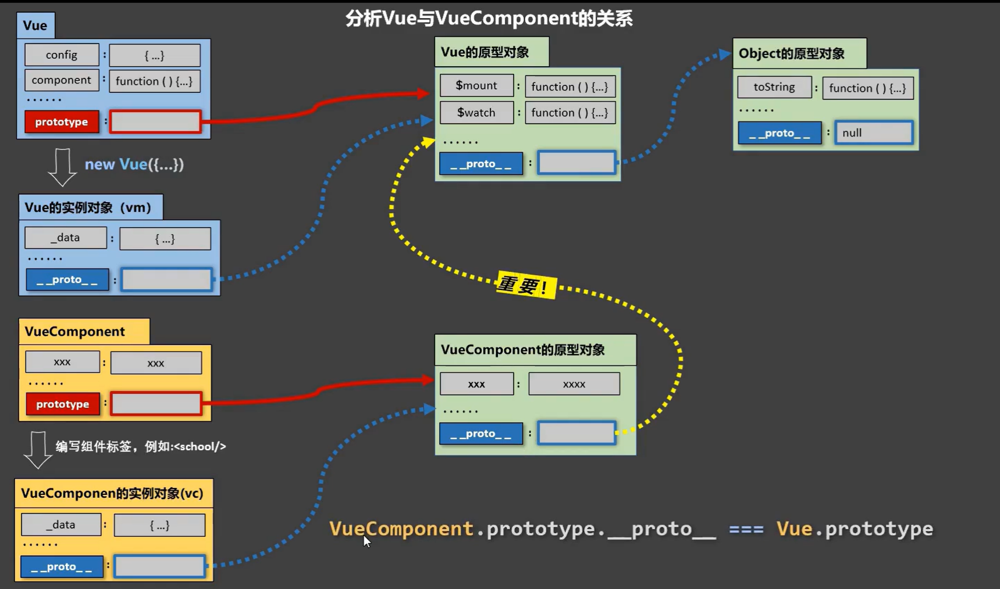

> 为什么要有这个关系

让组件实例对象可以访问到VUe原型上的属性、方法

## 2.5 单文件组件

- 定义School组件(School.vue文件)

  ```html
  <template>
      <!-- 组件的结构 -->
      <div class="demo">
          <h2>学校名称：{{schoolName}}</h2>
          <h2>学校地址：{{address}}</h2>
          <button @click="showSchoolName">show SchoolName</button>
      </div>
  </template>
  
  <script>
      // const school = Vue.extend({
      //     name: 'school',
      //     data() {
      //         return {
      //             schoolName: '尚硅谷',
      //             address: '北京'
      //         }
      //     },
      //     methods: {
      //         showSchoolName() {
      //             alert(this.schoolName)
      //         }
      //     },
      // })
      // 将组件暴露出去
      // 方法一（默认暴露）：
      // export default school
      // 对应的引入语法：import ??? from ???
  
      // 方法二（统一暴露）：
      // export {school}
      // 对应的引入语法：import {???} from ???
  
      // 方法三（分别暴露）：
      // 直接在定义school组件前加上export关键字即可，如：export const school = Vue.extend({...)}
      // 对应的引入语法：import {???} from ???
  
      // 以上可简写为：
      export default {
          name: 'school',
          data() {
              return {
                  schoolName: '尚硅谷',
                  address: '北京'
              }
          },
          methods: {
              showSchoolName() {
                  alert(this.schoolName)
              }
          },
      }
  </script>
  
  <style>
      .demo {
          background-color: orange;
      }
  </style>
  ```

- 定义Student组件(Student.vue文件)

  ```vue
  <template>
      <!-- 组件的结构 -->
      <div>
          <h2>学生姓名：{{studentName}}</h2>
          <h2>学生年龄：{{age}}</h2>
      </div>
  </template>
  
  <script>
      export default {
          name: 'student',
          data() {
              return {
                  studentName: '张三',
                  age: 18
              }
          }
      }
  </script>
  ```

- 定义APP组件(App.vue文件)

  ```vue
  <!-- 模板生成快捷键：输入<v,点击回车即可 -->
  <template>
      <div>
          <School></School>
          <Student></Student>
      </div>
  </template>
  
  <script>
      // 引入组件
      import School from './School.vue'
      import Student from './Student.vue'
      export default {
          name: 'App',
          components: {
              School,
              Student
          }
      }
  </script>
  ```

- 编写main.js文件

  ```js
  import App from './App.vue'
  
  new Vue({
      el: '#root',
      template: `<App></App>`,
      comments: {App}
  })
  ```

- 编写index.html文件

  ```html
  <!DOCTYPE html>
  <html lang="en">
  <head>
      <meta charset="UTF-8">
      <meta http-equiv="X-UA-Compatible" content="IE=edge">
      <meta name="viewport" content="width=div, initial-scale=1.0">
      <title>单文件组件语法练习</title>
  </head>
  <body>
      <div id="root"></div>
      <!-- 先渲染容器，再引入js -->
      <script src="../js/vue.js"></script>
      <script src="./main.js"></script>
  </body>
  </html>
  ```

- ==注意==

  此时运行index.html文件，页面控制台报错。原因是到目前为止，浏览器并不能解析Vue文件，需要借助Vue脚手架

# 3.使用Vue脚手架（Vue CLI）

CLI：Command Line Interface

## 3.1 初始化脚手架

> 脚手架官方文档

https://cli.vuejs.org/zh/

> 脚手架初始化步骤

- Step1.创建：vue create vue_test

- Step2.选择Vue版本：此处选择Vue2即可

  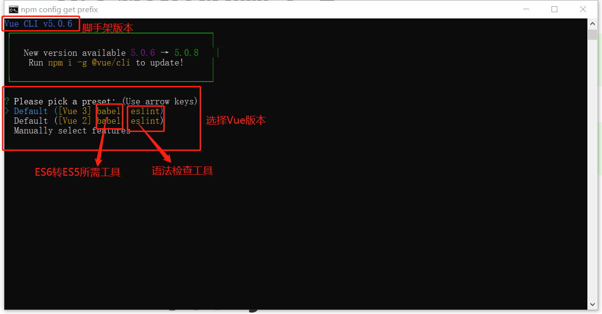

- Step3.初始化成功：

  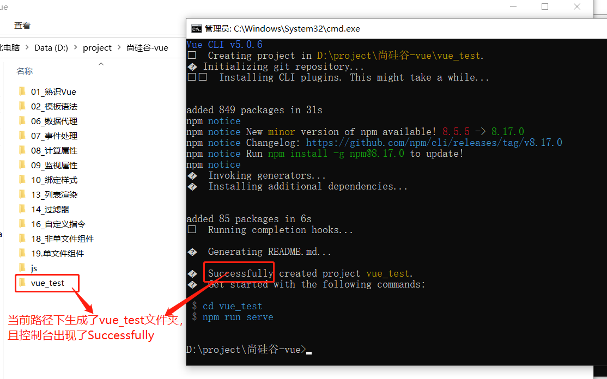

- Step4.按照控制台提示，进入vue_test文件夹，并运行项目

  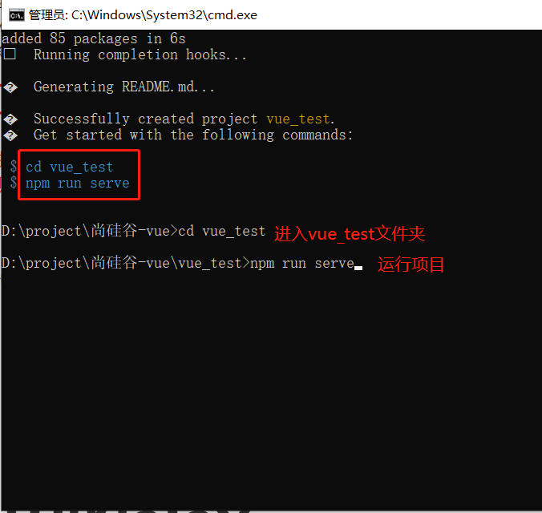

- Step5.项目运行成功

  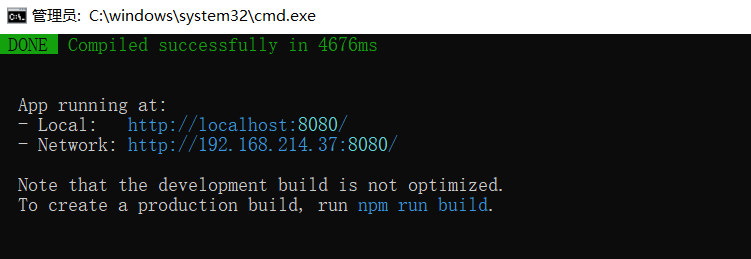

  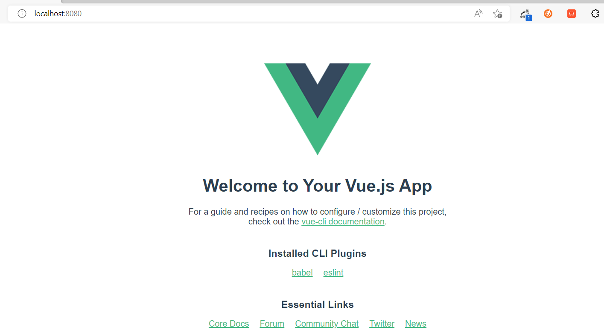


## 3.2 vue项目各文件解释

## 3.3 main.js中的rander函数解释

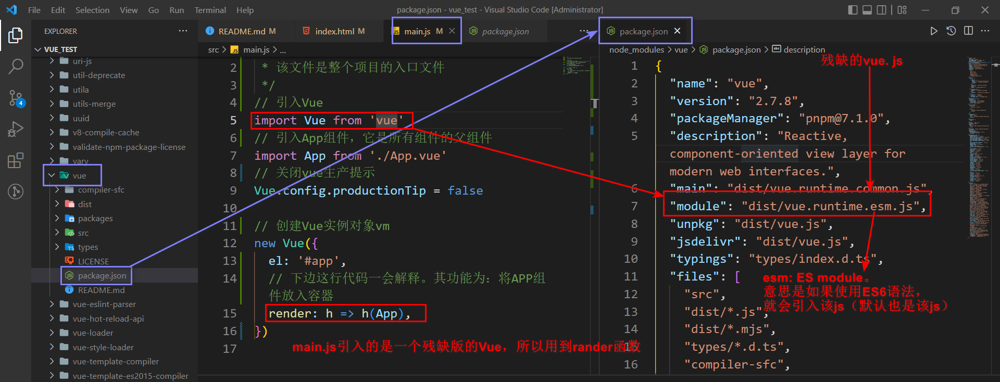

- `vue.js`和`vue.runtime.XXX.js`的区别：
  - `vue.js`是完整版的Vue，包含：核心功能+模板解析器
  - `vue.runtime.XXX.js`是运行版的Vue，只包含核心功能
- 因为`vue.runtime.XXX.js`没有模板解析器，所以不能用`new Vue`时不能使用`template`配置项。需要使用`render`函数接收到的`createElement`函数去之情具体内容。

## 3.4 脚手架文件结构

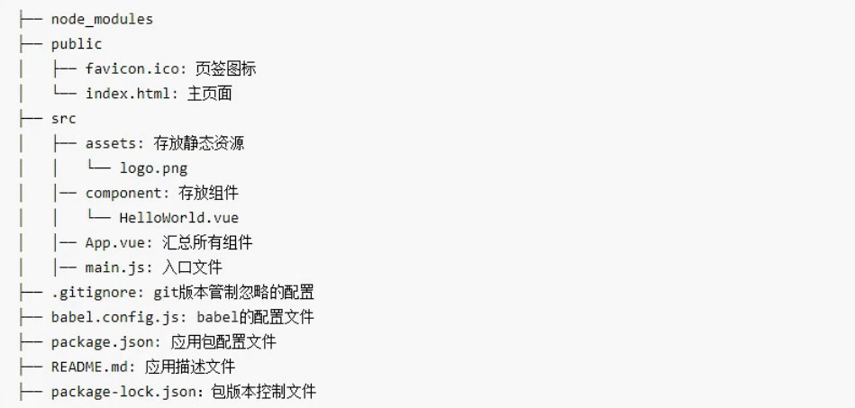

## 3.5 vue.config.js配置文件

- 使用`vue inspect > output.js`命令可以查看到Vue脚手架的默认配置
- 使用`vue.config.js`文件可以对脚手架进行个性化定制。（详情见：[配置参考 | Vue CLI (vuejs.org)](https://cli.vuejs.org/zh/config/)）
- 每次修改`vue.config.js`文件，必须重启，修改才会生效

## 3.6 ref属性

> 作用

- 被用来给元素或子组件注册引用信息（id的替代者）
- 应用在html标签上，获取的是真实的DOM元素
- 应用在组件标签上，获取的是组件的实例对象

> 举例

```vue
<template>
  <div id="app">
    <h1 v-text="msg" ref="title"></h1>
    <School ref="sch"/>
    <button ref="btn" @click="showDOM">点我输出上方DOM元素</button>
  </div>
</template>

<script>
// 引入School组件
import School from './components/School.vue'

export default {
  name: 'App',
  components: {
    School
  },
  data() {
    return {
      msg: '欢迎学习Vue'
    }
  },
  methods: {
    showDOM() {
      console.log(this.$refs.title) // 输出h1标签的DOM元素
      console.log(this.$refs.sch) // 输出School子组件的实例对象
      console.log(this.$refs.btn) // 输出button标签的DOM元素
    }
  }
}
</script>
```

> 运行结果

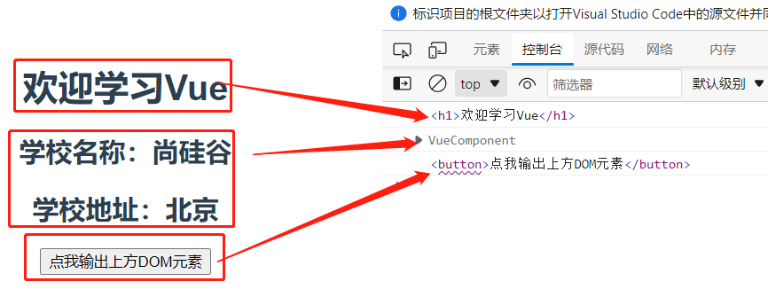

## 3.7 props配置项

> 作用

让组件接收外部传过来的数据

> 使用

- 外部传递数据

  `<组件名 prop1="prop1值" prop2="prop2值" ...>`

  ```html
  <!-- age属性用v-bind指令是想强制age的值是个Number类型 -->
  <Student name='李四' sex='女' :age="18"/>
  ```

- 本组件接收数据

  - 第一种方式（只接收）

    ```js
    export default {
        name: 'Student',
        data() {...},
        props: ['name', 'age', 'sex']
    }
    ```

  - 第二种方式（限制prop类型）

    ```js
    export default {
        name: 'Student',
        data() {...},
        props: {
            name: String,
            age: Number,
            sex: String
        }
    }
    ```

  - 第三种方式（限制类型+限制必要性+指定默认值）

    ```js
    export default {
        name: 'Student',
        data() {...},
        props: {
            name: {
                type: String, // 类型
                required: true // 必要性
            },
            age: {
                type: Number,
                default: 99 // 默认值
            },
            sex: {
                type: String, 
                required: true 
            }
        }
    }
    ```

> 注意事项

- props是只读的，Vue底层会监测对props的修改。如果进行了修改，控制台会报错

- 如果业务需求确需修改，可以$\textcolor{Red}{复制props的内容到data中，然后去修改data中的数据 }$

- 如果父组件传值了，但是子组件没有使用props接收，父组件传给子组件的值保留在`vm.$attrs`中

  ```js
  export default {
      name: 'Student',
      data() {
          return {
              msg: '我是一个尚硅谷的学生',
              myAge: this.age // 复制props中的age到data中
          }
      },
      props: ['name', 'age', 'sex']
  }
  ```


## 3.8 mixin（混入/混合）

> 作用

可以把多个组件共用的配置提取成一个混入对象

> 使用

- 定义混合

  新建js文件，在js文件中声明一个对象，对象里包含多个组件共用的配置，并将该对象暴露出去。

  如新建`commonUtils.js`文件，在文件中定义如下对象，并将其暴露出去：

  ```js
  export const myMixin = {
      data(){
          return {
              x: 100,
              y: 200
          }
      },
      methods: {
          showName() {
              alert(this.name)
          }
      },
      mounted: {
          console.log('挂载完成!!!')
      }
  } 
  ```

- 使用混合

  - 方法一，全局混合：在`main.js`文件中定义全局混合`Vue.mixin(myMixin)`

    ```js
    // 引入
    import {myMixin} from 'XXX/commonUtils'
    // 全局使用
    Vue.mixin(myMixin)
    ```

  - 方法二，局部混入：在指定组件文件中定义`mixins(myMixin)`

    ```vue
    // ...
    <script>
        // 引入
    	import {myMixin} from 'XXX/commonUtils'
        export default {
            name: 'Student',
            data() {...},
            mixins: [myMixin] // 本组件内使用
        }
    </script>
    ```

## 3.9 插件

> 作用

用于增强Vue

> 本质

包含`install()`的一个对象。install方法的第一个参数是Vue，第二个及其以后的参数是插件使用者传递的数据

> 使用

- 定义插件

  新建`plugins.js`文件，在该文件中定义插件，并将其暴露出去

  ```js
  export default {
      install(Vue) {
          // 定义全局过滤器
          Vue.filter('mySlice', function(value){
              return value.slice(0, 2)
          })
  
          // 定义全局指令
          Vue.directive('fbind', {
               // 指令与元素成功绑定时（一上来）就会被调用
              bind(element, binding) {
                  element.value = binding.value
              },
              // 指令所在元素被插入页面时被调用
              inserted(element, binding) {
                  // 获取焦点
                  element.focus()
              },
              // 指令所在模板被重新解析时被调用
              update(element, binding) {
                  element.value = binding.value
              }
          })
  
          // 定义全局混入
          Vue.mixin({
              data() {
                  return {
                      x: 100,
                      y: 200
                  }
              },
          })
  
          // 在Vue原型上添加一个方法（vm和vc都可以用）
          Vue.prototype.hello = () => {alert('你好啊')}
  
          // 在Vue原型上添加一个属性（vm和vc都可以用）
          Vue.prototype.z = 111
      }
  }
  ```

- 使用插件

  在`main.js`中引入并使用插件

  ```js
  // 引入插件
  import plugins from './plugins'
  
  // 使用插件
  Vue.use(plugins)
  // 使用多个插件
  // Vue.use(plugins2)
  // Vue.use(plugins3)
  ```

## 3.10 scoped样式

> 作用

让样式在局部生效，防止冲突

> 写法

```vue
<style scoped></style>
```

## 3.11 lang属性

> 作用

定义`<style>`标签中的语法是`css`还是`less`

> 用法

```vue
<style lang='less'></style>
```

当使用`less`时，需要安装`less-loader`

## 3.12 Todo-list案例

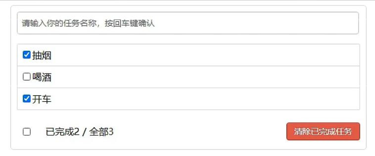

> 组件化编程流程（通用）

- 1.实现静态组件：抽取组件，使用组件实现静态页面效果
- 2.实现动态组件：考虑好数据的存放位置，数据是一个组件在用，还是一些组件在用：
  - 一个组件在用：放在组件自身即可
  - 一些组件在用：放在他们共同的父组件上（这种行为叫$\textcolor{Red}{状态提升}$）
- 3.实现交互：从绑定事件监听开始

> props使用场景

- 父传子通信
- 子传父通信：要求父组件先给子组件一个函数

> 使用props注意事项

- `v-model`绑定的值不能是`props`传过来的值，因为`props`是不可以修改的
- `props`传过来的值如果是对象类型，使用`v-model`等==修改对象中的属性==时，Vue不会报错，但是$\textcolor{Red}{不推荐}$

## 3.13 webStorage

webStorage，即浏览器的本地存储，存储大小一般在==5MB==左右。浏览器端通过`Window.localStorage`和`Window.sessionStorage`属性来实现本地存储机制。

==该内容并不是Vue团队提供的，原生JS就有的。==

> localStorage

==浏览器关掉后，存储的内容不会消失。==只有当调用localStorage的删除API或者清空浏览器缓存时，存储的内容才会消失。

- 存储：`localStorage.setItem(key, value)`$\textcolor{Red}{value必须是字符串}$

- 获取：`localStorage.getItem(key)`$\textcolor{Red}{方法返回值是字符串类型}$

  ==如果key不存在，返回的结果是null==

- 移除：`localStorage.removeItem(key)`

- 清空：`localStorage.clear()`

> sessionStorage

==浏览器关掉后，存储的内容会立即消失==

- 存储：`sessionStorage.setItem(key, value)`$\textcolor{Red}{value必须是字符串}$

- 获取：`sessionStorage.getItem(key)`$\textcolor{Red}{方法返回值是字符串类型}$

  如果key不存在，返回的结果是null

- 移除：`sessionStorage.removeItem(key)`

- 清空：`sessionStorage.clear()`

## 3.14 Vue中的自定义事件

> 作用

一种组件间通信的方式，适用于$\textcolor{red}{子组件 ===> 父组件}$

>使用方法

A是父组件，B是子组件，B想给A传值，那么需要在A中给B绑定自定义事件（==事件的回调在父组件A中==）

- 父组件绑定自定义事件

  - 方法一：使用`v-on`或`@`指令

    ```vue
    <template>
      <div id="app">
        <h1>{{msg}}</h1>
        <!-- 【父子组件通信】子传父：方法二，自定义事件（第一种写法） -->
        <Student v-on:myEvent="getStudentMsg" @demo="m1"/>
        <!-- @等价于v-on，once表示只调用一次 -->
        <!-- <Student @myEvent.once="getStudentMsg"/> -->
      </div>
    </template>
    
    <script>
    // Student
    import Student from './components/Student.vue'
    
    export default {
      name: 'App',
      components: {
        Student
      },
      data() {
        return {
          msg: '欢迎学习Vue'
        }
      },
      methods: {
        // 事件回调
        getStudentMsg(msg) {
          console.log('APP接收到了学生组件传递的信息：', msg)
        },
      }
    }
    </script>
    ```

  - 方法二：使用`ref`属性

    ```vue
    <template>
      <div id="app">
        <h1>{{msg}}</h1>
        <!-- 【父子组件通信】子传父：方法二，自定义事件（第二种写法） -->
        <Student ref="student"/>
      </div>
    </template>
    
    <script>
    // Student
    import Student from './components/Student.vue'
    
    export default {
      name: 'App',
      components: {
        Student
      },
      data() {
        return {
          msg: '欢迎学习Vue'
        }
      },
      methods: {
        // 事件回调
        getStudentMsg(msg) {
          console.log('APP接收到了学生组件传递的信息：', msg)
        }
      },
      mounted() {
        this.$refs.student.$on('myEvent', this.getStudentMsg) // 绑定自定义事件
        // this.$refs.student.$once('myEvent', this.getStudentMsg) // 绑定自定义事件，只触发一次
      }
    }
    </script>
    ```

  ==如果想让自定义事件只触发一次，可以使用`once`修饰符或者`$once`方法==

- 子组件触发自定义事件：使用子组件的`$emit`方法

  ```vue
  <template>
    <div class="student">
      <h2>学生姓名：{{name}}</h2>
      <h2>学生性别：{{sex}}</h2>
      <h2>学生年龄：{{age}}</h2>
      <button @click="sendStudentMsg">向父组件传学生递信息</button>
    </div>
  </template>
  
  <script>
  export default {
      name: 'Student',
      data() {
          return {
              name: '张三',
              age: 18,
              sex: '男'
          }
      },
      methods: {
        sendStudentMsg() {
          // 触发组件的myEvent事件
          this.$emit('myEvent', {name: this.name, age: this.age, sex: this.sex})
        }
      }
  
  }
  </script>
  ```

- 子组件解绑自定义事件

  - 方法一：借助`$off`方法

    ```js
    unbindSelfEvent() {
        this.$off('myEvent') // 销毁一个自定义事件
        // this.$off(['myEvent', 'demo']) // 销毁多个自定义事件
        // this.$off() // 销毁所有自定义事件
    },
    
    ```

  - 方法二：销毁当前组件

    ```js
    destroyStudent() {
        this.$destroy() // 销毁了当前Student组件实例，销毁后所有Student实例的自定义事件全部失效
    }
    ```

> 组件绑定原生DOM事件的方法

使用==native==修饰符

`<Student @click.native='alert(123)'/>`

> 注意事项

通过`this.$ref.xxx.$on('myEvent', 回调函数)`绑定自定义事件时，回调函数==要么配置在methods中，要么用箭头函数==，否则this指向会出现问题！

## 3.15 全局事件总线

> 作用

一种组件间通信的方式，适用于==任意组件间通信==

> 使用方法

- Step1. 安装全局事件总线

  在`main.js`文件创建`Vue`实例时安装全局事件总线：

  ```js
  new Vue({
      ...
      beforeCreate() {
      	Vue.prototype.$bus = this; // 安装全局事件总线$bus, $bus就是当前的vm实例
  	}
  })
  ```

- Step2. 接收数据

  在需要接收数据的组件中，给`$bus`绑定自定义事件，==事件的回调留在当前组件中==

  ```js
  ...
  methods() {
      // 定义回调方法
      demo(data) {...}
  }
  ...
  mounted() {
      // 给$bus绑定自定义事件
      this.$bus.$on('自定义事件名', this.demo)
  }
  ```

- Step3. 提供数据

  在提供数据的组件中，触发`$bus`的自定义事件

  ```js
  ...
  this.$bus.$emit('Step2中自定义的时间名', this.demo)
  ...
  ```

- Step4. 解绑当前事件

  最好在接收消息的组件中通过`beforeDestroy`钩子，用`$off`解绑==当前组件所用到的事件==

## 3.16 消息订阅与发布

==推荐安装`pubsub-js`库==：`npm -i pubsub-js`

> 作用

一种组件间通信的方式，适用于==任意组件间通信==

> 使用方法

- Step1. 安装第三方库

  `npm -i pubsub-js`

- Step2. 发布和订阅消息的组件引入pubsub-js

  `import pubsub from 'pubsub-js'`

- Step3. 接收数据

  在需要接收事件的组件中，==订阅消息==，订阅的回调留在当前组件中

  ```js
  ...
  methods: {
      // 订阅的回调函数
      demo(data) {...}
  }
  ...    
  mounted() {
      // 订阅消息
      this.pid = pubsub.subscribe('消息名', this.demo)
  }
  ```

- Step4. 提供数据

  ```js
  pubsub.publish('消息名', 数据)
  ```

- Step5. 取消订阅

  最好在接收消息的组件中通过`beforeDestroy`钩子，用`pubsub.unsubscribe(pid)`取消订阅。

## 3.17 $nextTick

> 作用

一个生命周期钩子函数。在下一次DOM更新结束后执行其指定的回调

> 使用场景

当改变数据后，要基于更新后的新的DOM进行某些操作。该操作要在nextTike所指定的回调函数中执行

> 语法

`this.$nextTick(回调函数)`

> 例子

```js
// 在DOM更新后获取input框（ref的值为inputTitle）的焦点
this.$nextTick(function() {
    this.$refs.inputTitle.focus();
})
```

## 3.18 过渡与动画

> 作用

在插入、更新或移除DOM元素时，给元素添加样式类名

> 图示

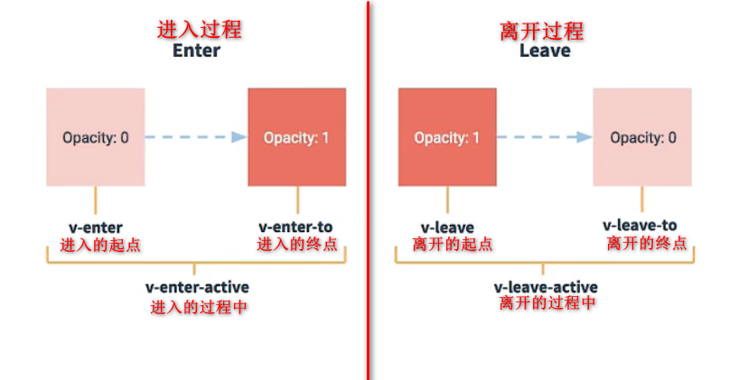

> 使用方法

- Step1. 准备好样式

  - 元素进入的样式
    - v-enter： 进入的起点
    - v-enter-active：进入过程中
    - v-enter-to：进入的终点
  - 元素离开的样式
    - v-leave：离开的起点
    - v-leave-active： 离开过程中
    - v-leave-to：离开的终点
  - 如果用动画实现，还需要编写动画效果；如果用过度实现，不需编写动画效果

- Step2. 用`<transition>`包裹要过渡的元素

  ==如果有多个元素需要配置动画效果，需要使用`<transition-group>`标签==。使用该标签时，<span style="color: red">必须给子元素设置key属性！</span>

  <span style="color: red">如果配置了name属性，Step1中的样式的类名不在是v-XXX,而是name-XXX</span>，如：

  ```vue
  <!-- 
  	transition的name值为hello，style中的样式名为hello-XXX 
  	appear表示页面刷新时执行进入动画
  -->
  <template>
    <div>
      <transition name="hello" appear>
          ...
      </transition>
    </div>
  </template>
  
  <script>
  ...
  </script>
  
  <style scoped>
  ...
  .hello-enter-active {
      animation: hello 1s linear;
  }
  
  .hello-leave-active {
      animation: hello 1s linear reverse;
  }
  ...
  </style>
  ```

> 栗子1：借助==动画==实现

```vue
<template>
  <div>
    <h1>利用动画实现元素的显示与隐藏效果</h1>
    <button @click="isShow = !isShow">显示/隐藏</button>
    <!-- 用<transition>包裹要过渡的元素，并配置`name`属性 -->
    <transition name="hello" appear>
        <div class="demo" v-show="isShow">你好啊</div>
    </transition>
  </div>
</template>

<script>
export default {
    name: 'Test',
    data() {
        return {
            isShow: true
        }
    }
}
</script>

<style scoped>
.demo {
    background-color: orange;
    margin-top: 10px;
    height: 50px;
    color: white;
    line-height: 50px;
    padding-left: 10px;
    border-radius: 10px;
    font-size: 22px;
}

/** 编写动画 */
@keyframes hello {
    from {
        transform: translateX(-100%);
    }
    to {
        transform: translateX(0px);
    }
}

/** 元素进入的样式 */
.hello-enter-active {
    animation: hello 1s linear;
}
    
/** 元素离开的样式 */
.hello-leave-active {
    animation: hello 1s linear reverse;
}

</style>
```

> 栗子2：借助==过渡==实现

```vue
<template>
  <div>
    <h1>利用过渡实现元素的显示与隐藏效果</h1>
    <button @click="isShow = !isShow">显示/隐藏</button>
    <!-- 用<transition>包裹要过渡的元素，并配置`name`属性 -->
    <transition name="hello" appear>
        <div class="demo" v-show="isShow">你好啊</div>
    </transition>
  </div>
</template>

<script>
export default {
    name: 'Test2',
    data() {
        return {
            isShow: true
        }
    }
}
</script>

<style scoped>
.demo {
    background-color: orange;
    margin-top: 10px;
    height: 50px;
    color: white;
    line-height: 50px;
    padding-left: 10px;
    border-radius: 10px;
    font-size: 22px;
}

/**进入的起点、离开的终点 */
.hello-enter, .hello-leave-to {
    transform: translateX(-100%);
}

/** 进入的动画、离开的动画 */
.hello-enter-active, .hello-leave-active {
    transition: 1s linear;
}

/**进入的终点、离开的起点 */
.hello-enter-to, .hello-leave{
    transform: translateX(0);
}

</style>
```

> 栗子3：多个元素实现动画效果

```vue
...
<transition-group name="hello" appear>
    <!-- 必须给div设置key属性 -->
    <div class="demo" v-show="isShow" key="1">你好啊</div>
    <div class="demo" v-show="!isShow" key="2">你好啊2</div>
</transition-group>
...
```

> 栗子4：使用第三方库animate

使用方法：详见官网[Animate.css | A cross-browser library of CSS animations.](https://animate.style/)

- 安装依赖

  ```sh
  npm install animate.css
  ```

- 在组件中引入

  ```js
  import 'animate.css';
  ```

- 配置`<transition>`或`<transition-group>`的name属性，并指定动画

  ```vue
  ...
  <!--
  	name: animate的类名
  	enter-active-class：进入时的动画。都是animate库写好的，在官网找就行
  	leave-active-class：离开时的动画。同上
  -->
  <transition-group 
  	appear
  	name="animate__animated animate__bounce"
      enter-active-class="animate__swing" 
      leave-active-class="animate__backOutUp"
  >
      ...
  </transition-group>
  ...
  ```

- 完整代码

  ```vue
  <template>
    <div>
      <h1>第三方动画库<a href="https://animate.style/" target="blank">animate</a></h1>
      <button @click="isShow = !isShow">显示/隐藏</button>
      <transition-group 
          appear
          name="animate__animated animate__bounce"
          enter-active-class="animate__swing"
          leave-active-class="animate__backOutUp"
      >
          <div class="demo" v-show="isShow" key="1">你好啊</div>
          <div class="demo" v-show="!isShow" key="2">你好啊2</div>
      </transition-group>
    </div>
  </template>
  
  <script>
  import 'animate.css';
  
  export default {
      name: 'Test4',
      data() {
          return {
              isShow: true
          }
      }
  }
  </script>
  
  <style scoped>
  .demo {
      background-color: orange;
      margin-top: 10px;
      height: 50px;
      color: white;
      line-height: 50px;
      padding-left: 10px;
      border-radius: 10px;
      font-size: 22px;
  }
  </style>
  ```

# 4.Vue中的ajax

## 4.1 vue脚手架配置代理

> 作用

可以用来解决开发环境Ajax跨域问题。

> 方法一

在`vue.config.js`中添加如下配置：

```js
module.exports = defineConfig({
  ...
  devServer: {
    proxy: "http://localhost:5000"
  }
})
```

==说明：==

- 优点：配置简单，请求资源时直接发给代理服务器(8080)即可
- 缺点：不能配置多个代理，不能灵活的控制请求是否走代理
- 工作方式：若按照上述配置代理，当请求了前端存在的资源，会优先返回前端资源。只有当请求了前端不存在的资源，才会将请求发给服务器

> 方法二

在`vue.config.js`中添加如下配置：

```js
module.exports = defineConfig({
  ...
  devServer: {
    proxy: {
      '/api': { // 匹配所有以'/api'开头的路径
        target: 'http://localhost:5000', // 转发路径
        changeOrigin: true, // 该值为true时，服务器收到的请求头中的host为localhost:5000；为false时，host为localhost:8080。默认为true
        pathRewrite: {'^/api': ''} // 使用正则，去掉路径中的'/api'
      },
      '/api2': { 
        target: 'http://localhost:5001', 
        changeOrigin: true, // 
        pathRewrite: {'^/api2': ''}
      }
    }
  }
})

```

==说明：==

- 优点： 可以配置多个代理，且可以灵活的控制是否走代理
- 缺点：配置略微繁琐，请求资源时必须加前缀

## 4.2 vue-resource

vue插件库，用途和`axios`一样，目前已经不推荐使用，官方已不维护。

> 使用

- 安装

  ```sh
  npm i vur-resource
  ```

- 引入和使用

  ```js
  // 在main.js中引入和使用
  
  // 引入
  import vueResource from 'vue-resource'
  // 使用
  Vue.use(vueResource)
  ```

  ==说明：==一旦使用成功，Vue实例和组件实例中就会多一个`$http`属性。此时则可以使用`$http`发送请求，使用方法和`axios`使用方法一样

## 4.3 slot插槽

> 作用

让父组件可以向子组件指定位置插入html结构，也是一种组件间通信方式，适用于<span style="color: red">父组件===>子组件</span>。

备注：外部传递过来的插槽信息保留在`vm.$slots`中

> 分类

- 默认插槽
- 具名插槽：顾名思义，给插槽取个名字，父组件使用时按照插槽名字将html结构插入到页面中
- 作用域插槽：<span style="color: red">数据在组件自身，但根据数据生成的结构需要组件的使用者来决定。</span>

> 使用方法

- 默认插槽

  - 子组件

    ```vue
    <template>
      <div class="category">
        <h2>{{title}}</h2>
        <hr>
        <slot>我是默认数据</slot>
      </div>
    </template>
    ```

  - 父组件

    ```vue
    <template>
      <div id="app">
        <Category title="美食分类">
          
        </Category>
      </div>
    </template>
    
    <script>
    // Test
    import Category from './components/Category.vue'
    
    export default {
      name: 'App',
      components: {
        Category
      }
    }
    </script>
    
    <style>
    #app {
      display: flex;
      justify-content: space-around;
    }
    img {
      width: 96%;
      margin-left: 2%;
    }
    </style>
    ```

- 具名插槽

  - 子组件

    ```vue
    <template>
      <div class="category">
        <h2>{{title}}</h2>
        <hr>
        <!-- 使用name属性为插槽取名字 -->
        <slot name="center">我是默认数据</slot>
        <hr>
        <slot name="bottom">我是默认数据</slot>
      </div>
    </template>
    ```

  - 父组件

    ```vue
    <template>
      <div id="app">
        <Category title="美食分类">
          <!-- 根据插槽名字将html结构插入到指定位置 -->
          
          <h4 slot="bottom">环联夜市欢迎你</h4>
        </Category>
    
        <Category title="游戏分类">
          <ul slot="center">
              <li v-for="(game, gIndex) in games" :key="gIndex">{{game}}</li>
          </ul>
          <div class="gamesCategory" slot="bottom">
            <a href="http://www.baidu.com">单机游戏</a>
            <a href="http://www.baidu.com">网络游戏</a>
          </div>
        </Category>
    
        <Category title="电影分类">
          <video slot="center" controls src="http://clips.vorwaerts-gmbh.de/big_buck_bunny.mp4"></video>
          <!-- 如果多个结构都需要查到同一个插槽，可以借助template标签。template标签除了可以借助 slot="center" 指定插槽名字外，还可以使用v-slot:bottom指定插槽 -->
          <template v-slot:bottom>
            <ul>
              <li v-for="(film, index) in films" :key="index">{{film}}</li>
            </ul>
            <div class="gamesCategory">
              <a href="http://www.baidu.com">经典</a>
              <a href="http://www.baidu.com">热门</a>
              <a href="http://www.baidu.com">推荐</a>
            </div>
          </template>
        </Category>
      </div>
    </template>
    
    <script>
    // Test
    import Category from './components/Category.vue'
    
    export default {
      name: 'App',
      components: {
        Category
      },
      data() {
        return {
          games: ['王者荣耀', '绝地求生', '开心消消乐', '滑雪大冒险'],
          films: ['你好李焕英', '夏洛特烦恼', '老炮儿', '你好，旧时光']
        }
      }
    }
    </script>
    
    <style>
    #app, .gamesCategory {
      display: flex;
      justify-content: space-around;
    }
    img, video {
      width: 96%;
      margin-left: 2%;
    }
    h4 {
      text-align: center;
    }
    </style>
    
    ```

    

- 作用域插槽：games数据在Category组件中，但是使用数组遍历出来的结构由APP组件决定。

  - 子组件

    ```vue
    <template>
      <div class="category">
        <h2>{{title}}</h2>
        <hr>
        <!-- 定义games传值 -->
        <slot :games="games">我是默认数据</slot>
      </div>
    </template>
    
    <script>
    export default {
        props: ['title'],
        data() {
          return {
            games: ['王者荣耀', '绝地求生', '开心消消乐', '滑雪大冒险'],
          }
        }
    }
    </script>
    
    <style scoped>
    .category {
       background-color: aqua;
       width: 200px;
       height:350px;
    }
    h2 {
      text-align: center;
    }
    </style>
    ```

  - 父组件

    ```vue
    <template>
      <div id="app">
        <Category title="游戏分类">
          <!-- 父组件使用scope来接收子组件传来的数据。info作为形参，可以随便定义 --> 
          <template scope="info">
            <ul>
                <li v-for="(game, gIndex) in info.games" :key="gIndex">{{game}}</li>
            </ul>
          </template>
        </Category>
    
        <Category title="游戏分类">
          <!-- scope接收的参数，也可以使用ES6语法中的结构赋值 --> 
          <template scope="{games}">
    	  <!-- scope也可以写成slot-scope，脚手架新旧API的问题，slot-scope 是新API --> 
    	  <!-- <template slot-scope="{games}"> -->
            <ol>
                <li v-for="(game, gIndex) in games" :key="gIndex">{{game}}</li>
            </ol>   
          </template>
        </Category>
      </div>
    </template>
    
    <script>
    // Test
    import Category from './components/Category.vue'
    
    export default {
      name: 'App',
      components: {
        Category
      }
    }
    </script>
    
    <style>
    #app, .gamesCategory {
      display: flex;
      justify-content: space-around;
    }
    img, video {
      width: 96%;
      margin-left: 2%;
    }
    h4 {
      text-align: center;
    }
    </style>
    ```

# 5.vuex

## 5.1 理解vuex

> vuex是什么

专门在Vue中实现集中式状态（数据）管理的一个Vue插件，对Vue应用中多个组件的共享状态进行集中式的管理（读写），也是一种组件间通信的方式，且适用于任意组件间通信。

附：Github地址：https://github.com/vuejs/vuex

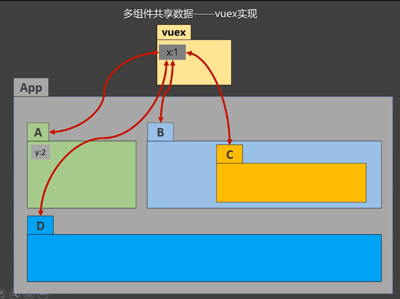

> 使用场景

- 多个组件依赖于同一个状态   
- 来自不同组件的行为需要变更同一状态

## 5.2 原理图

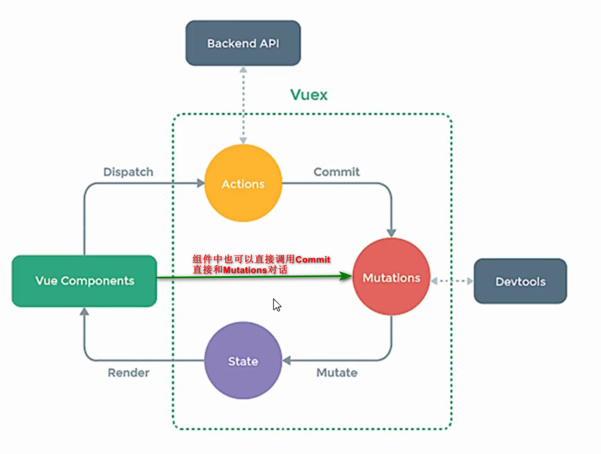

## 5.3 搭建vuex环境

- 创建`src/store/index.js`文件

  ```js
  // 该文件用于创建vuex中最为核心的store
  
  // 引入Vue
  import Vue from 'vue'
  // 引入Vuex
  import Vuex from 'vuex'
  // 使用插件Vuex,随后创建vue实例时，才可传入store配置项
  Vue.use(Vuex)
  
  // 准备actions，用于响应组件中的动作
  const actions = {}
  
  // 准备mutations， 用于操作数据（state）
  const mutations = {}
  
  // 准备state， 用于存储数据
  const state = {}
  // 创建并暴露store（创建store必须是在Vue.use(Vuex)之后，不然报错）
  export default new Vuex.Store({
      actions,
      mutations,
      state
  })
  ```

- 在`main.js`中创建vm时传入`store`配置项

  ```js
  ...
  // 引入store
  import store from './store/index'
  ...
  const vm = new Vue({
    el: '#app',
    render: h => h(App),
    store // 传入store配置。因为key值和value值一样，此处可以使用简写模式
  })
  ```

- 例子：进行求和操作

  - `Count`组件

    - 组件中读取vuex中的数据：`this.$store.state.sum`

    - 调用vuex API，修改数据：`this.$store.dispatch('actions中的方法名', 数据)`或`this.$store.commit('mutations中方法名', 数据)`

      ==如果没有网络请求，或者其他业务逻辑，组价也可以越过actions，直接调用commit API==

    ```vue
    <template>
      <div class="category">
        <h2>求和结果是：{{$store.state.sum}}</h2>
        <select v-model="n">
          <option :value="1">1</option>
          <option :value="2">2</option>
          <option :value="3">3</option>
        </select>
        <button @click="increment">+</button>
      </div>
    </template>
    
    <script>
    export default {
        data() {
          return {
            n: 1
          }
        },
        methods: {
          increment() {
            // 调用store的dispatch API，将操作发送给actions
            this.$store.dispatch('increment', this.n)
            // 如果没有网络请求，或者其他业务逻辑，组价也可以越过actions，直接调用commit API
            // this.$store.commit('INCREMENT', this.n)
          }
    }
    </script>
    
    <style scoped>
    button {
      margin-left: 5px
    }
    </style>
    ```

  - `src/store/index.js`

    ```js
    ...
    // 准备actions，用于响应组件中的动作
    const actions = {
        // 第一个参数叫上下文，是简写版的store
        increment(context, value) {
            // 调用store的commit API，将操作发送给mutations
            // 一般为了做个区分，mutations中对应的方法习惯性大写
            context.commit('INCREMENT', value)
        }
    }
    
    // 准备mutations， 用于操作数据（state）
    const mutations = {
        INCREMENT(context, value) {
            console.log('mutations---->INCREMENT:', context, value)
            context.sum += value
        }
    }
    
    // 准备state， 用于存储数据
    const state = {
        sum: 0 // 求得的和
    }
    ...
    ```

## 5.4 getters配置项

> 作用

当state中的数据需要加工再使用时，可以使用getters加工。

类似于vue中的计算属性computed

==逻辑当然也可以自己写。但是如果逻辑比较复杂，并且想要实现复用，推荐使用getters==

> 使用方法

- 在`src/store/index.js`中追加`getters`配置

  ```js
  ...
  // 准备getters， 用于对state中的数据进行加工
  const getters = {
      bigSum(state) {
          console.log('getters======', state)
          return state.sum * 10
      }
  }
  
  // 创建并暴露store
  export default new Vuex.Store({
      ...
      getters
  })

- 组件中读取数据：`this.$store.getters.bigSum`

## 5.5 四个map方法的使用

> mapState方法：将$store.state中的数据生成为Object对象（常写在组件的计算属性中，将Object对象返回为计算属性）

==语法==：`...mapState({'组件中属性名1': '$store.state中属性名1', 组件中属性名2: '$store.state中属性名2', ...})`或者当组件中属性名和$store.state中属性名一致时，可以使用数组形式简写`...mapState(['属性名1', '属性名2', ...])`

```vue
<template>
  <div class="category">
    <h2>求和结果是：{{sum}}</h2>
    <h2>我在{{school}}，学习{{subject}}</h2>
    ...
  </div>
</template>

<script>
// 引入mapState方法
import {mapState} from 'vuex'
export default {
    ...
    computed: {
      // 借助mapState获取$store.state中的数据：school、subject、sum(对象写法)
       ...mapState({'school': 'school', subject: 'subject', sum: 'sum'}),

      // 借助mapState获取$store.state中的数据：school、subject、sum（数组写法）
      ...mapState(['school', 'subject', 'sum']),

    },
}
</script>
...
```

> mapGetters方法：将$store.getters中的方法生成为Object对象（常写在组件的计算属性中，将Object对象返回为计算属性）

==语法==：`...mapGetters({'组件中方法名1': '$store.getters中方法名1', 组件中方法名2: '$store.getters中方法名2', ...})`或者当组件中方法名和$store.getters中方法名一致时，可以使用数组形式简写`...mapGetters(['方法名1', '方法名2', ...])`

```vue
<template>
  <div class="category">
   ...
    <h2>放大10倍后的结果是：{{bigSum}}</h2>
    ...
  </div>
</template>

<script>
// 引入mapGetters方法
import {mapGetters} from 'vuex'
export default {
    ...
    computed: {
      // 借助mapGetters获取$store.getters中的数据：bigSum(对象写法)
       ...mapGetters({bigSum: 'bigSum'}),

      // 借助mapGetters获取$store.getters中的数据：bigSum（数组写法）
      ...mapGetters(['bigSum'])
    }
}
</script>
...
```

> mapActions方法：生成与actions对话的方法，即包含$store.dispatch(XXX)的函数

==语法==：`...mapActions({'组件中方法名1': '$store.actions中方法名1', 组件中方法名2: '$store.actions中方法名2', ...})`或者当组件中方法名和$store.actions中方法名一致时，可以使用数组形式简写`...mapActions(['方法名1', '方法名2', ...])`

<h4 style="color: red">在组件中调用方法时必须传参，否则参数是事件对象！！！</h4>

```vue
<template>
  <div class="category">
    ...
    <!-- 注意：此时调用方法时必须传参 -->
    <button @click="increment(n)">+</button>
    <button @click="decrement(n)">-</button>
  </div>
</template>

<script>
// 引入mapActions
import { mapActions } from 'vuex'
export default {
    ...
    methods: {
      // 借助mapActions生成对应的方法，方法中会自动调用this.$store.dispatch API（对象写法）
      ...mapActions({increment: 'increment', decrement: 'decrement'}),

      // 借助mapActions生成对应的方法，方法中会自动调用this.$store.dispatch API（数组写法）
      ...mapActions(['increment', 'decrement']),
      ...
    },
    ...
}
</script>

<style scoped>
button {
  margin-left: 5px
}
</style>
```

> mapMutations方法：生成与mutations对话的方法，即包含$store.commit(XXX)的函数

==语法==：`...mapMutations({'组件中方法名1': '$store.mutations中方法名1', 组件中方法名2: '$store.mutations中方法名2', ...})`或者当组件中方法名和$store.mutations中方法名一致时，可以使用数组形式简写`...mapMutations(['方法名1', '方法名2', ...])`

<h4 style="color: red">在组件中调用方法时必须传参，否则参数是事件对象！！！</h4>

```vue
<template>
  <div class="category">
    ...
    <button @click="INCREMENT(n)">+</button>
    <button @click="DECREMENT(n)">-</button>
  </div>
</template>

<script>
// 引入mapMutations
import { mapMutations } from 'vuex'
export default {
    ...
    methods: {
      ...
      // 借助mapActions生成对应的方法，方法中会自动调用this.$store.commit API（对象写法）
      ...mapMutations({increment: 'INCREMENT', decrement: 'DECREMENT'}),

      // 借助mapActions生成对应的方法，方法中会自动调用this.$store.commit API（对象写法）
      // ...mapMutations(['INCREMENT', 'DECREMENT']),
      ...
    },
    ...
}
</script>
...
```

## 5.5 模块化编程+namespace

> 作用

让代码更好维护，让多种数据分类更加明确。

> 使用方法

<h4 style="color: red">注意一定要开启命名空间！！！</h4>

- 修改`src/store/index.js`文件：

  ==将不同模块的store相关配置分离开来，在创建store的时候使用modules分模块创建==

  ```js
  ...
  
  // Count组件相关功能
  const countAbout =  {
      namespaced: true, // 开启命名空间
      actions: {...},
      mutations: {...},
      state: {...},
      getters: {...}
  }
  // 人员组件相关功能
  const personAbout =  {
      namespaced: true, // 开启命名空间
      actions: {...},
      mutations: {...},
      state: {...},
      getters: {...}
  }
  // 创建并暴露store
  export default new Vuex.Store({
      modules: {
          count, // 模块名
          person // 模块名
      }
  })
  ```

- 开启命名空间后，组件读取state数据

  ```js
  // 方式一：自己直接读取（读取person模块中的personList属性）
  this.$store.state.person.personList
  // 方式二：借助mapState读取（读取count模块中的school、subject、sum属性）
   ...mapState('count', ['school', 'subject', 'sum']),
  ```

- 开启命名空间后，组件读取getters数据

  ```js
  // 方式一：自己直接读取（读取person模块中的firstPersonName getters方法）
  this.$store.getters['person/firstPersonName']
  // 方式二：借助mapGetters读取（读取count模块中的bigSum getters方法）
  ...mapGetters('count', ['bigSum'])
  ```

- 开启命名空间后，组件调用dispatch API

  ```js
  // 方式一：自己直接调用（调用person模块中的addWang actions方法）
  this.$store.dispatch('person/addWang', person)
  // 方式二：借助mapActions调用（调用count模块中的increment actions方法）
  ...mapActions('count',['increment']),
  ```

- 开启命名空间后，组件调用commit API

  ```js
  // 方式一：自己直接（调用person模块中的ADD mutations方法）
  this.$store.commit('person/ADD', person)
  // 方式二：借助mapMutations调用（调用count模块中的DECREMENT mutations方法）
  ...mapMutations('count', {decrement: 'DECREMENT'}),
  ```

# 6.vue-router

## 6.1 相关概念

> vue-router

（router：路由器，由多个路由组成，用于集中管理不同的路由）

vue的一个插件库，专门用来实现==SPA应用==

> SPA

- 单页面Web应用（single page web application)
- 整个应用<span style="color: red">只有一个完成的页面</span>
- 点击页面中的导航连接<span style="color: red">不会刷新页面</span>，只会做页面的<span style="color: red">局部更新</span>
- 数据需要通过ajax请求获取

> 路由

- 什么是路由：
  - 一个路由就是一组映射关系（key-value）
  - key为路径，value可能是function或者component
- 路由分类：
  - 后端路由
    - value是function，用于处理客户端提交的请求
    - 工作过程：当服务器接收到一个请求时，根据请求路径找到匹配的函数来处理请求，并返回响应数据
  - 前端路由
    - value是component，用于展示页面内容
    - 工作过程：当浏览器的路径改变时，对应的组件会被渲染

## 6.2 基本路由

> 使用方法

- 安装vue-router

  ==目前最新版本的vue-router是4.X，只适用于vue3，和vue2适配的最新版本是3.X。所以安装时要根据vue的版本指定vue-router的版本号==

  ```sh
  npm i vue-router@3
  ```

- 应用插件，并编写router配置

  新建`src/router/index.js`文件，编写如下内容：

  ```js
  // 引入vue-router
  import VueRouter from 'vue-router'
  // 引入Vue
  import Vue from "vue"
  // 使用VueRouter插件
  Vue.use(VueRouter)
  // 引入Home组件
  import Home from '../pages/Home.vue'
  // 创建router实例对象，去管理多组路由规则，并将其暴露出去
  export default new VueRouter({
      routes: [
          {
              path: '/about', // 路径
              component: () => import('../pages/About.vue') // 组件（第一种写法：异步写法）
          },
          {
              path: '/home', // 路径
              component: Home // 组件
          },
      ]
  })
  ```

- 修改`main.js`配置

  ```js
  ...
  // 引入router
  import router from './router'
  ...
  // 创建Vue实例对象vm
  const vm = new Vue({
    ...
    router: router // 配置vue的router属性
  })
  ```

- 页面中实现路由切换

  - 特定标签：router-link
  - active-class：指定选中样式
  - to：跳转到的路径

  ```vue
  <router-link class="myRouter" active-class="active" to="/about">About</router-link>
  ```

- 指定路由组件的展示位置

  ```vue
  <router-view></router-view>
  ```

> 几个注意事项

- 路由组件通常存放在`pages`文件夹，一般组件通常存放在`components`文件夹
- 通过切换，“隐藏”了的路由组件，默认是被销毁掉的，需要的时候再去挂载
- 每个组件都有自己的`$route`属性，里面存放着自己的路由信息
- 整个应用只有一个router，可以通过组件的`$router`属性获取到

## 6.3 嵌套（多级）路由

> 使用方法

- 配置路由规则，使用`children`配置项

  <h4 style="color: red">注意：子路由的path不能加“/”！！！</h4>

  ```js
  ...
  export default new VueRouter({
      routes: [
          ...
          {
              path: '/home',
              component: Home,
              children: [
                  {
                      path: 'news', // 子路由path值不加‘/’
                      component: News
                  },
                  {
                      path: 'messages',
                      component: Messages
                  },
              ]
          },
      ]
  })
  ```

- 跳转

  <h4 style="color: red">注意：跳转路径是包含父路径的完整路径！！！</h4>

  ```vue
   <router-link class="home_route" active-class="active" to="/home/messages">messages</router-link>
  ```

## 6.4 命名路由

> 作用

可以简化路由的跳转。

> 用法

- 给路由命名

  ```js
  export default new VueRouter({
      routes: [
          ...
          {
              name: 'home', // 路由名字
              path: '/home',
              component: Home,
              children: [
                  ...
                  {
                      name: 'messages', // 路由名字
                      path: 'messages',
                      component: Messages,
                      children: [{
                          name: 'detail', // 路由名字
                          path: 'detail',
                          component: Detail
                      }]
                  },
              ]
          },
      ]
  })
  ```

- 简化跳转

  ```vue
  <!-- 简化前，要写完整的路径 -->
  <router-link to="/home/messages/detail"></router-link>
  <!-- 简化后，直接通过路由名字跳转 -->
  <router-link to="{name: 'detail'}"></router-link>
  ```

## 6.5 路由传参

>传参方式

- query参数
- params参数

> query传参

- 传递参数

  ```vue
  ...
  <!-- 跳转并携带query参数，to的字符串写法 -->
  <router-link :to="`/home/messages/detail?id=${item.id}&info=${item.info}`">{{item.info}}</router-link>
  
  <!-- 跳转并携带query参数，to的对象写法 -->
  <router-link 
  	:to="{
  		name: 'detail', // 既可以使用name跳转，也可以使用path跳转
  		// path: '/home/messages/detail', 
          query: {
          	id: item.id,
              info: item.info
          }
       }"
  >{{item.info}}</router-link>
  ...
  ```

- 接收参数

  ```js
  this.$route.query.id
  this.$route.query.info
  ```

> params

- 路由配置，声明接收params参数

  ```js
  export default new VueRouter({
      routes: [
          ...
          {
              name: 'home', 
              path: '/home',
              component: Home,
              children: [
                  ...
                  {
                      name: 'messages', 
                      path: 'messages',
                      component: Messages,
                      children: [{
                          name: 'detail', 
                          path: 'detail/:id/:info', // 使用占位符，标记params参数名字
                          component: Detail
                      }]
                  },
              ]
          },
      ]
  })
  ```

- 传递参数

  <h4 style="color: red">注意：路由携带params参数时，若使用to的对象写法，则不能使用path配置项，必须使用name配置！！！</h4>

  ```vue
  <!-- 跳转并携带params参数，to的字符串写法 -->
  <router-link :to="`/home/messages/detail/${item.id}/${item.info}`">{{item.info}}</router-link>
  <!-- 跳转并携带params参数，to的对象写法 -->
  <router-link 
  	:to="{
  		name: 'detail', // 此处只能使用name跳转，不能使用path
          params: {
          	id: item.id,
              info: item.info
          }
       }"
  >{{item.info}}</router-link>
  ```

- 接收参数

  ```js
  this.$route.params.id
  this.$route.params.info
  ```

## 6.6 路由的props配置

> 作用

让路由组件更方便的接收到参数

> 使用方法

- 第一种写法：值为对象。该对象中的所有key-value都会以props的形式传给Detail组件

  ==一般不这么写。此种写法只能传递固定参数。==

  ```js
  export default new VueRouter({
      routes: [
          ...
          {
              name: 'home', 
              path: '/home',
              component: Home,
              children: [
                  ...
                  {
                      name: 'messages', 
                      path: 'messages',
                      component: Messages,
                      children: [
                          {
                              name: 'detail', 
                              path: 'detail/:id:/info',
                              component: Detail,
                              // props的第一种写法：值为对象
                              props: {id: '666', info: 'hello'}
                          }
                      ]
                  },
              ]
          },
      ]
  })
  ```

- 第二种写法：值为布尔值。若布尔值为true，就会把该路由组件收到的params参数，以props的形式传递给Detail组件

  ```js
  export default new VueRouter({
      routes: [
          ...
          {
              name: 'home', 
              path: '/home',
              component: Home,
              children: [
                  ...
                  {
                      name: 'messages', 
                      path: 'messages',
                      component: Messages,
                      children: [
                          {
                              name: 'detail', 
                              path: 'detail/:id:/info',
                              component: Detail,
                              // props的第二种写法：值为布尔值
                              props: true
                          }
                      ]
                  },
              ]
          },
      ]
  })
  ```

- 第三种写法：值为函数。既可以接收query参数，也可以接收params参数

  ```js
  export default new VueRouter({
      routes: [
          ...
          {
              name: 'home', 
              path: '/home',
              component: Home,
              children: [
                  ...
                  {
                      name: 'messages', 
                      path: 'messages',
                      component: Messages,
                      children: [
                          {
                              name: 'detail',
                              path: 'detail/:id/:info',
                              component: Detail,
                              // props的第三种写法：值为函数
                              props($route) {
                                  return {
                                      id: $route.params.id,
                                      info: $route.params.info
                                  }
                              }
                          }
                      ]
                  },
              ]
          },
      ]
  })
  ```

## 6.7 router-link的replace属性

> 作用

控制路由跳转时操作浏览器历史记录的模式

> 说明

浏览器的历史记录有两种写入方式，分别是`push`和`replace`， `push`是追加历史记录，`replace`是替换==当前记录==。路由跳转时默认为`push`方式

> 使用

对`router-link`标签使用`replace`属性即可开启`replace`模式

```vue
<router-link replace ...>Home</router-link>
```

## 6.8 编程式路由导航

> 作用

不借助`router-link`实现路由跳转，让路由跳转更加灵活

> 使用方法

==借助$router的API实现==

- push跳转

  ```js
  this.$router.push({
      name: 'detail',
      params: {
          id: '001',
          info: 'message001'
      }
  })
  ```

- replace跳转

  ```js
  this.$router.replace({
      name: 'detail',
      params: {
          id: '001',
          info: 'message001'
      }
  })
  ```

- 前进

  ==前进一步==

  ```js
  this.$router.forward()
  ```

- 后退

  ==后退一步==

  ```js
  this.$router.back()
  ```

- 按照参数前进或后退

  ==参数n为正，表示前进，参数为负，表示后退，步数为n的绝对值==

  ```js
  this.$router.go(2) // 前进两步
  this.$router.go(-1) // 后退一步
  ```

## 6.9 缓存路由组件

> 作用

让不展示的路由组件保持挂载，不被销毁

> 适用场景

路由组件中有输入框，切换到别的路由组件，再切回时，该路由组件输入框的内容仍旧为用户输入内容

> 具体编码

- keep-alive：特定标签，包裹着要展示的内容
- include：keep-alive的属性，用于配置哪些组件需要被缓存，其值为组件名

```vue
<!-- 缓存单个路由组件 -->
<keep-alive include="News">
	<router-view></router-view>
</keep-alive>

<!-- 缓存多个路由组件，第一种写法，字符串写法。注意，不可有空格，如include="News, Messages"是错误的 -->
<keep-alive include="News,Messages">
	<router-view></router-view>
</keep-alive>

<!-- 缓存多个路由组件，第二种写法，数组写法，使用v-bind指令。 -->
<keep-alive :include="['News', 'Messages']">
	<router-view></router-view>
</keep-alive>
```

## 6.10 两个新的生命周期钩子

> 作用

路由组件所独有的两个钩子，用于捕获路由组件的激活装填

> 具体名字

- activated：路由组件被激活时触发
- deactivated： 路由组件失活时触发

## 6.11 路由守卫

> 作用

对路由进行权限控制

> 分类

- 全局守卫
- 独享守卫
- 组件内守卫

> 全局守卫

```js
// 创建router实例对象，去管理多组路由规则
const router = new VueRouter({
    routes: [
       ...
        {
            name: 'home', 
            path: '/home',
            component: Home,
            meta: { // 路由元配置。在该属性内可以自定义路由信息
                title: '主页' // 配置组件title
            },
            children: [
                {
                    name: 'news', 
                    path: 'news', 
                    component: News,
                    meta: {
                        title: '新闻',
                        isAuth: true // 配置组件是否需要鉴权
                    }
                }
            ]
        },
    ]
})


/**
 * 全局前置守卫，初始化时执行，每次路由切换前执行
 * @param to 将要跳转到的路由
 * @param from 当前路由
 * @param next  放行，即完成路由的跳转
 */
router.beforeEach((to, from, next) => {
    if(to.meta.isAuth) { // 判断当前路由组件是否需要鉴权
        if(localStorage.getItem('userName') === 'tth') { // 鉴权
            next(); // 放行
        } else {
            alert('无权限查看')
        }
    } else {
        next()
    }
})

/**
 * 全局后置守卫，初始化时执行，每次路由切换后执行
 * @param to 将要跳转到的路由
 * @param from 当前路由
 */
router.afterEach((to, from) => {
    document.title = to.meta.title ? to.meta.title : 'vue_test' // 修改网页title
})

export default router
```

> 独享守卫

独享路由守卫`beforeEnter`配置项，只针对某一个路由组件的路由守卫，且只有前置独享守卫，没有后置独享守卫

```js
const router = new VueRouter({
    routes: [
        ...
       {
           name: 'news', // 路由名字
           path: 'news', // 子路由path值不加‘/’
           component: News,
           meta: {
               title: '新闻',
               isAuth: true
           },
           beforeEnter: (to, from, next) => { // 独享路由守卫
               if(to.meta.isAuth) { // 判断当前路由组件是否需要鉴权
                   if(localStorage.getItem('userName') === 'tth') { // 鉴权
                       next(); // 放行
                   } else {
                       alert('无权限查看')
                   }
               } else {
                   next()
               }
           },

       },
       ...
    ]
})
```

> 组件内路由守卫

- beforeRouteEnter：==通过路由守卫进入组件时==被调用
- beforeRouteLeave：==通过路由组件离开组件时==被调用

```vue
...
<script>
    export default {
        name: 'About',
        // 通过路由守卫，进入该组件时被调用
        beforeRouteEnter(to, from, next) {
        },
        // 通过路由守卫，离开该组件时被调用
        beforeRouteLeave(to, from, next) {
        }
    }
</script>
```

## 6.12 路由器的两种工作模式

> 路由器的两种工作模式

- hash模式
- history模式

> hash模式

- 对于一个url来说，==#及其后边的内容就是hash值==，hash值不会包含在HTTP请求中，即==hash值不会带给服务器==。可以借助==window.location.hash==来获取hash值

- 特点：

  - 地址中永远带着#，不美观
  - 若以后将地址通过第三方手机APP分享，如果APP校验严格，则地址会被标记为不合法
  - 兼容性比较好

- 使用方法：

  ```js
  const router = new VueRouter({
      mode: 'hash', // 将路由器的工作模式设置为hash模式（默认模式）
      ...
  })
  ```

> history模式

- 特点：

  - 地址干净、美观
  - 兼容性比hash略差
  - 应用部署上线需要后端支持，解决页面刷新服务端404错误

- 使用方法：

  ```js
  const router = new VueRouter({
      mode: 'hash', // 将路由器的工作模式设置为hash模式（默认模式）
      ...
  })
  ```

# 7.Vue UI组件库

## 7.1 移动端

- Vant：https://vant-ui.github.io/vant/#/zh-CN
- Cube UI： https://didi.github.io/cube-ui/#/zh-CN
- Mint UI：http://mint-ui.github.io/#!/zh-cn

## 7.2 PC端

- Element UI：https://element.eleme.cn/#/zh-CN
- iView UI：https://www.iviewui.com/

# 附：零零散散小知识

## ①组件通信--父传子

- 方法一：使用`props`属性
- 方法二：使用==全局事件总线==
- 方法三：插槽

## ②组件通信--子传父

- 方法一：使用`props`属性，先传给子组件一个方法，在子组件中调用该方法
- 方法二：使用自定义事件
  - 第一种写法：借助`v-on`或`@`指令
  - 第二种写法：借助`$ref`属性
- 方法三：使用==全局事件总线==

## ③组件通信--兄弟通信

- 方法一：使用==全局事件总线==
- 方法二：消息订阅与发布（vue中推荐使用方法一。因为消息订阅与发布需要引入第三方库）

## ④函数中用了一个data中没有声明过的变量

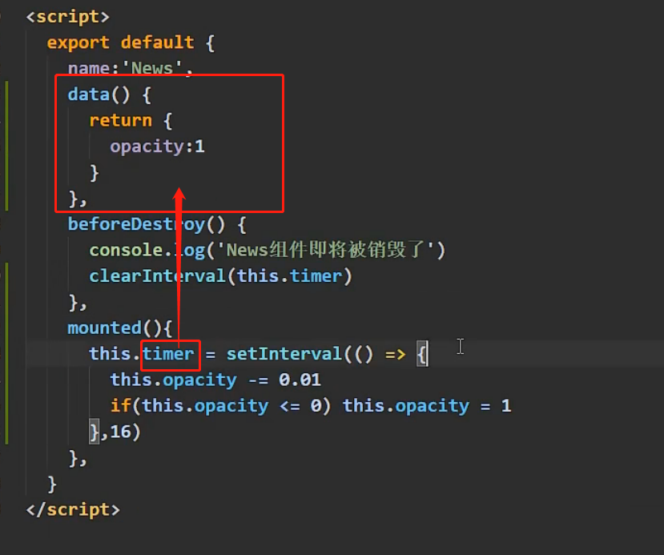

`timer`没有在`data`中声明，直接使用，==不会报错，但是，此时`timer`不是一个响应式的变量==

## ⑤生命周期钩子

- beforeCreate：此时==无法==通过vm访问到data中的数据、methods中的方法
- created：此时==可以==通过vm访问到data中的数据、methods中的方法
- beforeMounte：此时
  - 页面呈现的是==未经Vue编译==的DOM结构
  - 所有对DOM的操作，==最终==都不奏效（关于最终的解释：过程中会奏效，但是页面渲染结束后，之前对DOM的操作会被覆盖掉）
- mounted：此时
  - 页面中呈现的是==经过Vue编辑==的DOM
  - 对DOM的操作均有效（尽可能避免）
  - 至此，初始化过程结束。一般在此进行：==开启定时器任务==、==发送网络请求==、==订阅消息==、==绑定自定义事件==等初始化操作
- beforeUpdate：此时，==数据是新的，但页面是旧的==，即<span style="color: red">页面尚未和数据保持同步</span>。
- updated：此时，==数据是新的，页面也是新的==，即页面和数据保持同步
- beforeDestroy：
  - 此时，vm中所有的data、methods、指令等，都处于==可用==状态，==马上==要执行销毁过程
  - 一般在此进行：==关闭定时器==、==取消订阅任务==、==解绑自定义事件==等收尾工作
  - 该API的作用：完全销毁一个实例，清理它与其它实例的连接，解绑它的全部指令、自定义的事件监听器（<span style="color:red">DOM原生的监听不会被清理</span>）
- destroyed：此时，实例被完全销毁，一般来说，这个钩子函数用不到
- nextTick：在下一次DOM更新结束后执行其指定的回调
- activated：路由组件被激活时触发。当路由组件被`<keep-alive>`包裹时，可以在此==开启定时任务==（当然在mounted钩子中也可以）
- deactivated： 路由组件失活时触发。当路由组件被`<keep-alive>`包裹时，可以在此==关闭定时任务==

## ⑥ 其他相关知识

- nodejs
- ES6
- TS
- webpack


