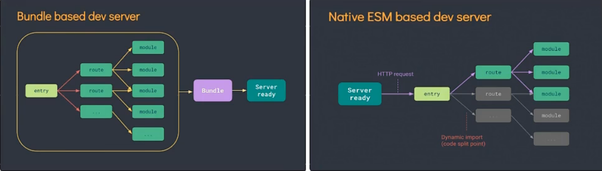
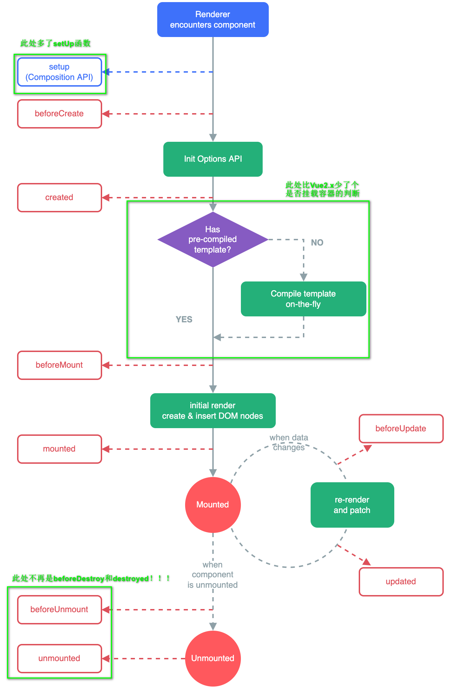
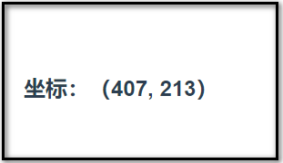
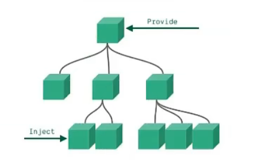

# Vue3快速入门
# 1.创建Vue3.0工程

## 1.1 使用vue-cli创建

==创建Vue3工程，需要保证@vue/cli的版本在4.5.0以上==

==官方文档：==https://cli.vuejs.org/zh/guide/creating-a-project.html

```sh
# 查看@vue/cli版本
vue -V
# 安装或升级@vue/cli
npm install -g @vue/cli
# 创建项目
vue create <project_name>(项目名)
# 创建过程中，选择vue3
# 启动项目
cd <project_name>
npm run serve
```

## 1.2使用vite创建

>vite简介

==vite官网：==https://vitejs.cn/

> 概念

新一代前端构建工具

> 优势

- 开发环境中，无需打包，可快速冷启动
- 轻量快速的热重载（HMR）
- 真正的按需编译，不再等待整个应用编译完成

> 传统构建与vite构建对比图



> 创建过程

```sh
# 创建工程
npm init vite-app <project_name>
# 首次使用vite-app，创建过程中需要安装，直接输入y回车即可
# 安装依赖
cd <project_name>
npm install # 或者使用‘yarn’命令
# 启动项目
npm run dev # 或者使用‘yarn dev’命令
```

## 1.3 分析工程结构

==以下分析均使用vue-cli创建的项目==

> main.js文件

```js
// 引入的不再是Vue构造函数了，而是一个名为createApp的工厂函数
import { createApp } from 'vue'
import App from './App.vue'

createApp(App).mount('#app')
/**
 * 以上代码可以进行如下拆解
 * ===================================
 * 创建应用实例对象--app(类似于vue2中的vm实例，但app比vm更“轻量”)
 * const app = createApp(App)
 * 挂载
 * app.mount('#app')
 * ====================================
 */
```

> App.vue文件

```vue
<template>
  <!-- Vue3组件中的模板结构可以没有根标签 -->
  
  <HelloWorld msg="Welcome to Your Vue.js App"/>
</template>
...
```

# 2.常用Composition API

## 2.1 拉开序幕的setup

> 什么是setup

- Vue3.0中一个新的==配置项==，值为一个函数。
- 是所有Composition API“表演的舞台”
- 组件中所用到的数据、方法等，均要配置在setup中

> setup函数的两种返回值

- 返回一个对象：对象中的属性、方法，在模板中均可直接使用（重点关注！！！）

  ```vue
  <template>
    <h2>人员信息</h2>
    <h4>姓名：{{name}}</h4>
    <h4>年龄：{{age}}</h4>
    <button @click="sayHello">sayHello</button>
  </template>
  
  <script>
  export default {
    name: 'App',
    // setup函数，返回一个对象（暂时不考虑响应式问题）
    setup() {
      // 定义数据
      let name = '张三'
      let age = 18
  
      // 定义方法
      function sayHello() {
        // 方法中使用变量时，前边不用再加“this.”
        alert(`我叫${name}, 今年${age}岁，你好啊~`)
      }
  
      // 将数据和方法包装成一个对象返回  
      return {
        name,
        age,
        sayHello
      }
    }
  }
  </script>
  ```

- 返回一个渲染函数：可以自定义渲染内容（了解）

  ```vue
  ...
  <script>
  import {h} from 'vue'
  
  export default {
    name: 'App',
    // setup函数，返回一个渲染函数
    setup() {
      // 和Vue2中vm的render配置项一致
      // h(param1, param2)参数说明：param1 标签， param2 标签内容
      return () => {return h('h1', 'Vue3学习')}
    }
  }
  </script>
  ```

  

> 注意事项

- 尽量不要与Vue2.x配置混用
  - Vue2.x配置（data、methods、computed...）可以访问到setup中的属性、方法
  - setup中不能访问到Vue2.x配置（data、methods、computed...）
  - 如果重名，setup优先
- setup不能是一个async函数，因为async函数返回值不再是return的对象，而是promise，模板看不到return对象中的属性（后期也可以返回一个Promise实例，但需要Suspense和异步组件的配合）

## 2.2 ref函数

> 作用

定义一个响应式数据

> 使用方法

- 声明变量：`let xxx = ref(initValue)`)(创建了一个包含响应式数据的<span style="color: red">引用对象（reference对象，简称ref对象）</span>)

  需要引入`ref`函数：`import {ref} from 'vue'`

- js中操作数据：`xxx.value`

- 模板中读取数据：`<div>xxx</div>`(不需要.value)

- 完整代码

  ```vue
  <template>
    <h1>人员信息</h1>
    <!-- 模板中读取数据 -->
    <h2>姓名：{{name}}</h2>
    <h2>年龄：{{age}}</h2>
    <h3>工作类型：{{job.type}}</h3>
    <h3>工作薪资：{{job.salary}}</h3>
    <button @click="changePersonInfo">修改人员信息</button>
  </template>
  
  <script>
  // 引入ref函数
  import {ref} from 'vue'
  
  export default {
    name: 'App',
    setup() {
      // 定义基本类型数据
      let name = ref('张三')
      let age = ref(18)
      // 定义一个对象
      let job = ref({
        type: '前端开发工程师',
        salary: '30K'
      })
  
      function changePersonInfo() {
        // 修改基本类型数据
        name.value = '李四'
        age.value = 48
        // 修改对象中的属性
        job.value.type = 'UI设计师'
        job.value.salary = '80K'
      }
  
      return {
        name,
        age,
        job,
        changePersonInfo
      }
    }
  }
  </script>
  
  <style>
  #app {
    font-family: Avenir, Helvetica, Arial, sans-serif;
    -webkit-font-smoothing: antialiased;
    -moz-osx-font-smoothing: grayscale;
    /* text-align: center; */
    color: #2c3e50;
    margin: 20px;
  }
  </style>
  
  ```

> 备注

- ref()接收的数据可以是基本类型，也可以是对象类型
- 基本类型的数据：响应式依然是靠`Object.defineProperty()`的`get`与`set`完成
- 对象类型的数据：内部“求助”了Vue3.0中的一个新函数---`reactive`函数

## 2.3 reactive函数

> 作用

定义一个==对象类型==的响应式数据

只能定义对象类型的数据，不能定义基本类型的数据

>语法

- 声明变量：`const 代理对象 = reactive(源对象)`

  需要引入`reactive`函数：`import {reactive} from 'vue'`

- JS使用：`console.log(代理对象)`

- 模板中使用：`<div>{{代理对象}}</div>`

==接收一个对象或数组，返回一个<span style="color: red; font-weight: 900">代理对象（Proxy的实例对象，简称proxy对象）</span>==

> 说明

- `reactive`定义的响应式数据是“深层次的”
- 内部基于ES6的Proxy实现，通过代理对象操作源对象内部数据进行操作

## 2.4 Vue3.0中的响应式原理

> vue2.x的响应式

- 实现原理

  - 对象类型：通过`Object.defineProperty()`对属性的读取、修改进行拦截（数据劫持）

    ```js
    Object.defineProperty(源对象, '属性名', {
        get() {...},
        set(value) {...}
    })
    ```

  - 数组对象：通过重写更新数组的一系列方法来实现拦截（对数据的变更方法进行包裹）

- 存在问题

  - 新增属性、删除属性，界面不会更新

    ```vue
    ...
    <script>
    export default {
      name: 'App',
      data() {
          return {
              person: {
                  name: '张三',
                  age: 18
              }
          }
      },
      methods: {
          addSex() {
              // 使用如下代码添加属性，界面不会更新
              this.person.sex = '男'
              // 解决方法：借助vue封装的API
              this.$set(this.person, 'sex', '男')
              // 或者直接使用Vue调用API
              Vue.set(this.person, 'sex', '男')
          },
          deleteName() {
              // 使用如下代码删除属性，界面不会更新
              delete this.person.name
               // 解决方法：借助vue封装的API
              this.$delete(this.person, 'name')
              // 或者直接使用Vue调用API
              Vue.delete(this.person, 'name')
          }
      }
    }
    </script>
    ...
    ```

  - 直接通过下标修改数组，界面 不会自动更新

    ```vue
    ...
    <script>
    export default {
      name: 'App',
      data() {
          return {
              hobbies: ['吃饭', '睡觉', '打豆豆']
          }
      },
      methods: {
          updateHobby() {
              // 使用如下方法修改第一个爱好，界面不会更新
              this.hobbies[0] = '狂阶'
              // 可以使用如下方法解决
              // 方法一：借助Vue的API
              this.$set(this.hobbies, 0, '逛街')
              // 或者使用Vue直接调用
              Vue.$set(this.hobbies, 0, '逛街')
              // 方法二：使用数组的变更方法（vue自己封装了的）
              this.hobbies.splice(0, 1, '逛街')
          }
      }
    }
    </script>
    ...
    ```

> Vue3.0响应式

- 实现原理

  - 通过Proxy（代理）：拦截对象中任意属性的变化，包括：属性值的读写、属性的添加、属性的删除等

  - 通过Reflect（反射）：对源对象的属性进行操作

    ```js
    new Proxy(源对象, {
        /**
        * 拦截读取属性值
        * @param target 源对象
        * @param prop 属性名
        */
        get(target, prop) {return Reflect.get(target, prop)},
        
        /**
        * 拦截设置属性值或添加新属性
        * @param target 源对象
        * @param prop 属性名
        */
        set(target, prop, value) {return Reflect.set(target, prop, value)},
        
        /**
        * 拦截删除属性
        * @param target 源对象
        * @param prop 属性名
        */
        deleteProperty(target, prop) {return Reflect.deleteProperty(target, prop)}
    })
    ```

## 2.5 setup的两个注意点

> setup执行时机

在beforeCreate之前执行一次，this是`undefined`

> setup参数

- props：值为对象，包含组件外部传递过来，且在组件内部<span style="color: red; font-weight: 900">声明接收</span>了的属性

  ```vue
  <!-- 父组件 -->
  <Demo msg="hello"></Demo>
  
  <!-- 子组件 -->
  <script>
  ...
  	props: ['msg'] // 只有在此处声明接收父组件传过来的属性，setup函数中的props才能获取到值
  	setup(props) {
      	console.log(props)
  	}
  ...
  </script>
  ```

- contetx：上下文对象，包含以下属性

  - attrs：值为对象，包含组件外部传递过来，但是props配置<span style="color: red; font-weight: 900">没有声明</span>的属性，相当于vue2.x中的`vm.$attrs`

  - slots：收到的插槽内容，相当于vue2.x中的`vm.$slots`

    <h6 style="color: red">Vue3.0使用具名插槽时，用 <span style="color: blue">v-slot:插槽名</span> 绑定具体插槽！！！</h6>

  - emit：分发自定义事件的函数，相当于vue2.x中的`vm.$emit`

    <h6 style="color: red">Vue3.0使用自定义事件时，如果没有声明接收，控制台会有警告，可以使用 <span style="color: blue">emits['自定义事件1', '自定义事件2', ...]</span> 来声明接收自定义事件！！！</h6>

## 2.6 reactive对比ref

- 从定义数据的角度对比
  - ref用来定义<span style="color: red; font-weight: 900">基本类型数据</span>
  - reactive用来定义<span style="color: red; font-weight: 900">对象或数组类型数据</span>
  - 备注：ref也可以用来定义<span style="color: red; font-weight: 900">对象或数组类型数据</span>，它内部会通过`reactive`转化为<span style="color: red; font-weight: 900">代理对象</span>
- 从原理的角度对比
  - ref通过`Object.defineProperty()`的`get`和`set`来实现响应式（数据劫持）
  - reactive通过使用<span style="color: red; font-weight: 900">Proxy</span>来实现响应式（数据劫持），并通过<span style="color: red; font-weight: 900">Reflect</span>操作<span style="color: orange; font-weight: 900">源对象</span>内部的数据

- 从使用的角度对比
  - ref定义的数据：js中操作数据<span style="color: red; font-weight: 900">需要</span>`.value`，模板中使用时<span style="color: red; font-weight: 900">不需要</span>`.value`
  - reactive定义的数据：在js和模板中操作和使用，<span style="color: red; font-weight: 900">均不需要</span>`.value`

## 2.7 计算函数computed

==与Vue2.x中computed配置功能一致==

> 使用方法

```js
// 引入
import { reactive, computed } from 'vue'
export default {
    name: 'Demo',
    props: ['msg'],
    setup() {
        let person = reactive({
            firstName: '张',
            lastName: '三'
        })

        // 计算属性，简单写法（只能读不能改）
        person.fullName = computed(() => {
            return person.firstName + '-' +person.lastName
        })

        // 计算属性，复杂写法（能读能改）
        person.fullName = computed({
            get() {
                return person.firstName + '-' + person.lastName
            },
            set(value) {
                const nameArr = value.split('-')
                person.firstName = nameArr[0]
                person.lastName = nameArr[1]
            }
        })

        return {
            person
        }
    }
}
```

## 2.8 监视函数watch

==与vue2.x中的watch配置共一致==

> 两个小“坑”：

- ==监视reactive定义的响应式数据时，oldValue无法正确获取，强制开启了深度监视（deep配置无效）==
- ==监视reactive定义的响应式数据中的某个属性（对象类型）时，deep配置有效==

> 语法

`watch(prop, function, config)`

- prop：要监视的变量
- function：(newValue, oldValue) => {}，变量发生变化时的回调
- config：是个对象，编写watch的一些配置，如{immediate: true; deep: true}，可以为空

> 具体代码

```js
export default {
    name: 'Demo',
    props: ['msg'],
    setup() {
        // 定义数据库
        let num = ref(0)
        let msg = ref('hello')
        let person = reactive({
            name: '张三',
            age: 18,
            job: {
                s1: {
                    salary: 20
                }
            }
        })

        // 监视器
        // 情况一：监视ref定义的一个响应式数据
        watch(num, (newValue, oldValue) => {
            console.log(`num发生了变化，新值是${newValue}，原来为${oldValue}`)
        },{immediate: true})

        // 情况二：监视ref定义的多个响应式数据
        watch([num, msg], (newValue, oldValue) => {
            console.log(`num或msg发生了变化，新值是${newValue}，原来为${oldValue}`)
        })

        /**
         * 情况三：监视reactive定义的一个响应式数据的全部属性
         * 1. 此处无法正确获取oldValue的值
         * 2. 强制开启了深度监视模式（deep配置无效）
         */
        watch(person, (newValue, oldValue) => {
            console.log('person发生了改变', newValue, oldValue)
        },{deep: false})

        /**
         * 情况四：监视reactive定义的一个响应式数据的某个属性
         * 此处可以拿到oldValue
         */
        watch(() => person.age, (newValue, oldValue) => {
            console.log('person.age发生了改变', newValue, oldValue)
        })

        /**
         * 情况五：监视reactive定义的一个响应式数据的某些属性
         * 此处可以拿到oldValue
         */
        watch([() => person.age, () => person.name], (newValue, oldValue) => {
            console.log('person.age或person.name发生了改变', newValue, oldValue)
        })

        /**
         * 特殊情况
         * 1. 此处拿不到oldValue
         * 2. 此处必须配置deep为true才可以监测到person.job的变化
         */
        watch(() => person.job, (newValue, oldValue) => {
            console.log('person.job发生了改变', newValue, oldValue)
        },{deep: true})


        return {
            num,
            msg,
            person
        }
    }
}
```

## 2.9 监视函数watchEffect

> 和watch的对比

- watch既要指明监视的属性，也要指明监视的回调
- watchEffect不用指明监视的属性，监视回调函数中用到哪个属性，就会监视哪个属性

> 和computed的对比

watchEffect有点像computed，但二者有如下区别：

- computed注重的是计算出来的值（回调函数的返回值），所以必须要写返回值
- watchEffect更注重的是过程（回调函数的函数体），所以不用写返回值

> 语法

`watchEffect(() => {})`

> 具体代码

```js
export default {
    name: 'Demo',
    props: ['msg'],
    setup() {
        // 定义数据库
        let num = ref(0)
        let msg = ref('hello')
        let person = reactive({
            name: '张三',
            age: 18,
            job: {
                s1: {
                    salary: 20
                }
            }
        })

        // 监视器
        // 回调函数中用到了num和person.job.s1.salary，所以只要这俩值一发生变化，watchEffect的回调就会被触发
        watchEffect(() => {
            const x1 = num.value;
            const x2 = person.job.s1.salary
            console.log('watchEffect执行了')
        })


        return {
            num,
            msg,
            person
        }
    }
}
```

## 2.10 生命周期



> 注意

Vue3.0可以继续使用Vue2.x中的生命周期钩子，但有两个被更名：

- `beforeDestroy`改名为`beforeUnmount` 
- `destroyed`改名为`unmounted` 

> Vue3.0中Composition API形式的生命周期钩子，与Vue3.0中钩子对应如下

- `beforeCreate`===>`setUp()`
- `created`===>`setUp()`
- `beforeMount`===>`onBeforeMount`
- `mounted`===>`onMounted`
- `beforeUpdate`===>`onBeforeUpdate`
- `updated`===>`onUpdated`
- `beforeUnmount`===>`onBeforeUnmount`
- `unmounted`===>`onUnmounted`

## 2.11 自定义hook函数

> 概念

- hook本质是一个函数，把setup函数中使用的Composition API进行了封装
- 类似于vue2.x中的mixin
- 自定义hook的优势：复用代码，让setup中的逻辑更清晰易懂
- 个人理解：抽取setup中的可以实现某个具体功能的代码，简化setup中的代码，同时也方便后期实现代码的复用

> 具体例子

==需求：获取鼠标点击的点的坐标==

步骤如下：

- 创建`src/hooks`文件夹，自定义的hook函数都存放在该路径下

- 在`src/hooks`文件夹下，创建`usePoint.js`文件(<span style="color: orange; font-weight: 600">一般hook函数的js文件命名方式均为useXXX.js</span>)

- 在`usePoint.js`文件中编写函数实现逻辑，并将函数暴露出去，代码如下：

  ```js
  import { reactive, onMounted, onBeforeUnmount} from 'vue'
  export default function() {
      // 数据：鼠标点击的点的坐标
      let point = reactive({
          x: 0,
          y: 0
      })
  
      // 方法：获取鼠标点击的点的坐标
      function getPoint(event) {
          point.x = event.pageX
          point.y = event.pageY
      }
  
      // 生命周期钩子：页面挂载时触发
      onMounted(() => {
          window.addEventListener('click', getPoint)
      })
  
      // 生命周期钩子：页面卸载时触发
      onBeforeUnmount(() => {
          window.removeEventListener('click', getPoint)
      })
  
      // 返回坐标
      return point
  }
  ```

- 使用`usePoint.js`中的函数

  ```vue
  <template>
    <!-- 显示点的坐标 -->
    <h2>坐标：（{{point.x}}, {{point.y}}）</h2>
  </template>
  
  <script>
  // 引入hook函数usePoint 
  import usePoint from '../hooks/usePoint'
  export default {
      name: 'Demo',
      props: ['msg'],
      setup() {
          // 使用usePoint，并拿到点的坐标
          let point = usePoint()
  
          return {
              num,
              point
          }
      }
  }
  </script>
  ```

- 最终效果如下

  

## 2.10 toRefs

> 作用

创建一个ref对象，其value值指向另一个对象中的某个属性

> 语法

`const name = toRef(对象变量, '变量属性名')`

> 应用

要将响应式对象中的某个属性单独提供给外部使用时

> 扩展

`toRefs`和`toRef`功能一致，但可以批量创建多个ref对象，语法：`toRefs(对象变量)`

==备注：==可以借助`toRefs`函数，简化模板编码

```vue
<template>
  <!-- 页面中使用person的属性时，可以不再加'person.' -->
  <h2>用户信息</h2>
  <h3>姓名：{{name}}</h3>
  <h3>年龄：{{age}}</h3>
  <h3>性别：{{sex}}</h3>
  <h3>爱好：{{hobbies}}</h3>
  <h3>手机号：{{phone}}</h3>
  <h3>家庭住址：{{familyAddress}}</h3>
  <h3>学校名称：{{collage}}</h3>
  <h3>所学专业：{{major}}</h3>
</template>

<script>
import { reactive, toRefs } from '@vue/reactivity'
export default {
    name: 'Demo',
    setup() {
        // 定义数据库
        let person = reactive({
            name: '张三',
            age: 18,
            sex: '男',
            hobbies: ['吃饭', '睡觉'],
            phone: '130XXXXXXXX',
            familyAddress: '山东省济南市XXXX',
            collage: '山东大学',
            major: '会计'
        })

        return {
            ...toRefs(person) // 此处使用了toRefs()组合API
        }
    }
}
</script>
```

# 3.其他Composition API

## 3.1 shallowReactive与shallowRef

>shallowReactive

只处理对象最外层属性的响应式（浅响应式）

>shallowRef

只处理基本数据类型的响应式，不进行对象的响应式处理

> 语法

```js
let person1 = shallowRef({...})
let person2 = shallowReactive({...})
```

> 使用场景

- shallowReactive：当一个对象结构比较深，但是只有外层属性才会发生变化
- shallowRef：如果一个对象有数据，后续功能不会修改该对象中的属性，而是生成新的对象来替换

## 3.2 readonly与shallowReadonly

> readonly

让一个响应式的数据变为只读（深只读）

>shallowReadonly

让一个响应式数据变为只读（浅只读）

> 语法

```js
// 定义响应式变量
let person = reactive({...})
// 深只读
person = readonly(person)
// 浅只读
person = shallowReadonly(person)
```

> 应用场景

不希望数据被修改时

> 注意事项

readonly与shallowReadonly也可以用来定义数据，但是定义出来的数据不是响应式的。如果想让响应式的数据变为只读，只能先用ref或reactive定义数据，然后再用readonly或者shallowReadonly定义数据变为只读。

## 3.3 toRaw与markRow

> toRaw

- 作用：将一个由`reactive`生成的<span style="color: orange; font-weight: 900">响应式对象</span>转为<span style="color: orange; font-weight: 900">普通对象</span>

- 使用场景：用于读取响应式对象对应的普通对象，对这个普通对象的操作，不会引起页面刷新

- 语法

  ```js
  let person = reactive({...})
  const p = toRaw(person)
  // 之后对p做的修改，不会引起页面变化
  ```

> markRow

- 作用：标记一个对象，使其永远不会再成为响应式对象

- 使用场景：

  - 1.有些值不应该被设置为响应式的，例如复杂的第三方类库
  - 2.当渲染具有不可变数据源的大列表时，跳过响应式转换可以提高性能

- 语法：

  ```js
  let person = markRow({...})
  ```

## 3.4 customRef

> 作用

创建一个自定义的ref，并对其依赖项跟踪和更新触发进行显示控制

> 语法

```js
/**
* @param trace 函数，通知Vue追踪value的变化。在get()中直接调用即可
* @param trigger 函数， 通知Vue重新解析模板。在set()中直接调用即可
* @return 返回值是一个对象。该对象包含get()(用来获取数据)、set()(用来修改数据)方法 
*/
customRef((trace, trigger) => {
    return {
        // 获取数据
        get() {
            trace() // 通知Vue追踪value的变化
            return value
        },
        // 修改数据
        set(newValue) {
            clearTimeout(timer) //每次进来先清除一下定时器，防止页面抖动
            timer = setTimeout(() => {
                value = newValue
                trigger() // 通知Vue重新解析模板
            }, delay);
        }
    }
})
```

> 栗子：自定义ref，实现防抖效果

```vue
<template>
  <input type="text" v-model="keyWord">
  <h3>{{keyWord}}</h3>
</template>

<script>
import {customRef} from 'vue'

export default {
  name: 'App',
  setup() {
    let keyWord = myRef('hello', 1000) 

    // 自定义ref
    function myRef(value, delay) {
      let timer; // 定时器id
      return customRef((trace, trigger) => {
        return {
          // 获取数据
          get() {
            trace() // 通知Vue追踪value的变化
            return value
          },
          // 修改数据
          set(newValue) {
            clearTimeout(timer) //每次进来先清除一下定时器，防止页面抖动
            timer = setTimeout(() => {
              value = newValue
              trigger() // 通知Vue重新解析模板
            }, delay);
          }
        }
      })
    }
    return {
      keyWord,
      myRef
    }
  }
}
</script>

<style>
#app {
  font-family: Avenir, Helvetica, Arial, sans-serif;
  -webkit-font-smoothing: antialiased;
  -moz-osx-font-smoothing: grayscale;
  /* text-align: center; */
  color: #2c3e50;
  margin: 20px;
}
</style>

```

## 3.5 provide与inject



> 作用

实现==祖组件与后代组件间==通信

> 语法

组组件中用`provide`选项提供数据，后代组件用`inject`选线来接收数据

> 语法

- 祖组件：

  ```js
  setup() {
  	...
      let car = reactive({name: '比亚迪·汉', price: '25W'})
      /**
      * 使用provide提供数据
      * 第一个参数：要传递的数据的名。inject函数使用该值来接收参数
      * 第二个参数：要传递的数据的值
      */
      provide('car', car)
      ...
  }
  ```

- 后代组件：

  ```js
  setup() {
     ...
     /**
     * 使用inject接收数据
     * 参数 祖组件中provide函数的第一个参数的值
     */
     let car = inject('car')
      ...
  }
  ```

## 3.6 响应式数据的判断

- isRef：检查一个值是否为一个`ref`对象
- isReactive ：检查一个对象是否是由`reactive`创建的响应式代理
- isReadonly：检查一个对象是否是由`readonly`创建的只读代理
- isProxy：检查一个对象是否是由`reactive`或者`readonly`创建的代理

# 4.Composition API的优势

> Options API 存在的问题

使用传统Options API时，新增或者修改一个需求，就需要在data、methods、computed等中分别进行修改

> Composition API的优势

可以自定义hook函数，更加优雅的组织代码，让功能相关的数据和函数更加有序的组织在一起

# 5.新的组件

## 5.1 Fragment

- 在vue2中：组件必须有一个根标签
- 在Vue3中：组件可以没有根标签。当不写根标签时，vue会将多个标签包含在一个Fragment虚拟元素中
- 好处：减少标签层级，减少内存占用（理论上）

## 5.2 teleport

==`teleport`是将组件html结构移动到指定位置==

```vue
<!-- to的值可以是html标签（如html、body），也可以是css选择器 -->
<teleport to='指定位置' >
	<!-- html结构 -->
</teleport>xxxxxxxxxx <<teleport to='' >        <!-- html结构 -->    </teleport>
```

## 5.3 Suspense

> 使用场景

等待<span style="color: red">异步组件</span>时渲染一些额外内容，让应用有更好的用户体验

> 使用步骤

- 异步引入组件

  ```js
  import {defineAsyncComponent} from 'vue'
  let Son = defineAsyncComponent(()=>import('./components/Son'))
  ```

- 使用`Suspense`包裹组件，并配置好`default`和`fallback`插槽

  - default：默认插槽。组件往这里边放
  - fallback：由于各种原因，插槽未加载出来的提示信息往这里边放

  ```vue
  <Suspense>
      <template v-slot:default>
  		<Son/>
      </template>
      <template v-slot:fallback>
  		加载中，请稍后
      </template>
  </Suspense>
  ```

> 完整栗子

- APP 组件

  ```vue
  <template>
    <div class="app">
      <h2>我是APP组件</h2>
      <Suspense>
        <template v-slot:default>
          <Son/>
        </template>
        <template v-slot:fallback>
          加载中，请稍后
        </template>
      </Suspense>
    </div>
  </template>
  
  <script>
  import {defineAsyncComponent} from 'vue'
  let Son = defineAsyncComponent(()=>import('./components/Son'))
  
  export default {
    name: 'App',
    components: {Son},
    
  }
  </script>
  
  <style>
  .app {
   background-color: gray;
   padding: 10px;
  }
  </style>
  
  ```

- Son组件

  ```vue
  <template>
    <div class="son">
      我是子组件
      {{sum}}
    </div>
  </template>
  
  <script>
  import { ref } from 'vue';
      import Grandson from './Grandson.vue';
      export default {
          name: 'Son',
          components: {Grandson},
          // 为了使组件延迟加载，setup返回值是一个Promise对象
          async setup() {
              let sum = ref(0)
              let p = new Promise((resolve, reject) => {
                  setTimeout(() => {
                      resolve({sum})
                  }, 3000);
              })
  
              return await p
          }
      }
  </script>
  
  <style scpoed>
  .son {
      background-color: aquamarine;
      padding: 10px;
      margin-top:10px;
  }
  </style>
  ```


# 6.Vue3.0和Vue2.x对比

- ==全局API的转移==

  Vue3.0将Vue2.x中的全局API（Vue.xxx）调整到了应用实例（app）上

  | Vue2.x全局API（Vue）     | Vue3.0实例API（app）                     |
  | ------------------------ | ---------------------------------------- |
  | Vue.config.xxx           | app.config.xxx                           |
  | Vue.config.productionTip | **<span style="color: red">移除</span>** |
  | Vue.component            | app.component                            |
  | Vue.directive            | app.directive                            |
  | Vue.mixin                | app.mixin                                |
  | Vue.use                  | app.use                                  |
  | Vue.prototype            | app.config.globalProperties              |

- ==data选项应始终被声明为一个函数==

- ==过渡（动画）类名的改变==

  | Vue2.x     | Vue3.0                                           |
  | ---------- | ------------------------------------------------ |
  | v-enter    | **<span style="color: red">v-enter-from</span>** |
  | v-leave-to | v-leave-to                                       |
  | v-leave    | **<span style="color: red">v-leave-from</span>** |
  | v-enter-to | v-enter-to                                       |

- ==移除keyCode作为v-on的修饰符，同时也不再支持config.keyCode==

- ==移除v-on.native修饰符，自定义事件用emits属性配置==

  - 父组件中绑定事件

    ```vue
    <my-component 
                  v-on:close = "handleComponentEvent"
                  v-on:click = "handleNativeClickEvent"
    />
    ```

  - 子组件中声明自定义事件

    ```js
    export default {
        ...
        emits: ['close']
        ...
    }
    ```

- ==移除过滤器filter==

  过滤器虽然看起来方便，但它需要一个自定义语法，打破大括号内表达式“只是JavaScript”的假设，这不仅有学习成本，还有实现成本！  **<span style="color: red">建议用方法调用或者计算属性去替换过滤器。</span>**