# Docker 进阶

## Docker Compose

`[DaoCloud | Docker 极速下载](http://get.daocloud.io/)`

### 简介

通过YAML文件，定义、运行多个容器。

> 使用Docker Compose的三步骤：

1.定义Dockerfile文件。

2.编写docker-compose.yaml文件

3.启动项目

> 狂神说

Compose是Docker官方开源项目，需要安装！

Compose重要概念：

- 服务Services：单个的容器/应用
- 项目Project：一组关联的容器

`大神福利看`

### 安装

1.下载

可以在http://get.daocloud.io/ 网站中找到国内下载地址

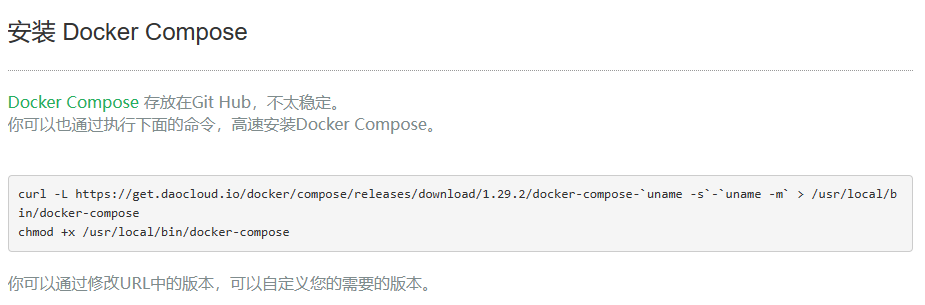

```shell
curl -L https://get.daocloud.io/docker/compose/releases/download/1.29.2/docker-compose-`uname -s`-`uname -m` > /usr/local/bin/docker-compose
```

2.授权

```shell
chmod +x /usr/local/bin/docker-compose
```

3.验证是否安装成功

```shell
docker-compose --version
```

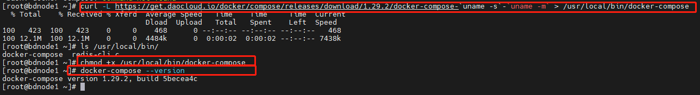

### 体验

- 官方python计数器应用。[Get started with Docker Compose | Docker Documentation](https://docs.docker.com/compose/gettingstarted/)
- 搭建WordPress博客应用。[Quickstart: Compose and WordPress | Docker Documentation](https://docs.docker.com/samples/wordpress/)


## Docker Swarm

[How nodes work | Docker Documentation](https://docs.docker.com/engine/swarm/how-swarm-mode-works/nodes/)

### 安装

```shell
# 准备好4台虚拟机（centos7.8系统），3台用作master节点（10.1.93.40, 10.1.93.42, 10.1.93.43），一台用作node节点（10.1.93.44）

# 关闭虚拟机防火墙
[root@localhost ~]# systemctl stop firewalld
# 开机不启动防火墙
[root@localhost ~]# systemctl disable firewalld
Removed symlink /etc/systemd/system/multi-user.target.wants/firewalld.service.
Removed symlink /etc/systemd/system/dbus-org.fedoraproject.FirewallD1.service.

# 设置主机名分别为master1、master2、master3、node（以master1为例）
[root@localhost ~]# hostnamectl set-hostname master1
[root@localhost ~]# hostname
master1


# 查看docker swarm 帮助文档
[root@localhost ~]# docker swarm --help

Usage:  docker swarm COMMAND

Manage Swarm

Commands:
  ca          Display and rotate the root CA
  init        Initialize a swarm # 初始化docker swarm
  join        Join a swarm as a node and/or manager # 在docker swarm集群中假如一个node（工作）节点或者manager（管理）节点
  join-token  Manage join tokens # 管理加入swarm集群的token
  leave       Leave the swarm # 离开swarm集群
  unlock      Unlock swarm
  unlock-key  Manage the unlock key
  update      Update the swarm

Run 'docker swarm COMMAND --help' for more information on a command.

# 查看swarm初始化命令的帮助文档
[root@localhost ~]# docker swarm init --help

Usage:  docker swarm init [OPTIONS]

Initialize a swarm

Options:
      --advertise-addr string                  Advertised address (format: <ip|interface>[:port])  # 节点的ip
      --autolock                               Enable manager autolocking (requiring an unlock key to start a stopped manager)
      --availability string                    Availability of the node ("active"|"pause"|"drain") (default "active")
      --cert-expiry duration                   Validity period for node certificates (ns|us|ms|s|m|h) (default 2160h0m0s)
      --data-path-addr string                  Address or interface to use for data path traffic (format: <ip|interface>)
      --data-path-port uint32                  Port number to use for data path traffic (1024 - 49151). If no value is set or is set to 0, the default port (4789) is used.
      --default-addr-pool ipNetSlice           default address pool in CIDR format (default [])
      --default-addr-pool-mask-length uint32   default address pool subnet mask length (default 24)
      --dispatcher-heartbeat duration          Dispatcher heartbeat period (ns|us|ms|s|m|h) (default 5s)
      --external-ca external-ca                Specifications of one or more certificate signing endpoints
      --force-new-cluster                      Force create a new cluster from current state
      --listen-addr node-addr                  Listen address (format: <ip|interface>[:port]) (default 0.0.0.0:2377)
      --max-snapshots uint                     Number of additional Raft snapshots to retain
      --snapshot-interval uint                 Number of log entries between Raft snapshots (default 10000)
      --task-history-limit int                 Task history retention limit (default 5)
[root@localhost ~]# ip a s
1: lo: <LOOPBACK,UP,LOWER_UP> mtu 65536 qdisc noqueue state UNKNOWN group default qlen 1000
    link/loopback 00:00:00:00:00:00 brd 00:00:00:00:00:00
    inet 127.0.0.1/8 scope host lo
       valid_lft forever preferred_lft forever
    inet6 ::1/128 scope host
       valid_lft forever preferred_lft forever
2: enp0s3: <BROADCAST,MULTICAST,UP,LOWER_UP> mtu 1500 qdisc pfifo_fast state UP group default qlen 1000
    link/ether 08:00:27:12:b7:b0 brd ff:ff:ff:ff:ff:ff
    inet 10.1.93.12/24 brd 10.1.93.255 scope global noprefixroute dynamic enp0s3
       valid_lft 28641sec preferred_lft 28641sec
    inet 10.1.93.40/24 brd 10.1.93.255 scope global secondary noprefixroute enp0s3
       valid_lft forever preferred_lft forever
    inet6 fe80::8f66:341c:c632:dbe/64 scope link tentative noprefixroute dadfailed
       valid_lft forever preferred_lft forever
    inet6 fe80::11b0:6c7b:f3d5:528/64 scope link tentative noprefixroute dadfailed
       valid_lft forever preferred_lft forever
    inet6 fe80::a259:11c5:d707:87d6/64 scope link tentative noprefixroute dadfailed
       valid_lft forever preferred_lft forever
3: docker0: <NO-CARRIER,BROADCAST,MULTICAST,UP> mtu 1500 qdisc noqueue state DOWN group default
    link/ether 02:42:13:36:ad:88 brd ff:ff:ff:ff:ff:ff
    inet 172.17.0.1/16 brd 172.17.255.255 scope global docker0
       valid_lft forever preferred_lft forever
       
# 初始化swarm集群
[root@localhost ~]# docker swarm init --advertise-addr 10.1.93.40
Swarm initialized: current node (u0bt4gq1cjcbrr5sm75w7btmg) is now a manager. # swarm初始化，当前节点是一个manager节点

To add a worker to this swarm, run the following command: # 如果想要加入一个worker（工作）节点，就执行下面的命令

    docker swarm join --token SWMTKN-1-0sal3yuz8pf9fqku0q284jpwonbulc1auelurkcikqhyqhk91q-bp090fqdn83y8tu0340xjty5n 10.1.93.40:2377

To add a manager to this swarm, run 'docker swarm join-token manager' and follow the instructions. # 如果想要加入一个manager节点，执行该命令来获取令牌。

# 获取worker节点令牌 docker swarm join-token worker

# 获取manager节点令牌 docker swarm join-token manager


# 加入node节点（在node节点中执行）
[root@localhost ~]# docker swarm join --token SWMTKN-1-0sal3yuz8pf9fqku0q284jpwonbulc1auelurkcikqhyqhk91q-bp090fqdn83y8tu0340xjty5n 10.1.93.40:2377
This node joined a swarm as a worker.
# 查看node节点是否加入成功（在master1节点中执行）
root@localhost ~]# docker node ls
ID                            HOSTNAME   STATUS    AVAILABILITY   MANAGER STATUS   ENGINE VERSION
u0bt4gq1cjcbrr5sm75w7btmg *   master1    Ready     Active         Leader           20.10.8
ygfjk8z1o38ojxcp9bmh8djxs     node       Ready     Active                          20.10.8
# 新增node，node节点加入成功

# 加入manager节点
# 获取manager节点令牌（在master节点中执行）
[root@localhost ~]# docker swarm join-token manager
To add a manager to this swarm, run the following command:

    docker swarm join --token SWMTKN-1-0sal3yuz8pf9fqku0q284jpwonbulc1auelurkcikqhyqhk91q-5ruytdhj863jahojyzd0h031g 10.1.93.40:2377
# 加入master2（在master2中执行）
[root@localhost ~]# docker swarm join --token SWMTKN-1-0sal3yuz8pf9fqku0q284jpwonbulc1auelurkcikqhyqhk91q-5ruytdhj863jahojyzd0h031g 10.1.93.40:2377
This node joined a swarm as a manager.
# 加入master3（在master3中执行）
[root@localhost ~]# docker swarm join --token SWMTKN-1-0sal3yuz8pf9fqku0q284jpwonbulc1auelurkcikqhyqhk91q-5ruytdhj863jahojyzd0h031g 10.1.93.40:2377
This node joined a swarm as a manager.
# 查看manager节点是否加入成功（在master1节点中执行）
[root@localhost ~]# docker node ls
ID                            HOSTNAME   STATUS    AVAILABILITY   MANAGER STATUS   ENGINE VERSION
u0bt4gq1cjcbrr5sm75w7btmg *   master1    Ready     Active         Leader           20.10.8
eumyzjkk6y8hy3qiw1fdiu6nm     master2    Ready     Active         Reachable        20.10.8
jjcybt4dhej1tfl9zmhatnvzi     master3    Ready     Active         Reachable        20.10.8
ygfjk8z1o38ojxcp9bmh8djxs     node       Ready     Active                          20.10.8
# 新增master2， master3，两个master节点加入成功
# 至此，集群搭建完毕
# 只有管理节点才能执行docker swarm命令.
```


### Raft协议

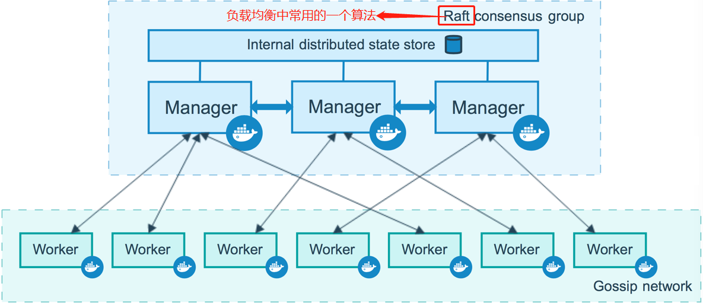


> 定义：保证大多数节点存活才可以使用。

如果两主两从，挂了一个主节点，另外一个主节点也不能用了。

如果三住一从，挂了一个主节点，另外两个可以使用；如果挂了两个主节点，另外一个也不能用了。


### 体会

可以类比k8s。

命令：`docker service`

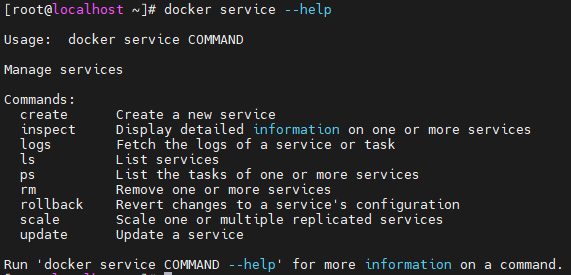

#### 创建服务

```shell
# 启动nginx服务
[root@localhost ~]# docker service create -p 8888:80 --name my-nginx nginx
3ab10q4uk6ujhiukrelj8i804
overall progress: 1 out of 1 tasks
1/1: running   [==================================================>]
verify: Service converged

# 查看服务列表
[root@localhost ~]# docker service ls
ID             NAME       MODE         REPLICAS   IMAGE          PORTS
3ab10q4uk6uj   my-nginx   replicated   1/1        nginx:latest   *:8888->80/tcp

# 查看服务运行状态
[root@localhost ~]# docker service ps my-nginx
ID             NAME         IMAGE          NODE      DESIRED STATE   CURRENT STATE           ERROR     PORTS
89duy7m0qs22   my-nginx.1   nginx:latest   master1   Running         Running 4 minutes ago
```

> dokcer run 和 docker service 对比：

- docker run：容器启动，单机版，不具有扩缩容功能
- docker service：服务启动，集群操作，具有扩缩容功能

==docker swarm创建的服务随机分配到各个节点上，包括master节点和node节点==

> 副本服务与全局服务

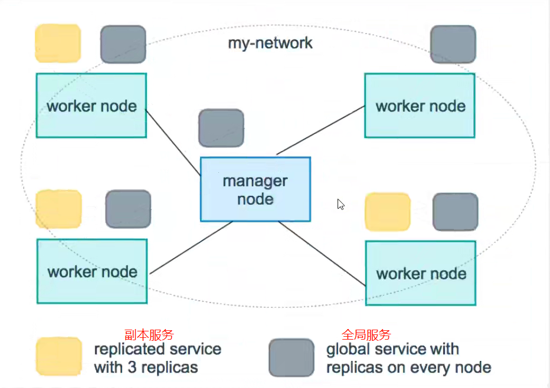

- 副本服务：只运行在worker节点上
- 全局服务：既可运行在worker节点上，又可运行在manager节点上。默认为全局服务

==可以使用--mode设置服务规则==

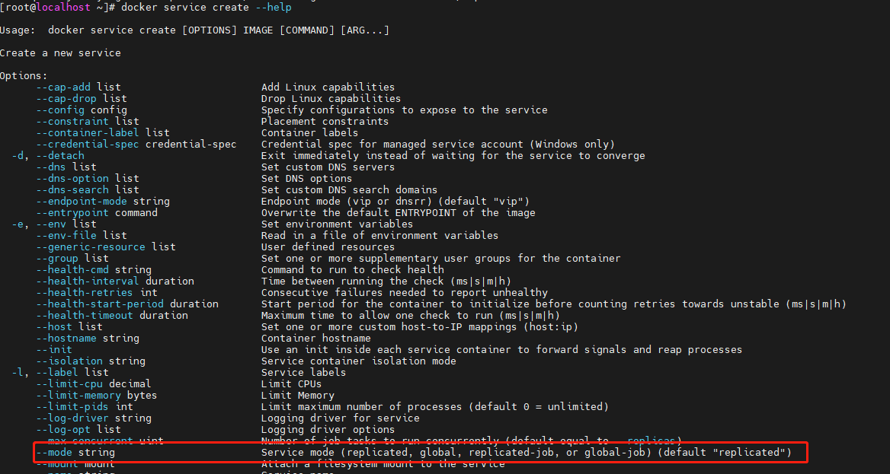

#### 动态扩缩容

> 两种方法

- docker service update --replicas 
- docker service scale 

```shell
# 使用 docker service update --replicas 将my-nginx扩展为3个副本
[root@localhost ~]# docker service update --replicas 3 my-nginx
my-nginx
overall progress: 3 out of 3 tasks
1/3: running   [==================================================>]
2/3: running   [==================================================>]
3/3: running   [==================================================>]
verify: Service converged

# 查看服务列表
[root@localhost ~]# docker service ls
ID             NAME       MODE         REPLICAS   IMAGE          PORTS
3ab10q4uk6uj   my-nginx   replicated   3/3        nginx:latest   *:8888->80/tcp

# 使用docker service scale 将my-nginx扩展为5个副本
[root@localhost ~]# docker service scale my-nginx=5
my-nginx scaled to 5
overall progress: 5 out of 5 tasks
1/5: running   [==================================================>]
2/5: running   [==================================================>]
3/5: running   [==================================================>]
4/5: running   [==================================================>]
5/5: running   [==================================================>]
verify: Service converged

# 查看服务列表
[root@localhost ~]# docker service ls
ID             NAME       MODE         REPLICAS   IMAGE          PORTS
3ab10q4uk6uj   my-nginx   replicated   5/5        nginx:latest   *:8888->80/tcp
```

 

动态更新

灰度发布（金丝雀发布）

### 概念

> task：容器内的命令，细节任务！

一个service可创建多个副本，每个副本都是一个task任务，每个task任务中运行一个容器。

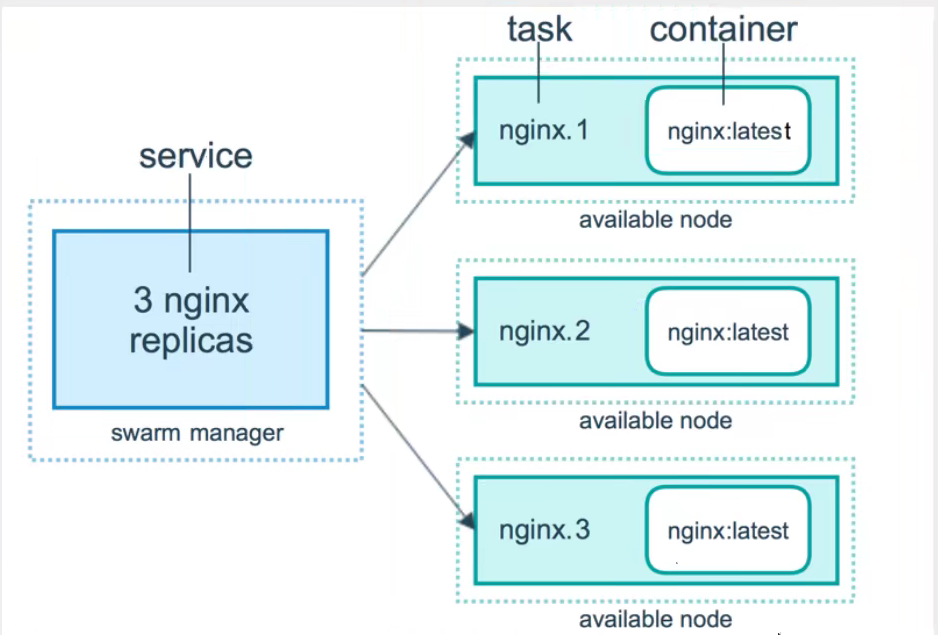

### 内部原理

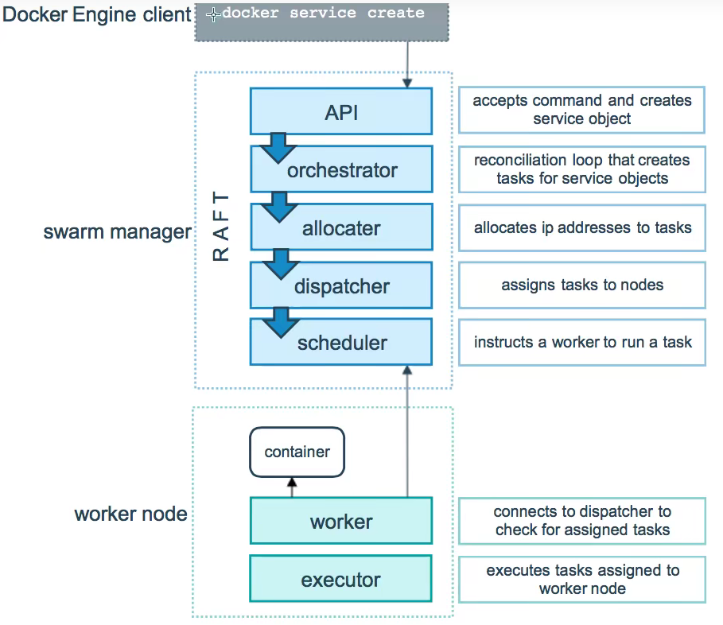

### 网络模式

- Overlay：使得各个节点能够ping通，变成一个集群。

- ingress：特殊的Overlay，具有负载均衡的功能。

  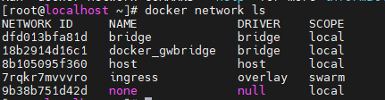

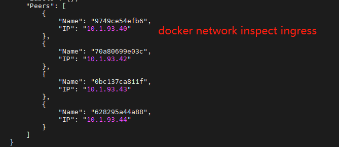


## Docker Stack

docker-compose 单击部署项目。

Docker Stack 集群部署项目。

```shell
# 单击部署
docker-compose up -d wordpress

# 集群部署
docker stack deploy wordpress.yaml
```


## Docker Secret

安全！配置密码，证书

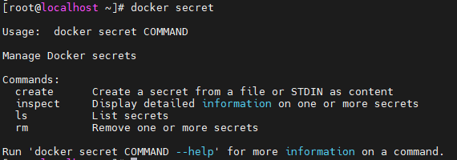


## Docker Config

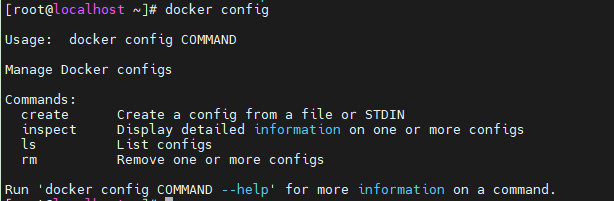


## 扩展到K8S

**云原生时代**

超过10台服务器，首选k8s，而非docker swarm！

先掌握go语言，在学习k8s会更好。

java就是用go语言写的。

go的效率接近于c语言。
