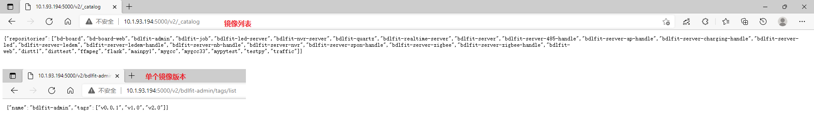

# docker搭建私有镜像仓库

## 1.下载镜像仓库镜像，并启动镜像仓库容器

```shell
# 下载镜像
docker pull registry
# 运行容器
docker run -d -p 5000:5000 --name registry docker.io/registry
```

## 2.虚拟机配置私有仓库地址

```shell
# 编辑daemon.json
vim /etc/docker/daemon.json
# 给insecure-registries 参数加上镜像仓库地址及端口号
"insecure-registries": ["110.1.93.194:5000"]
```

## 3.虚拟机重启docker

```shell
# 重新装载配置
systemctl daemon-reload
# 重启docker
systemctl restart docker
```

## 4.搭建成果展示



