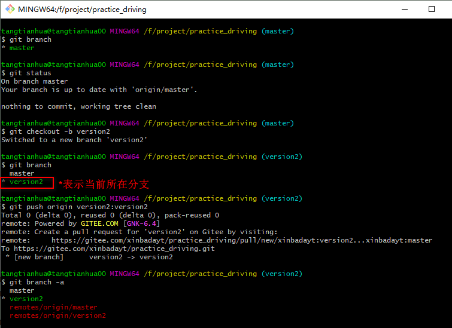

# gitlab 常用命令

## 1 本地创建分支并推送到远程

* 首先需要确保本地已有分支是干净的，没有需要commit的。可以使用`git status` 查看

* 新建本地分支
    ```shell script
     git checkout -b 本地分支名
    ```
* 查看一下本地分支
    ```shell script
      git branch
    ```
* 将本地分支推送到远程
    ```shell script
      git push origin 本地分支名:远程分支名
    ```
* 查看所有分支
    ```shell script
      git branch -a
    ```
> 举例


 
## 2 删除本地分支

```shell script
git branch -d 分支名
```

## 3 删除远程分支
* 方法一：向远程分支推送一个空分支
    ```shell script
      git push origin :远程分支名
    ```
* 方法二：使用delete删除
    ```shell script
      git push origin --delete 远程分支名
    ```
