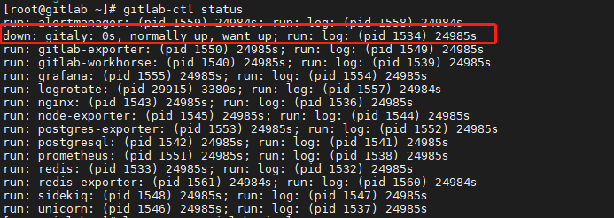
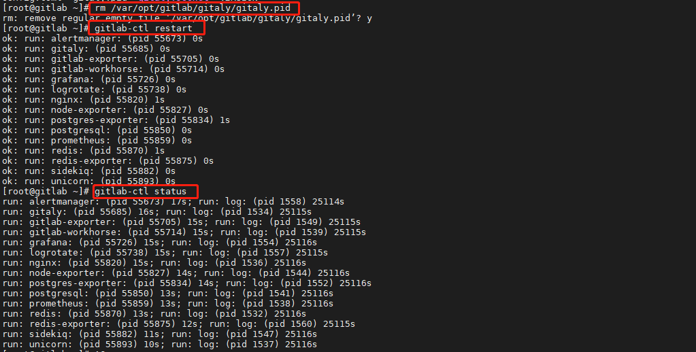

# gitlab 报错
## 1 gitlab报503错误

> 报错描述

 

> 解决步骤：

1.查看gitlab状态

```shell
gitlab-ctl status
```



2.从1中看到是gitaly down了，删掉/var/opt/gitlab/gitaly/gitaly.pid文件，重启即可

```shell
#删掉/var/opt/gitlab/gitaly/gitaly.pid文件
rm /var/opt/gitlab/gitaly/gitaly.pid
#重启gitlab
gitlab-ctl restart
#再次查看gitlab状态
gitlab-ctl status
```

