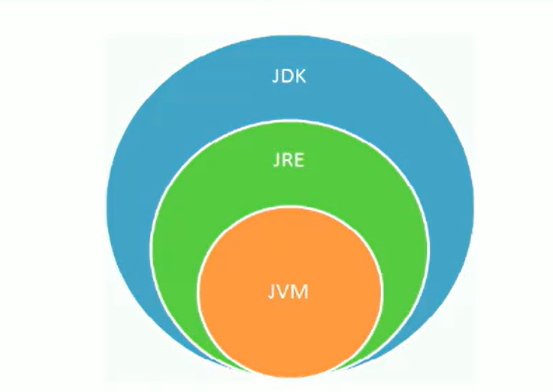

# 1 Java语言概述

### 1.1 JDK 、JRE、JVM的关系

> JDK（Java Development Kit ）

即Java开发工具包。

JDK = JRE + Java开发工具（包括编译工具javac.exe、运行工具java.exe、文档工具javadoc.exe、打包工具jar.exe等）

> JRE（Java Runtime Environment ）

即Java运行时环境。

JRE = JVM + Java核心类库

>JDK 、JRE、JVM的关系

