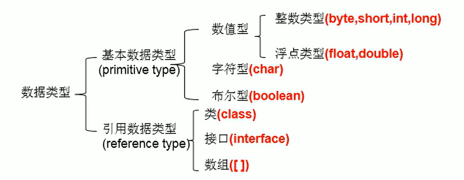
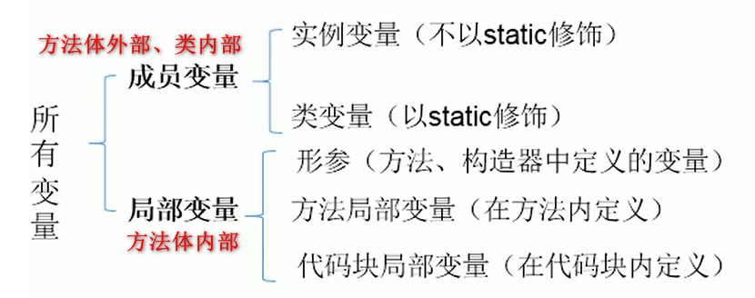

# 2 Java基本语法
## 2.1 变量的分类

> 按照数据类型分



- 基本数据类型

  | 类型    | 占用存储空间     | 表数范围                          | 备注                                                         |
  | ------- | ---------------- | --------------------------------- | ------------------------------------------------------------ |
  | byte    | 1字节=8bit位     | [-128, 127]                       |                                                              |
  | short   | 2字节            | [$-2^{15}$, $2^{15}-1$]           |                                                              |
  | int     | 4字节            | [$-2^{32}$, $2^{32}-1$]           |                                                              |
  | long    | 8字节            | [$-2^{64}$, $2^{64}-1$]           | 声明变量时，需要在后边加上**l**或**L**                       |
  | float   | 4字节            | [$-3.403E^{38}$, $3.403E^{38}$]   | 单精度，尾数可以精确到7位有效数字；<br />**数值范围比long还大** |
  | double  | 8字节            | [$-1.798E^{308}$, $1.798E^{308}$] | 双精度（**默认的浮点型**）                                 |
  | char    | 2字节（1个字符） | --                                | 声明时，通常使一对**单引号**；<br />char c = '';//编译不通过 |
  | boolean | --               | --                                | 取值只能是true或false                                        |

- 引用数据类型

  - 类
  - 接口
  - 数组

> 按声明的位置的不同分



**注：** 二者在初始化值方面的异同：

- 同：都有声明周期
- 异：局部变量除形参外，需显示初始化

##  2.2   基本数据类型间的运算规则

<p><front style="background: yellow">前提：</front> 只讨论7种基本数据类型变量之前的计算，不包含boolean类型</p> 

- 自动类型提升

  **<span style="color:red">byte、char、short-->int-->long-->float-->double</span>**

  结论：

  - 容量小的数据类型的变量与容量大的做运算时，结果自动提升为容量大的数据类型的数据
  - 特别的，大概byte、char、short三种类型的变量做运算时，结果为int型

- 强制类型转换

  强制类型转换，<front style="background: yellow">可能</front>会造成经度的损失

  `short s = 128; byte b = (byte)s`，b的值为<front style="background: yellow">-128</front>，也是一种精度的损失

## 2.3 关于进制

| 进制     | 数值范围 | 写法                 | 备注            |
| -------- | -------- | -------------------- | --------------- |
| 二进制   | 0,1      | 以<front style="background: yellow">0b</front>或<front style="background: yellow">0B</front>开头 |                 |
| 十进制   | 0-9      |                      |                 |
| 八进制   | 0-7      | 以<front style="background: yellow">0</front>开头          |                 |
| 十六进制 | 0-9及A-F | 以<front style="background: yellow">0x</front>或<front style="background: yellow">0X</front>开头 | A-F不区分大小写 |

> 二进制

计算机底层都是以<front style="background: yellow">补码</front>的形式存储数据。

正数的原码、反码、补码都是一样的，负数的反码是除符号位，对原码各位取反，补码则为反码+1。

## 2.4 ++与--

- 前++（前--）：先自增（减）1，再运算

  ```java
  int a = 10;
  int b = ++a;
  // 结果：a=11，b=11
  ```

- 后++（后--）：先运算，再自增（减）1

  ```java
  int a = 10;
  int b = a++;
  // 结果： a=11， b=10
  ```

<front style="background: yellow">++和--不会改变数据类型</front>，如以下代码能正常运行：

```java
short s = 10;
s++;
// 结果： s
```

## 2.5 赋值运算符

`=`、`+=`、`-=`、`*=`、`/=`、`%=`

- <front style="background: yellow">+=、-=、*=、/=、%=不会改变数据类型</front>

  ```java
  short s = 10;
  s = s + 1; // 编译不通过
  s += 1; // 正确，s值为11，short类型
  
  int i = 1;
  i *= 0.1; // 正确，i值为0
  ```

- 与`++`相关的计算题

  ```java
  int n = 10;
  n += (n++) + (++n);
  // 上式可以等价写为：n = n + (n++) + (++n),==>n = 10 + 10 + 12=32
  ```

## 2.6 逻辑运算符

`&`、 `&&`、 `|`、 `||`、 `!`、 `^`

- `&`、 `&&`的对比

  `&`称<front style="background: yellow">逻辑与</front>，`&&`称<front style="background: yellow">短路与</front>

  - 相同点1：二者运算结果相同
  - 相同点2：当符号左边是true时，二者都会执行符号右边的运算
  - 不同点：当符号左边是false时，`&`会继续执行符号右边运算，`&&`不再执行符号右边的运算

- `|`、 `||`的对比

  `|`称<front style="background: yellow">逻辑或</front>，`||`称<front style="background: yellow">短路或</front>

  - 相同点1：二者运算结果相同
  - 相同点2：当符号左边是false时，二者都会执行符号右边的运算
  - 不同点：当符号左边是true时，`|`会继续执行符号右边运算，`||`不再执行符号右边的运算

<front style="background: yellow">开发中推荐使用短路与、短路或</front>

## 2.7 位运算符

<p><front style="background: yellow">位运算符操作的都是整型数据</front></p>

| 运算符 | 名称       | 细节                                                         | 备注                                  |
| ------ | ---------- | ------------------------------------------------------------ | ------------------------------------- |
| <<     | 左移运算符 | 空位补0，被移除的最高位丢弃                                  | 在一定范围内，每向左移1位，相当于 * 2 |
| >>     | 右移运算符 | 若最高位是0，右移后空位补0；<br />若最高位是1，右移后空位补1 | 在一定范围内，每向右移1位，相当于 / 2 |
| >>>    | 无符号右移 | 最高位无论是0或1，空位都补0                                  | 后边讲                                |
| &      | 与         | 每一位只要有0就是0                                           |                                       |
| \|     | 或         | 每一位只要有1就是1                                           |                                       |
| ^      | 异或       | 每一位只要不同就是1                                          | 公式：k = (k ^n)^n                    |
| ~      | 取反       | 包括符号位在内，每一位0变1，1变0                             |                                       |

> 面试题
>
> 最高效方式计算2 * 8？

答：`2 << 3`或 `8 << 1`

## 2.8 三元运算符

三元运算符的效率比if-else高。

## 2.9 Scanner类

> 作用

获取用户输入的变量

> 用法

```java
public static void main(String[] args) {
    Scanner scanner = new Scanner(System.in);
    // 获取String类型变量
    String name = scanner.next();
    // 获取int类型变量
    int age = scanner.nextInt();
    // 获取double类型变量
    double weight = scanner.nextDouble();
    // 获取boolean类型变量
    boolean isMarried = scanner.nextBoolean();
    // 获取char类型变量
    String sex = scan.next();
    char sexChar = sex.charAt(0); // 获取索引值为0位置
}
```

## 2.10 switch-case

<p><front style="background: yellow">注意事项：</front></p>

switch中的表达式，只能是一下6种数据类型之一：byte、short、char、int、枚举、String（JDK7之后）

## 2.11 break和continue

> 二者区别

<p><front style="background: yellow">相同点：</front>二者后边不可以再写其他语句，编译报错</p>

- break可以用在switch-case语句和循环语句中。continue只能用在循环语句中
- break是结束当前循环，continue是结束当次循环

> break和continue结束指定标识的循环

```java
label:for(int i = 0; i < 10; i++) {
    for(int j = 0; j < 5; j++) {
        ...
        break label;//结束指定标识的这一个循环
        //continue label;//结束指定标识的这一次循环
    }
}
```

> 其他

也可以使用<front style="background: yellow">return</front>关键字结束循环