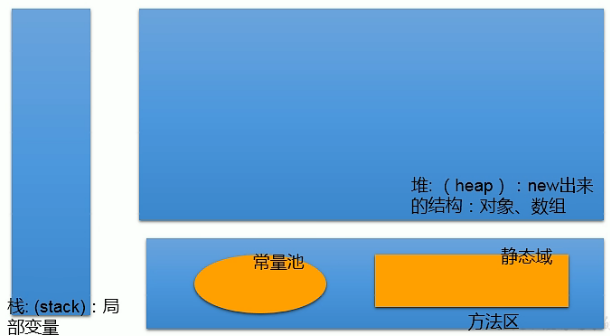
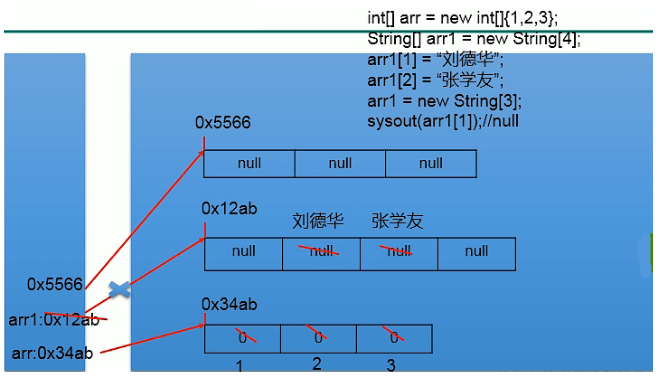
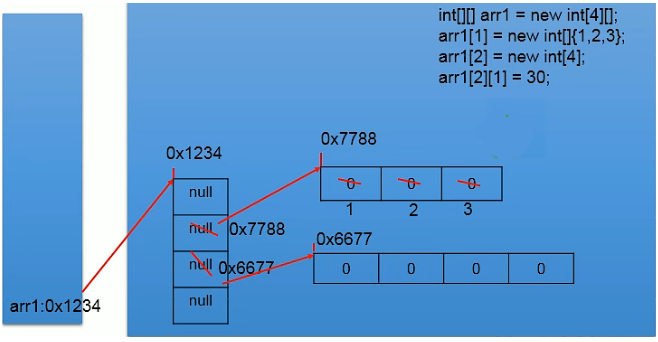

# 3 Java数组

> 数组的特点

- 有序性
- 存储空间连续
- 数组是引用类型变量
- 长度固定，不可更改，一旦初始化完成，数组长度就确定了

## 3.1 一维数组

> 声明和初始化

- 静态初始化：数组的声明赋值操作同时进行
- 动态初始化：先声明，再进行赋值操作

```java
// 静态初始化
String[] names = new String[]{"tom", "jan","steve"};
// 其他正确写法
String names2[] = new String[]{"tom", "jan","steve"};
String[] names3 = {"tom", "jan","steve"};

// 动态初始化
int[] ages = new int[3];
ages[0] = 15;
ages[1] = 16;
ages[2] = 15;
```

> 获取数组长度

```java
String[] names = new String[]{"tom", "jan","steve"};
System.out.println(names.length); // 3
```

> 数组的初始化值

- 数组元素是整型（byte、short、int、long）：0
- 数组元素是浮点型（float、double）：0.0
- <front style="background: yellow">数组元素是char型</front>：0或'\u0000'，而非'0'
- 数组元素是boolean型：false
- 数组元素为引用类型：null

> 关于数组的打印

- 打印char类型的数组变量：

  `char[] c = new char[]{'a', 'b', 'c'}; System.out.println(c)`，结果输出为`abc`

- 打印非char类型的数组变量：

  `int[] i = new int[]{1, 2, 3}; System.out.println(c)`，结果输出为`地址值`

<front style="background: yellow">println方法有个专门针对参数是char类型数组的重载。</front>



> 内存解析

- 内存简化结构

  

- 一维数组内存举例说明

  

## 3.2 多维数组

以二维数组为例

> 理解

可以看成是一维数组array1又作为另外一个一维数组array2的元素而存在。<front style="background: yellow">其实，从数组底层的运行机制来看，没有多维数组。</front>

> 初始化

- 静态初始化
- 动态初始化

```java
// 静态初始化
int[][] arr1 = new int[][]{{1,2,3},{4,5},{8,9,10}};
// 其他正确写法
int arr2[][] = new int[][]{{1,2,3},{4,5},{8,9,10}};
int[] arr3[] = new int[][]{{1,2,3},{4,5},{8,9,10}};
int[][] arr4 = {{1,2,3},{4,5},{8,9,10}};

// 动态初始化
String[][] arr5 = new String[3][2];//3行2列
String[][] arr6 = new String[3][];
```

> 获取指定位置的元素

```java
int[][] arr1 = new int[][]{{1,2,3},{4,5},{8,9,10}};
System.out.println(arr1[0][1]); //输出2
```

> 获取数组的长度

```java
int[][] arr1 = new int[][]{{1,2,3},{4,5},{8,9,10}};
System.out.println(arr1.length); //输出3
```

> 初始化值

```java
int[][] arr1 = new int[4][5];
System.out.println(arr1[0]);//地址值
System.out.println(arr1[1][1]);//0

int[][] arr2 = new int[4][];
System.out.println(arr2[0]);//null
System.out.println(arr2[1][1]);//空指针异常

```

>内存解析



## 3.3 数组的常见算法

### 3.3.1 复制

```java
int[] arr1 = {2,3,5,7,11};
int[] arr2 = arr1; //这里只是地址值的赋值，arr2和arr1指向同一个地址
// 数组的复制
int[] arr3 = new int[arr1.length];
for(int i = 0; i < arr3.length; i++) {
    arr3[i] = arr1[i];
}
```

### 3.3.2 反转

```java
/**
* 数组反转 方法一
*/
private void reverse1() {
    int[] arr1 = {2,3,5,7,11,13,17,19};
    for (int i = 0; i < arr1.length / 2; i++) {
        int temp = arr1[i];
        arr1[i] = arr1[arr1.length - 1 - i];
        arr1[arr1.length - 1 - i] = temp;
    }
    for (int i = 0; i < arr1.length; i++) {
        System.out.print(arr1[i] + "\t");
    }
}

/**
 * 数组反转 方法二
 */
private void reverse2() {
    int[] arr1 = {2,3,5,7,11,13,17,19};
    for (int i = 0, j = arr1.length - 1; i < j; i++, j--) {
        int temp = arr1[i];
        arr1[i] = arr1[j];
        arr1[j] = temp;
    }
    for (int i = 0; i < arr1.length; i++) {
        System.out.print(arr1[i] + "\t");
    }
}
```

### 3.3.3 线性查找

> 理解

从前往后依次查找。

### 3.3.4 二分法查找

> 前提

数组是按照由小到大或者由大到小的顺序存储的。

> 代码

```java
/**
* 二分查找
* 本题中数组按由小到大的顺序进行存储
*/
private static void findWithBinary() {
    int[] arr1 = {2,3,5,7,11,13,17,19};
    int dest = 13;
    boolean flag = false;
    int head = 0, end = arr1.length - 1;

    while (head <= end) {
        int middle = (end + head) / 2;
        if(arr1[middle] == dest) {
            System.out.println("找到了指定元素，下标为："+middle);
            flag =  true;
            break;
        } else if (arr1[middle] > dest) {
            end = middle - 1;
        } else {
            head = middle + 1;
        }
    }

    if (!flag) {
        System.out.println("很遗憾，指定元素不存在哦");
    }
}
```

### 3.3.5 排序算法概述

> 衡量排序算法的优劣

- <front style="background: yellow">时间复杂度</front>：分析关键字的比较次数和记录的移动次数
- <front style="background: yellow">空间复杂度</front>：分析算法中需要多少辅助内存
- <front style="background: yellow">稳定性</front>：若两个记录A和B的关键字值相等，但排序后A、B的先后次序保持不变，则称这种算法是稳定的

> 排序算法分类

- <front style="background: yellow">内部排序</front>：整个排序过程不需要借助外部存储器（如磁盘等），所有排序操作都在内存中完成。
- <front style="background: yellow">外部排序</front>：参与排序的数据非常多，数据量非常大，计算机无法把整个排序过程放在内存中完成，必须借助外部存储器（如磁盘）等。外部排序最常见的算法有<span style="color:red">多路归并排序</span>。可以认为外部排序是由多次内部排序组成的。

> 十大排序算法

- <front style="background: yellow">选择排序</front>

  将待排序的元素分为已排序（初始为空）和未排序两组，依次将未排序的元素中值最小的元素放入已排序的组中。

  - <front style="background: yellow">简单选择排序</front>
  - <front style="background: yellow">堆排序</front>

- 交换排序

  - 冒泡排序
  - 快速排序

- 插入排序

  - 直接插入排序
  - 折半插入排序
  - 希尔排序

- 归并排序

- 桶式排序

- 基数排序

> 算法5大特性

- <front style="background: yellow">输入</front>：有0个或多个输入数据，这些输入必须有清楚的描述和定义
- <front style="background: yellow">输出</front>：至少有1个或多个输出结果，不可以没有输出
- <front style="background: yellow">有穷性（有限性）</front>：算法可以在有限的步骤之后会自动结束而不是无线循环，并且每一个步骤可以在可接受的时间内完成
- <front style="background: yellow">确定性（明确性）</front>：算法中的每一步都有确定的含义，不会出现二义性
- <front style="background: yellow">可行性（有效性）</front>：算法的每一步骤都是清楚且可行的，能让用户用纸笔计算而求出答案

### 3.3.6 简单选择排序

> 基本过程

- 在一组元素R[i]到R[n]中选择最小的元素
- 如果他不是这组元素中的第一个元素，则将其与该组元素中的第一个元素交换
- 除去具有最小关键字的元素，在剩下的元素中重复以上两步骤，直到元素只有一个为止

> 效率分析

- <span style="color:red">比较次数</span>：$(n-1)+(n-2)+...+2+1=n(n-1)/2$

  无论初始状况如何，在第i趟排序中选择最小元素的时候，都需要做$(n-i)$次比较

- <span style="color:red">交换次数</span>：

  - 最好情况：0次

    序列恰好为正序时，需要交换0次

  - 最差情况：${(n-1)}$次

    如将数组[${5,1,2,3,4}$]按照有小到大的顺序排列，需要移动4次

综上，简单选择排序的<front style="background: yellow">时间复杂度为$O(n^{2})$</front>

>稳定性

<p><front style="background: yellow">不稳定</front></p>

由于在直接选择排序中存在不相邻元素的交换，因此它是一个不稳定的排序方法。

比如给定数组[$3,7,3',2,1$]，按照有小到大的顺序排列后的结果为[$1,2,3',3,7$]

>示例代码

```java
int[] arr = {49,38,65,97,76,13,24,49};
// 开始排序
// 说明1：循环条件是 i < arr.length - 1，而不是i < arr.length的原因：最后一个数无需和自身进行比较、交换
for (int i = 0; i < arr.length - 1; i++) {
    int index = i; // 记录最小值的下标
    // 循环找到数组中的最小值对应的下标
    for (int j = i + 1; j < arr.length; j++) {
        if (arr[index] > arr[j]) {
            index = j;
        }
    }
    // 将最小值和无序数组中的第一个元素进行交换（当最小值下标和当前下标不相等的时候再交换）
    if (i != index) {
        int temp = arr[i];
    	arr[i] = arr[index];
    	arr[index] = temp;
    }
}
// 排序完成
// 打印
for (int i = 0; i < arr.length; i++) {
    System.out.print(arr[i]+"\t");
}
```

### 3.3.7 堆排序

### 3.3.8 冒泡排序

> 基本思想

对待排序序列从前往后，依次比较相邻元素排序码，如果逆序则交换，使排序码较大的元素逐渐从前往后移动。

>效率分析

- <span style="color:red">比较次数</span>：

  - 最好情况：$n-1$次

    此时待排序序列恰好是按照要求的顺序进行排序

  - 最坏情况：$(n-1)+(n-2)+...+2+1=n(n-1)/2$次

    此时待排序序列恰好是按照要求的顺序的逆序进行排序

- <span style="color:red">交换次数</span>：

  - 最好情况：0次

    此时待排序序列恰好是按照要求的顺序进行排序

  - 最坏情况：$(n-1)+(n-2)+...+2+1=n(n-1)/2$

> 稳定性

-

> 示例代码

```java
int[] arr = {49,38,65,97,76,13,27,49};
// 开始排序
// 说明1：循环条件是 i < arr.length - 1，而不是i < arr.length的原因：最后一个数无需和自身进行比较、交换
for (int i = 0; i < arr.length - 1; i++) {
    // 说明2：循环条件是arr.length - 1 - i的原因：每完成一次排序，最后（i+1）个数都已完成排序，不需要再进行比较、交换
    for (int j = 0; j < arr.length - i - 1; j++) {
        if (arr[j] > arr[j+1]) {
            int temp = arr[j];
            arr[j] = arr[j+1];
            arr[j+1] = temp;
        }
    }
}
// 排序完成
// 打印
for (int i = 0; i < arr.length; i++) {
    System.out.print(arr[i]+"\t");
}
```


### 3.3.9 快速排序

### 3.3.10 插入排序

### 3.3.10.1 直接插入排序

### 3.3.10.2 折半插入排序

### 3.3.12 希尔排序

### 3.3.13 归并排序

### 3.3.14 桶式排序

### 3.3.15 基数排序

## 3.4 Arrays工具类的使用

| 方法                                             | 作用                                     | 备注                                               |
| ------------------------------------------------ | ---------------------------------------- | -------------------------------------------------- |
| Arrays.equals(Object[] a, Object[] a2)           | 判读两个数组中的元素是否全相等           | 全相等，返回true                                   |
| Arrays.toString(Object[] a)                      | 获取数组中的元素信息                     | 数组元素之间用","分隔，用"[]"包裹                  |
| Arrays.fill(Object[] a, Object val)              | 将指定数值（val）填充到数组中            | 无返回值                                           |
| Arrays.sort(Object[] a)                          | 对数组进行正序排序                       | 排序完成后，原数组发生改变                         |
| Arrays.sort(Object[] a, Comparator<? super T> c) | 对数组排序，顺序由Comparator构造函数决定 | 基本数据类型不可使用该方法，但对应的封装类型可使用 |
| Arrays.binarySearch(int[] a, int key)            | 对排序后的数组进行二分法查找             | 数组必须是已排序好的；返回值小于0表示未找到        |

## 3.5 数组中的常见异常

| 异常                           | 描述             | 备注                                                         |
| ------------------------------ | ---------------- | ------------------------------------------------------------ |
| ArrayIndexOutOfBoundsException | 数组下标越界异常 | 下标小于0也叫数组下标越界                                    |
| NullPointerException           | 空指针异常       | // 情况一：<br />int[] arr4 = {49,38,65,97,76,13,27,49};<br /> arr4 = null;<br /> System.out.println(arr4[1]); // 空指针异常<br />// 情况二：<br />int[][] arr = new int[4][]; <br />System.out.println(arr[0][0]);// 空指针异常 |
