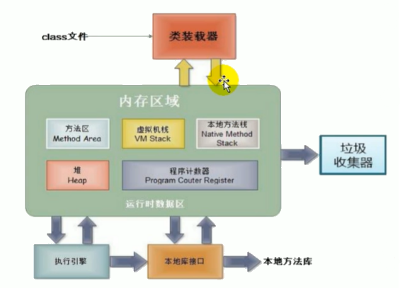
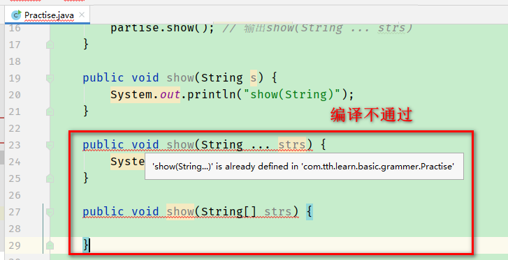
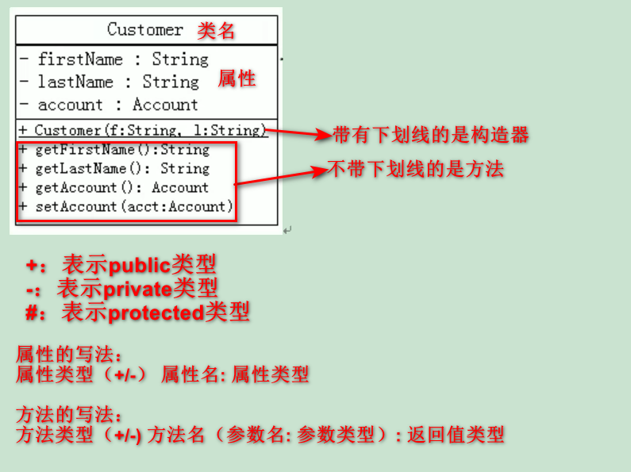

# 4 面向对象编程（上）

## 4.1 面向过程与面向对象

> 面向过程POP与面向对象OOP

- 面向过程：强调的是功能行为，以函数为最小单位，考虑怎么做。
- 面向对象：将功能封装进对象，强调具备了功能的对象，以类/对象为最小单位，考虑谁来做。

> 面向对象三大特征

- 继承
- 封装
- 多态

## 4.2 内存解析



- <front style="background: yellow">堆</front>：存放<span style="color: red">对象实例</span>

  所有的对象实例和数组都要在堆上分配（Java虚拟机规范中如此描述）

- <front style="background: yellow">栈</front>：存放<span style="color: red">局部变量</span>等。

  局部变量表存放了编译期可知长度的各种基本数据类型、对象引用类型（reference类型，值为对象在堆内的首地址）。方法执行完，自动释放。

  通常所说的栈，是指虚拟机栈。

- <front style="background: yellow">方法区</front>：存放<span style="color: red">已被虚拟机加载的类信息、常量、静态变量、即时编译器编译后的代码</span>等数据

## 4.3 属性和局部变量的对比

> 相同点

- 定义变量的格式相同：数据类型 变量名 = 变量值
- 都是先声明，后使用
- 变量都有其对应的作用域

> 不同点

- 在类中声明的位置不同
  - 属性：直接定义在类的一对{}中
  - 局部变量：声明在方法内、方法形参、代码块内、构造器形参、构造器内部的变量
- 关于权限修饰符的不同
  - 属性：可以在声明属性时，指明其权限
  - 局部变量：不可以使用权限修饰符
- 默认初始化值的问题
  - 属性：类的属性，根据其类型，都有默认初始化值
    - 整型（byte、short、int、long）：0
    - 浮点型（float、double）：0.0
    - 字符型（char）：0 或 '\u0000'
    - 布尔型（boolean）：false
    - 引用数据类型：null
  - 局部变量：没有初始化值
- 非static的变量/属性在内存中加载的位置不同
  - 属性：存放在堆中
  - 变量：存放在栈空间中

## 4.4 匿名对象

> 理解

new出来的对象没有显示的赋值给一个变量。如：

```java
new Phone().sendEmail("我是通过匿名对象调用的");
```

> 特点

匿名对象只能使用一次。

## 4.5 方法

### 4.5.1 方法的重载

> 定义

同一个类中，允许有一个以上的同名方法，只要它们的参数类型或者参数个数不同即可。

```java
class Test {
    private void getSum(int i, int j){...}
    private void getSum(int i, String s) {...}
    private void getSum(String s, int i) {...}
}
```

### 4.5.2 可变个数的形参

<p><front style="background: yellow">jdk5.0新特性</front></p>

> 具体使用

- 可变个数形参的格式： `数据类型 ... 变量名`

- 当调用可变个数形参的方法时，传入的参数个数可以是0个，1个，2个，...

  ```java
  public class Partise {
  
      public static void main(String[] args) {
          Partise partise = new Partise();
          partise.show("hello"); // 输出show(String)。如果注释了show(String)方法，也不会报错，会去调用show(String ... strs)方法
          partise.show("hello", "world"); // 输出show(String ... strs)
          partise.show(); // 输出show(String ... strs)
      }
  
      public void show(String s) {
          System.out.println("show(String)");
      }
  
      public void show(String ... strs) {
          System.out.println("show(String ... strs)");
      }
  }
  ```

> 说明

- 可变个数形参的方法与本类中方法名相同、形参不同的方法之间构成重载。

- 可变个数形参的方法与本类中方法名相同、形参类型也相同的数组之间不构成重载，二者不能共存。

  

- 可变个数形参的方法中，<front style="background: yellow">可变形参必须声明在末尾，且最多只能声明一个可变形参</front>

### 4.5.3 方法形参的传递机制

<p><front style="background: yellow">值传递机制</front>（不是引用类型传递机制）</p>

- 如果参数是<span style="color: red">基本数据类型</span>，实参传递给形参的是实参的真实存储的<span style="color: red">数据值</span>。
- 如果参数是<span style="color: red">引用数据类型</span>，实参传递给形参的是实参存储数据的<span style="color: red">地址值</span>（包含变量的数据类型）。

<p><front style="background: yellow">练习题：</front></p>

```java
public class Practise {

    public static void main(String[] args) {
        Practise p = new Practise();
        p.first();
    }

    public void first() {
        int i = 5;
        Value v  = new Value();
        v.i = 25;
        second(v, i);
        System.out.println(v.i + " " +i); // 输出 20 5
    }

    public void second(Value v, int i) {
        i = 0;
        v.i = 20;
        Value val = new Value();
        v = val;
        System.out.println(v.i + " " +i); // 输出 15 0
    }

    class Value {
        int i = 15;
    }
    
}
```

### 4.5.4 递归方法

## 4.6 OOP特征一：封装

### 4.6.1 封装性的体现

- 属性私有化，同时提供公共的方法来获取和设置属性
- 不对外暴露私有方法
- 单例模式

### 4.6.2 权限修饰符

<p><front style="background: yellow">封装性的体现，需要权限修饰符来配合。</front></p>

> 权限修饰符及其访问权限

| 修饰符    | 类内部 | 同一个包 | 不同包的子类 | 同一个工程 |
| --------- | ------ | -------- | ------------ | ---------- |
| private   | ✔      |          |              |            |
| （缺省）  | ✔      | ✔        |              |            |
| protected | ✔      | ✔        | ✔            |            |
| public    | ✔      | ✔        | ✔            | ✔          |

> 特别说明

- class（外部类）的权限修饰符只可以用public和缺省
  - public类可以在任意地方被访问
  - 缺省类只可以被同一个包内部的类访问

## 4.7 构造器

> 特点

- 名称和类相同
- 不声明返回值
- 不能被static、final、synchronized、abstract、native修饰
- 不能有return语句

> 说明

- 如果没有显示的定义，系统默认提供一个无参构造器（默认构造器的权限和类保持一致）
- 语法：`权限修饰符 类名(形参列表){}`
- 一个类中定义的多个构造器，彼此构成重载
- 一旦显示的定义了类的构造器没系统就不会再提供默认的构造器

> 作用

- 创建对象
- 给对象进行初始化

> 属性赋值的顺序

默认初始化 -> 显示初始化 -> 构造器中赋值 -> 通过“对象.方法”或“对象.属性”的方式赋值

> 通过this调用构造器

- 使用`this(形参列表)`方式，调用本类中指定的其他构造器
- 构造器中不能通过`this(形参列表)`方式调用自己
- 如果一个类中有n个构造器，则最多有n-1个构造器使用了`this(形参列表)`
- `this(形参列表)`必须<span style="color: red">声明在构造器的首行</span>
- 构造器内部，最多只能声明一个`this(形参列表)`，来调用其他构造器

> 通过super调用构造器

- 在子类的构造器中通过`super(形参列表)`显示调用父类的构造器
- `super(形参列表)`的使用必须在子类构造器的首行
- `super(形参列表)`与`this(形参列表)`只能二选一，不可同时出现
- 在构造器首行，没有`super(形参列表)`或`this(形参列表)`，则默认调用的是**父类中的空参构造器**
- 在类的多个构造器中，至少有一个类的构造器中使用了`super(形参列表)`，调用父类构造器

## 4.8 JavaBean

> 定义

JavaBean是Java语言编写的可重用组件

> JavaBean的特点

- 类是公共的
- 有一个无参的公共的构造器
- 有属性，且有对应的get、set方法

## 4.9 UML类图



## 4.10 package和import关键字

> 一些知识的补充

- 如果使用的类或接口是`java.lang`包下定义的，或者是`本包`下定义的，则可省略`import`结构

- import `xxx.*`时，只能导入本包下的全部结构。当使用`xxx子包`下的结构时，仍需要import

- `import static`导入指定类或接口中的静态结构（属性或方法）

  - 举例：

    ```java
    ...
    import static java.lang.System.*;
    ...
    public static void main(String[] args) {
        out.println("Hello World！")
    }
    ```
