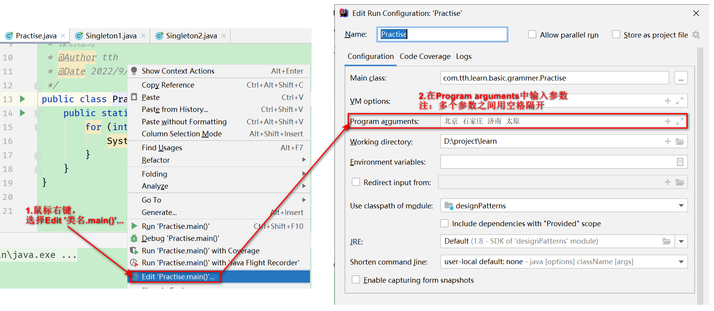
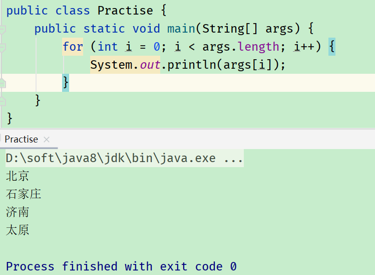
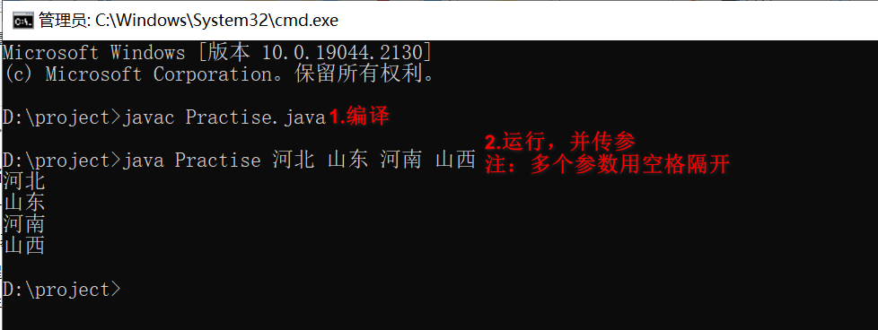

# 6 面向对象编程（下）

## 6.1 关键字static

<p><front style="background: yellow">static可以用来修饰：属性、方法、代码块、内部类</front></p>

> static修饰属性：静态变量

- 属性，按是否使用static修饰，又分为：	

  - 静态属性 （类变量）：我们创建了类的多个对象，多个对象共享同一个静态变量。当对某一个对象修改静态变量时，会导致当其他对象调用该属性时，获得的是被修改过之后的值。
  - 非静态属性（实例变量）：我们创建了类的多个对象，每一个对象都独立的拥有一套类中的非静态属性。当修改其中一个对象中的非静态属性时，不会对其他对象的同一个属性值修改。

- static修饰属性的其他说明：

  - 静态变量随着类的加载而加载，可以通过`类.静态变量`的方式使用。

  - 静态变量的加载<front style="background: yellow">早于</front>对象的创建。

  - 由于类只会加载一次，所以静态变量在内存中野只会存在一份，存在于<front style="background: yellow">方法区的静态域</front>中。

  - 调用方法

    |      | 类变量（静态属性） | 实例变量（非静态属性） |
    | ---- | ------------------ | ---------------------- |
    | 类   | ✔                  | ✘                      |
    | 对象 | ✔                  | ✔                      |

> static修饰方法（静态方法）

- 随着类的加载而加载，可以通过`类.静态方法(形参列表)`的方式调用

- 调用方法

  |      | 静态方法 | 非静态方法 |
  | ---- | -------- | ---------- |
  | 类   | ✔        | ✘          |
  | 对象 | ✔        | ✔          |

- 静态方法<front style="background: yellow">不可以</front>调用非静态方法或属性；非静态方法中，既可以调用静态方法或属性又可以调用非静态方法或属性

> static注意点

- 静态方法中，不能使用this和super关键字
- 关于静态属性和静态方法的使用，可以从声明周期的角度去理解

> static使用场景

- static属性：当属性可以被多个对象所共享，不会随着对象的不同而不同
- static方法：
  - 操作静态属性的方法，通常被设置为static的
  - 工具类的方法，习惯上声明为static的。如Math、Arrays、Collections等工具类中的方法

## 6.2 static应用之单例设计模式

>设计模型

- 定义：在大量的实践中总结和理论化之后优选的代码结构、编程风格，以及解决问题的思考方式。

> 设计模式分类（共23个）

- 创造型：工厂方法模式、抽象工厂模式、单例模式、建造者模式、原型模式
- 结构型：适配器模式、装饰器模式、代理模式、外观模式、桥接模式、组合模式、享元模式
- 行为型：策略模式、模板方法模式、观察者模式、迭代子模式、责任链模式、命令模式、备忘录模式、状态模式、访问者模式、中介者模式、解释器模式

> 单例模式

- 定义：采取一定的方法，保证在整个软件系统中，某个类只能存在一个对象实例，并且该类只提供一个取得其对象实例的方法。

- 实现思路：

  - <front style="background: yellow">将类的构造器的访问权限设置为private</front>
  - <front style="background: yellow">在该类中声明一个静态方法，用以返回类内部创建的对象</front>（原因：构造器私有，外部无法获取对象实例，但类内部可以产生对象实例，所以只能声明一个公有的静态方法以返回类内部创建的对象）
  - <front style="background: yellow">该类的变量也必须是静态的</front>（原因：静态方法只能访问类的静态成员变量）

- 实现方式

  - 饿汉式

    ```java
    package com.tth.learn.basic.grammer.Singleton;
    
    /**
     * 单例模式的饿汉式实现
     * @Author tth
     * @Date 2022/10/20 10:25
     */
    public class Singleton1 {
    
        public static void main(String[] args) {
            Bank bank1 = Bank.getInstance();
            Bank bank2 = Bank.getInstance();
            System.out.println(bank1 == bank2); // 返回true
        }
    }
    
    class Bank {
        // 1.私有化构造器
        private Bank() {}
    
        // 2.内部创建类对象，并声明为静态的
        private static Bank instance = new Bank();
    
        // 3.创建静态公共方法，返回对象实例
        public static Bank getInstance() {
            return instance;
        }
    }
    ```

  - 懒汉式

    ```java
    package com.tth.learn.basic.grammer.Singleton;
    
    /**
     * 单例模式的懒汉式实现
     * @Author tth
     * @Date 2022/10/20 10:30
     */
    public class Singleton2 {
        public static void main(String[] args) {
            Order order1 = Order.getInstance();
            Order order2 = Order.getInstance();
            System.out.println(order1 == order2); //返回true
        }
    }
    
    class Order {
    
        // 1.私有化构造器
        private Order() {}
    
        // 2.声明静态的当前类的对象，没有初始化
        private static Order instance = null;
    
        // 3.创建静态公共方法，返回对象实例
        public static Order getInstance() {
            if (null == instance) {
                instance = new Order();
            }
            return instance;
        }
    }
    ```

- 区分饿汉式和懒汉式

  - 饿汉式：
    - 好处：天生线程安全
    - 坏处：对象加载时间过长
  - 懒汉式：
    - 好处：延迟对象的创建
    - 坏处：以上写法是线程不安全的（到多线程内容的时候，再修改）

>单例模式的优点

减少内存的开销

> 单例模式举例

- java.lang.Runtime（饿汉式）

> 单例模式应用场景

- 网站的计数器
- 应用程序的日志应用
- 数据库连接池
- 读取配置文件的类
- Application
- Windows的Task Manager（任务管理器）
- Windows的Recycle Bin（回收站）

## 6.3 理解main方法的语法

- main()方法是程序的入口

- main()也是一个普通的静态方法

  可以通过`类名.main(参数)`的方式被调用

- main()可以作为和控制台交互的方式（之前使用的是Scanner）

  - 使用idea给main()方法传参

    - 编写代码，打印main()方法接收的参数：

      ```java
      public class Practise {
          public static void main(String[] args) {
              for (int i = 0; i < args.length; i++) {
                  System.out.println(args[i]);
              }
          }
      }
      ```

    - 设置参数：

      

    - 右键运行，控制台即可输出参数：

      

  - 使用cmd给main()方法传参：

    - 代码如上

    - 运行

      

## 6.4 类的成员之四：代码块

> 作用

用来初始化类、对象

> 修饰符

代码块只能使用static来修饰

> 分类

- 静态代码块
  - 随着类的加载而执行，且只执行一次
  - 作用：初始化类的信息
  - 静态代码块的执行时间先与非静态代码块的执行时间
  - 静态代码块之间的执行顺序是按照代码编写的先后顺序执行
  - 不可以调用非静态结构（属性和方法）
- 非静态代码块
  - 随着对象的创建而执行，且没创建一个对象，就会执行一次
  - 作用：可以在创建对象时，对对象的属性等进行初始化
  - 非静态代码块之间的执行顺序是按照代码编写的先后顺序执行

> 属性赋值的顺序

默认初始化 -> 显示初始化/代码块-> 构造器中赋值 -> 通过“对象.方法”或“对象.属性”的方式赋值

```java
// 此时创建的Order对象的orderId为2
class Order {
    int orderId = 1;
    {
        orderId = 2;
    }
}

// 此时代码不报错，创建的Order2对象的orderId为1
class Order2 {
    {
        orderId = 2;
    }
    int orderId = 1;
}
```

## 6.4 关键字final

> 作用

可以用来修饰：

- 类：<front style="background: yellow">final修饰的类不能被其他类所继承。</front>举例：String类、System类、StringBuffer类

- 方法：<front style="background: yellow">final修饰的方法不能被子类重写。</front>举例：Object.getClass()

- 变量：<front style="background: yellow">final修饰的变量不能被修改，此时的变量成为“常量”。</front>

  - 修饰属性：可以赋值的位置有：显示初始化、代码块中初始化、构造器中初始化

  - 修饰局部变量：

    尤其是修饰形参时，表明此形参时一个常量，只能在方法体内使用，不能修改 

> static final修饰属性

被称为全局常量

## 6.5 抽象类与抽象方法

> 关键字abstract的使用

可以用来修饰的结构：<front style="background: yellow">类</front>、<front style="background: yellow">方法</front>

不能修饰：属性、构造器、私有方法、静态方法、final方法、final类

> 抽象类

被abstract修饰的类叫做抽象类。

- <front style="background: yellow">抽象类不能实例化</front>
- 抽象类中一定有构造器，便于子类实例化的时候调用
- 开发中，都会提供抽象类的子类，让子类对象实例化，完成相关操作
- <front style="background: yellow">包含抽象方法的类，一定是抽象类；反之，抽象类中可以没有抽象方法</front>

> 抽象方法

被abstract修饰的方法叫抽象方法。

```java
public abstract void fun();
```

- 抽象方法只有方法的声明，没有方法体
- 若子类重写了父类中的所有抽象方法后，此子类方可实例化；若子类没有重写父类中的所有抽象方法，则子类也必须声明为一个抽象类

> abstract使用注意事项

- abstract不能用来修饰属性、构造器等结构
- abstract不能用来修饰private方法、static方法、final方法、final类

> 抽象类的匿名子类

```java
/**
* 定义抽象类Person
*/
public abstract Person {
    private String name;
    private int age;
    
    public Person() {}
    
    public abstract void fun1();
    
    public abstract void fun2();
    
    public void fun3() {
        System.out.println("hello, fun3");
    }
}

/**
* 测试类
*/
public PersonTest {
    public static void main(String[] args) {
        
        // 定义匿名子类
        Person p = new Person() {
            @Override
            public void fun1(){
                 System.out.println("hello, fun1");
            }
    
            @Override
    		public void fun2() {
                 System.out.println("hello, fun2");
            }
        };
        
        // 创建匿名子类的匿名对象
        method(new Person() {
            @Override
            public void fun1(){
                 System.out.println("hello, fun1");
            }
    
            @Override
    		public void fun2() {
                 System.out.println("hello, fun2");
            }
        })
    }
    
    public static void method(Person p) {
        System.out.println("hello, method")
    }
}
```

## 6.6 abstract应用之模板方法设计模式

抽象类体现的就是一种模板模式的设计，抽象类作为多个子类的通用模板，子类在抽象类的基础上进行扩展、改造，但子类总体上会保留抽象类的行为方式。

> 解决的问题

- 当功能内部一部分实现是确定的，一部分实现是不确定的。此时可以吧不确定的部分暴露出去，让子类去实现。
- 即<front style="background: yellow">在软件开发中实现一个<span style="color: red">算法</span>时，整体步骤很固定、通用，这些步骤已经在父类中写好了。但是某些部分易变，易变部分可以抽象出来，供不同的子类实现。这就是一种模板模式。</front>

> 应用举例

- 数据库访问的链接
- Junit单元测试
- JavaWeb的Servlet中doGet、doPost方法
- Hibernate中模板程序
- Spring中JDBCTemplate、HibernateTemplate等

## 6.7 接口

> 定义接口中的成员

- JDK7及以前：只能定义全局常量和抽象方法
  - 全局常量：public static final修饰的变量。但是public static final可以省略不写
  - 全局方法：public abstract修饰的方法。但是public static可以省略不写
- JDK8及以后：可以定义全局常量、抽象方法、静态方法、默认方法

> 接口使用注意事项

- <front style="background: yellow">接口中<span style="color: red">**不能**</span>定义构造器。</front>这意味着接口是不可以实例化的。
- 接口通过让类去实现(implements)的方式来使用。
  - 如果实现类实现了接口中所有的抽象方法，则此类可以实例化
  - 否则，实现类需要声明为abstract的
- Java类可以实现多个接口（多个接口之间用“,”隔开）--->弥补了Java单继承的局限性
- 当一个Java类既继承类，又实现接口的时候，应该<front style="background: yellow">先写继承后写实现</front>
- <front style="background: yellow">接口与接口之间可以继承（extends），且可以多继承</front>
- <front style="background: yellow">接口的具体使用，提现了多态性</front>
- 接口，实际上可以看做是一种规范
- 接口的主要用途就是被实现类实现，这称为<front style="background: yellow">面向接口编程</front>
- 从本质上讲，接口是一种特殊的抽象类。

> JDK8中接口新特性

JDK8以后，接口既可以定义全局常量、抽象方法，也可以定义静态方法、默认方法。

- 定义静态方法（public static）：接口中定义的静态方法，只能通过接口来调用
- 定义默认方法（public default）：
  - 可以通过实现类的对象，调用接口中的默认方法
  - 实现类可以重写接口的默认方法
  - 如果子类（或实现类）继承的父类和实现的接口中，声明了同名、同参的默认方法，那么子类在没有重写此方法的情况下，默认调用的是父类中的方法 ---> <front style="background: yellow">类优先原则</front>
  - 如果实现类实现了多个接口，且这多个接口中定义了同名、同参的默认方法，在实现类没有重写此方法的情况下，编译报错 ---> <front style="background: yellow">接口冲突</front>
    - 如果想解决以上冲突，必须在实现类中重写此方法。 
  - 如何在子类（或实现类）的方法中调用父类、接口中被重写的方法？
    - 调用父类中声明的方法：`super.方法`
    - 调用接口中默认的方法：`接口名.super.方法`

## 6.8 接口应用之代理模式（Proxy）

> 概述

代理设计就是为其他对象提供一种代理以控制对这个对象的方法。

> 代码示例

以明星和他的小助理为例。明星参加面谈会、签合同、订票、唱歌，都需要通过他的小助理来完成。小助理就是明星的一个代理。

```java
public class ProxyTest {
    public static void main(String[] args) {
        // 定义代理类对象，实现明星的面谈会、签合同、订票、唱歌功能
        Assistant proxy = new Assistant(new RealStar());
        proxy.confer();
        proxy.signContract();
        proxy.bookTicker();
        proxy.sing();
    }
}

/**
 * 明星接口
 */
interface Star {
    // 面谈会
    void confer();

    // 签合同
    void signContract();

    // 订票
    void bookTicker();

    // 唱歌
    void sing();
}

/**
 * 明星（被代理类）
 */
class RealStar implements Star {
    @Override
    public void confer() {
        System.out.println("RealStar confer");
    }

    @Override
    public void signContract() {
        System.out.println("RealStar signContract");
    }

    @Override
    public void bookTicker() {
        System.out.println("RealStar bookTicker");
    }

    @Override
    public void sing() {
        System.out.println("RealStar sing");
    }
}

/**
 * 明星的助理（代理类）
 */
class Assistant implements Star {
    private RealStar realStar;

    public Assistant(RealStar realStar) {
        this.realStar = realStar;
    }

    @Override
    public void confer() {
        System.out.println("小助理组织面谈会");
        // 明星参加面谈会
        this.realStar.confer();
        System.out.println("面谈会结束后，小助理其他工作...");
    }

    @Override
    public void signContract() {
        System.out.println("小助理检查合同");
        // 明星在合同上签字
        this.realStar.confer();
    }

    @Override
    public void bookTicker() {
        System.out.println("小助理给明星订票");
    }

    @Override
    public void sing() {
        // 明星唱歌
        this.realStar.sing();
    }
}
```

> 应用场景

- 安全代理：屏蔽对真是角色的直接访问
- 远程代理：通过代理类处理远程方法调用（RMI）
- 延迟加载：先加载轻量级的代理对象，真正需要再加载真是对象

> 分类

- 静态代理（静态定义代理对象）

- 动态代理（动态生成代理类）

  JDK自带的动态代理，需要反射等知识

## 6.9 接口应用之工厂模式

> 概述

工厂模式实现了创建者与调用者的分离，即将创建对象的具体过程屏蔽隔离起来，达到高灵活性的目的。

<p><front style="background: yellow">本质</front>：实例化对象时，用工厂方法代理new操作。</p>

​			 将选择实现类、创建对象统一管理和控制，从而将调用者和实现类解耦。

> 体现的原则

- 开闭原则（OCP）：软件实体对扩展开放，对修改关闭
- 依赖倒转原则（DIP）：如果A中关联B，那么尽量使得B实现某个接口，然后A与接口发生关系，不与B实现类发生关联关系
- 迪米特法则（LOD）：不和陌生人说话，有事去中介

>分类

- <front style="background: yellow">简单工厂模式（静态工厂模式）</front>：用来生产同一等级结构中的任意产品

  一个工厂类，根据方法名或者参数，返回不同的产品。

  - 优点：把调用者和创建者分离，实现了解耦
  - 缺点：对于新增产品，需要修改代码。违反了开闭原则

- <front style="background: yellow">工厂方法模式</front>：用来生产同一等级结构中的固定产品（支持新增任意产品）

  一个工厂接口，多个不同工厂接口的实现类，根据不同工厂接口的实现类，返回不同的产品。

  - 缺点：并没有真正的避免代码的改动。当添加新产品时，要么将判断逻辑留在抽象工厂的角色里，要么在客户端将具体工厂类写死。

- <front style="background: yellow">抽象工厂模式</front>：用来生产不同品族的全部产品（对于增加新的产品，无能为力；支持增加产品族）

  - 和工厂方法模式的区别：在于需要创建对象的复杂程度上。

## 6.10 类的成员之五：内部类

> 概述

Java中允许将一个类A生命在另一个类B中，则类A就是内部类，类B称为外部类

> 分类

- 成员内部类：分为静态、非静态
- 局部内部类：可以定义在方法内、代码块内、构造器内

> 成员内部类

- 作用：

  - 一方面，作为外部类的成员：
    - 可以调用外部类的属性、方法：`外部类名.this.属性/方法`
    - 可以被static修饰
    - 可以被4种不同的权限修饰（外部类的权限修饰符只可以用public和缺省2种）
  - 另一方面，作为一个类：
    - 类内可以定义属性、方法、构造器等
    - 可以被final修饰，表示不能被继承（言外之意，不使用final，可以被继承）
    - 可以被abstract修饰，表示不能被实例化

- 注意点：

  在局部内部类（AA）的方法（show）中，如果调用局部内部类所声明的方法（method）中的局部变量（num），要求此局部变量声明为final(此final在JDK8及之后可省)

  ```java
  class Person {
      public void method() {
          // 局部变量
          // JDK7及之前，必须显示声明为final。JDK8之后，final可省
          int num = 10;
          
          class AA {
              public void show() {
                  System.out.println(num);
              }
          }
      }
  }
  ```

  

> 实例化成员内部类对象

- 实例化静态成员内部类对象：`外部类.静态内部类 变量名 = new 外部类.静态内部类();`
- 实例化非静态成员内部类对象：先创建外部类对象，再通过`外部类对象实例.new 静态内部类()`
- 例子：

````java
public class InnerClassTest {
    public static void main(String[] args) {
        // 创建静态成员内部类
        Person.Dog dog = new Person.Dog();
        
        // 创建非静态成员内部类
        Person p = new Person();
        Person.Bird bird = p.new Bird();
        bird.sing();
    }
}

class Person {
    String name;
    int age;
    
    // 静态成员内部类
    static class Dog {
        String name;
        int age;
        
        public void show() {
            System.out.println("卡拉是条狗");
        }
    }
    
    // 非静态成员内部类
    class Bird {
        String name;
        
        public void sing() {
            System.out.println("我是一只小小鸟");
        }
    }
}
````

>在成员内部类中区分调用外部类的结构

见Bird类的display()方法。

```java
class Person {
    String name;
    int age;
    
    // 静态成员内部类
    static class Dog {
        String name;
        int age;
        
        public void show() {
            System.out.println("卡拉是条狗");
        }
    }
    
    // 非静态成员内部类
    class Bird {
        String name;
        
        public void sing() {
            System.out.println("我是一只小小鸟");
        }
        
        public void display(String name) {
            // 调用方法的形参
            System.out.println(name);
            // 调用内部类的属性
            System.out.println(this.name);
            // 调用外部类的属性（如果外部类属性是static的，this可省）
            System.out.println(Person.this.name);
        }
    }
}
```

> 开发中局部内部类的使用

```java
class Person {
    static String name = "张三";
    int age;

    // 局部内部类
    public Comparable getComparable() {
        // 创建了一个实现Comparable接口的局部内部类
        // 方式1：
//        class MyComparable implements Comparable {
//            @Override
//            public int compareTo(Object o) {
//                return 0;
//            }
//        }
//        return new MyComparable();

        // 方式2：创建了实现Comparable接口的匿名实现类的匿名对象
        return new Comparable() {
            @Override
            public int compareTo(Object o) {
                return 0;
            }
        };
    }
}
```
