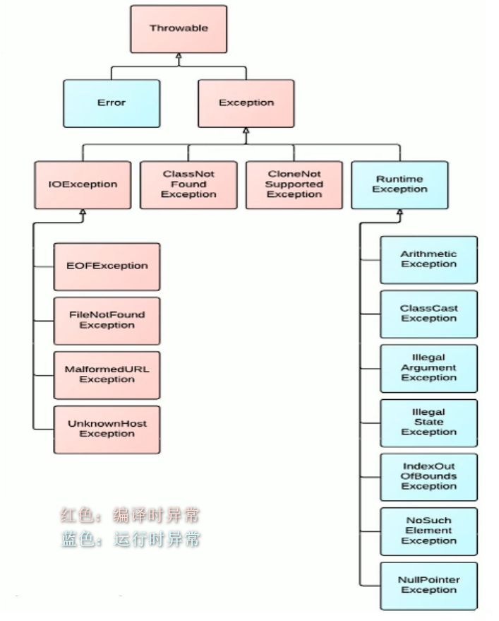

# 7 异常处理

## 7.1 概述

> 异常分类

- <front style="background: yellow">Error</front>：Java虚拟机无法解决的严重问题。如JVM系统内部错误、资源耗尽（如StackOverflowError栈溢出、OOM堆溢出）等严重情况。一般不编写针对性的代码进行处理。
- <front style="background: yellow">Exception</front>：其它因编程错误或偶然意外的外在因素导致的一般性问题，可以使用针对性的代码进行处理，如：空指针访问、试图读取不存在的文件、网络连接中断、数组下标越界
  - 分类
    - 编译时异常
    - 运行时异常

> 异常的体系结构

java.lang.Throwable

​		|------ java.lang.Error：一般不编写针对性的代码处理

​		|------ java.lang.Exception：可以进行异常的处理

​				|------ 编译时异常（checked）

​							|------ IOException

​									|------ FileNotFoundException

​							|------ ClassNotFoundException

​				|------ 运行时异常（unchecked，RuntimeException）

​							|------ NullPointerException

​							|------ ArrayIndexOutOfBoundsException

​							|------ ClassCastException

​							|------ NumberFormatException

​							|------ InputMismatchException

​							...

## 7.2 异常处理

> 异常处理方式

- try-catch-finally
- throws + 异常类型

> try-catch-finally使用注意事项

- 当catch捕获多个异常时，如果这些异常之间没有子父类关系，谁在上谁在下都可以。但是如果有子父类关系，子类在前父类在后
- try-catch-finally处理编译时异常，使得程序在编译时不再报错，但是运行时仍可能报错
- finally中声明的是一定会被执行的语句。即使catch中又出现异常了，或者是try和catch中有return语句等情况
- 如果try、catch、finally中都有return，最终返回的是finally中的内容

> 开发中如何选择使用try-catch-finally还是使用throws？

- 如果父类中被重写的方法中没有使用throws的方式处理异常，那么子类重写的方法也不能使用throws，也就是说，如果子类重写的方法有异常，只能使用try-catch-finally的方式处理
- 执行的方法a中，先后又调用了另外几个方法，这几个方法是递进关系执行的。建议使用throws的方式进行处理a中调用的方法，执行的a方法则可以考虑使用try-catch-finally方式进行处理