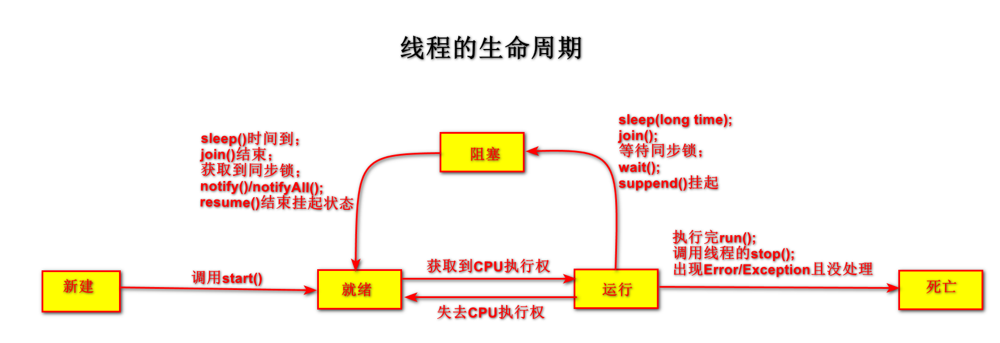

# 8 多线程

### 8.1 基本概念

- <front style="background: yellow">程序（program）</front>：是为了完成特定的任务、用某种语言编写的一组指令的集合。即一段静态的代码，静态对象

- <front style="background: yellow">进程（process）</front>：是程序的一次执行过程，或者是正在运行的一个程序。是一个动态的过程，有他自身的产生、存在和消亡的过程

  - 程序是静态的，进程是动态的
  - 进程作为<span style="color:red">资源分配的单位</span>，系统在运行时会为每个进程分配不同的内存区域

- <front style="background: yellow">线程（thread）</front>：进程可以进一步细化为线程，是一个程序内部的一条执行路径

  - 若一个进程同一时间可以并行执行多个线程，那么这个进程就是支持多线程的
  - 线程作为<span style="color:red">调度和执行的单位</span>，<span style="color: blue">**每个线程拥有独立的运行栈和程序计数器（pc）**</span>，线程切换的开销小
  - <span style="color: blue">**一个进程中的多个线程共享相同的方法区、堆**</span>，他们从同一堆中分配对象，可以访问相同的变量和对象。这使得线程间通信更简便、高效。但多个线程操作共享的系统资源就会带来安全隐患

- <front style="background: yellow">单核CPU</front>：其实是一种假的多线程，因为他在一个时间单元内，也只能执行一个线程的任务

- <front style="background: yellow">多核CPU</front>：多核CPU才能更好的发挥多线程的效率

  一个Java应用程序java.exe，其实至少有3个线程：main()主线程，gc()垃圾回收线程，异常处理线程。当然如果发生异常，会影响主线程

- <front style="background: yellow">并行</front>：多个CPU同事执行多个任务。如：多个人同时做不同的事情

- <front style="background: yellow">并发</front>：一个CPU（采用时间片）同时执行多个任务。如：秒杀，多个人同时做一件事

- <front style="background: yellow">多线程的优点</front>：

  - 提高应用程序的相应。对图形化界面更有意义，可增强用户体验
  - 提高计算机系统CPU的利用率
  - 改善程序结构。将既长又复杂的进程分为多个线程，独立运行，利于理解和修改

- <front style="background: yellow">何时需要多线程</front>：

  - 程序需要同时执行两个或多个任务

  - 程序需要实现一些需要等待的任务时，如用户输入、文件读写操作、网络操作、搜索。

    比如点外卖时，手指上划，获取数据和图片加载就是两个线程

  - 需要一些后台运行的程序时

### 8.2 线程的创建和使用

更深的课程：[45_Callable接口_哔哩哔哩_bilibili](https://www.bilibili.com/video/BV18b411M7xz?p=45&vd_source=555f33f5f6791940abce98aa27017451)

> 线程创建的方法

- 方法一：继承Thread类
- 方法二：实现Runnable接口
- 方法三：实现Callable接口（JDK5.0新增）
- 方法四：使用线程池（JDK5.0新增）

> 方式一：继承Thread类

- <front style="background: yellow; font-weight: 900">步骤</front>

  - 创建一个继承Thread类的子类

  - 在子类中重写Thread的run()方法

    将线程需要执行的操作，声明在run()方法中

  - 创建子类的实例对象

  - 调用子类实例对象的start()方法

    - start()方法的作用
      - 启动当前线程
      - 调用**当前线程**的run()方法
    - <front style="background: yellow">不可以让已经start()的线程重新start()。</front>否则会报IllegalThreadStateException

> 方式二：实现Runnable接口

- <front style="background: yellow; font-weight: 900">步骤</front>
  - 创建一个实现Runnable接口的类
  - 实现类中去重写Runnable接口的抽象方法run()
  - 创建实现类的对象
  - 将次对象作为参数传递到Thread类的构造器中，创建Thread类对象
  - 通过Thread类的对象调用run()

- <p><front style="background: yellow; font-weight: 900">比较以上创建线程的两种方式</front></p>
  - 开发中优先选择实现Runnable接口的方式。原因如下：
    - 实现的方式没有类的单继承性的局限性
    - 实现的方式更适合来处理多个线程有共享数据的情况

  - 二者的联系如下：
    - Thread本身也实现了Runnable接口
  - 相同点：
    - 两种方式都要重写run()，将线程要执行的逻辑写在run()中

> 方式三：实现Callable接口

- <front style="background: yellow; font-weight: 900">步骤</front>

  - 创建一个实现Callable的实现类
  - 实现call()方法：将此线程需要执行的操作声明在此方法中。call()是可以有返回值的
  - 创建Callable实现类的对象
  - 创建FutureTask对象：将上述Callable实现类对象，作为参数传递到FutureTask构造器中
  - 创建Thread对象并运行：需要将FutureTask对象作为参数传递到Thread构造器中
  - （可选）获取Callable实现类中call()的返回值：借助FutureTask对象的get()方法获取

- <p><front style="background: yellow; font-weight: 900">Future接口简介</front></p>

  - 可以对具体Runnable、Callable任务的执行结果进行取消、查询是否完成、获取结果等
  - FutureTask是Future接口的唯一实现类
  - FutureTask同时实现了Runnable、Future接口。既可以作为Runnable被线程执行，又可以作为Future得到Callable中call()的返回值

- <p><front style="background: yellow; font-weight: 900">实现Callable接口方法与实现Runnable接口的对比：</front></p>

  - 与实现Runnable相比，Callable功能更强大
    - 相比run()方法，Callable接口中的call()可以有返回值
    - call()方法可以抛出异常
    - Callable支持泛型
    - 需要借助FutureTask类，来获取返回结果

- <p><front style="background: yellow; font-weight: 900">示例代码</front></p>

  ```java
  package com.tth.learn.java;
  
  import java.util.concurrent.Callable;
  import java.util.concurrent.ExecutionException;
  import java.util.concurrent.FutureTask;
  
  /**
   * 创建线程的方式三：实现Callable接口（JDK5.0新增）
   * @Author tth
   * @Date 2022/11/3 17:37
   */
  public class CreateThreadTest3 {
      public static void main(String[] args) {
          // 3.创建Callable实现类对象
          MyThreadByCallable mtc = new MyThreadByCallable();
  
          // 4.创建FutureTask对象
          FutureTask futureTask = new FutureTask(mtc);
  
          // 5.创建Thread对象，并启动线程
          new Thread(futureTask).start();
  
          try {
              // 6.获取call()中返回值
              Object o = futureTask.get();
              System.out.println(o);
          } catch (InterruptedException e) {
              e.printStackTrace();
          } catch (ExecutionException e) {
              e.printStackTrace();
          }
      }
  }
  
  // 1.创建Callable的实现类
  class MyThreadByCallable implements Callable {
      // 2.重写call()
      @Override
      public Object call() throws Exception {
          int sum = 0;
          for (int i = 1; i <= 100; i++) {
              if (i % 2 == 0) {
                  System.out.println(i);
                  sum += i;
              }
          }
          return sum;
      }
  }
  ```

> 方式四：使用线程池

- <p><front style="background: yellow">适用场景</front></p>

  经常创建和销毁、使用量特别大的资源。如并发情况下的线程，对性能影响很大

- <p><front style="background: yellow">好处</front></p>

  - 提高响应速度（减少了创建新线程的时间）
  - 降低资源消耗（重复利用线程池中的线程，不需要每次都创建）
  - 便于线程管理：
    - corePoolSize：核心池的大小
    - maximumPoolSize：最大线程数
    - KeepAliveTime：线程没有任务时最多保持多长时间会终止

- <p><front style="background: yellow">线程池相关API</front></p>

  - <span style="color: red; font-weight: bold;">ExecutorService</span>：
  - <span style="color: red; font-weight: bold;">Executors</span>：

### 8.3 Thread类中的方法

- <front style="background: yellow">start()</front>：启动当前线程；调用当前线程的run()
- <front style="background: yellow">run()</front>：通常都需要重写该方法，将创建的线程要执行的操作声明在此方法中
- <front style="background: yellow">currentThread()</front>：静态方法，返回执行当前代码的线程
- <front style="background: yellow">getName()</front>：获取当前线程的名字
- <front style="background: yellow">setName()</front>：设置当前线程的名字
- <front style="background: yellow">yield()</front>：释放当前CPU的执行权（当然下一个CPU的执行权也有可能被争取到）
- <front style="background: yellow">join()</front>：在线程a中调用线程b的join()，此时线程a就会进入阻塞状态，直到线程b执行完成后，线程a才会结束阻塞状态
- <front style="background: yellow">stop()</front>：已过时。强制结束当前线程，不推荐使用
- <front style="background: yellow">sleep(long millis)</front>：静态方法，让当前线程“睡眠”指定的millis毫秒。在指定的millis毫秒时间内，当前线程是阻塞的装填
- <front style="background: yellow">isAlive()</front>：判断当前线程是否存活

### 8.4 线程的调度

> CPU调度策略

- 时间片：执行一段时间的A，再去执行一定时间的B，再去执行一定时间的C......
- 抢占式：高优先级的线程抢占CPU

> Java的调度方法

- 同优先级线程组成先进先出队列，使用时间片策略
- 对于高优先级的，使用优先调度的抢占式策略

> 线程的优先级

- 线程优先级的等级

  共10档，有三个常量，如下：

  - <front style="background: yellow">MAX_PRIORITY</front>：10。最大的优先级
  - <front style="background: yellow">MIN_PRIORITY</front>：1。最小的优先级
  - <front style="background: yellow">NORM_PRIORITY</front>：5。默认的优先级

- 涉及的方法

  - <front style="background: yellow">getPriority()</front>：返回线程的优先级
  - <front style="background: yellow">setPriority(int newPriority)</front>：改变线程的优先级

- 说明

  - 线程创建时，继承父线程的优先级
  - 低优先级只是获得调度的概率低，并非一定是在高优先级线程之后才被调用

### 8.5 线程的分类

Java中的线程分类两类，一种是<front style="background: yellow">守护线程</front>，一种是<front style="background: yellow">用户线程</front>。

- 它们几乎在每个方面都是相同的，唯一的区别就是判断JVM何时离开
- 守护线程是用来服务用户线程的，通过在start()前调用`线程实例对象.setDaemon(true)`可以把一个用户线程变成一个守护线程
- Java垃圾回收就是一个典型的守护线程
- 若JVM中都是守护线程，当前JVM将退出

### 8.6 线程的生命周期



### 8.7 线程的同步

> 线程同步的方法

- 方法一：同步代码块
- 方法二：同步方法
- 方法三：使用Lock锁

> 方式一：同步代码块

- 语法：

  ```java
  synchronized(同步监视器) {
      // 需要被同步的代码，即操作共享数据的代码
  }
  ```

- 说明

  - 同步监视器：即锁，任何一个类的对象，都可以充当锁。

    - 要求：多个线程共用同一把锁

    - 补充：

      - 在实现Runnable接口创建多线程的方式中，可以考虑使用this、或者声明一个实现类的属性（该属性是一个类的实例）作为同步监视器

        ```java
        class Window2 implements Runnable {
            // 此处可以不使用static。因为虽然开了3个窗口，但是实际上共用的是一个Window对象
            private int ticket = 100;
        
            // 声明一个对象属性同步锁
            private Object obj = new Object();
        
            @Override
            public void run() {
                while (true) {
                    // 使用实现类的对象属性作为同步锁
                    synchronized (obj) {
                     // 使用this作为同步锁
        //            synchronized (this) {
                        if (ticket > 0) {
                            System.out.println(Thread.currentThread().getName() + ": 卖票，票号为：" + ticket);
                            ticket --;
                        } else {
                            break;
                        }
                    }
                }
            }
        }
        ```

      - 在继承Thread类创建多线程的方式中，可以考虑使用`类名.class`、或者声明一个实现类的静态属性（该属性是一个实例）作为同步监视器，不可使用this

        ```java
        class Window extends Thread {
            // 票声明为static，所有线程共用同一个static变量
            private static int ticket = 100;
            // obj声明为static，作为一个锁，所有线程共用同一把锁
            private static Object obj = new Object();
            @Override
            public void run() {
                while (true) {
                    // 正确。使用实现类的对象静态属性作为同步锁
                    // synchronized (obj) {
                    // 正确。使用“实现类.class”为同步锁
                    synchronized (Window.class) {
                    // 错误。不可以用this
                    // synchronized (this) {
                        if (ticket > 0) {
                            System.out.println(getName() + ": 卖票，票号为：" + ticket);
                            ticket --;
                        } else {
                            break;
                        }
                    }
                }
            }
        }
        ```

        

    - 举例：

      - 在类中声明一个对象，用来作为同步锁
      - 使用`类名.class`

  - 需要被同步的代码：即操作共享数据的代码

> 方式二：同步方法

- 同步方法仍然涉及到同步监视器，只是不需要显示声明

- 非静态的同步方法，同步监视器是this

  ```java
  class Window4 implements Runnable {
      // 此处可以不使用static。因为虽然开了3个窗口，但是实际上共用的是一个Window对象
      private int ticket = 100;
  
      @Override
      public void run() {
          while (true) {
              show();
          }
      }
  
  
      private synchronized void show() { // 同步监视器：this
          if (ticket > 0) {
              System.out.println(Thread.currentThread().getName() + ": 卖票，票号为：" + ticket);
              ticket--;
          }
      }
  }
  ```

- 静态的同步方法，同步监视器是类本身

  ```java
  class Window3 extends Thread {
      // 票声明为static，所有线程共用同一个static变量
      private static int ticket = 100;
  
      @Override
      public void run() {
          while (true) {
              show();
          }
      }
  
      private synchronized static void show() { // 同步监视器：Window3.class
          if (ticket > 0) {
              System.out.println(Thread.currentThread().getName() + ": 卖票，票号为：" + ticket);
              ticket --;
          }
      }
  }
  ```

> 方法三：Lock

<front style="background: yellow">jdk5.0新特性</front>


### 8.8 单例设计模式之线程安全的懒汉式

```java
class Bank {
    private static Bank instance = null;
    // 私有化构造器
    private Bank() {}

    public static Bank getInstance() {
        // 方式一：效率稍差
//        synchronized (Bank.class) {
//            if (null == instance) {
//                instance = new Bank();
//            }
//        }
        
        // 方式二：效率较高
        if (null == instance) {
            synchronized (Bank.class) {
                if (null == instance) {
                    instance = new Bank();
                }
            }
        }

        return instance;
    }
}
```

### 8.9 线程的死锁

> 死锁

- 不同的线程分别占用对方需要的同步资源不放弃，都在等待对方放弃自己需要的同步资源，这就造成了线程的死锁
- 出现死锁后，不会出现异常，不会出现提示，只是所有的线程都处于阻塞状态，无法继续

> 死锁产生的必要条件

- 互斥条件：任意一个时刻一个资源只能给一个进程使用
- 不可剥夺条件：进程所获得的资源在未使用完毕之前，不能被其他进程强行剥夺
- 请求和保持条件：进程在申请新资源的同时，继续占用已经分配到的资源
- 循环等待条件：前一个进程占有后一个进程锁申请的资源，最后一个进程占用第一个进程所申请的资源

> 处理死锁的方法

- 预防死锁

  - “互斥”条件是无法破坏的
  - 破坏“不可剥夺”条件：
    - 方法一：如果占有某些资源的一个进程申请新的资源被拒绝，则该进程必须释放它最初占有的资源。如有必要，只可以再次请求这些资源和其他资源
    - 方法二：如果一个进程请求当前被另一个进程占有的资源，则操作系统可以抢占另一个进程，要求它释放资源。只有在两个进程优先级不同的条件下，方法二才能预防死锁	
  - 破坏“请求与保持”条件：
    - 方法一：创建进程时，系统要么满足它申请的所有资源，要么什么都不给。这就会所谓的“一次性分配”
    - 方法二：要求每个进程申请新的资源时，释放他所占有的资源。
  - 破坏“循环等待”条件：将系统中所有的资源编号，进程可以在任意时间提出资源申请，但所有申请必须按照资源的编号书序提出。

- 避免死锁

  - 有序资源分配法：将系统中的资源统一编号，申请时必须按从小到大的顺序
  - 专门的算法：如银行家算法

- 检测死锁：当死锁发生时，相关机构能够监测到死锁发生的位置和原因，并能通过外力破坏死锁发生的必要条件，从而使得并发进程从死锁状态中恢复出来

- 解除死锁：

  死锁解除的主要方法有：

  - 资源剥夺法：挂起某些死锁进程，并抢占他们的资源，将这些资源分配给其他的死锁进程。

    但是，应该防止被挂起的进程长时间得不到资源而处于资源匮乏的状态。

  - 撤销进程法：强制撤销部分甚至全部死锁进程，并剥夺他们的资源。

    撤销的原则可以按照进程的优先级和撤销进程代价的高低进行。

  - 进程回退法：让一个或者多个进程回退到足以避免死锁的地步，进程回退时资源释放资源。

    要求系统保持进程的历史信息，设置还原点。

### 8.10 线程的通信

> 常用方法

以下方法是定义在Object类中的，不是Thread中

- <front style="background: yellow">wait()</front>：使线程进入阻塞状态，并释放同步监视器
- <front style="background: yellow">notify()</front>：唤醒被wait的一个线程（优先唤醒有优先级高的）
- <front style="background: yellow">notifyAll()</front>：唤醒所有被wait的线程

> 说明

- wait()、notify()、notifyAll()必须用在同步代码块或者同步方法中

- wait()、notify()、notifyAll()的调用者必须是同步代码块或同步方法中的同步监视器。

  否则会出现IllegalMonitorStateException异常

- wait()、notify()、notifyAll()是定义在java.lang.Object中的

> 例子

```java
package com.tth.learn.java;

/**
 * 线程通信的例子：使用两个线程打印1-100.线程1和线程2交替打印
 * @Author tth
 * @Date 2022/11/1 17:52
 */
public class CommunicationTest {
    public static void main(String[] args) {
        Number number = new Number();

        Thread t1 = new Thread(number);
        t1.setName("线程1");

        Thread t2 = new Thread(number);
        t2.setName("线程2");

        t1.start();
        t2.start();

    }
}

class Number implements Runnable {

    private int num = 1;
    private Object obj = new Object();

    @Override
    public void run() {
        while (true) {
            synchronized (obj) {
                // 假如第一次进来的线程1。第一次notify()并没有唤醒任何线程。
                // 待线程1执行完wait()后,待线程1进入阻塞状态
                // 随后线程2进来。执行notify()，唤醒线程1
                obj.notify();
                if (num <= 100) {
                    System.out.println(Thread.currentThread().getName()+"_"+num);
                    num ++;
                    try {
                        // 阻塞当前线程
                        obj.wait();
                    } catch (InterruptedException e) {
                        e.printStackTrace();
                    }
                } else {
                    break;
                }
            }
        }
    }
}
```