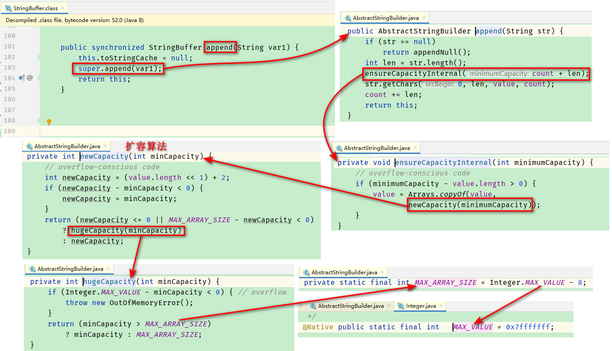

# 9 Java常用类

## 9.1 String

### 9.1.1 特性

- String类声明为final的，不可被继承

- 实现了Serializable接口，表示支持序列化

- 实现了Comparable接口，表示可以比较大小

- 内部定义了final char[] value，用来存储字符串数据

- String代表了<front style="background: yellow">不可变的字符串序列</front>，简称不可变性，体现如下：

  - 当对字符串重新赋值时，需要重新指定内存区域进行赋值，不能对内存中原有的字符串内容进行修改
  - 当对字符串进行连接操作时，也需要重新指定内存区域进行赋值
  - 当对字符串调用replace()修改字符串时，也需要重新指定内存区域进行赋值

- 通过字面量的方式（区别与new，使用String a="abc";）给一个字符串赋值，此时的字符串的值存在方法区中的字符串常量池中

  字符串常量池不会存相同内容的字符串

### 9.1.2 String的初始化方式

- 通过字面量的方式：String s = "abc";

  初始化过程：

  - 在字符串常量池中创建abc常量
  - s指向abc常量的地址

- 通过new+构造器的方式：String s = new String("abc");

  初始化过程：

  - 在字符串常量池中创建abc常量
  - 在堆空间中创建String对象，其value属性值为abc常量的地址
  - s指向堆中创建的String对象

  <front style="background: yellow">面试题</front>：String s = new String("abc")创建了几个对象？

  答：两个。一个是在堆空间中new了一个String类型的对象，另一个是在常量池中创建了一个char[]

> 引申

- 常量与常量的拼接结果在常量池中（如String s = "abc"+"def";s指向常量池中的"abcdef"），且常量池中不会存在相同内容的常量。

- 常量与变量的拼接、变量与变量的拼接结果在堆空间中（如String s = "abc"; String s2 = s1+"def";s2指向堆空间，相当于new了一个变量）

- 特别的，如果拼接结果调用了<front style="background: yellow">intern()</front>，返回结果在常量池中。

- 例子如下：

  ```java
  public static void main(String[] args) {
          String s1 = "javaEE";
          String s2 = "hadoop";
  
          String s3 = "javaEEhadoop";
          String s4 = "javaEE" + "hadoop";
          String s5 = s1 + "hadoop";
          String s6 = "javaEE" + s2;
          String s7 = s1 + s2;
          String s8 = s5.intern();
  
          System.out.println(s3 == s4); //true
          System.out.println(s3 == s5); // false
          System.out.println(s3 == s6); // false
          System.out.println(s3 == s7); // false
          System.out.println(s5 == s6); // false
          System.out.println(s5 == s7); // false
          System.out.println(s6 == s7); // false
          System.out.println(s3 == s8); // true
      }
  ```

### 9.1.3 String常用方法 

<p><front style="background: yellow">凡是涉及到对字符串进行修改的方法，原字符都没有变化，需要用新的变量去接收返回值</front>，这提现了字符串的不可变性，</p>

- `int length()`：返回字符串长度
- `char charAt(int index)`：返回索引处的字符
- `boolean isEmpty()`：判断是否是空字符串
- `String toLowerCase()`： 将字符转为小写（）
- `String toUpperCase()`： 将字符转为大写
- `String trim()`：忽略字符串收尾空格
- `boolean equals(Object obj)`：比较字符串的内容是否相等
- `boolean equalsIgnoreCase(Object obj)`：忽略大小写，比较字符串的内容是否相等
- `String concat(String str)`：将指定字符串连接到此字符串的结尾，等价于“+”
- `int compareTo(String anotherString)`：比较两个字符串的大小。返回负数表示当前字符串比指定字符串小。
- `String substring(int beginIndex)`：从beginIndex开始截取并返回
- `String substring(int beginIndex, int endIndex)`：截取[beginIndex, endIndex)范围内的字符串并返回
- `boolean endsWith(String suffix)`：判断字符串是否以指定的字符串结尾
- `boolean startsWith(String suffix)`：判断字符串是否以指定的字符串开始
- `boolean startsWith(String suffix, int toffset)`：判断字符串从指定的索引位置开始的子字符串是否以指定的字符串开始
- `boolean contains(CharSequence s)`：判断是否包含指定字符串
- `int indexOf(String str)`：返回指定字符串在当前字符串中第一次出现的索引位置
- `int indexOf(String str, int fromIndex)`： 返回指定字符串在当前字符串中第一次出现的索引位置，从指定的下标开始 
- `int lastIndexOf(String str)`：返回指定字符串在当前字符串中最后一次出现的索引位置
- `int lastI ndexOf(String str, int fromIndex)`：返回指定字符串在当前字符串中第一次出现的索引位置，从指定的索引反向搜索
- `String replace(char oldChar, char newChar)`：用newChar替换oldChar
- `String replace(CharSequence target, CharSequence replacement)`：用replacement替换target
- `String replaceAll(String regex, String replance)`：用replacement替换符合正则表达式regex的字符串
- `String replaceFirst(String regex, String replance)`：用replacement替换第一个符合正则表达式regex的字符串
- `boolean match(String regex)`：判断字符串是否匹配给定的正则表达式
- `String[] split(String regex)`：根据给定的正则表达式拆分此字符串
- `String[] split(String regex, int limit)`：根据给定的正则表达式拆分此字符串，最多不超过limit个。如果超出，剩下的全都放在最后一个元素中

### 9.1.4 String与部分数据结构之间的转换

- String与char[]之间的转换
  - String --> char[]：调用String的toCharArray()
  - char[] --> String ：调用String的构造器
- String与byte[]之间的转换
  - String --> byte[]：调用String的getBytes()    --------->相当于<front style="background: yellow">编码</front>
  - byte[] --> String ：调用String的构造器            --------->相当于<front style="background: yellow">解码</front>

### 9.1.5 StringBuffer和StringBuilder

> String、StringBuffer、StringBuilder三者的区别与联系

- String：
  - 不可变的字符序列；
- StringBuffer：
  - 可变的字符序列；
  - 线程安全的，效率低
- StringBuilder：（<front style="background: yellow">jdk5.0新增</front>）
  - 可变的字符序列；
  - 线程不安全的，效率高
- 三者的联系：
  - 三者底层都是char[]，但是String是用final修饰的

> 源码分析

以StringBuffer为例

- 构造器

  - StringBuffer sb = new StringBuffer()：底层创建了一个长度是16的字符数组，即char[] value = new char[16]
  - StringBuffer sb = new StringBuffer("abc")：底层创建了一个长度是"abc".length+16的字符数组，即char[] value = new char["abc".length+16]

- 问题1：sb.length()是多少？

  答：是字符的真实长度。如StringBuffer sb = new StringBuffer()，sb.length()=0；StringBuffer sb = new StringBuffer("abc")，sb.length()=3

- 问题2：当sb.append(str)长度不够时，是如何扩容的？

  答：默认情况下是将原来的容量变为原来的2倍+2；如果默认扩容完毕后，长度仍不够，则容量扩容为sd.length()+str.length()；...

  同时将原有数组中的元素复制到新的数组中。

  <p><front style="background: yellow">开发中建议使用StringBuffer(int capacity)</front>，给定一个长度，避免在append过程中进行扩容（这样就可以避免在扩容时复制数组）</p>

  

> StringBuffer常用方法

- `StringBuffer append(String var1)`：字符串拼接

- `StringBuffer delete(int start, int end)`：删除[start, end)位置的字符

- `StringBuffer replace(int start, int end, String str)`：把[start, end)位置的字符替换成str

- `StringBuffer insrt(int offset, xxx)`：在指定位置插入xxx

- `StringBuffer reverse()`：字符串反转

  以上方法都会将原有字符串进行修改。此外StringBuffer还可以调用String的一些方法，如`String substring(int beginIndex, int endIndex)`，当调用String的方法时，对原有字符串不会修改

>String、StringBuffer、StringBuilder效率对比

String < StringBuffer < StringBuilder

### 9.1.6 JVM中字符串常量池存放位置

- jdk 1.6：字符串常量池存储在方法区（永久区）
- jdk 1.7：字符串常量池存储在堆空间
- jdk 1.8：字符串常量池存储在方法区（元空间）

## 9.2 日期时间的API

### 9.2.1 JDK8之前的日期时间API

- java.util.Date及其子类java.sql.Date

- System.currentTimeMillis()：获取当前时间的时间戳

- java.text.SimpleDateFormat：时间格式化

- Calendar：日历类。Calender是Date的升级版

  说明：获取月份时，一月是0，二月是1，以此类推，十二月是11；获取星期时，周日是1，周一是2，以此类推，周六是7

  ```java
  // 实例化1: 创建子类对象
  GregorianCalendar gregorianCalendar = new GregorianCalendar();
  // 实例化2（常用）：调用其静态方法getInstance()
  Calendar calendar = Calendar.getInstance();
  
  // 常用方法
  // get(int field)：获取指定参数对应的Calender对象的时间
  int month = calendar.get(Calendar.MONTH); //获取月份
  System.out.println(month);
  int days = calendar.get(Calendar.DAY_OF_YEAR); //获取当前是一年中的第几天
  System.out.println(days);
  
  // set(int field, int value)：对Calender对象的时间进行set操作
  calendar.set(Calendar.DAY_OF_MONTH, 10);
  System.out.println(calendar.get(Calendar.DAY_OF_YEAR));
  
  // add(int field, int amount)：对Calender对象的时间进行“+”操作
  calendar.add(Calendar.DAY_OF_YEAR, 3);
  System.out.println(calendar.get(Calendar.DAY_OF_YEAR));
  
  // getTime()：日历类 --> java.util.Date
  Date date = calendar.getTime();
  System.out.println(date);
  
  // setTime()：java.util.Date --> Calender
  Date date1 = new Date();
  calendar.setTime(date1);
  System.out.println(calendar.get(Calendar.DAY_OF_YEAR));
  ```

### 9.2.2 JDK8中新的日期时间API

> 旧日期时间API存在的问题

- 可变性：日期和时间这样的类应该是不可变的
- 偏移性：Date中的年份是从1900开始的，月份是从0开始的
- 格式化：格式化只对Date有用，对Calender不行
- 线程安全性：Date和Calender都不是线程安全的
- 不能处理闰秒等

> JDK8新增的日期时间API

<p><front style="background: yellow">JDK8新特性</front></p>

- java.time.LocalDate：获取日期
- java.time.LocalTime：获取时间
- java.time.LocalDateTime：获取日期+时间
- java.time.Instant：瞬时，等同于Date中的getTime()
- java.time.format.DateTimeFormatter：时间格式化
- 其他API：
  - java.time.ZoneId：时区相关操作
  - java.time.ZonedDateTime：带时区的日期时间
  - java.time.Clock：使用时区提供对当前即时、日期、和时间的访问的时钟
  - java.time.Duration：用来计算两个**时间**的间隔，可以获取秒级间隔，也可以获取纳秒级间隔
  - java.time.Period：用来计算两个**日期**的间隔
  - java.time.temporal.TemporalAdjuster：时间校正器。如获取当前日期的下一个工作日等
  - java.time.temporal.TemporalAdjusters：该类通过静态方法提供了大量的TemporalAdjuster实现

> LocalDate、LocalTime、LocalDateTime的使用

- 实例化

  - 方法一：使用now()实例化当前时间

    ```java
    // 实例化1：使用静态方法now()，获取当前日期/时间/时间+日期
    LocalDate localDate = LocalDate.now();
    LocalTime localTime = LocalTime.now();
    LocalDateTime localDateTime = LocalDateTime.now();
    System.out.println(localDate);
    System.out.println(localTime);
    System.out.println(localDateTime);
    ```

  - 方法二：使用of()实例化指定时间

    ```java
    // 实例化2：使用静态方法of()，设置指定的时间。没有偏移量
    LocalDate localDate1 = LocalDate.of(2022, 12, 7);
    LocalTime localTime1 = LocalTime.of(14, 44, 12);
    LocalDateTime localDateTime1 = LocalDateTime.of(2022, 12, 7, 14, 42, 33);
    System.out.println(localDate1);
    System.out.println(localTime1);
    System.out.println(localDateTime1);
    ```

- 获取属性：getXxx

  ```java
  LocalDateTime localDateTime = LocalDateTime.now(); // 2022-12-7 14:47:28
  // getXXX()：获取相关属性
  System.out.println(localDateTime.getDayOfMonth()); // 7
  System.out.println(localDateTime.getDayOfWeek()); // WEDNESDAY
  System.out.println(localDateTime.getMonth()); // DECEMBER
  System.out.println(localDateTime.getMonthValue()); // 12
  System.out.println(localDateTime.getMinute()); // 47
  ```

- 设置属性：withXxx  <front style="background: yellow">体现了不可变性</front>

  ```java
  LocalDateTime localDateTime = LocalDateTime.now();
  // withXxx()：设置相关属性 ---> 体现了不可变性，原时间不变，时间修改方法中有返回值，返回的新日期是被修改过的
  LocalDateTime localDateTime2 = localDateTime.withDayOfMonth(22);
  System.out.println(localDateTime); // 2022-12-07T14:54:38.985
  System.out.println(localDateTime2); // 2022-12-22T14:54:38.985
  ```

- 对相关属性执行“+”操作：plusXxx()  <front style="background: yellow">体现了不可变性</front>

  ```java
  LocalDateTime localDateTime = LocalDateTime.now();
  // plusXxx()：对相关属性执行“+”操作
  LocalDateTime localDateTime3 = localDateTime.plusMonths(3);
  System.out.println(localDateTime); // 2022-12-07T14:54:38.985
  System.out.println(localDateTime3); // 2023-03-07T14:54:38.985
  ```

- 对相关属性执行“-”操作：minusXxx()  <front style="background: yellow">体现了不可变性</front>

  ```java
  LocalDateTime localDateTime = LocalDateTime.now();
   // minusXxx()：对相关属性执行“-”操作
  LocalDateTime localDateTime4 = localDateTime.minusDays(6);
  System.out.println(localDateTime); // 2022-12-07T14:54:38.985
  System.out.println(localDateTime4); // 2022-12-01T14:54:38.985
  ```

> Instant说明

时间线上的一个瞬时点。这可能被用来记录应用程序中的事件时间戳。

从概念上来讲，它知识简单的表示自1970年1月1日0时0分0秒开始的事件数，精确度可达纳秒级。

> Instant的使用

- 实例化

  - 方法一：使用now()获取当前时间 <front style="background: yellow">注：获取到的是本初子午线的时间，与东八区相差8小时</front>

    ```java
    // 实例化1：now() 获取当前时间
    Instant instant = Instant.now();// 获取到的是本初子午线时间，与东八区时间相差8小时
    System.out.println(instant); // 2022-12-07T07:31:15.348Z（当前时间为2022-12-07T15:31:15.348Z）
    ```

  - 方法二：使用of(long l)获取指定时间戳对应的时间 

    ```java
    //实例化2：ofEpochMilli()，按照给定的毫秒数获取指定时间
    Instant instant1 = Instant.ofEpochMilli(1670398455189L);
    System.out.println(instant1);
    ```

- 设置偏移量，获取当前时间 atOffset()

  ```java
  // 设置偏移量，获取当前时间
  OffsetDateTime offsetDateTime = instant.atOffset(ZoneOffset.ofHours(8));
  System.out.println(offsetDateTime); // 2022-12-07T15:31:15.348+08:00
  ```

- 获取自1970-01-01 00:00:00开始的毫秒数

  ```java
  // 获取自1970-01-01 00:00:00开始的毫秒数
  long milli = instant.toEpochMilli();
  System.out.println(milli);
  ```

> DateTimeFormatter的使用

- 实例化方法一：通过预定义的标准格式，如ISO_LOCAL_TIME、ISO_LOCAL_DATE、ISO_LOCAL_DATE_TIME

  ```java
  DateTimeFormatter dtf = DateTimeFormatter.ISO_LOCAL_DATE_TIME;
  // 格式化：日期 --> 字符串
  LocalDateTime localDateTime = LocalDateTime.now();
  String s = dtf.format(localDateTime);
  System.out.println(localDateTime + " --> " +s);
  // 解析： 字符串 --> 日期
  TemporalAccessor parse = dtf.parse("2022-12-07T16:04:03.594");
  System.out.println(parse); // {},ISO resolved to 2022-12-07T16:04:03.594
  ```

- 实例化方法二：通过本地化相关的格式，如DateTimeFormatter.ofLocalizedDateTime()、DateTimeFormatter.ofLocalizedDate()

  - DateTimeFormatter.ofLocalizedDateTime()适用的参数：
    - FormatStyle.SHORT
    - FormatStyle.MEDIUM
    - FormatStyle.LONG

  - DateTimeFormatter.ofLocalizedDate()适用的参数：
    - FormatStyle.SHORT
    - FormatStyle.MEDIUM
    - FormatStyle.LONG
    - FormatStyle.FULL

  ```java
  // FormatStyle.SHORT
  DateTimeFormatter dtf1 = DateTimeFormatter.ofLocalizedDateTime(FormatStyle.SHORT);
  String s1 = dtf1.format(localDateTime);
  System.out.println(localDateTime + " --> " +s1); // 2022-12-07T16:09:18.095 --> 22-12-7 下午4:09
  // FormatStyle.MEDIUM
  DateTimeFormatter dtf2 = DateTimeFormatter.ofLocalizedDateTime(FormatStyle.MEDIUM);
  String s2 = dtf2.format(localDateTime);
  System.out.println(localDateTime + " --> " +s2); // 2022-12-07T16:09:18.095 --> 2022-12-7 16:09:18
  // FormatStyle.LONG
  DateTimeFormatter dtf3 = DateTimeFormatter.ofLocalizedDateTime(FormatStyle.LONG);
  String s3 = dtf3.format(localDateTime);
  System.out.println(localDateTime + " --> " +s3); // 2022-12-07T16:09:18.095 --> 2022年12月7日 下午04时09分18秒
  // FormatStyle.FULL
  DateTimeFormatter dtf4 = DateTimeFormatter.ofLocalizedDate(FormatStyle.FULL);
  LocalDate localDate = LocalDate.now();
  String s4 = dtf4.format(localDate);
  System.out.println(localDate + " --> " +s4); // 2022-12-07 --> 2022年12月7日 星期三
  ```

- 实例化方法三：通过自定义的格式，如DateTimeFormatter.ofPattern("yyyy-MM-dd HH:mm:ss") <front style="background: yellow">最常用</front>

  ```java
  DateTimeFormatter dtf5 = DateTimeFormatter.ofPattern("yyyy-MM-dd HH:mm:ss");
  // 格式化
  String s5 = dtf5.format(localDateTime);
  System.out.println(localDateTime + " --> " +s5); // 2022-12-07T16:19:37.665 --> 2022-12-07 16:19:37
  // 解析
  TemporalAccessor parse1 = dtf5.parse("2022-11-11 08:08:08");
  System.out.println(parse1); // {},ISO resolved to 2022-12-07T16:04:03.594
  ```

## 9.3 Java比较器

### 9.3.1 Comparable自然排序 

<p><front style="background: yellow">自定义类实现自然排序，需要实现`Comparable`接口，并重写``compareTo(Object o)``</front></p>

> 重写compareTo(Object o)方法的规则

- 当前对象this > 形参对象obj，返回正数

- 当前对象this < 形参对象obj，返回负数

- 当前对象this = 形参对象obj，返回0

  tips：如果形参对象不是当前对象对应的类，可以考虑抛出异常！

> 例子

- 自定义类实现`Comparable`接口，并重写`compareTo(Object o)`

  ```java
  public class Goods implements Comparable{
      private String name;
      private double price;
  
      // getter、setter、toString
  
      // 重写compareTo，首先按照价格由低到高排序；价格相同时按照商品名由低到高排序
      @Override
      public int compareTo(Object o) {
          if (o instanceof Goods) {
              Goods goods = (Goods) o;
              if (this.getPrice() - goods.getPrice() > 0) {
                  return 1;
              } else if (this.getPrice() - goods.getPrice() < 0) {
                  return -1;
              } else {
                  return this.getName().compareTo(goods.getName());
              }
          }
  
          throw new RuntimeException("数据格式不一致！");
      }
  }
  
  ```

- 排序测试

  ```java
   @Test
  public void comparableTest() {
      Goods[] goods = new Goods[4];
      goods[0] = new Goods("apple", 5.13);
      goods[1] = new Goods("basketball", 130.99);
      goods[2] = new Goods("bag", 999);
      goods[3] = new Goods("banana", 5.13);
      Arrays.sort(goods);
  
      System.out.println(Arrays.toString(goods)); // [Goods{name='apple', price=5.13}, Goods{name='banana', price=5.13}, Goods{name='basketball', price=130.99}, Goods{name='bag', price=999.0}]
  }
  ```

### 9.3.2 Comparator定制排序

> 使用场景

- 元素类型没有实现Comparable接口，且又不方便修改代码
- 虽实现了Comparable接口，但是compareTo(Object o)方法中的排序规则不适用于当前排序

> 使用方法

实现`Comparator`接口，并重写`compare(Goods o1, Goods o2)`方法

重写compare(Goods o1, Goods o2)方法的规则与Comparable接口的compareTo(Object o)规则一致。

> 例子

```java
@Test
public void comparatorTest() {
    Goods[] goods = new Goods[4];
    goods[0] = new Goods("apple", 5.13);
    goods[1] = new Goods("basketball", 130.99);
    goods[2] = new Goods("bag", 999);
    goods[3] = new Goods("banana", 5.13);

    // 按照价格倒序排序。如果价格相等，按照商品名称倒序排序
    Arrays.sort(goods, new Comparator<Goods>() {
        @Override
        public int compare(Goods o1, Goods o2) {
            if (o1.getPrice() > o2.getPrice()) {
                return -1;
            } else if (o1.getPrice() < o2.getPrice()) {
                return 1;
            } else {
                return -o1.getName().compareTo(o2.getName());
            }
        }
    });
    System.out.println(Arrays.toString(goods)); // [Goods{name='bag', price=999.0}, Goods{name='basketball', price=130.99}, Goods{name='banana', price=5.13}, Goods{name='apple', price=5.13}]
}
```

## 9.4  BigInteger与BigDecimal

- BigInteger可以表示不可变的任意精度的整数。

- BigDecimal支持不可变的、任意精度的有符号十进制定点数。