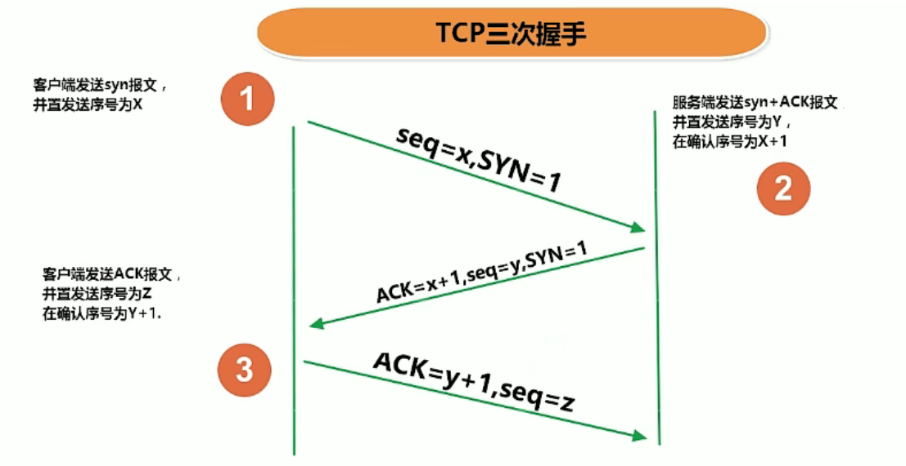
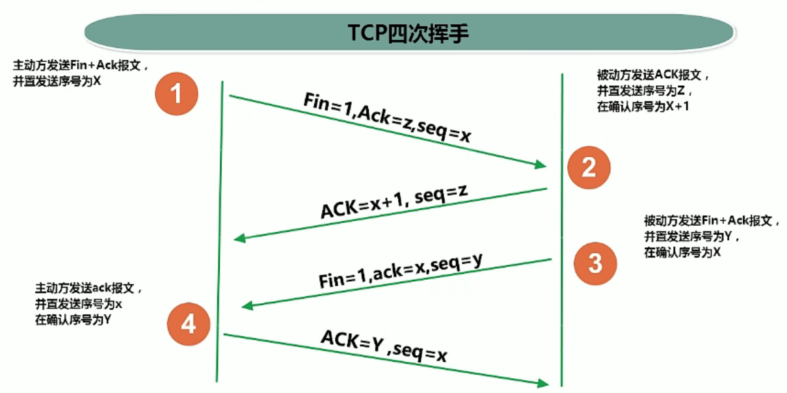

# 14 网络编程

### 14.1  通信要素1：IP和端口号

> IP地址：InetAddress

- 作用：用来唯一标识Internet上的计算机

- 在Java中使用InetAddress类代表IP

- IP地址分类1

  - IPV4：
  - IPV6：

- IP地址分类2

  - 公网地址（万维网使用）
  - 私有地址（局域网使用）

- 本地回路地址：127.0.0.1  对应着localhost

- <front style="background: yellow">InetAddress类的使用</front>

  - 实例化

    - `InetAddress getByName(String host)`：根据指定host获取InetAddress对象。host可以是ip地址，也可以是域名
    - `InetAddress getLocalHost()`：获取本机InetAddress对象

  - 两个常用方法

    - `String getHostName()`：获取InetAddress对象的主机名
    - `String getHostAddress()`：获取InetAddress对象的ip地址

  - 示例

    ```java
    @Test
    public void test1() {
        try {
            InetAddress inte1 = InetAddress.getByName("192.168.23.37");
            System.out.println(inte1);// /192.168.23.37
    
            InetAddress inte2 = InetAddress.getByName("www.baidu.com");
            System.out.println(inte2);// www.baidu.com/180.101.49.13
    
            InetAddress inet3 = InetAddress.getLocalHost();
            System.out.println(inet3); // tangtianhua00/192.168.23.37
    
            String hostName = inet3.getHostName();
            System.out.println(hostName);// tangtianhua00
    
            String hostAddress = inet3.getHostAddress();
            System.out.println(hostAddress);// 192.168.23.37
        } catch (UnknownHostException e) {
            e.printStackTrace();
        }
    ```

> 端口号

- 作用：标识正在计算机上正在运行的程序
- 不同的进程对应不同的端口号
- 端口号的范围：0~65535
- 端口分类：
  - 公认端口：0~1023，被预先定义的服务通信占用
  - 注册端口：1024，分配给用户进程或应用程序
  - 动态/私有端口：49152~65535
- <front style="background: yellow">端口号和IP地址的组合得出一个网络套接字：Socket</front>

### 14.2 通信要素2：网络协议

> 通信协议分层的思想

同层间可以通信，上一层可以调用下一层，隔层不可以通信

> TCP/IP协议簇

- 传输层协议中有两个非常重要的协议

  - 传输控制协议TCP

    - 实用TCP协议前，须先建立TCP连接，行程传输数据通道

    - 传输前，采用“**三次握手**”方式，**点对点通信**，**是可靠的**

      - 第一次握手：客户端发送syn报文，并置发送序号为X
      - 第二次握手：服务端发送syn+ACK报文，并置发送序号为Y，在确认序号为X+1
      - 第三次握手：客户端发送ACK报文，并置发送序号为Z，在确认序号为Y+1

      

    - TCP协议进行通信的两个应用进程：客户端、服务端

    - 在连接中可以**进行大数据量的传输**

    - 传输完毕，需**释放已建立的连接，效率低**。释放连接需要经历“**四次挥手**”

      挥手时，客户端和服务端都可以开始挥手，但是一般都是客户端主动挥手，断开连接

      - 第一次挥手：主动方发送Fin+ACK报文，并置发送序号为X
      - 第二次挥手：被动方发送ACK报文，并置发送序号为Z，在确认序号为X+1
      - 第三次挥手：被动方发送Fin+ACK报文，并置发送序号为Y，在确认序号为X（此时已经断开连接）
      - 第四次挥手：主动方发送ACK报文，并置发送序号为X，在确认序号为Y（此步骤就是为了去验证是否真的断开连接）

      

  - 用户数据报协议UDP

    - 将数据、源、目的封装成数据包，**不需要建立连接**
    - 每个数据报的大小限制在64K内
    - 发送不管对方是否准备好，接收方收到也不需要确认，故**是不可靠的**
    - **可以广播发送**
    - 发送数据结束时**无需释放资源，开销小，速度快**
    - 应用场景：可以接受一部分数据的丢失，比如看网络视频，可以接受一部分帧的丢失，但是不能接受卡顿。

- TCP/IP以其两个主要协议传输控制协议（TCP）和网络互联协议（IP）而得名。实际上是一组协议，包括多个具有不同功能且互为关联的协议

- IP协议是网络层的主要协议，支持网络间互连的数据通信

- TCP/IP协议模型从更实用的角度出发，形成了高效的四层体系结构，即<front style="background: yellow">物理链路层、IP层、传输层、应用层</front>

### 14.3 TCP网络编程

> 例1. 客户端发送信息给服务端，服务端将接收到的数据显示在控制台

【重点难点】：熟悉客户端、服务端Socket的使用

```java
/**
     * 客户端
     */
@Test
public void client() {
    Socket socket = null;
    OutputStream os = null;
    try {
        // 1.创建Socket对象，指明服务器端的IP和端口号
        String serverIp = "127.0.0.1";
        int serverPort = 8899;
        InetAddress serverInet = InetAddress.getByName(serverIp);
        socket = new Socket(serverInet, serverPort);

        // 2.获取一个输出流，用于输出数据
        os = socket.getOutputStream();
        // 3.输出数据
        os.write("你好，我是客户端".getBytes());
    } catch (IOException e) {
        e.printStackTrace();
    } finally {
        // 4.关闭资源
        if (null != os) {
            try {
                os.close();
            } catch (IOException e) {
                e.printStackTrace();
            }
        }

        if (null != socket) {
            try {
                socket.close();
            } catch (IOException e) {
                e.printStackTrace();
            }
        }
    }


}

/**
     * 服务端
     */
@Test
public void server() {
    ServerSocket ss = null;
    Socket socket = null;
    InputStream is = null;
    ByteArrayOutputStream baos = null;
    try {
        // 1.创建服务端Socket-ServerSocket，指明自己的端口号
        ss = new ServerSocket(8899);
        // 2.调用accept()，接收来自于客户端的Socket
        socket = ss.accept();
        // 3.获取输入流，用于接收数据
        is = socket.getInputStream();

        // 4.读取输入流中的数据
        // 方式一：不建议使用，可能会有乱码
        //        byte[] buff = new byte[1024];
        //        int len;
        //        while ((len = is.read(buff)) != -1) {
        //            String str = new String(buff, 0, len);
        //            System.out.println(str);
        //        }

        // 方式二：推荐
        baos = new ByteArrayOutputStream();
        byte[] buffer = new byte[5];
        int len;
        while ((len = is.read(buffer)) != -1) {
            baos.write(buffer, 0, len);
        }

        System.out.println(baos.toString());
        System.out.println("收到了来自于"+socket.getInetAddress().getHostAddress()+"的数据");
    } catch (IOException e) {
        e.printStackTrace();
    } finally {
        // 5.关闭资源
        if (null != baos) {
            try {
                baos.close();
            } catch (IOException e) {
                e.printStackTrace();
            }
        }

        if (null != is) {
            try {
                is.close();
            } catch (IOException e) {
                e.printStackTrace();
            }
        }

        if (null != socket) {
            try {
                socket.close();
            } catch (IOException e) {
                e.printStackTrace();
            }
        }

        if (null != ss) {
            try {
                ss.close();
            } catch (IOException e) {
                e.printStackTrace();
            }
        }
    }
}
```

> 例2. 从客户端发送文件给服务端，服务端保存到本地，并返回“发送成功”给客户端

【重点难点】

- 使用Socket发送、接收图片

- 服务端给用户端发送反馈，客户端接收

  <p><front style="background: yellow">InputStream的read()是个阻塞式的方法。如果客户端没有明确终止数据的发送，服务端的read()就会一直等待。
  因此当客户端需要接收服务端反馈信息时，客户端在发送完数据时，需要显示调用Socket的shutdownOutput()，用以关闭数据的输出</front></p>

```java
/**
 * 客户端
 */
@Test
public void client() {
    Socket socket = null;
    OutputStream os = null;
    BufferedInputStream bis = null;
    InputStream is = null;
    ByteArrayOutputStream baos = null;
    try {
        // 给服务端发送图片
        String serverIp = "127.0.0.1";
        int serverPort = 9900;
        socket = new Socket(InetAddress.getByName(serverIp), serverPort);
        os = socket.getOutputStream();
        bis = new BufferedInputStream(new FileInputStream("big.png"));
        byte[] buff = new byte[1024];
        int len;
        while ((len = bis.read(buff)) != -1) {
            os.write(buff, 0, len);
        }

        // 关闭socket数据的输出，目的是通知客户端数据发送终止
        socket.shutdownOutput();
        // 接收服务端的反馈，并打印到控制台
        is = socket.getInputStream();
        baos = new ByteArrayOutputStream();
        byte[] buff2 = new byte[10];
        int len2;
        while ((len2 = is.read(buff2)) != -1) {
            System.out.println(buff2.length + "-" + len2);
            baos.write(buff2, 0, len2);
        }
        System.out.println(baos.toString());
    } catch (IOException e) {
        e.printStackTrace();
    } finally {
        if (null != baos) {
            try {
                baos.close();
            } catch (IOException e) {
                e.printStackTrace();
            }
        }
        if (null != is) {
            try {
                is.close();
            } catch (IOException e) {
                e.printStackTrace();
            }
        }
        if (null != bis) {
            try {
                bis.close();
            } catch (IOException e) {
                e.printStackTrace();
            }
        }

        if (null != os) {
            try {
                os.close();
            } catch (IOException e) {
                e.printStackTrace();
            }
        }

        if (null != socket) {
            try {
                socket.close();
            } catch (IOException e) {
                e.printStackTrace();
            }
        }
    }
}

/**
 * 服务端
 */
@Test
public void server() {
    ServerSocket ss = null;
    Socket socket = null;
    InputStream is = null;
    BufferedOutputStream bos = null;
    OutputStream os = null;
    try {
        // 接收客户端发送来的图片，并保存到本地
        ss = new ServerSocket(9900);
        socket = ss.accept();
        is = socket.getInputStream();
        Date date = new Date();
        bos = new BufferedOutputStream(new FileOutputStream(date.getTime()+".png"));
        byte[] buff = new byte[1024];
        int len;
        // read()是一个阻塞式的方法。如果客户端socket不停止发送数据，服务端就会一直等待
        while ((len = is.read(buff)) != -1) {
            bos.write(buff, 0, len);
        }

        // 服务端给客户端反馈
        os = socket.getOutputStream();
        os.write("图片保存成功！".getBytes());

    } catch (IOException e) {
        e.printStackTrace();
    } finally {
        if (null != os) {
            try {
                os.close();
            } catch (IOException e) {
                e.printStackTrace();
            }
        }
        if (null != bos) {
            try {
                bos.close();
            } catch (IOException e) {
                e.printStackTrace();
            }
        }

        if (null != is) {
            try {
                is.close();
            } catch (IOException e) {
                e.printStackTrace();
            }
        }

        if (null != socket) {
            try {
                socket.close();
            } catch (IOException e) {
                e.printStackTrace();
            }
        }

        if (null != ss) {
            try {
                ss.close();
            } catch (IOException e) {
                e.printStackTrace();
            }
        }
    }
}
```

### 14.4 UDP网络编程

> 例1. 接收端接收发送端发送的消息，并打印

```java
/**
     * 发送端
     */
@Test
public void sender() {
    DatagramSocket socket = null;
    try {
        socket = new DatagramSocket();

        InetAddress inet = InetAddress.getByName("127.0.0.1");

        String str = "我是UDP方式发送的导弹";
        byte[] data = str.getBytes();
        DatagramPacket packet = new DatagramPacket(data, 0, data.length, inet, 9090);

        socket.send(packet);
    } catch (IOException e) {
        e.printStackTrace();
    } finally {
        if (null != socket) {
            socket.close();
        }
    }
}

/**
     * 接收端
     */
@Test
public void receiver(){
    DatagramSocket socket = null;
    try {
        socket = new DatagramSocket(9090);

        byte[] buffer = new byte[100];
        DatagramPacket packet = new DatagramPacket(buffer, 0, buffer.length);
        socket.receive(packet);

        System.out.println(new String(packet.getData(), 0, packet.getLength()));
    } catch (IOException e) {
        e.printStackTrace();
    } finally {
        if (null != socket) {
            socket.close();
        }
    }

}
```

### 14.5 URL编程

> URL

- URL：统一资源定位符，它表示Internet上某一资源的地址

- 是一种具体的URI，即URL可以用来标识一个资源，而且还指明了如何locate这个资源

- URL的基本结构由5部分组成：

  **<传输协议>://<主机名>:<端口号>/<资源地址>?参数列表**

> URL构造器与常用方法

- `URL(String spec)`：构造器
- `String getProtocol()`：获取URL的协议名
- `String getHost()`：获取URL的主机名
- `int getPort()`：获取URL的端口号
- `String getPath()`：获取URL的文件路径
- `String getFile()`：获取URL的文件名
- `String getQuery()`：获取URL中的参数

```java
@Test
public void test() throws MalformedURLException {
    URL url = new URL("http://localhost:8080/examples/beauty.jpg?username=tth&password=123456");
    // 获取URL的协议名
    System.out.println(url.getProtocol()); // http
    // 获取URL的主机名
    System.out.println(url.getHost()); // localhost
    // 获取URL的端口号
    System.out.println(url.getPort()); // 8080
    // 获取URL的文件路径
    System.out.println(url.getPath()); // /examples/beauty.jpg
    // 获取URL的文件名
    System.out.println(url.getFile()); // /examples/beauty.jpg?username=tth&password=123456
    // 获取URL的参数
    System.out.println(url.getQuery()); // username=tth&password=123456
}
```

> 例1. 从url中下载图片并保存到本地

```java
@Test
public void test2() {
    HttpURLConnection urlConnection = null;
    InputStream is = null;
    FileOutputStream fos = null;
    try {
        // 1.实例化url
        URL url = new URL("http://localhost:8080/examples/lbxx.jpg?username=tth&password=123456");

        // 2.获取HTTP连接
        urlConnection = (HttpURLConnection) url.openConnection();

        // 3.连接
        urlConnection.connect();

        // 4.获取流，下载url中的文件，保存到本地
        is = urlConnection.getInputStream();
        fos = new FileOutputStream("lbxx.jpg");
        byte[] buff = new byte[1024];
        int len;
        while ((len = is.read(buff)) != -1) {
            fos.write(buff, 0, len);
        }

        System.out.println("图片保存成功！");
    } catch (IOException e) {
        e.printStackTrace();
    } finally {
        // 5.关闭资源
        if (null != fos) {
            try {
                fos.close();
            } catch (IOException e) {
                e.printStackTrace();
            }
        }

        if (null != is) {
            try {
                is.close();
            } catch (IOException e) {
                e.printStackTrace();
            }
        }

        if (null != urlConnection) {
            urlConnection.disconnect();
        }
    }
}
```

