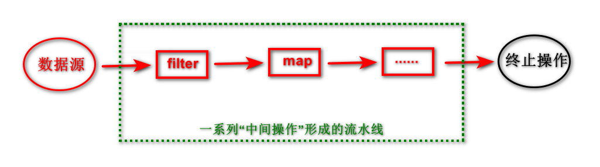

# 16 Java8新特性

Java8中最重要的两大改变：<front color=red>Lambda表达式</front>、<front color=red>Stream API</front>

## 16.1 接口新特性

> JDK8以后，接口既可以定义全局常量、抽象方法，也可以定义静态方法、默认方法。

- 定义静态方法（public static）：接口中定义的静态方法，只能通过接口来调用
- 定义默认方法（public default）：
  - 可以通过实现类的对象，调用接口中的默认方法
  - 实现类可以重写接口的默认方法
  - 如果子类（或实现类）继承的父类和实现的接口中，声明了同名、同参的默认方法，那么子类在没有重写此方法的情况下，默认调用的是父类中的方法 ---> <front style="background: yellow">类优先原则</front>
  - 如果实现类实现了多个接口，且这多个接口中定义了同名、同参的默认方法，在实现类没有重写此方法的情况下，编译报错 ---> <front style="background: yellow">接口冲突</front>
    - 如果想解决以上冲突，必须在实现类中重写此方法。 
  - 如何在子类（或实现类）的方法中调用父类、接口中被重写的方法？
    - 调用父类中声明的方法：`super.方法`
    - 调用接口中默认的方法：`接口名.super.方法`

## 16.2 新的日期时间API

具体使用见[9.2.2 JDK8中新的日期时间API](/tang/java/java系统学习/09_Java常用类.html#_9-2-2-jdk8中新的日期时间api)小节

> JDK8新增的日期时间API

- java.time.LocalDate：获取日期
- java.time.LocalTime：获取时间
- java.time.LocalDateTime：获取日期+时间
- java.time.Instant：瞬时，等同于Date中的getTime()
- java.time.format.DateTimeFormatter：时间格式化
- 其他API：
  - java.time.ZoneId：时区相关操作
  - java.time.ZonedDateTime：带时区的日期时间
  - java.time.Clock：使用时区提供对当前即时、日期、和时间的访问的时钟
  - java.time.Duration：用来计算两个**时间**的间隔，可以获取秒级间隔，也可以获取纳秒级间隔
  - java.time.Period：用来计算两个**日期**的间隔
  - java.time.temporal.TemporalAdjuster：时间校正器。如获取当前日期的下一个工作日等
  - java.time.temporal.TemporalAdjusters：该类通过静态方法提供了大量的TemporalAdjuster实现

## 16.3 注解新特性

具体使用见[10.2.6 JDK8中注解新特性](/tang/java/java系统学习/10_枚举_注解.html#_10-2-6-jdk8中注解新特性)小节

- <front style="background: yellow">可重复注解</front>：在一个类或者属性或其他结构上使用多次相同注解
- <front style="background: yellow">类型注解</front>：
  - JDK8之前，注解只能是在声明的地方使用；JDK8之后，注解可以应用在任何地方。
  - JDK8之后，元注解@Target的参数类型ElementType枚举值多了两个：
    - ElementType.TYPE_PARAMETER：表示该注解能写在类型变量的声明语句中（如泛型声明）
    - ElementType.TYPE_USE：表示该注解能写在使用类型的任何语句中

## 16.4 Lambda表达式

> 格式

- `->`：lambda操作符 或 箭头操作符
- `-> 左边`：lambda形参列表，即接口中抽象方法的形参列表
- `-> 右边`：lambda体，即重写的抽象方法的方法体

> 举例

`(o1, o2) -> Interger.compare(o1,o2)`

> lambda的使用

- `-> 左边`：
  - lambda形参列表的参数类型可以省略（类型推断）
  - 如果lambda形参列表只有一个参数，其一对()可以省略
- `-> 右边`：
  - lambda体应该使用一对{}包裹
  - 如果lambda体只有一条执行语句（可能是return语句），可以省略一对{}和return关键字（如果省略{}，return必须省略）

>使用举例

```java
@Test
public void test1() {
    // 不使用lambda表达式
    Consumer<String> con1 = new Consumer<String>() {
        @Override
        public void accept(String s) {
            System.out.println(s);
        }
    };
    con1.accept("辞暮尔尔，烟火年年");

    System.out.println("****************************************");

    // 使用lambda表达式：一个参数，可以省略形参的()；抽象方法中只有一句代码，可以省略方法体的{}
    Consumer<String> con2 = s -> System.out.println(s);
    con2.accept("辞暮尔尔，烟火年年");
}

@Test
public void test2() {
    // 不使用lambda表达式
    Comparator<Integer> com1 = new Comparator<Integer>() {
        @Override
        public int compare(Integer o1, Integer o2) {
            return Integer.compare(o1, o2);
        }
    };
    System.out.println(com1.compare(12, 13));

    System.out.println("****************************************");

    // 使用lambda表达式：两个参数，形参列表的()不可省；抽象方法中只有一句代码，可以省略{}和return
    Comparator<Integer> com2 = (o1, o2) ->  Integer.compare(o1, o2);
    System.out.println(com2.compare(2, 1));
}
```

>lambda表达式的本质

<p><front style="background: yellow">lambda表达式是接口的实例。</front></p>

- <front style="background: yellow">接口的要求</front>：接口必须是函数式接口
- 以前用匿名实现类表示的，现在都可以用Lambda表达式来写

## 16.5 函数式(Functional)接口

> 定义

如果一个接口中，只声明了一个(抽象)方法，那么这个接口就叫函数式接口。(接口中的方法都是抽象方法)

- 自定义函数式接口时，可以在接口上加上`@FunctionalInterface`注解。这样可以检查它是否是一个函数式接口
- 在java.util.function包下定义了Java8的丰富的函数式接口

> Java内置四大核心函数式接口

| 函数式接口                | 参数类型 | 返回类型 | 用途                                                         |
| ------------------------- | -------- | -------- | ------------------------------------------------------------ |
| Consumer&lt;T&gt; 消费型接口    | T        | void     | 对类型为T的对象应用操作，包含方法：void accept(T t)          |
| Supplier&lt;T&gt; 供给型接口    | 无       | T        | 返回类型为T的对象，包含方法：T get()                         |
| Function<T, R> 函数型接口 | T        | R        | 对类型为T的对象应用操作，并返回R类型的结果，包含方法：R apply(T) |
| Predicate&lt;T&gt; 判定型接口   | T        | boolean  | 确定类型为T的对象是否满足约束，并返回boolean值，包含方法：boolean test(T t) |

## 16.6 方法引用与构造器引用

### 16.6.1 方法引用

> 概述

- 当要传递给Lambda体的操作，已经有实现的方法了，就可以使用方法引用
- 方法引用可以看做是Lambda表达式深层次的表达。换句话说，方法应用就是Lambda表达式，也就是函数式接口的一个实例，通过方法的名字来指向一个方法，可以认为是Lambda表达式的一个语法糖
- <front style="background: yellow">要求</front>：实现接口的抽象方法的参数列表和返回值类型，必须与方法引用的方法的参数列表和返回值类型保持一致
- <front style="background: yellow">格式</front>：使用操作符`::`将类（或对象）与方法名分隔开来
- <front style="background: yellow">三种主要使用情况</front>：(注意，::右侧都是方法名，不需要参数)
  - 对象::实例方法名
  - 类::静态方法名
  - 类::非静态方法名

> 举例

- 情况一：对象 :: 实例方法

  ```java
  /**
   * 情况一： 对象 :: 实例方法
   *
   * Consumer中的void accept(T t)
   * PrintStream中的void println(String x)
   */
  @Test
  public void test1() {
      // 原Lambda表达式写法
      Consumer<String> con1 = str -> System.out.println(str);
      con1.accept("帘外雨潺潺，春意阑珊。");
  
      System.out.println("**************************************");
  
      // 方法引用写法
      PrintStream out = System.out;
      Consumer<String> con2 = out :: println;
      con2.accept("罗衾不耐五更寒。");
  }
  ```

- 情况二：类 :: 静态方法

  ```java
  /**
   * 情况二： 类 :: 静态方法
   *
   * Comparator中的int compare(T o1, T o2)
   * Integer中的int compareTo(Integer anotherInteger)
   */
  @Test
  public void test2() {
      // 原Lambda写法
      Comparator<Integer> com1 = (o1, o2) -> Integer.compare(o1, o2);
      System.out.println(com1.compare(12, 13));
  
      System.out.println("**************************************");
  
      // 方法引用写法
      Comparator<Integer> com2 = Integer::compareTo;
      System.out.println(com2.compare(12, 13));
  }
  ```

- 情况三：类 :: 静态方法

  <p><front style="background: yellow">①中方法参数多于②中方法参数，且①中第一个参数作为②中方法调用者，①中第二个（及以后的）参数作为②中方法参数</front></p>

  ```java
  /**
   * 情况三： 类 :: 静态方法
   *
   * ① Comparator中的int compare(T t1, T t2)
   * ② String中的int t1.compareTo(t2)
   */
  @Test
  public void test3() {
      // 原Lambda写法
      Comparator<String> com1 = (t1, t2) -> t1.compareTo(t2);
      System.out.println(com1.compare("abc", "abd"));
  
      System.out.println("**************************************");
  
      // 方法引用写法
      Comparator<String> com2 = String :: compareTo;
      System.out.println(com2.compare("abc", "abm"));
  }
  ```

### 16.6.2 构造器引用

> 概述

和方法引用类似。

- 使用场景：函数式接口的抽象方法的形参列表和构造器的形参列表一致`且`抽象方法的返回值即为构造器所属的类的类型

> 使用举例

```java
/**
 * 空参构造器
 * Supplier<T>中的 T get()
 */
@Test
public void test1() {
    //
    Supplier<Person> sup1 = () -> new Person();
    System.out.println(sup1.get());

    System.out.println("*******************************************");

    Supplier<Person> sup2 = Person::new;
    System.out.println(sup2.get());
}

/**
 * 含一个参数的构造器
 * Function<T, R>中的R apply(T t)
 */
@Test
public void test2() {
    Function<String, Person> fun1 = name -> new Person(name);
    System.out.println(fun1.apply("Tom"));

    System.out.println("*******************************************");

    Function<String, Person> fun2 = Person::new;
    System.out.println(fun2.apply("张三"));
}

/**
 * 含2个参数的构造器
 * BiFunction<T, U, R>中的R apply(T t, U u)
 */
@Test
public void test3() {
    BiFunction<String, Integer, Person> bi1 = (name, age) -> new Person(name, age);
    System.out.println(bi1.apply("Steven", 18));

    System.out.println("*******************************************");

    BiFunction<String, Integer, Person> bi2 = Person::new;
    System.out.println(bi2.apply("李四", 22));
}
```

### 16.6.3 数组引用

> 概述

可以将数组引用看做是一个特殊的类，写法与构造器引用一致

> 使用举例

```java
@Test
public void test() {
    Function<Integer, String[]> fun1 = length -> new String[length];
    String[] arr1 = fun1.apply(5);
    System.out.println(Arrays.toString(arr1));

    System.out.println("************************************************");

    Function<Integer, String[]> fun2 = String[] :: new;

    String[] arr2 = fun2.apply(10);
    System.out.println(Arrays.toString(arr2));
}
```

## 16.7 Stream API

### 16.7.1 概述

- Stream API(java.util.stream)把真正的函数式变成风格引入到Java中

- 可以使用Stream API对集合数据进行操作，如过滤、查询、排序等

- 为什么要用Stream API？

  实际开发中，项目中多数数据源都来自于MySQL、Oracle等。但是对于像MongoDB、Radis等NoSql中获取的数据需要在Java层面去处理。

- Stream和Collection的区别

  - Collection是一种静态的内存数据结构；Stream是有关计算的
  - Collection主要是面向内存，存储在内存中；Stream主要是面向CPU，通过CPU实现计算

- 注意：

  - Stream不会存储数据
  - Stream不会改变源对象，会返回一个持有结果的新的Stream ---- `Stream 的不可变性`
  - Stream操作是延迟执行的。这意味着他们会等到结果的时候才执行

### 16.7.2 Stream的操作三个步骤

- ①创建Stream

  一个数据源（如集合、数组），获取一个流

- ②中间操作

  一个中间操作链，对数据源的数据进行处理

- ③终止操作（终端操作）

  一旦执行终止操作，就执行中间操作链，并产生结果。之后不会再被使用



### 16.7.3 Stream的实例化

- 通过集合实例化

  - `Stream<E> stream()`：返回一个顺序流
  - `Stream<E> parallelStream()`：返回一个并行流

- 通过数组实例化

  - 调用Arrays 的`static <T> Stream<T> stream(T[] array)`方法

- 通过Stream的`static<T> Stream<T> of(T... values)`方法实例化

- 创建无限流 ---- 用于造数据

  - 调用Stream的`static<T> Stream<T> iterate(final T seed, final UnaryOperator<T> f)`方法
  - 调用Stream的`static<T> Stream<T> generate(Supplier<T> s)`方法

- 举例说明

  ```java
  /**
   * 通过集合实例化
   */
  @Test
  public void test1() {
      List<Person> persons = new ArrayList<Person>(){
          { add(new Person(1001, "张1", 18, 5600)); }
          { add(new Person(1002, "张2", 17, 7200)); }
          { add(new Person(1003, "张3", 16, 3400)); }
          { add(new Person(1004, "张4", 20, 8900)); }
          { add(new Person(1005, "张5", 19, 5400)); }
          { add(new Person(1006, "张6", 18, 5600)); }
      };
  
      // 创建顺序流
      Stream<Person> stream = persons.stream();
  
      // 创建并行流
      Stream<Person> personStream = persons.parallelStream();
  }
  
  /**
   * 通过数组实例化
   */
  @Test
  public void test2() {
      Person[] arr = new Person[] {
              new Person(1001, "张1", 18, 5600),
              new Person(1002, "张2", 17, 7200),
              new Person(1003, "张3", 16, 3400),
              new Person(1004, "张4", 20, 8900),
              new Person(1005, "张5", 19, 5400),
              new Person(1006, "张6", 18, 5600)
      };
  
      Stream<Person> stream = Arrays.stream(arr);
  }
  
  /**
   * 通过Stream.of()实例化
   */
  @Test
  public void test3() {
      Stream<Person> stream = Stream.of(new Person(1001, "张1", 18, 5600),
              new Person(1002, "张2", 17, 7200),
              new Person(1003, "张3", 16, 3400),
              new Person(1004, "张4", 20, 8900),
              new Person(1005, "张5", 19, 5400),
              new Person(1006, "张6", 18, 5600));
  
  }
  
  /**
   * 创建无限流---用来造数据
   */
  @Test
  public void test4() {
      // 获取前10个偶数
      Stream<Integer> stream1 = Stream.iterate(0, t -> t + 2).limit(10);
      stream1.forEach(System.out :: println);
  
      System.out.println("********************************");
  
      // 获取10个随机数
      Stream<Double> stream2 = Stream.generate(Math::random).limit(10);
      stream2.forEach(d -> System.out.println(d));
  } 
  ```

### 16.7.4 Stream的中间操作

多个<front color=red>中间操作</front>可以连接起来行程一个<front color=red>流水线</front>。除非流水线上触发终止操作，
否则<front color=red>中间操作不会执行任何的处理</front>！而是<front color=red>在终止操作时一次性全部处理</front>。
这称为“<front color=red>惰性求值</front>”。

> 筛选与切片

| 方法                | 描述                                                         |
| ------------------- | ------------------------------------------------------------ |
| filter(Predicate p) | 接收Lambda，从流中排除某些元素                               |
| distinct()          | 筛选，通过流元素生成的hasCode()和equals()去除重复元素        |
| limit(long maxSize) | 截断流，使其元素不超过指定数量                               |
| ship(long n)        | 跳过元素，返回一个扔掉了前n个元素的流。若流中元素不足n个，则返回一个空流。与limit(n)互补 |

> 映射

| 方法                                                         | 描述                                                         |
| ------------------------------------------------------------ | ------------------------------------------------------------ |
| <front color=red>map(Function f)</front>                           | 接收一个函数作为参数，将元素转换成其他形式或提取信息，该函数会被应用到每个元素上，并将其映射成一个新的元素。 |
| <front color=red>flatMap(Function f)</front>                       | 接收一个函数作为参数，将流中的每个值都换成另一个流，然后把所有的流连接成一个流。 |
| mapToDouble(ToDoubleFunction f)与flatMapToDouble(ToDoubleFunction f) | 接收一个函数作为参数，该函数会被应用到每个元素上，产生一个新的DoubleStream |
| mapToInt(ToIntFunction f)与flatMapToInt(ToIntFunction f)     | 接收一个函数作为参数，该函数会被应用到每个元素上，产生一个新的IntStream |
| mapToLong(ToLongFunction f)与flatMapToLong(ToLongFunction f) | 接收一个函数作为参数，该函数会被应用到每个元素上，产生一个新的LongStream |

<p><front style="background: yellow">map(Function f)和flatMap(Function f)的区别：</front></p>

`答`：map(Function f)类似于List中的add()，flatMap(Function f)类似于List中的addAll()。

> 排序

| 方法                          | 描述                                                 |
| ----------------------------- | ---------------------------------------------------- |
| sorted()                      | 产生一个新流，其中按自然顺序排序                     |
| sorted(Comparator comparator) | 产生一个新柳，其中按照自定义的Comparator实现定制排序 |

> 例子

- 测试类：

  ```java
  /**
   * @Author tth
   * @Date 2023/1/3 16:46
   */
  public class StreamAPITest2 {
  
      /**
       * Stream的筛选与切片
       */
      @Test
      public void test1() {
          List<Person> persons = Person.getPersons();
  
          // 练习：查询员工中薪资超过6000的员工，并打印
          persons.stream().filter(p -> p.getSalary() > 6000).forEach(System.out :: println);
  
          System.out.println("***********************************************************************");
  
          // 练习：截断流，使其元素不超过指定元素
          persons.stream().limit(3).forEach(System.out :: println);
  
          System.out.println("***********************************************************************");
  
          // 练习：跳过元素，返回一个扔掉了前n个元素的流。若流中元素不足n个，则返回一个空流。与limit(n)互补
          persons.stream().skip(3).forEach(System.out :: println);
  
          System.out.println("***********************************************************************");
  
          // 练习：筛选，通过流元素生成的hasCode()和equals()去除重复元素
          persons.stream().distinct().forEach(System.out :: println);
      }
  
      @Test
      public void test2() {
          List<Person> persons = Person.getPersons();
  
          // 练习：获取员工姓名长度大于3的人员的姓名
          persons.stream().filter(e -> e.getName().length()>3).map(Person::getName).forEach(System.out :: println);
      }
  
      /**
       * <R> Stream<R> map(Function f) 和
       */
      @Test
      public void test2_1() {
          List<String> list = Arrays.asList("aa", "bb", "cc", "dd");
          Stream<Stream<Character>> stream1 = list.stream().map(StreamAPITest2::fromStringToStream);
          stream1.forEach(s -> {
              s.forEach(System.out :: println);
          });
  
          System.out.println("********************************************");
  
          Stream<Character> stream2 = list.stream().flatMap(StreamAPITest2::fromStringToStream);
          stream2.forEach(System.out :: println);
  
      }
  
      /**
       * 将字符串str中的多个字符构成的集合转换为Stream实例。
       *  即将字符串str转成Stream实例
       * @param str
       * @return
       */
      public static Stream<Character> fromStringToStream(String str) {
          ArrayList<Character> list = new ArrayList<>();
          for(Character c : str.toCharArray()) {
              list.add(c);
          }
          return list.stream();
      }
  
      @Test
      public void test3() {
          // 练习：通过sorted()实现自然排序
          List<Integer> list = Arrays.asList(12, 3, 99, 10, 78, 67, 88);
          list.stream().sorted().forEach(System.out :: println);
  
          System.out.println("***********************************************************************");
          
          // 练习：通过sorted(Comparator comparator)实现定制排序
          List<Person> persons = Person.getPersons();
          persons.stream().sorted(((o1, o2) -> {
              int compare = Integer.compare(o1.getAge(), o2.getAge());
              if (compare != 0) {
                  return compare;
              } else {
                  return Double.compare(o1.getSalary(), o2.getSalary());
              }
          })).forEach(System.out :: println);
      }
  }
  ```

- 实体类：

  ```java
  /**
   * @Author tth
   * @Date 2023/1/3 15:05
   */
  public class Person {
      private String name;
      private Integer age;
      private Integer id;
      private double salary;
  
      public Person() {
      }
  
      public Person(String name) {
          this.name = name;
      }
  
      public Person(String name, Integer age) {
          this.name = name;
          this.age = age;
      }
  
      public Person(Integer id, String name, Integer age, double salary) {
          this.name = name;
          this.age = age;
          this.id = id;
          this.salary = salary;
      }
  
      public String getName() {
          return name;
      }
  
      public void setName(String name) {
          this.name = name;
      }
  
      public Integer getAge() {
          return age;
      }
  
      public void setAge(Integer age) {
          this.age = age;
      }
  
      public Integer getId() {
          return id;
      }
  
      public void setId(Integer id) {
          this.id = id;
      }
  
      public double getSalary() {
          return salary;
      }
  
      public void setSalary(double salary) {
          this.salary = salary;
      }
  
      @Override
      public String toString() {
          return "Person{" +
                  "name='" + name + '\'' +
                  ", age=" + age +
                  ", id=" + id +
                  ", salary=" + salary +
                  '}';
      }
  
      @Override
      public boolean equals(Object o) {
          if (this == o) return true;
          if (o == null || getClass() != o.getClass()) return false;
          Person person = (Person) o;
          return Double.compare(person.salary, salary) == 0 &&
                  name.equals(person.name) &&
                  age.equals(person.age) &&
                  id.equals(person.id);
      }
  
      @Override
      public int hashCode() {
          return Objects.hash(name, age, id, salary);
      }
  
      public static List<Person> getPersons() {
          return new ArrayList<Person>(){
              { add(new Person(1001, "张1", 18, 5600)); }
              { add(new Person(1002, "张2强", 17, 7200)); }
              { add(new Person(1003, "张3", 16, 3400)); }
              { add(new Person(1004, "张4凭栏", 20, 8900)); }
              { add(new Person(1005, "张5", 19, 5400)); }
              { add(new Person(1005, "张5", 19, 5400)); }
              { add(new Person(1006, "张6阑珊", 18, 7400)); }
              { add(new Person(1006, "张6", 18, 2100)); }
          };
      }
  }
  ```

### 16.7.5 Stream的终止操作

> 匹配与查找

| 方法                  | 描述                                                         |
| --------------------- | ------------------------------------------------------------ |
| allMatch(Predicate p) | 检查是否匹配所有元素                                         |
| anyMatch(Predicate p) | 检查是否至少匹配一个元素                                     |
| noneMatch()           | 检查是否没有匹配所有元素                                     |
| findFirst()           | 返回第一个元素                                               |
| findAny()             | 返回当前流中任意元素                                         |
| count()               | 返回流中元素总数                                             |
| max(Comparator c)     | 返回流中最大值                                               |
| min(Comparator c)     | 返回流中最小值                                               |
| forEach(Consumer c)   | 内部迭代（使用Collection接口需要用户去做迭代的方法，称为外部迭代。相反Stream API使用内部迭代） |

> 规约

| 方法                             | 描述                                                         |
| -------------------------------- | ------------------------------------------------------------ |
| reduce(T iden, BinaryOperator b) | 可以将流中元素反复结合起来，得到一个值。参数iden表示初始值。返回值类型为T |
| reduce(BinaryOperator b)         | 可以将流中元素反复结合起来，得到一个值。返回值类型为Optional&lt;T&gt; |

<p><front style="background: yellow">注：</front></p>

map和reduce的连接通常称为map-reduce模式，因Google用它来进行网络搜索而出名

<p><front style="background: yellow">用途：</front></p>

如计算`List<Employee>`中员工工资的总和

> 收集

| 方法                 | 描述                                                         |
| -------------------- | ------------------------------------------------------------ |
| collect(Collector c) | 将流转换为其他形式。接收一个Collector接口的实现，用于给Stream中元素做汇总的方法 |

<p><front style="background: yellow">注：</front></p>

`Collector`接口中方法的实现决定了如何对流执行收集的操作（如收集到List、Set、Map）。另外`Collectors`实用类提供了很多静态方法，可以便捷的创建常见收集器实例，常见方法如下：

| 方法                                     | 返回值类型           | 作用                                  |
| ---------------------------------------- | -------------------- | ------------------------------------- |
| toList()                                 | List&lt;T&gt;              | 把流中元素收集到List                  |
| toSet()                                  | Set&lt;T&gt;               | 把流中元素收集到Set                   |
| toCollection(Supplier collectionFactory) | Collection&lt;T&gt;        | 把流中元素收集到创建的集合            |
| counting()                               | Long                 | 计算流中元素的个数                    |
| summingInt(ToIntFunction mapper)         | Integer              | 对流中元素的整数属性求和              |
| averagingInt(ToIntFunction  mapper)      | Double               | 对流中元素的整数属性求平均值          |
| summarizingInt(ToIntFunction  mapper)    | IntSummaryStatistics | 收集流中Integer属性的统计值，如平均值 |

> 举例

- 测试类：

  ```java
  /**
   * 测试Stream的终止操作
   * @Author tth
   * @Date 2023/1/4 10:31
   */
  public class StreamAPITest3 {
  
      /**
       * 匹配与查找
       */
      @Test
      public void test1() {
          List<Person> persons = Person.getPersons();
  
          // 练习：判断是否所有人员的年龄都不小于16岁
          boolean allMatch = persons.stream().allMatch(p -> p.getAge() >= 16);
          System.out.println(allMatch);
  
          System.out.println("**************************************************************************");
  
          // 练习：判断是否存在人员的工资大于10000
          boolean anyMatch = persons.stream().anyMatch(p -> p.getSalary() > 10000);
          System.out.println(anyMatch);
  
          System.out.println("**************************************************************************");
  
          // 练习：判断是否存在人员姓“诸葛”
          // noneMatch：检查是否没有匹配的元素。如果有姓“诸葛”的，返回false；否则返回true
          boolean noneMatch = persons.stream().noneMatch(p -> p.getName().startsWith("诸葛"));
          System.out.println(noneMatch);
  
          System.out.println("**************************************************************************");
  
          // 练习：返回第一个人员信息
          // Optional类是用来处理空指针类型的。后边讲
          Optional<Person> first = persons.stream().findFirst();
          System.out.println(first);
  
          System.out.println("**************************************************************************");
  
          // 练习：随机返回一个人员信息
          // 注意：使用findAny()时，在获取Stream实例的时候，最好用List.parallelStream()，才会随机返回一个。使用List.stream()只能返回第一个
          Optional<Person> any2 = persons.parallelStream().findAny();
          System.out.println(any2);
  
          System.out.println("**************************************************************************");
  
          // 练习：求人员列表中年龄在18岁以下的人员的个数
          long count = persons.stream().filter(person -> person.getAge() < 18).count();
          System.out.println(count);
  
          System.out.println("**************************************************************************");
  
          // 练习：返回最高的工资
          Optional<Double> max = persons.stream().map(person -> person.getSalary()).max(Double::compareTo);
          System.out.println(max);
  
          System.out.println("**************************************************************************");
  
          // 练习：返回最低工资的员工
          Optional<Person> minSalaryPerson = persons.stream().min((p1, p2) -> Double.compare(p1.getSalary(), p2.getSalary()));
          System.out.println(minSalaryPerson);
  
          System.out.println("**************************************************************************");
  
          // 练习：内部迭代
          persons.stream().forEach(System.out :: println);
      }
  
      /**
       * 规约
       */
      @Test
      public void test2() {
          // 练习1：计算1-10的自然数的值
          List<Integer> list = Arrays.asList(1, 2, 3, 4, 5, 6, 7, 8, 9, 10);
          Integer sum = list.stream().reduce(0, Integer::sum);
          System.out.println(sum);
  
          // 练习2：计算人员工资的总和
          List<Person> persons = Person.getPersons();
          Optional<Double> reduce = persons.stream().map(person -> person.getSalary()).reduce(Double::sum);
          // 如果不知道Double.sum(double a, double b)方法，可以使用如下方法计算总和
  //        Optional<Double> reduce2 = persons.stream().map(person -> person.getSalary()).reduce((d1, d2) -> d1 + d2);
          System.out.println(reduce);
      }
  
      /**
       * 收集
       */
      @Test
      public void test3() {
          List<Person> persons = Person.getPersons();
          // 练习： 查找工资大于6000的人员，结果返回一个List
          List<Person> collect = persons.stream().filter(person -> person.getSalary() > 6000).collect(Collectors.toList());
          System.out.println(collect);
  
          System.out.println();
  
          // 练习：查找工资大于6000的人员，结果返回一个Set
          Set<Person> collect1 = persons.stream().filter(person -> person.getSalary() > 6000).collect(Collectors.toSet());
          System.out.println(collect1);
      }
  }
  ```

- 实体类

  见[16.7.4 中间操作](/tang/java/java系统学习/16_Java8新特性.html#_16-7-4-stream的中间操作)中的实体类。

## 16.8 Optional类

> 概述

`Optional<T>`类（java.util.Optional）是一个容器类，它可以保存类型T的值，代表这个值存在。或者仅仅保存null，表示这个值不存在。
原来用null表示一个值不存在，现在Optional可以更好的表达这个概念，并且<front style="background: yellow">可以避免空指针异常</front>。Optional中提供了很多方法，这样就不用显示进行空值j检测

> Optional相关方法

- 创建Optional类对象
  - `Optional.of(T t)`：创建一个Optional实例，t必须非空
  - `Optional.empty()`：创建一个空的Optional实例
  - `Optional.ofNullable(T t)`：t可以为空
- 判断Optional容器中是否包含对象
  - `boolean isPresent()`：判断是否包含对象
  - `void ifPresent(Consumer c)`：如果有值，就执行Consumer接口的实例代码，并且该值会作为参数传给它
- 获取Optional容器的对象
  - `T get()`：如果调用对象包含值，返回该值，否则抛异常
  - `T orElse(T other)`：如果有值将其返回，否则返回指定的other对象
  - `T orElseGet(Supplier s)`：如果有值将其返回，否则抛出由Supplier接口提供的异常

> 举例：Optional是如何避免空指针的

重要方法：

- `Optional<T> ofNullable(T value)`：获取Optional实例
- `T orElse(T other)`：或uOptiona实例的对象

```java
@Test
public void test2() {
    Boy boy = null;
    String girName = getGirName(boy);
    System.out.println(girName);
}

/**
 * 返回boy中girl对象的名字
 *  Optional<T> ofNullable(T value) 与 T orElse(T other)的使用
 * @param boy
 * @return
 */
public String getGirName(Boy boy) {
    // 如果使用下面语句，当boy为空或者boy中girl的属性为空时，都会报空指针异常
    // return boy.getGirl().getName();

    // 使用Optional避免空指针异常
    Optional<Boy> boyOptional = Optional.ofNullable(boy);
    // 此时boy1一定非空，且boy1中的girl也一定非空
    Boy boy1 = boyOptional.orElse(new Boy(new Girl("迪丽热巴")));
    return boy1.getGirl().getName();
}
```

## 16.9 try语句的优化

Java8中可以实现<front style="background: yellow">资源的自动关闭</front>，<front color=red>要求执行后要关闭的资源必须在try的一对小括号中初始化</front>，否则编译不通过。

```java
@Test
public void test2() {
    // java8之前的写法
    //        InputStreamReader reader = null;
    //        try {
    //            reader = new InputStreamReader(System.in);
    //            char[] buff = new char[1024];
    //            int len;
    //            while ((len = reader.read(buff)) != -1) {
    //                String str = new String(buff, 0, len);
    //                System.out.println(str);
    //            }
    //        } catch (IOException e) {
    //            e.printStackTrace();
    //        } finally {
    //            if (null != reader) {
    //                try {
    //                    reader.close();
    //                } catch (IOException e) {
    //                    e.printStackTrace();
    //                }
    //            }
    //        }

    // java8写法：资源的实例化必须写在try的()中
    try(InputStreamReader reader = new InputStreamReader(System.in)) {
        char[] buff = new char[1024];
        int len;
        while ((len = reader.read(buff)) != -1) {
            String str = new String(buff, 0, len);
            System.out.println(str);
        }
    } catch (IOException e) {
        e.printStackTrace();
    }
}

```

## 16.10 其他新特性

- 通用目标类型推断
- JDK的更新：
  - 集合的流式操作
  - 并发
  - Arrays
  - Number和Math
  - IO/NIO的改进
  - Reflection获取形参名
  - String：join()
  - Files
- 新编译工具：
  - jjs
  - jdeps
- JVM中Metaspace取代PermGen空间