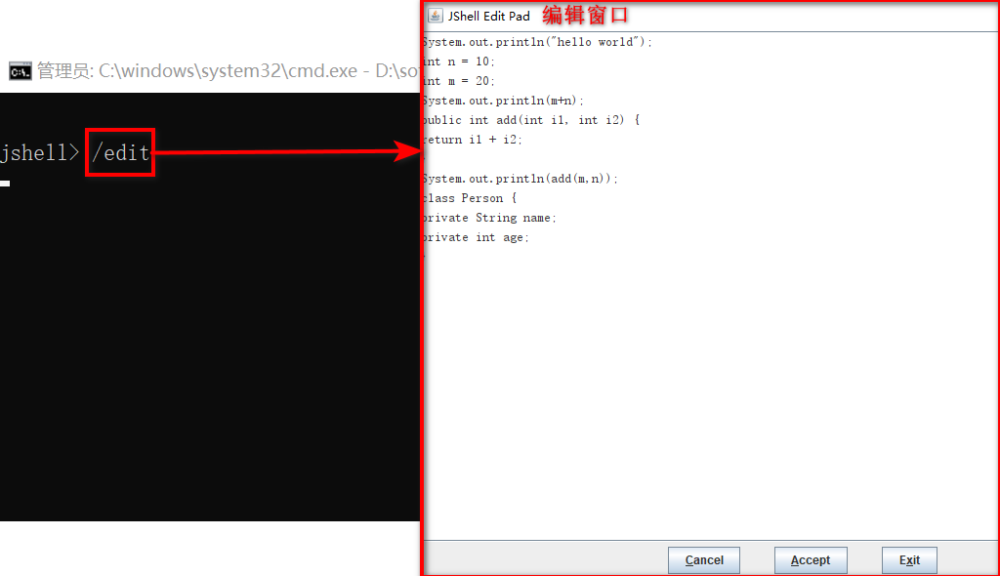
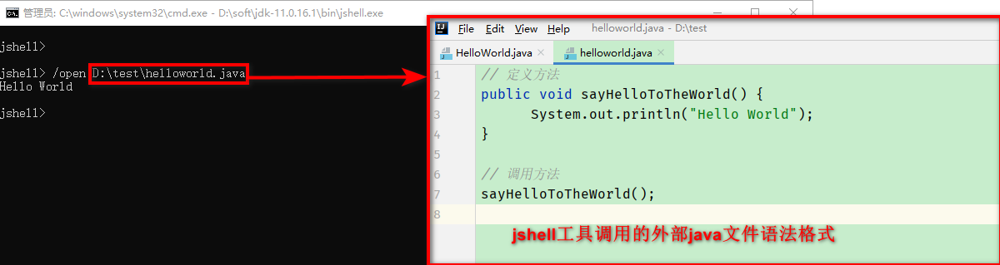
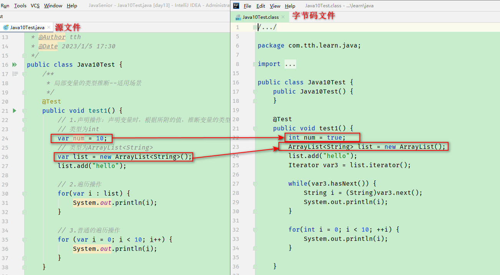

# 17 Java9&10&11新特性

> 概述

- 从java9开始，java的从<front style="background: yellow">以特性驱动</front>的发布周期转变为<front style="background: yellow">以时间驱动</front>的发布周期。
Java的计划发布周期是<front style="background: yellow">6个月</front>，Oracle（在Java11之后）将以<front style="background: yellow">三年为周期</front>发布长期支持版本。
- java9、java10不是长期支持的版本，java11是长期支持的版本。因此可以不用安装java9、java10，直接安装java11就行

## 17.1 Java9新特性

Java9中最重要的两大改变：<front color=red>模块化系统</front>、<front color=red>jshell命令</front>

> 概述

Java9提供了<front style="background: yellow">超过150项新功能</front>特性，包括备受期待的模块化系统、可交互的REPL工具（jshell、JDK编译工具）、Java公共API和私有代码，以及安全增强、扩展提升、性能管理改善等。可以说<front style="background: yellow">Java9是一个庞大的系统工程，完全做了一个整体改变</front>。

> Java9中不得不说的新特性

- 最主要之一：<front style="background: yellow">模块化系统</front>
- 最主要之二：<front style="background: yellow">jshell命令</front>
- 多版本兼容jar包
- 语法改进之一：接口的私有方法
- 语法改进之二：钻石操作符(<>)的使用升级
- 语法改进之三：语法改进：try
- API改进之一：String存储结构变更
- API改进之二：便利的集合特性--of()创建只读集合
- API改进之三：增强的Stream API
- API改进之四：全新的HTTP客户端API
- API改进之五：Deprecated的相关API
- javadoc的HTML5支持
- JavaScript引擎升级--Nashorn（Java11中被干掉了）
- java的动态编译器

### 17.1.1 模块化系统

> 模块化系统提出的背景

<front style="background: yellow">谈到Java9大家往往第一个想到的就是Jigsaw项目。</front>Java自出生以来，Java和相关生态在不断丰富的同时，也暴露出一些问题：

- **Java运行环境的膨胀和臃肿**。每次启动JVM，至少会有30~60MB的内存加载，主要原因是**JVM需要加载rt.jar**
- **当代码库越来越大，创建复杂，盘根错节的“意大利面条式代码”的几率呈指数级的增长**。不同版本的类库交叉依赖导致让人头疼的问题，这些都阻碍了Java开发和运行效率的提升
- 很难真正的对代码进行封装，而系统并没有对不同部分（也就是JAR文件）之间的依赖有个明确的概念。**每个公共类都可以被类路径下任何其他公共类访问到，这样就导致无意中使用了并不想公开访问的API**

> 定义

本质上讲，<front style="background: yellow">模块（module）的概念，其实就是package外再裹一层</front>。也就是说，用模块来管理各个package，通过声明某个package暴露，不声明默认就是隐藏。因此，模块化使得代码组织上<front color=red>更安全</front>，
因为它可以<front color=red>指定哪些部分可以暴露，哪些部分需要隐藏</front>。

> 优点

- 减少内存的开销
- 只须必要模块，而非全部jdk模块，可简化各种类库和大型应用的开发和维护
- 改进Java SE平台，使其可以适应不同大小的计算设备
- 改进其安全性、可维护性，提高性能

> 例子：在day13模块中使用java9test模块中定义的Person类

- 注意事项：

  day13模块中使用Person类的类，所在的包不能和Person类所在包名字相同

- 步骤

  - ①在java9test模块中的<front color=red>src</front>目录下创建<front color=red>module-info.java文件</front>，写明要暴露出去的包(注意是包，不能详细到类) 
  - ②在day13模块的<front color=red>src</front>目录下中创建<front color=red>module-info.java文件</front>，写明要导入的包(注意是包，不能详细到类) 
  - ③在day13模块中使用java9test模块中的类

- 代码

  - java9test模块中Person类

    ```java
    package com.tth.learn.java.bean;
    
    /**
     * @Author tth
     * @Date 2023/1/4 17:22
     */
    public class Person {
        private String name;
        private int age;
    
        // 以下省略构造器、getter、setter、toString等方法
    }
    ```

  - java9test模块中module-info.java文件

    ```java
    module java9test {
        exports com.tth.learn.java.bean;
    }
    ```

  - day13模块中module-info.java文件

    ```java
    module day13 {
        requires java9test;
    }
    ```

  - day13模块中使用Person类

    ```java
    package com.tth.learn.java;
    
    import com.tth.learn.java.bean.Person;
    
    /**
     * 模块化测试
     *  在day13模块中调用java9test模块中的Person类
     *
     *  步骤：
     *  ①在java9test模块中的src目录下创建module-info.java文件，写明要暴露出去的包(注意是包，不能详细到类)
     *  ②在day13模块的src目录下中创建module-info.java文件，写明要导入的包(注意是包，不能详细到类)
     *  ③在day13模块中使用java9test模块中的类
     * @Author tth
     * @Date 2023/1/4 17:11
     */
    public class ModuleTest {
    
        public static void main(String[] args) {
            Person person = new Person("Tom", 11);
            System.out.println(person);
        }
    }
    ```

### 17.1.2 Java的REPL工具：jshell命令

> REPL概念

- 定义：

  REPL（read-evaluate-print-loop），以交互的方式对语句和表达式进行求值。开发者只需要输入一些代码，就可以在编译前获得对程序的反馈。

  **之前的java版本要想执行代码，必须创建文件、声明类、提供测试方法方可实现**

- 设计理念：

  即写即得，快速运行

- 实现目标：

  - java9中开始由了REPL工具--jshell。在控制台启动jshell，在没有创建类的情况下，可以直接声明变量、计算表达式、执行语句。
  - jshell可以从文件中加载语句或者将语句保存到文件中
  - jshell中可以使用Tab键自动补全

> jshell工具的使用

- 使用控制台打开jshell工具，并尝试打印“hello world”：

  ```shell
  C:\Users\tangtianhua>D:\soft\jdk-11.0.16.1\bin\jshell.exe
  |  欢迎使用 JShell -- 版本 11.0.16.1
  |  要大致了解该版本, 请键入: /help intro
  
  jshell> System.out.println("hello world")
  hello world
  ```

- 声明变量：<front color=red>如果变量名被重复定义，后边定义的会覆盖之前的</front>

  ```shell
  jshell> int n = 10;
  n ==> 10
  
  jshell> int m = 20;
  m ==> 20
  
  jshell> System.out.println(m+n);
  30
  ```

- 声明方法：<front color=red>如果方法名被重复定义，后边定义的会覆盖之前的</front>

  ```shell
  jshell> public int add(int i1, int i2) {
     ...> return i1 + i2;
     ...> }
  |  已创建 方法 add(int,int)
  ```

- 方法调用：

  ```shell
  jshell> System.out.println(add(m,n))
  30
  ```

- 声明类：

  ```shell
  jshell> class Person {
     ...> private String name;
     ...> private int age;
     ...> }
  |  已创建 类 Person
  ```

- 引入包：

  ```shell
  jshell> import java.net.URL;
  ```

- 编译时异常的处理：

  对于编译时异常，jshell在后台会将其隐藏，不会强制程序员捕获

  ```shell
  jshell> URL url = new URL("http://www.baidu.com");
  url ==> http://www.baidu.com
  ```

- `/help`：获取jshell帮助

- `/edit`：打开编辑窗口。对之前输入的内容编辑完成后，点击`Accept`按钮编辑内容方可生效

  

- `/vars`：列出当前session下定义过的变量

  ```shell
  jshell> /vars
  |    int n = 10
  |    int m = 20
  ```

- `/methods`：列出当前session下定义过的方法

  ```shell
  jshell> /methods
  |    int add(int,int)
  ```

- `/list`：列出当前session里所有有效的代码片段

  ```shell
  jshell> /list
  
     1 : System.out.println("hello world")
     2 : int n = 10;
     3 : int m = 20;
     4 : System.out.println(m+n);
     5 : public int add(int i1, int i2) {
         return i1 + i2;
         }
     6 : System.out.println(add(m,n))
     7 : class Person {
         private String name;
         private int age;
         }
  ```

- `/open`：调用外部文件中的java代码

  java文件中不需要定义类，只需按照jshell工具中的语法编写即可。

  

- `/exit`：退出

  ```shell
  jshell> /exit
  |  再见
  ```

### 17.1.3 接口的私有方法

Java8中接口除了抽象方法之外，还可以定义静态方法（静态方法只能接口自己调用，实现类不能调用）、默认方法（实现类可以选择是否重写接口中的默认方法）。

<front style="background: yellow">Java9中接口的方法可以定义为private的。</front>私有方法只能在接口内部使用，外部不允许调用。

```java
/**
 * @author tth
 * @description 接口新特性
 * @date 2023/1/5 11:19
 */
public interface InterfaceTest {
    // 定义抽象方法，访问权限是public
    void methodAbstract();

    // 定义静态方法，访问权限是public
    static void methodStatic() {
        System.out.println("我是接口中的静态方法");
    }

    // 定义方法，访问权限是public
    default void methodDefault() {
        System.out.println("我是接口中的默认方法");
    }

    // 定义私有方法。JDK9新特性
    private void methodPrivate() {
        System.out.println("我是接口中的私有方法");
    }
}
```

### 17.1.4 钻石操作符使用升级

<p><front style="background: yellow">在Java9中，钻石操作符与匿名实现类可以共同存在</front>，在java9之前是不可以的。</p>

此外，<front style="background: yellow">该特性要与jdk7中新特性--类型推断区分开</front>。

```java
public void test1() {
    // Java9新特性：钻石操作符与匿名实现类可以共同使用
    Comparator<Object> com = new Comparator<>() {
        @Override
        public int compare(Object o1, Object o2) {
            return 0;
        }
    };

    // JDK7新特性：类型推断
    List<String> list = new ArrayList<>();
}
```

### 17.1.5 try语句的改进

在java8和java9中可以实现<front color=red>资源的自动关闭</front>。

- 在java8中，需要关闭的资源的实例化需要在<front color=red>try后边的()</front>中进行。此时
- 在java9中，需要关闭的资源的实例化可以在<front color=red>try外边</front>实现，<front color=red>try对应的()中写明要关闭的资源</front>。<front color=red>多个资源用 ; 隔开</front>

```java
@Test
public void test2() {
    // java8之前的写法
    //        InputStreamReader reader = null;
    //        try {
    //            reader = new InputStreamReader(System.in);
    //            char[] buff = new char[1024];
    //            int len;
    //            while ((len = reader.read(buff)) != -1) {
    //                String str = new String(buff, 0, len);
    //                System.out.println(str);
    //            }
    //        } catch (IOException e) {
    //            e.printStackTrace();
    //        } finally {
    //            if (null != reader) {
    //                try {
    //                    reader.close();
    //                } catch (IOException e) {
    //                    e.printStackTrace();
    //                }
    //            }
    //        }

    // java8写法：需要自动关闭的资源的实例化必须写在try的()中
    //        try(InputStreamReader reader = new InputStreamReader(System.in)) {
    //            char[] buff = new char[1024];
    //            int len;
    //            while ((len = reader.read(buff)) != -1) {
    //                String str = new String(buff, 0, len);
    //                System.out.println(str);
    //            }
    //        } catch (IOException e) {
    //            e.printStackTrace();
    //        }

    // java9写法：需要自动关闭的资源的实例化可以放在try()外边，但是此时的资源对象是一个常量，无法更改。
    // 如果有多个资源需要自动关闭，在try()中用;隔开
    InputStreamReader reader = new InputStreamReader(System.in);
    OutputStreamWriter writer = new OutputStreamWriter(System.out);
    try(reader; writer) {
        char[] buff = new char[1024];
        int len;
        while ((len = reader.read(buff)) != -1) {
            String str = new String(buff, 0, len);
            System.out.println(str);
        }
    } catch (IOException e) {
        e.printStackTrace();
    }
}
```

### 17.1.6 String存储结构的变更

String、StringBuilder、StringBuffer(线程安全)底层改用byte[]存储，不在使用char[]

### 17.1.7 新增创建只读集合的方法

<p><front style="background: yellow">java9中可以使用具体集合的of()方法创建只读集合</front>。</p>

- java9之前创建只读集合--使用`Collections.unmodifiableXxx()`

  以List为例。List还可以使用`Arrays.asList()`创建只读集合

  ```java
  /**
       * java9之前创建只读集合。以List为例
       */
  @Test
  public void test3() {
      // java9之前的写法1
      List<String> nameList = new ArrayList<>();
      nameList.add("Bob");
      nameList.add("Jerry");
      // 将list变为只读
      nameList = Collections.unmodifiableList(nameList);
      //        nameList.add("张三"); // 抛异常 UnsupportedOperationException
      System.out.println(nameList);
  
      // java9之前的写法2
      List<String> nameList2 = Arrays.asList("Tom", "Steven");
      //        nameList2.add("张三"); // 抛异常 UnsupportedOperationException
      System.out.println(nameList2);
  }
  ```

- java9创建只读集合--使用`of()`方法

  ```java
  **
      * java9新特性：集合工厂方法，创建只读集合
      */
      @Test
      public void test4() {
      // 创建只读List
      List<Integer> list = List.of(1, 2, 3, 4, 5);
      //        list.add(6); // 抛异常 UnsupportedOperationException
      System.out.println(list);
  
      // 创建只读Set
      Set<String> set = Set.of("纳兰性德", "李清照", "辛弃疾");
      //        set.add("李白"); // 抛异常 UnsupportedOperationException
      System.out.println(set);
  
      // 创建只读Set，方法一
      Map<String, Object> map = Map.of("name", "李煜", "poem", "浪淘沙令·帘外雨潺潺");
      //        map.put("age", 41); // 抛异常 UnsupportedOperationExceptio
      System.out.println(map);
  
      // 创建只读Set，方法二
      Map<String, Object> map2 = Map.ofEntries(Map.entry("name", "李煜"), Map.entry("poem", "浪淘沙令·帘外雨潺潺"));
      //        map2.put("age", 41); // 抛异常 UnsupportedOperationExceptio
      System.out.println(map2);
  }
  ```

### 17.1.8 InputStream加强

<p><front style="background: yellow">java9中，`InputStream`新增方法`transferTO()`，可以将数据直接传输到`OutputStream`</front></p>

```java
/**
 * java9新特性：InputStream的新方法--transferTo()
 */
@Test
public void test5() {
    try (InputStream is = new FileInputStream("hello.txt");
         OutputStream os = new FileOutputStream("src\\hello.txt")) {
        // 将输入流中的所有数据直接自动的复制到输出流
        is.transferTo(os);
    } catch (IOException e) {
        e.printStackTrace();
    }
}
```

### 17.1.9 增强的Stream API

Java9中新增了4个新方法：

- `takeWhile()`：从开头开始查找满足指定规则的数据，直到找到不满足规则的第一个数据为止，并将这些数据返回

  ```java
  @Test
  public void test6() {
      List<Integer> list = Arrays.asList(11, 22, 34, 54, 90, 88, 67, 7, 102);
      //takeWhile()：从开头开始查找满足指定规则的数据，直到找到不满足规则的第一个数据为止，并将这些数据返回
      list.stream().takeWhile(i -> i < 50).forEach(i -> System.out.print(i+" ")); // 11 22 34
  }
  ```

- `dropWhile()`：与takeWhile()相反。从开头开始查找不满足指定规则的数据，直到找到满足规则的第一个数据为止，并将这些数据返回

  ```java
  @Test
  public void test6() {
      List<Integer> list = Arrays.asList(11, 22, 34, 54, 90, 88, 67, 7, 102);
      //dropWhile()：与takeWhile()相反。从开头开始查找不满足指定规则的数据，直到找到满足规则的第一个数据为止，并将这些数据返回
      list.stream().dropWhile(i -> i < 50).forEach(i -> System.out.print(i+" ")); // 54 90 88 67 7 102
  }
  ```

- `ofNullable()`：参数只有一个，且形参变量可以是单个的null

  ```java
  @Test
  public void test7() {
      // Stream.of()参数中的多个元素，可以包含null值
      Stream<Integer> stream1 = Stream.of(1, 2, 3, null);
      System.out.println(stream1.count());
  
      // Stream.of()参数不能存储单个null。否则报NullPointerException
      //        Stream<Object> stream2 = Stream.of(null);
      //        System.out.println(stream2.count());
  
      // Stream.of()可以存储多个null值
      Stream<Object> stream3 = Stream.of(null, null);
      System.out.println(stream3.count());
  
      // Stream.ofNullable()：形参变量可以是单个的null
      Stream<Integer> stream4 = Stream.ofNullable(1);
      System.out.println(stream4.count());
  
      Stream<Integer> stream5 = Stream.ofNullable(null);
      System.out.println(stream5.count());
  }
  ```

- `iterate()`：是一个重载方法。重载后的第二个参数可以表示终止条件

  ```java
  @Test
  public void test8() {
      // java8中使用Stream.terate(final T seed, final UnaryOperator<T> f) 创建无限流
      Stream.iterate(0, x -> x + 1).limit(10).forEach(System.out :: println);
  
      System.out.println("\n**************************************************");
  
      // java9中重载了Stream.iterate(T seed, Predicate<? super T> hasNext, UnaryOperator<T> next)，其中第二个参数用来表示终止条件
      Stream.iterate(0, x -> x < 8, x -> x + 1).forEach(System.out :: println);
  }
  ```

### 17.1.10 Optional获取Stream的方法

<p><front style="background: yellow">Optional本质是一个容器</front>，因此也可以调用`stream()`方法将其转换为Stream实例</p>

```java
@Test
public void test9() {
    List<String> nameList = new ArrayList<>();
    nameList.add("Bob");
    nameList.add("Jerry");

    Optional<List<String>> optional = Optional.ofNullable(nameList);
    // 将Optional实例转换为Stream实例
    Stream<List<String>> stream = optional.stream();
    stream.flatMap(x -> x.stream()).forEach(System.out :: println);
}
```

### 17.1.11 JavaScript引擎升级：Nashorn

- Java8之前使用Rhino解析JavaScript，Java8开始使用Nashorn，<front color=red>在Java9中对Nashorn进行改进--Nashorn为java提供了轻量级的JavaScript运行时</front>
- <front color=red>Java9包含一个用来解析Nashorn的ECMAScript语法树的API</front>。这个API使得IED和服务端框架不需要依赖Nashorn项目的内部实现类，就能分析ECMAScript代码
- 在Java11中，Nashorn被一个新的引擎所取代

附：完整的JavaScript实现包含3部分：

- ECMAScript：描述该语言的语法和基本对象
- DOM：文档对象模型。描述处理网页内容的方法和接口
- BOM：浏览器对象模型。描述与浏览器进行交互的方法和接口

## 17.2 Java10新特性

Java10中最重要的改变：<front color=red>局部变量类型推断</front>

> 概述

Java10提供了<front style="background: yellow">超过109项新特性</front>，其中包含12个JEP(JDK特性加强协议)，<front color=red>对于程序员来讲，真正的新特性就一个</front>。

### 17.2.1 局部变量类型推断

> 定义

局部变量类型推断是指，在声明局部变量时，可以根据`=`右侧的内容推断出变量的类型，此时`=`左侧不需要再注明变量的类型，直接使用`var`即可。

`例子`：

```java
// num的类型为int
var num = 10;
// list的类型为ArrayList<String>
var list = new ArrayList<String>();
```

> 适用场景

- 声明局部变量
- 增强for循环的遍历操作
- 普通for循环的遍历操作

```java
/**
 * 局部变量的类型推断--适用场景
 */
@Test
public void test1() {
    // 1.声明操作：声明变量时，根据所附的值，推断变量的类型
    // 类型为int
    var num = 10;
    // 类型为ArrayList<String>
    var list = new ArrayList<String>();
    list.add("hello");

    // 2.遍历操作
    for(var i : list) {
        System.out.println(i);
    }

    // 3.普通的遍历操作
    for (var i = 0; i < 10; i++) {
        System.out.println(i);
    }
}
```

> 不适用场景

- 没有初始化的局部变量

  ```java
  var num;//编译报错
  ```

- Lambda表达式中，左边的函数式接口不能声明为var

  ```java
  // Lambda表达式中，左边的函数式接口不能声明为var
  Supplier<Double> sup = () -> Math.random(); // 正确
  // var sup1 = () -> Math.random(); // 编译报错
  ```

- 方法引用中，左边函数式接口不能声明为var

  ```java
  // 3.方法引用中，左边函数式接口不能声明为var
  Consumer<String> con = System.out :: println; // 正确
  // var con1 = System.out :: println; // 编译报错
  ```

- 数组的静态初始化中，当省略右侧数组元素类型时，左侧变量类型不能生命为var

  ```java
  // 4.数组的静态初始化中，当省略右侧数组元素类型时，左侧变量类型不能生命为var
  int[] arr = {1,2,3,4}; // 正确
  // var arr1 = {1,2,3,4}; // 编译报错
  ```

- catch块中，异常类型不能声明为var

  ```java
  // 6.catch块中，异常类型不能声明为var
  //        try {
  //
  //        } catch (var e) { // 编译报错
  //
  //        }
  ```

- 方法的返回值类型，不能声明为var

  ```java
  /**
   * 方法的返回值类型，不能声明为var
   * @return
   */
  public var method1() { // 编译报错
      return 0; // 编译报错
  }
  ```

- 方法的形参，不能声明为var

- 构造器的形参，不能声明为var

- 类的属性，不能声明为var

> 工作原理

<front color=red>在处理var时，编译器先是看表达式右边部分</front>，并根据右边变量值的类型进行推断，作为左边的类型，然后<front color=red>将该类型写入字节码文件中</front>。

> 注意事项

- <front style="background: yellow">var不是关键字</front>。var是一个类型名，也是一个普通的标识符。作为类型名，在编译器需要知道类型的地方才会用到它。作为一个普通的标识符，除了不能用它作为类名外，声明的变量、方法等都可以使用var来命名

- <front style="background: yellow">这不是JavaScript</front>。JavaScript是一门边解释边运行的语言，是一门动态语言。虽然Java10中引入了var，但是<front style="background: yellow">var 并不会改变Java是一门静态语言的事实</front>。在遇到var声明的变量时，编译器负责推断出类型，并将其写入字节码文件。var的出现只是简化了程序的编写，对字节码文件没有任何作用。也就是说源文件中用var声明的变量，在字节码中会将var转换为对应的类型，如下图：

  

### 17.2.2 再次新增创建只读集合的方法

<p><front style="background: yellow">java10中可以新增copyOf()方法用来将一个集合转为只读集合。</front></p>

> 使用方法

```java
@Test
public void test3() {
    ArrayList<String> list = new ArrayList<>();
    list.add("木兰花令");
    List<String> list1 = List.copyOf(list); // list1为只读集合
}
```

> 注意事项

List  copyOf(Collection coll)在返回只读集合时，会<front style="background: yellow">先判断coll是不是AbstractImmutableList类型的</front>。如果coll是AbstractImmutableList类型的，会将coll直接返回。否则会调用List.of()方法创建一个新的AbstractImmutableList集合并返回。

```java
@Test
public void test4() {
    var list1 = List.of("浪淘沙令", "木兰花令");
    var copy1 = List.copyOf(list1);
    System.out.println(list1 == copy1); // true

    var list2 = new ArrayList<>();
    list2.add("浪淘沙令");
    list2.add("木兰花令");
    var copy2 = List.copyOf(list2);
    System.out.println(list2 == copy2); // false
}
```

## 17.3 Java11新特性

<p><front style="background: yellow">Java11是一个长期支持的版本。</front></p>

Java11中最重要的两个改变：<front color=red>引入了两种新的GC，包括Epsilon和ZGC（也许具有跨时代的意义）</front>

### 17.3.1 String新增的方法

| 方法                     | 描述                 | 举例                                                     |
| ------------------------ | -------------------- | -------------------------------------------------------- |
| boolean isBlank()        | 判断字符串是否是空白 | " ".isBlank(); // true                                   |
| String strip()           | 去掉首尾空格         | "    JavaStack    ".strip(); // "JavaStack"              |
| String stripTrailing()   | 去掉尾部空格         | "    JavaStack    ".stripTrailing(); // "    JavaStack"  |
| String stripLeading()    | 去掉首部空格         | "    JavaStack     ".stripLeading(); // "JavaStack     " |
| String repeat(int count) | 复制count次字符串    | "Java".repeat(3); // "JavaJavaJava"                      |
| Stream&lt;String&gt; lines()   | 行数统计             | "A\nB\nC".lines().count(); // 3                          |

### 17.3.2 Optional加强

Optional也新增了几个方法，可以方便的将一个Optional转换成一个Stream，或者当一个空Optional时给它一个替代的。

| 方法                                                        | 描述                                                         | 新增的版本 |
| ----------------------------------------------------------- | ------------------------------------------------------------ | ---------- |
| boolean isEmpty()                                           | 判断value是否为空（与JDK8中的isPresent()正好相反）           | JDK11      |
| void ifPresentOrElse(Consumer action, Runnable emptyAction) | 若value非空，执行参数1；否则，执行参数2                      | JDK9       |
| Optional&lt;T&gt; or(Supplier  supplier)                          | 若value非空，返回对应的Optional；否则，返回形参包装的Optional | JDK9       |
| Stream&lt;T&gt; stream()                                          | 若value非空，返回包含此value的Stream；否则，返回空的Stream   | JDK9       |
| T orElseThrow()                                             | 若value非空，返回value；否则，抛异常NoSuchElementException   | JDK10      |

### 17.3.3 局部变量类型推断升级

可以在<front style="background: yellow">在var上添加注解</front>

```java
// 用注解去修饰Lambda表达中的参数
@Test
public void test3() {
    // 注：当注解去修饰变量的时候，变量的类型一定要有
    Consumer<String> con1 = (@Deprecated var t) -> System.out.println(t.toUpperCase());
}
```

## 17.4 全新的HTTP客户端API

> 概述

- HTTP/1.1和HTTP/2（2015年成为标准）两个协议的主要区别

  二者的主要区别是<front color=red>如何在客户端和服务器之间构建和传输数据</front>。

  - **HTTP/1.1依赖于相应周期**
  - **HTTP/2允许服务器“push”数据：它可以发送比客户端请求更多的数据**。这使得它可以优先处理并发送对于首先加载网页至关重要的数据

- 在JDK9中引入Http Client API，该API支持同步和异步，而且在JDK11中对其进行了修改，此时成为正式可用状态。可以在java.net包中找到该API

- 它将<front color=red>替代仅适用于blocking模式的HttpURLConnection</front>(HttpURLConnection是在HTTP1.0的时代创建的)，<front color=red>并提供对 WebSocket 和 HTTP/2 的支持</front>。

> 使用举例

<p><front style="background: yellow">需要在module-info.java中引入java.net.http包</front></p>

```java
// 同步方式
@Test
public void test4() {
    try {
        HttpClient client = HttpClient.newHttpClient();
        HttpRequest request = HttpRequest.newBuilder(URI.create("http://www.baidu.com")).build();
        HttpResponse.BodyHandler<String> responseHandler = HttpResponse.BodyHandlers.ofString();
        // send是同步发送
        HttpResponse<String> response = client.send(request, responseHandler);
        String body = response.body();
        System.out.println(body);
    } catch (IOException e) {
        e.printStackTrace();
    } catch (InterruptedException e) {
        e.printStackTrace();
    }
}

// 异步方式
@Test
public void test4_2() {
    try {
        HttpClient client = HttpClient.newHttpClient();
        HttpRequest request = HttpRequest.newBuilder(URI.create("http://www.baidu.com")).build();
        HttpResponse.BodyHandler<String> responseHandler = HttpResponse.BodyHandlers.ofString();
        // sendAsync是异步发送
        CompletableFuture<HttpResponse<String>> sendAsync = client.sendAsync(request, responseHandler);
        HttpResponse<String> response = sendAsync.get();
        String body = response.body();
        System.out.println(body);
    } catch (InterruptedException e) {
        e.printStackTrace();
    } catch (ExecutionException e) {
        e.printStackTrace();
    }
}
```

## 17.5 更简化的编译运行程序

在JDK11之前，运行一个Java源码，需要先编译，再运行。<front style="background: yellow">在JDK11中只用一个java命令就可以直接编译运行程序</front>。

> 只用一个java命令就运行程序的要求

- 该方法运行java文件，是去执行源文件中的第一个类，且第一个类必须包含main方法
- 不可以使用其它源文件中的类

## 17.6 废弃Nashorn引擎

废除Nashorn JavaScript引擎，有需要可以考虑使用G让AIVM。

## 17.7 ZGC垃圾回收

<p><front style="background: yellow">ZGC是Java11最瞩目的特性</front></p>

> 背景

现代系统中可用的内存不断增长，用户和程序员希望JVM能够以高效的方式充分利用这些内存，并且无需长时间的GC暂停时间

> 概念

ZGC是一个并发、基于region、压缩型的垃圾回收器，只有root扫描阶段会STW（stop the world），因此GC停顿时间不会随着堆的增长和存活对象的增长而变长。

但是目前还是处于试验阶段，开发环境不建议使用

> 优势

-  GC暂停时间不会超过10ms 
-  既能处理几百兆的小堆, 也能处理几个T的大堆(OMG) 
-  和G1相比, 应用吞吐能力不会下降超过15% 
-  为未来的GC功能和利用colord指针以及Load barriers优化奠定基础
-  初始只支持64位系统

## 17.8 其他新特性

- Unicode 10 
- Deprecate the Pack200 Tools and API 
- 新的Epsilon垃圾收集器 
- 完全支持Linux容器（包括Docker） 
- 支持G1上的并行完全垃圾收集 
- 最新的HTTPS安全协议TLS 1.3 
- Java Flight Recorder

## 17.9 JDK展望

- 缺乏一个标准化和轻量级的JSON API
- 缺乏新的货币API