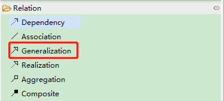
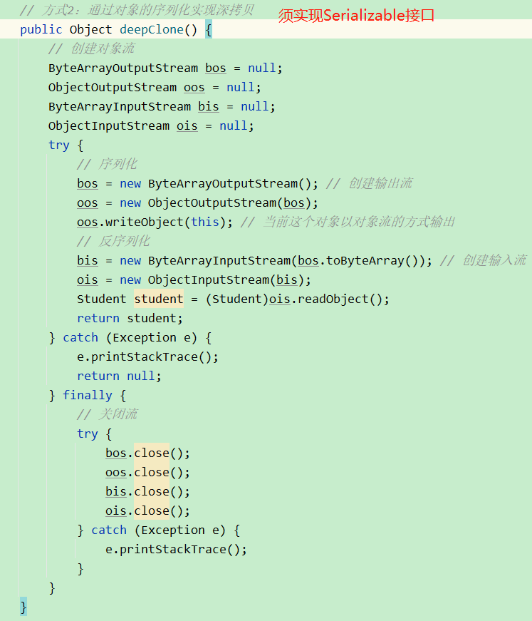

# 19 设计模式

<p><front style="background: yellow">设计模式（Design Pattern）</front>是前辈们对代码开发经验的总结，是解决特定问题的一系列套路。
它不是语法规定，而是一套用来提高代码可复用性、可维护性、可读性、稳健性、安全性、以及提高程序的内聚、降低程序耦合的解决方案。</p>

## 1.七大原则

> 设计原则的核心思想：

- 找出应用中可能需要变化之处，把他们独立出来，不要和那些不需要变化的代码混在一起
- 针对接口编程，而非针对实现编程
- 为了交互对象之间的松耦合设计而努力

### 1.1 单一职责原则

#### 1.1.1 基本介绍

对类来说，**一个类应该只负责一项职责**。

`eg.` 某个Dao类既操作user表，又操作order表。这个时候就应该把该Dao类拆分成一个UserDao类、一个OrderDao类。

#### 1.1.2 注意事项和细节

- 降低类的复杂度，一个类只负责一个一项职责。
- 提高类的可读性、可维护性
- 降低变更引起的风险
- 通常情况下，我们应当遵守单一职责原则。**只有逻辑足够简单，才可以在代码级违反单一原则；只有类中方法数量足够少，可以在方法级别保持单一职责原则。**

### 1.2 接口隔离原则

#### 1.2.1 基本介绍

客户端不应该依赖(即使用)它不需要的接口。即一个类对另一个类的依赖应该建立在最小的接口上。

#### 1.2.2 例子

Interface1中有5个方法，类B和类D是它的实现类。类A通过接口Interface1依赖（使用）类B，使用类B中的fun1、fun2、fun3方法； 类C通过接口Interface1依赖（使用）类D，使用类D中的fun1、fun4、fun5方法。

#### 1.2.2.1 未遵循接口隔离原则


  ```java
  package com.tth.learn.principle.segregation;
  
  public class Segregation1 {
  
  }
  
  interface Interface1 {
      void fun1();
      void fun2();
      void fun3();
      void fun4();
      void fun5();
  }
  
  class B implements Interface1 {
      @Override
      public void fun1() {
          System.out.println("B 实现了 fun1");
      }
  
      @Override
      public void fun2() {
          System.out.println("B 实现了 fun2");
      }
  
      @Override
      public void fun3() {
          System.out.println("B 实现了 fun3");
      }
  
      @Override
      public void fun4() {
          System.out.println("B 实现了 fun4");
      }
  
      @Override
      public void fun5() {
          System.out.println("B 实现了 fun5");
      }
  }
  
  class D implements Interface1 {
      @Override
      public void fun1() {
          System.out.println("D 实现了 fun1");
      }
  
      @Override
      public void fun2() {
          System.out.println("D 实现了 fun2");
      }
  
      @Override
      public void fun3() {
          System.out.println("D 实现了 fun3");
      }
  
      @Override
      public void fun4() {
          System.out.println("D 实现了 fun4");
      }
  
      @Override
      public void fun5() {
          System.out.println("D 实现了 fun5");
      }
  }
  
  /**
   * A类通过接口Interface1依赖（使用）B类，但是只会拥戴1,2,3方法
   */
  class A {
      
      public void depend1(Interface1 i) {
          i.fun1();
      }
  
      public void depend2(Interface1 i) {
          i.fun2();
      }
  
      public void depend3(Interface1 i) {
          i.fun3();
      }
  }
  
  class C {
      public void depend1(Interface1 i) {
          i.fun1();
      }
  
      public void depend4(Interface1 i) {
          i.fun4();
      }
  
      public void depend5(Interface1 i) {
          i.fun5();
      }
  }
  ```

#### 1.2.2.2 遵循接口隔离原则

  按照隔离接口原则应该这样处理：

  将Interface1按照下图所示拆分成3个接口，A通过Interface1、Interface2依赖类B，C通过Interface1、Interface3依赖类D。

  

  ```java
  package com.tth.learn.principle.segregation.improve;
  
  public class Segregation1 {
      public static void main(String[] args) {
          A a = new A();
          a.depend1(new B()); // A类依赖（使用）B类
          a.depend2(new B());
          a.depend3(new B());
  
          C c = new C();
          c.depend1(new D());
          c.depend4(new D());
          c.depend5(new D());
      }
  }
  
  interface Interface1 {
      void fun1();
  }
  interface Interface2 {
      void fun2();
      void fun3();
  }
  interface Interface3 {
      void fun4();
      void fun5();
  }
  
  class B implements Interface1, Interface2 {
      @Override
      public void fun1() {
          System.out.println("B 实现了 fun1");
      }
  
      @Override
      public void fun2() {
          System.out.println("B 实现了 fun2");
      }
  
      @Override
      public void fun3() {
          System.out.println("B 实现了 fun3");
      }
  }
  
  class D implements Interface1, Interface3 {
      @Override
      public void fun1() {
          System.out.println("D 实现了 fun1");
      }
  
      @Override
      public void fun4() {
          System.out.println("D 实现了 fun4");
      }
  
      @Override
      public void fun5() {
          System.out.println("D 实现了 fun5");
      }
  }
  
  /**
   * A类通过接口Interface1、Interface2依赖（使用）B类，但是只会拥有1,2,3方法
   */
  class A {
      public void depend1(Interface1 i) {
          i.fun1();
      }
  
      public void depend2(Interface2 i) {
          i.fun2();
      }
  
      public void depend3(Interface2 i) {
          i.fun3();
      }
  }
  
  /**
   * C类通过接口Interface1、Interface3依赖（使用）D类，但是只会拥戴1,4,5方法
   */
  class C {
      public void depend1(Interface1 i) {
          i.fun1();
      }
  
      public void depend4(Interface3 i) {
          i.fun4();
      }
  
      public void depend5(Interface3 i) {
          i.fun5();
      }
  }
  ```

### 1.3 依赖倒转原则

#### 1.3.1 基本介绍

- 高层模块不应该依赖低层模块，二者都应该依赖其抽象
- **抽象不应该依赖细节，细节应该依赖抽象**
- <front style="background: yellow; font-weight: 900">依赖倒转的中心思想：面向接口编程</front>
- **依赖倒转原则的设计理念**：相对于细节的多变性，抽象的东西要稳定的多。以抽象为基础搭建的架构比以细节为基础搭建的架构要稳的多。在java中，抽象指的是接口或抽象类，细节就是具体的实现类。
- **使用接口或抽象类的目的**是制定好规范，而不设计任何具体操作，把展现细节的任务交给他们的实现类。
- **变量的声明类型尽量是抽象类或接口**。这样我们的变量引用和实际对象间，就存在一个缓冲层，有利于程序的扩展和优化。
- **继承时遵循里氏替换原则**

#### 1.3.2 个人理解

类A在依赖（使用）类B时，不要直接使用类B，而是使用接口1，其中类B需要实现接口1。

#### 1.3.3 例子

`例子` 完成Person接收消息的功能

##### 1.3.3.1 没有遵循依赖倒转原则

  ```java
  package com.tth.learn.principle.inversion;
  
  public class DependecyInversion {
      public static void main(String[] args) {
          Person person = new Person();
          person.receive(new Email());
      }
  }
  
  class Email {
      public String getInfo() {
          return "电子邮件信息： hello world";
      }
  }
  
  class Person{
      public void receive(Email email) {
          System.out.println(email.getInfo());
      }
  }
  
  ```

##### 1.3.3.2 遵循依赖倒转原则

  **没有使用依赖倒转原则的代码存在的问题：** 如果我们获取的对象是微信、短信等，则新增类，同时Person类还应该增加相应的接收方法。

  **解决：** 引入一个抽象接口IReceiver，表示接收者，使Person和IReceiver产生依赖关系，让Email、WeiXin各自实现IReceiver接口。

  ```java
  package com.tth.learn.principle.inversion.improve;
  
  public class DependecyInversion {
      public static void main(String[] args) {
          Person person = new Person();
          person.receive(new Email());
          person.receive(new WeiXin());
      }
  }
  
  // 定义接口
  interface IReceiver{
      String getInfo();
  }
  
  class Email implements IReceiver{
      @Override
      public String getInfo() {
          return "电子邮件信息： hello world";
      }
  }
  
  class WeiXin implements IReceiver{
      @Override
      public String getInfo() {
          return "微信信息： hello world";
      }
  }
  
  class Person{
      public void receive(IReceiver receiver) {
          System.out.println(receiver.getInfo());
      }
  }
  ```

#### 1.3.4 依赖关系传递的三种方式

> 依赖关系传递的3种方式

* 接口传递
* 构造方法传递
* setter方式传递

> 例子

现有一需求，要求实现不同品牌电视机的开机功能。具体功能如下：
* 点击电视的开机按钮后，电视机首先都会判断是否通电。该方法所有品牌都一样。
* 确定通电后，电视机会点亮屏幕。因不同品牌电视机硬件不同，所以不同品牌的电视机点亮屏幕的方法不同。
* 电视机屏幕点亮后，开机功能完成
* 暂时不考虑电视机没通电的情况

<p><front style="background-color: yellow">设计思路</front></p>

* 定义接口IOpenAndClose，电视机的开机或关机方法
* 定义接口ITV，用来存放不同品牌的电视机的操作
* 定义类OpenAndClose实现接口IOpenAndClose，OpenAndClose实现开机方法时，需要使用ITV中的点亮屏幕方法
* 创建特定品牌的电视机类如HaiXinTV，实现海信电视的点亮屏幕的操作
* 在客户端中测试长虹电视机的开机方法

以下按照**接口传递** 方式、**构造方法传递** 方式、 **setter传递** 方式分别实现以上例子

##### 1.3.4.1 接口传递

<p><front style="background: yellow">请注意观察 OpenAndClose 类中 open() 方法定义、ITV对象的注入方式，以及 Client 类中对指定品牌电视机开机方法的测试。</front></p>

* 电视机操作接口`ITV`

```java
/**
 * @author tth
 * @description 电视机操作接口
 * @date 2023/5/30 17:21
 */
public interface ITV {
    // 点亮屏幕
    void openScreen();

    // 播放节目
    void playProgram(Object o);
}
```

* 开关机接口`IOpenAndClose`

```java
/**
 * @author tth
 * @description 开关机接口
 * @date 2023/5/30 17:21
 */
public interface IOpenAndClose {
    // 开机
    void open(ITV tv);

    // 关机
    void close(ITV tv);
}
```

* 开关机类`OpenAndClose`

```java
/**
 * 开关机类--通过接口传递依赖
 * @Author tth
 * @Date 2023/5/30 17:22
 */
public class OpenAndClose implements IOpenAndClose{
    @Override
    public void open(ITV tv) {
        // 先确定是否通电。若通电，则执行以下操作，否则暂不考虑
        tv.openScreen();
        System.out.println("开机完成！");
    }

    @Override
    public void close(ITV tv) {
        // 暂不实现
    }
}
```

* 海信牌电视机类`HaiXinTV`

```java
/**
 * 海信电视机
 * @Author tth
 * @Date 2023/5/30 17:23
 */
public class HaiXinTV implements ITV {
    @Override
    public void openScreen() {
        System.out.println("海信电视机点亮屏幕啦...");
    }

    @Override
    public void playProgram(Object o) {
        System.out.println("海信电视机播放节目啦...");
    }
}
```

* 客户端`Client`

```java
/**
 * 客户端，用来测试
 * @Author tth
 * @Date 2023/5/30 17:20
 */
public class Client {
    public static void main(String[] args) {
        OpenAndClose openAndClose = new OpenAndClose();
        HaiXinTV tv = new HaiXinTV();
        openAndClose.open(tv); // 开机时，传入ITV接口的实现类
    }
}
```

##### 1.3.4.2 构造方法传递

<p><front style="background: yellow">请注意观察 OpenAndClose 类中 open() 方法定义、ITV对象的注入方式，以及 Client 类中对指定品牌电视机开机方法的测试。</front></p>

* 电视机操作接口`ITV`

```java
/**
 * @author tth
 * @description 电视机操作接口
 * @date 2023/5/30 17:21
 */
public interface ITV {
    // 点亮屏幕
    void openScreen();

    // 播放节目
    void playProgram(Object o);
}
```

* 开关机接口`IOpenAndClose`

```java
/**
 * @author tth
 * @description 开关机接口
 * @date 2023/5/30 17:21
 */
public interface IOpenAndClose {
    // 开机
    void open();

    // 关机
    void close();
}
```

* 开关机类`OpenAndClose`

```java
/**
 * 开关机类-通过构造方法传递依赖
 * @Author tth
 * @Date 2023/5/30 17:22
 */
public class OpenAndClose implements IOpenAndClose {
    private ITV tv;

    public OpenAndClose(ITV tv) {
        this.tv = tv;
    }

    @Override
    public void open() {
        // 先确定是否通电。若通电，则执行以下操作，否则暂不考虑
        this.tv.openScreen();
        System.out.println("开机完成！");
    }

    @Override
    public void close() {
        // 暂不实现
    }
}
```

* 海信牌电视机类`HaiXinTV`

```java
/**
 * 海信电视机
 * @Author tth
 * @Date 2023/5/30 17:23
 */
public class HaiXinTV implements ITV {
    @Override
    public void openScreen() {
        System.out.println("海信电视机点亮屏幕啦...");
    }

    @Override
    public void playProgram(Object o) {
        System.out.println("海信电视机播放节目啦...");
    }
}
```

* 客户端`Client`

```java
/**
 * 客户端，用来测试
 * @Author tth
 * @Date 2023/5/30 17:20
 */
public class Client {
    public static void main(String[] args) {
        OpenAndClose openAndClose = new OpenAndClose(new HaiXinTV());
        openAndClose.open();
    }
}
```

##### 1.3.4.3 setter方式传递

<p><front style="background: yellow">请注意观察 OpenAndClose 类中 open() 方法定义、ITV对象的注入方式，以及 Client 类中对指定品牌电视机开机方法的测试。</front></p>

* 电视机操作接口`ITV`

```java
/**
 * @author tth
 * @description 电视机操作接口
 * @date 2023/5/30 17:21
 */
public interface ITV {
    // 点亮屏幕
    void openScreen();

    // 播放节目
    void playProgram(Object o);
}
```

* 开关机接口`IOpenAndClose`

```java
/**
 * @author tth
 * @description 开关机接口
 * @date 2023/5/30 17:21
 */
public interface IOpenAndClose {
    // 开机
    void open();

    // 关机
    void close();
}
```

* 开关机类`OpenAndClose`

```java
/**
 * 开关机类-通过setter方式传递依赖
 * @Author tth
 * @Date 2023/5/30 17:22
 */
public class OpenAndClose implements IOpenAndClose {
    private ITV tv;

    public void setTv(ITV tv) {
        this.tv = tv;
    }

    @Override
    public void open() {
        // 先确定是否通电。若通电，则执行以下操作，否则暂不考虑
        this.tv.openScreen();
        System.out.println("开机完成！");
    }

    @Override
    public void close() {
        // 暂不实现
    }
}
```

* 海信牌电视机类`HaiXinTV`

```java
/**
 * 海信电视机
 * @Author tth
 * @Date 2023/5/30 17:23
 */
public class HaiXinTV implements ITV {
    @Override
    public void openScreen() {
        System.out.println("海信电视机点亮屏幕啦...");
    }

    @Override
    public void playProgram(Object o) {
        System.out.println("海信电视机播放节目啦...");
    }
}
```

* 客户端`Client`

```java
/**
 * 客户端，用来测试
 * @Author tth
 * @Date 2023/5/30 17:20
 */
public class Client {
    public static void main(String[] args) {
        OpenAndClose openAndClose = new OpenAndClose();
        openAndClose.setTv(new HaiXinTV());
        openAndClose.open();
    }
}
```

#### 1.3.5 注意事项和细节

* 低层模块尽量都要有抽象类或接口，或者二者都有，程序稳定性更好
* 变量的类型尽量是抽象类或接口，这样变量的引用和实际对象之间，就存在一个缓冲层，利于程序的烤鱼站
* 继承时，需要遵循里氏替换原则

### 1.4 里氏替换原则

#### 1.4.1 里氏替换原则产生的原因

面向对象中继承的弊端：

* 继承会给程序带来侵入性
* 继承会降低程序的可移植性
* 继承增加了对象之间的耦合性

为解决以上弊端，在使用继承时，引出里氏替换原则。

#### 1.4.2 基本介绍

- 如果S是T的子类型，对于S类型的任意对象，使得以T定义的所有程序P在所有t1对象换成s1对象时，程序P的行为没有发生任何变化。
**所有引用基类的地方必须能够透明的使用子类。**===>**对象继承的原则**

- <front style="background: yellow; font-weight: 900">替换的前提：面向对象的多态性</front>，即同一个行为具有多个不同的表现形式或者形态的能力。也可以理解为多条就是同一个接口，拥有多个不同的实现类。

- 在使用继承时，**子类尽量不要重写父类方法**。

- 里氏替换原则告诉我们：继承实际上让两个类耦合性增强了， 在适当的情况下，可以通过**聚合**、**组合**、**依赖**来解决问题。

  - 组合

    ```java
    class Base{}
    class A extend Base{
        int fun1(int a, int b) {return a + b;}
    }
    class  B extend Base{
        // 组合
        private A a  = new A();
        int fun1(int a, int b) {return a - b;}
        int fun2(int a, int b) {return a.fun1(a, b);}
    }
    ```

  - 聚合

  - 依赖

- 违反里氏替换原则的场景

  - 子类抛出了基类中未定义的异常

    以JDK的集合框架为例，如果自定义一个List的派生类，如下：

    ```java
    class CustomList<T> extends ArrayList<T> {
        @Override
        public T get(int index) {
            throw new UnsupportedOperationException();
        }
    }
    ```

    以上例子重写了get方法，抛出了`UnsupportedOperationException`异常。在JDK源码中，LIst的get方法仅会抛出`IndexOutOfBoundsException`异常（见下面代码），此时子类抛出`UnsupportedOperationException`异常并不是基类所期待的，所以该子类违反了里氏替换原则。

    ```java
    /**
         * Returns the element at the specified position in this list.
         *
         * @param index index of the element to return
         * @return the element at the specified position in this list
         * @throws IndexOutOfBoundsException if the index is out of range
         *         ({@code index < 0 || index >= size()})
         */
        E get(int index);
    ```

  - 子类方法改变了基类方法的语义或者引入了副作用

    同样，以JDK的集合框架为例，如果自定义一个List的派生类，如下：

    ```java
    class CustomList<T> extends ArrayList<T> {
        @Override
        public T get(int index) {
            if (index >= size()){
                return null;
            }
            return get(index);
        }
    }
    ```

    以上代码中，当下标>list长度时，返回空而非抛出`IndexOutOfBoundsException`异常，此时子类改变了基类方法的语义。所以该子类也违反了里氏替换原则。

### 1.5 开闭原则

<p><front style="background: yellow">ocp： Open Close Principle</front></p>

> 基本介绍

- 开闭原则是编程中最基础、最重要的原则
- 一个类（软件实体）中，模块和函数应该**对扩展开放**（即对提供方开放），**对修改关闭**（即对使用方关闭），即当给类增加新的功能时，尽量不修改代码或者尽可能少修改代码。用抽象架构框架，用实现扩展细节。
- **当软件需要变化时，尽量通过扩展软件实体的行为来实现改变，而不是通过修改已有的代码来实现变化**。
- 编程中遵循其他原则，以及使用设计模式的目的就是遵循开闭原则。

### 1.6 迪米特法则

<p><front style="background: yellow">Demeter Principle</front></p>

> 基本介绍

- 迪米特法则又叫**最少知道原则**，即一个类**对自己依赖的类知道的越少越好**。也就是说，对于被依赖的类不管多么复杂，都尽量将逻辑封装到类的内部。对外除了提供的public方法，不对外泄露任何消息。
- 迪米特法则还有一个更简单的定义：**只与直接的朋友通信**
- **直接的朋友**：每个对象都与其他对象有耦合关系，只要两个对象之间有耦合关机，我们就说两个对象之间是**朋友关系**。耦合的方式（依赖、关联、组合、聚合等）。我们称出现成员变量、方法参数、方法返回值中的类为**直接朋友**。而出现在局部变量中的类不是直接朋友（而是陌生人）。**陌生类最好不要以局部变量的形式出现在类的内部。**
- 核心：**降低类之间的耦合**，但并非完全没有依赖关系

### 1.7 合成复用原则

<p><front style="background: yellow">Composite Reuse Principle</front></p>

> 基本介绍

**尽量使用合成/聚合的方式，而不是使用继承。**

## 2.UML类图

### 2.1 基本介绍

> 定义

Unified modeling language，统一建模语言，是一种用于软件系统分析和设计的语言工具，他帮助软件开发人员进行思考和记录思路的结果。

> 常用符号


### 2.2 UML类图的画法

<p><front style="background: yellow">类之间的关系：</front></p>

**依赖**： A在类中用到了B类，则A和B类之间就存在依赖关系。可以是类的成员变量、方法的返回类型、方法接收的参数类型、方法中的局部变量。


**泛化（继承）**：泛化就是继承，是依赖关系的特例。



**实现**：类实现了接口，是依赖关系的特例。


**关联**：指的是类与类之间的联系，是依赖的特例。具有**导航性**（即双向关系或者单项关系）、**多重性**（一对一、一对多、多对多）


**聚合**：表示整体和部分的关系，整体与部分可以分开（比如电脑中有鼠标和键盘类，但是键盘和鼠标又可以从电脑上拆下来，所以电脑与鼠标、电脑与键盘是聚合关系），是关联关系的特例。具有导航性和多重性。


**组合**：表示整体和部分的关系，整体与部分不可以分开（比如人中有头和四肢类，但是头和四肢不能从人上拆下来，所以人和头、人和四肢是组合关系。人有身份证，身份证可以从人身上拆下来，所以人和身份证是聚合关系）。


> 聚合与组合

```java
class A {
    private B b; // 聚合
    private C c  = new C(); // 组合关系
}
class B {}
class C {}
```

如果程序中A实体中定义了对IDCard进行**级联删除**（即删除Person时连同IDCard一起删除），那么IDCard和Person就是组合了。

## 3.设计模式

### 3.1 概述

- 设计模式是某类问题的**通用解决方案**，代表了最佳实践
- 本质：提高软件的维护性、通用性、扩展性，降低软件的复杂性
- **分为3种类型**：
  - **创建型模式**：单例模式、抽象工厂模式、原型模式、建造者模式、工厂模式
  - **结构性模式**：适配器模式、桥接模式、装饰模式、组合模式、外观模式、享元模式、代理模式
  - **行为型模式**：模板方法模式、命令模式、访问者模式、迭代器模式、观察者模式、终结者模式、备忘录模式、解释器模式、状态模式、策略模式、职责链模式

### 3.2 单例模式

#### 3.2.1 定义

即采取一定的方法保证整个软件系统中，对于某个类**只能存在一个对象实例**，并且该类**只提供一个取得该对象实例的方法**（静态方法）。

#### 3.2.2 实现方式

<p><front style="background: yellow; font-weight: 900">高亮的推荐</front></p>

- <front style="background: yellow">饿汉式（静态常量）</front>
- <front style="background: yellow">饿汉式（静态代码块）</front>
- 懒汉式（线程不安全）
- 懒汉式（同步方法）
- 懒汉式（同步代码块）
- <front style="background: yellow">双重检查</front>
- <front style="background: yellow">静态内部类</front>
- <front style="background: yellow">枚举</front>

##### 3.2.2.1 **饿汉式（静态常量）**

```java
class HungryManType1 {
	// 1.构造器私有化
	private HungryManType1() {}

	// 2.本类内部创建对象实例
	private final static HungryManType1 instance = new HungryManType1();

	// 3.公共静态方法，返回实例对象
	public static HungryManType1 getInstance() {
		return instance;
	}
}
```

> 分析

- 优点：写法简单，在类装载的时候完成实例化，避免了线程同步问题
- 缺点：没有用到懒加载效果。如果从始至终没有用到这个实例，则会造成<front style="background: yellow">内存浪费</front>。

> 结论

<p><front style="background: yellow">可用</front>，但是可能造成内存浪费。</p>

##### 3.2.2.2 **饿汉式（静态代码块）**

```java
class HungryManType2 {
	// 1.构造器私有化
	private HungryManType2() {}

	// 2.本类内部创建对象实例
	private static HungryManType2 instance;

	// 3.在静态代码块中创建实例
	static {
		instance = new HungryManType2();
	}
	
	// 4.公共静态方法，返回实例对象
	public static HungryManType2 getInstance() {
		return instance;
	}
}
```

> 分析

- 优点：写法简单，在类装载的时候完成实例化，避免了线程同步问题
- 缺点：没有用到懒加载效果。如果从始至终没有用到这个实例，则会造成<front style="background: yellow">内存浪费</front>。

> 结论

<p><front style="background: yellow">可用</front>，但是可能造成内存浪费。</p>

##### 3.2.2.3 **懒汉式（线程不安全）**

```java
class LazyManType1{
    // 1.本类内部创建对象实例
    private static LazyManType1 instance;

    // 2.构造器私有化
    private LazyManType1() {};

    // 3.公共静态方法，返回实例对象
    public static LazyManType1 getInstance() {
        if (null == instance) {
            instance = new LazyManType1();
        }
        return instance;
    }
}
```

> 分析

- 优点：起到了懒加载效果
- 缺点：<front style="background: yellow">线程不安全，只能在单例模式下使用</front>

> 结论

实际开发不要使用该方法。

##### 3.2.2.4 **懒汉式（同步方法）**

```java
class LazyManType2{
    // 1.本类内部创建对象实例
    private static LazyManType2 instance;

    // 2.构造器私有化
    private LazyManType2() {};

    // 3.公共同步静态方法，返回实例对象---加入synchronized解决线程安全问题
    public static synchronized LazyManType2 getInstance() {
        if (null == instance) {
            instance = new LazyManType2();
        }
        return instance;
    }
}
```

> 分析

- 优点：起到了懒加载效果，线程安全
- 缺点：<front style="background: yellow">方法进行同步效率太低</front>

> 结论

实际开发不推荐使用。

##### 3.2.2.5 **懒汉式（同步代码块）**

```java
class LazyManType3{
    // 1.本类内部创建对象实例
    private static LazyManType3 instance;

    // 2.构造器私有化
    private LazyManType3() {};

    // 3.公共同步静态代码块，返回实例对象
    public static LazyManType3 getInstance() {
        if (null == instance) {
            synchronized (LazyManType3.class) {
                instance = new LazyManType3();
            }

        }
        return instance;
    }
}
```

> 分析

本意是优化同步方法的方式，但是实际上<front style="background: yellow">并不能起到线程同步的作用</front>。

> 结论

实际开发不能使用。

##### 3.2.2.6 **双重检查**

```java
class DoubleCheckType{
    // 1.本类内部创建对象实例
    // volatile保证变量如果有修改，能够立刻刷到内存中，一定程度上还能达到同步的效果
    private static volatile DoubleCheckType instance;

    // 2.构造器私有化
    private DoubleCheckType() {};

    // 3.公共方法，加入双重检查代码，解决线程安全问题，返回实例对象
    public static DoubleCheckType getInstance() {
        if (null == instance) {
            synchronized (LazyManType3.class) {
                if (null == instance) {
                    instance = new DoubleCheckType();
                }
            }
        }
        return instance;
    }
}
```

> 分析

- 优点：线程安全，延时加载，效率高

> 结论

实际开发<front style="background: yellow">推荐使用</front>。

##### 3.2.2.7 **静态内部类**

> 静态内部类的特点

- 外部类装载的时候，静态内部类并不一定会立即被装载
- 静态内部类只会在第一次加载类的时候初始化

```java
class StaticInnerClassType{
    // 1.构造器私有化
    private StaticInnerClassType() {};

    // 2.静态内部类，以及他的静态属性
    private static class SingletonInstance {
        private static final StaticInnerClassType INSTANCE = new StaticInnerClassType();
    }

    // 3.公共方法，加入双重检查代码，解决线程安全问题，返回实例对象
    public static StaticInnerClassType getInstance() {
        return SingletonInstance.INSTANCE;
    }
}
```

> 分析

- 优点：线程安全，利用静态内部类特点实现延迟加载，效率高

> 结论

借助底层JVM类的装载机制保证初始化时只有一个实例，实际开发<front style="background: yellow">推荐使用</front>。

##### 3.2.2.8 **枚举**

```java
enum EnumType{
    INSTANCE;
    public void sayOk() {
        System.out.println("ok~");
    }
}
```

> 分析

- 优点：线程安全，防止反序列化重新创建新的对象

> 结论

实际开发<front style="background: yellow">推荐使用</front>。

#### 3.2.3 源码单例举例


#### 3.2.4 使用场景

- 需要频繁的创建和销毁的对象
- 创建对象时耗时过多或者耗费资源过多但又经常用到的对象
- 工具类对象
- 频繁访问数据库或者文件的对象（如数据源、session工厂等）

### 3.3 工厂模式

#### 3.3.1 简单工厂模式

> 基本介绍

- 属于创建型模式，是工厂模式的一种。简单工厂模式是**由一个工厂对象决定创建出哪一种产品类的实例**。

- 本质：定义了一个创建对象的<front style="background: yellow">类</front>，由这个类来**封装实例化对象的行为**。

- 使用场景：当需要大量的创建某类或者某批对象时，就会用到工厂模式。

- 简单工厂模式也叫静态工厂模式。

  

#### 3.3.2 工厂方法模式

> 基本介绍

- 本质：定义了一个创建对象的<front style="background: yellow">抽象方法</front>，由子类决定要实例化的类。工厂方法模式**将对象的实例化推迟到子类**。

  

#### 3.3.3 抽象工厂模式

> 基本介绍

- 本质：定义了一个<front style="background: yellow">interface</front>，用于创建或有依赖关系对象的对象簇，无需指明具体的类。

- 抽象工厂模式**可以将简单工厂模式和工厂方法模式进行整合**。

- 从设计层面看，抽象工厂模式就随对简单工厂模式的进一步抽象----将工厂抽象成两层，即抽象工厂和具体实现的工厂子类。程序员可以根据创建对象类型使用对应的工厂子类，如此便将单个的简单工厂类变成了**工厂簇**，更利于代码的维护和扩展。

  

#### 3.3.4 源码工厂模式举例


#### 3.3.5 小结

> 意义

将实例化对象的代码提取出来，放到一个类中统一管理和维护，以达到和主项目依赖关系的解耦，从而提高项目的可扩展性和可维护性。

> 三种工程模式

- 简单工厂模式
- 工厂方法模式
- 抽象工厂模式

> 设计模式的**依赖抽象**原则

- 创建对象实例时，不要直接new类，而是把这个new类的动作放在一个工厂的方法中，并返回。
- 不要让类继承具体类，而应继承抽象类或者实现接口。
- 不要覆盖类中已经实现的方法。

### 3.4 原型模式

####  3.4.1 基本介绍

- **定义**：用原型实例指定创建对象的种类，并且通过拷贝这些原型创建新的对象
- 是一种<front style="background: yellow">创建型设计模式</front>，允许一个对象再创建另外一个可定制的对象，无需知道创建细节
- **工作原理**：通过将一个原型对象传给那个要发起创建的对象，这个要发起创建的对象通过请求原型对象拷贝他们自己来实现创建，即<front style="background: yellow">对象.clone()</front>
- **形象理解**：孙悟空拔出猴毛，变出其他孙大圣

#### 3.4.2 克隆羊例子

创建5只属性一样的羊。

> 关键

Sheep类实现Cloneable接口，并重写clone()。客户端创建完第一只羊之后，调用clone()方法完成其他4只羊的创建。

<p><front style="background: yellow">Sheep类：</front></p>

```java
package com.tth.learn.prototype;

public class Sheep implements Cloneable{
    private String name;
    private int age;
    private String color;

    public Sheep(String name, int age, String color) {
        this.name = name;
        this.age = age;
        this.color = color;
    }

    public String getName() {
        return name;
    }

    public void setName(String name) {
        this.name = name;
    }

    public int getAge() {
        return age;
    }

    public void setAge(int age) {
        this.age = age;
    }

    public String getColor() {
        return color;
    }

    public void setColor(String color) {
        this.color = color;
    }

    @Override
    public String toString() {
        return "Shape{" +
                "name='" + name + '\'' +
                ", age=" + age +
                ", color='" + color + '\'' +
                '}';
    }

    @Override
    protected Object clone() {
        Sheep shape = null;
        try {
            shape = (Sheep) super.clone();
        }catch (CloneNotSupportedException e) {
            System.out.println(e.getMessage());
        }
        return shape;
    }
}
```

<p><front style="background: yellow">Client类：</front></p>

```java
package com.tth.learn.prototype;

public class Client {
    public static void main(String[] args) {
        Sheep sheep = new Sheep("Tom", 1, "白色");
        Sheep sheep2 = (Sheep)sheep.clone();
        Sheep sheep3 = (Sheep)sheep.clone();
        Sheep sheep4 = (Sheep)sheep.clone();
        Sheep sheep5 = (Sheep)sheep.clone();

        System.out.println(sheep);
        System.out.println(sheep2);
        System.out.println(sheep3);
        System.out.println(sheep4);
        System.out.println(sheep5);
    }
}
```

#### 3.4.3 源码原型模式举例

<p><front style="background: yellow">Spring使用xml创建bean实例，可以指定原型模式</front></p>

```xml
<bean id="monster" class="com.tth.learning.springsource.Monster" scope="prototype">
```


#### 3.4.4 浅拷贝和深拷贝

> 浅拷贝

- 基本数据类型：值传递，即将该属性值复制一份给新的对象
- 引用数据类型（数组、对象等）：引用传递，即指向同一个内存地址
- 浅拷贝是使用默认的<front style="background: yellow">clone()</front>方法来实现的

> 深拷贝

- 深拷贝实现方式：<front style="background: yellow">重写clone()</front>或者通过<front style="background: yellow">对象实例化(推荐)</front>实现深拷贝

  > 通过重写clone()方法实现深拷贝

  

  ```java
  // Teacher类
  public class Teacher implements Cloneable{
      private String name;
      private String major;
  
      public Teacher(String name, String major) {
          this.name = name;
          this.major = major;
      }
  
      @Override
      protected Object clone() throws CloneNotSupportedException {
          return super.clone();
      }
  
      public String getName() {
          return name;
      }
  
      public void setName(String name) {
          this.name = name;
      }
  
      public String getMajor() {
          return major;
      }
  
      public void setMajor(String major) {
          this.major = major;
      }
  }
  // Student类
  public class Student implements Cloneable{
      private String name;
      private int age;
      private Teacher teacher;
  
      public Student(String name, int age, String teacherName, String teacherMajor) {
          this.name = name;
          this.age = age;
          this.teacher = new Teacher(teacherName, teacherMajor);
      }
  
      // 方式一：重写clone方法，实现深拷贝
      @Override
      protected Object clone() throws CloneNotSupportedException {
          Student student = null;
          // 完成对基本类型以及String类型属性的克隆
          student = (Student) super.clone();
          // 借助引用对象的clone()方法，完成对引用对象的克隆
          student.setTeacher((Teacher) teacher.clone());
          return student;
      }
  
      public String getName() {
          return name;
      }
  
      public void setName(String name) {
          this.name = name;
      }
  
      public int getAge() {
          return age;
      }
  
      public void setAge(int age) {
          this.age = age;
      }
  
      public Teacher getTeacher() {
          return teacher;
      }
  
      public void setTeacher(Teacher teacher) {
          this.teacher = teacher;
      }
  }
  
  // 使用
  public class Client {
      public static void main(String[] args) throws Exception {
          Student s1 = new Student("明世隐", 14, "诸葛亮", "数学");
          Student s2 = (Student)s1.clone();
  
          System.out.println("s1="+s1.hashCode()+" s1.name="+s1.getName()+" s1.teacher="+s1.getTeacher().hashCode());
          System.out.println("s2="+s2.hashCode()+" s2.name="+s2.getName()+" s2.teacher="+s2.getTeacher().hashCode());
      }
  }
  ```

  > 通过对象的序列化实现深拷贝

  

  ```java
  // Teacher类
  public class Teacher implements Serializable{
      private String name;
      private String major;
  
      public Teacher(String name, String major) {
          this.name = name;
          this.major = major;
      }
  
      public String getName() {
          return name;
      }
  
      public void setName(String name) {
          this.name = name;
      }
  
      public String getMajor() {
          return major;
      }
  
      public void setMajor(String major) {
          this.major = major;
      }
  }
  
  // Student类
  public class Student implements Serializable{
      private String name;
      private int age;
      private Teacher teacher;
  
      public Student(String name, int age, String teacherName, String teacherMajor) {
          this.name = name;
          this.age = age;
          this.teacher = new Teacher(teacherName, teacherMajor);
      }
  
      // 方式2：通过对象的序列化实现深拷贝
      public Object deepClone() {
          // 创建对象流
          ByteArrayOutputStream bos = null;
          ObjectOutputStream oos = null;
          ByteArrayInputStream bis = null;
          ObjectInputStream ois = null;
          try {
              // 序列化
              bos = new ByteArrayOutputStream(); // 创建输出流
              oos = new ObjectOutputStream(bos);
              oos.writeObject(this); // 当前这个对象以对象流的方式输出
              // 反序列化
              bis = new ByteArrayInputStream(bos.toByteArray()); // 创建输入流
              ois = new ObjectInputStream(bis);
              Student student = (Student)ois.readObject();
              return student;
          } catch (Exception e) {
              e.printStackTrace();
              return null;
          } finally {
              // 关闭流
              try {
                  bos.close();
                  oos.close();
                  bis.close();
                  ois.close();
              } catch (Exception e) {
                  e.printStackTrace();
              }
          }
      }
  
  
      public String getName() {
          return name;
      }
  
      public void setName(String name) {
          this.name = name;
      }
  
      public int getAge() {
          return age;
      }
  
      public void setAge(int age) {
          this.age = age;
      }
  
      public Teacher getTeacher() {
          return teacher;
      }
  
      public void setTeacher(Teacher teacher) {
          this.teacher = teacher;
      }
  }
  
  // 使用
  public class Client {
      public static void main(String[] args) throws Exception {
          Student s1 = new Student("明世隐", 14, "诸葛亮", "数学");
          Student s3 = (Student)s1.deepClone();
  
          System.out.println("s1="+s1.hashCode()+" s1.name="+s1.getName()+" s1.teacher="+s1.getTeacher().hashCode());
          System.out.println("s3="+s3.hashCode()+" s3.name="+s3.getName()+" s3.teacher="+s3.getTeacher().hashCode());
      }
  }
  ```

#### 3.4.5 小结

> 原型模式的注意事项和优缺点

- 当创建的对象比较复杂时，可以利用原型模式**简化对象的创建过程**，同时也能**提高效率**
- 不用重新初始化对象，而是动态的获取对象运行时的状态
- 如果原式对象的属性增加或者减少，其他克隆对象的也会相应变化，无需修改代码
- 缺点：需要为每一个类配备一个克隆方法，这对于全新的类来说不是很难，但对已有的类改造时，需要修改源代码，违背了ocp原则

### 3.5 建造者模式

#### 3.5.1 基本介绍

- 本质：将产品和产品建造过程解耦
- 是一种<front style="background: yellow">创建型设计模式</front>。它可以将复杂对象的建造过程抽象出来，使这个抽象过程的不同实现方法可以构造出不同属性的对象
- 建造者模式是一步一步的创建一个复杂对象。它允许用户只通过指定复杂对象的类型和内容就可以构建它们，用户不需要知道内部的具体构造过程
- 建造者的<front style="background: yellow">四个角色</front>
  - **Product(产品)**：产品对象
  - **Builder(抽象建造者)**：穿件一个Product对象各个部件指定的接口或抽象类
  - **ConcreteBuilder(具体建造者)**：实现接口或抽象类，构建和装配各个组件
  - **Director(指挥者)**：构建一个使用Builder接口的对象。<front style="background: yellow">作用是</front>**①**隔离客户与对象的生产过程**②**负责控制产品对象的生产过程。

#### 3.5.2 盖房子例子


#### 3.5.3 小结

> 建造者模式的注意事项和优缺点

- 客户端不比知道产品内部的**组成**细节，将产品本身与产品床创建过程解耦，使得相同的创建过程可以创建不同的产品对象。
- 每一个具体建造者都是相对独立的，因此可以很方便的替换具体建造者或者增加新的建造者，**用户使用不同的具体建造者即可得到不同的对象产品**。
- **可以更加惊喜的控制产品的创建过程**。将复杂产品的创建步骤分解在不同的方法中，是的创建过程更加清晰，也更方便使用程序来控制创建过程。
- **增加新的具体建造者无须修改原有类库代码**，符合**开闭原则**
- 使用建造者模式创建的产品一般具有较多的共同点，其组成部分相似。**如果产品之间的差异性很大，则不适合使用建造者模式**。
- <front style="background: yellow">抽象工厂模式VS建造者模式</front>
  - **抽象工厂模式**实现对产品家族的创建，一个产品家族是这样一系列的产品：具有不同分类纬度的产品组合，采用抽象工厂模式不需要关系构建过程，之关系什么产品由什么工厂生产即可。抽象工厂模式是一个函数生成一个对象。
  - **建造者模式**是把对象的创建分散开来，不同的方法创建对象不同的组成部分，最终将所有函数结合起来才能生成一个对象。

### 3.6 适配器模式

#### 3.6.1 基本介绍

- **定义**：适配器模式将某个类的接口转换成客户端期望的另一个接口表示。
- **目的**：兼容。让原本因接口不匹配不能一起工作的两个类可以协同工作。
- 是一种<front style="background: yellow">结构型设计模式</front>
- **分类**：
  - 类适配器模式
  - 对象适配器模式
  - 接口适配器模式

#### 3.6.2 类适配器模式

- **定义：**<front style="background: yellow">是一个类(Adapter)，通过**继承被适配类**，实现目标类的接口，完成被**适配类(src)->目标类(dst)** 的实现。</front>
- **优缺点**
  - `缺点`：由于java是单继承，类适配器需要继承src类，所以det必须是接口，有一定的局限性
  - `缺点`：src类的方法在Adapter中会暴露出来，也增加了使用的成本
  - `优点`：由于继承了src类，所以它可以根据需求重写src类，使得Adapter的灵活性增强了

#### 3.6.3 对象适配器模式

- **定义：**<front style="background: yellow">基本思路和类的适配器模式相同，只是将Adapter类作修改，不是继承src类，而是<front style="font-weight: 900">持有src类的实例</front>，以解决兼容性问题。即：持有src类，实现dst接口（或继承dst类），完成src->dst的适配。</front>
- 根据“合成复用原则”，在系统中尽量使用关联关系来替代继承类。
- **对象适配器模式是适配器模式中最常用的一种**。
- **优缺点：**
  - `优点：`对象适配器是对类适配器的一种升级。根据合成复用原则，使用组合替代继承，它解决了类适配器必须继承src的局限性问题，也不再要求dst必须是接口。
  - `缺点：`使用成本更低，更灵活。

#### 3.6.4 接口适配器模式

- **定义：** 当不需要全部实现接口提供的方法时，可以先设计一个<front style="background: yellow">抽象类</front>实现接口，
    并<front style="background: yellow">为该接口中每个方法提供一个默认实现（空方法）</front>，
    那么<front style="background: yellow">抽象类的子类可有选择的覆盖父类的某些方法来实现需求</front>。
- **使用场景：** 适用于一个接口不想使用其所有方法的情况。

#### 3.6.5 源码适配器模式举例

适配器模式在SpringMVC中的应用。


> 例子：手写简单SpringMVC DispatcherServlet.doDispatch()方法


```java
// ========================Controller类============================================
package com.tth.designpattern.adapter.springmvcadapter;

public interface Controller {
}

class HttpController implements Controller {
    public void doHttpController() {
        System.out.println("HttpController...");
    }
}

class SimpleController implements Controller {
    public void doSimpleController() {
        System.out.println("SimpleController...");
    }
}

class AnnotationController implements Controller {
    public void doAnnotationController() {
        System.out.println("AnnotationController...");
    }
}

// ========================HandlerAdapter类============================================
public interface HandlerAdapter {
    // 判断当前handler对应的类是否是指定的HandlerAdapter类
    boolean supports(Object handler);
    // 具体HandlerAdapter对象的处理方法
    void handle(Object handler);
}

class HttpHandlerAdapter implements HandlerAdapter {

    /**
     * 判断当前handler对应的类是否HttpHandlerAdapter类
     * @param handler
     * @return
     */
    @Override
    public boolean supports(Object handler) {
        return (handler instanceof HttpController);
    }

    /**
     * 执行HttpController对应的方法
     * @param handler
     */
    @Override
    public void handle(Object handler) {
        // 此处将handler强转为HttpController类，并调用HttpController类中的doHttpController()
        // 因为handle()方法是在supports()方法返回为true的前提下调用的，所以强转肯定是成功的
        ((HttpController)handler).doHttpController();
    }
}

class SimpleHandlerAdapter implements HandlerAdapter {
    /**
     * 判断当前handler对应的类是否SimpleHandlerAdapter类
     * @param handler
     * @return
     */
    @Override
    public boolean supports(Object handler) {
        return (handler instanceof SimpleController);
    }

    /**
     * 执行SimpleController对应的方法
     * @param handler
     */
    @Override
    public void handle(Object handler) {
        // 此处将handler强转为SimpleController类，并调用SimpleController类中的doSimpleController()
        // 因为handle()方法是在supports()方法返回为true的前提下调用的，所以强转肯定是成功的
        ((SimpleController)handler).doSimpleController();
    }
}

class AnnotationHandlerAdapter implements HandlerAdapter {
    /**
     * 判断当前handler对应的类是否AnnotationHandlerAdapter类
     * @param handler
     * @return
     */
    @Override
    public boolean supports(Object handler) {
        return (handler instanceof AnnotationController);
    }

    /**
     * 执行AnnotationController对应的方法
     * @param handler
     */
    @Override
    public void handle(Object handler) {
        // 此处将handler强转为AnnotationController类，并调用AnnotationController类中的doAnnotationController()
        // 因为handle()方法是在supports()方法返回为true的前提下调用的，所以强转肯定是成功的
        ((AnnotationController)handler).doAnnotationController();
    }
}

// ========================DispatcherServlet类============================================
import java.util.ArrayList;
import java.util.List;

public class DispatcherServlet {
    List<HandlerAdapter> handlerAdapters = new ArrayList<>();

    public DispatcherServlet() {
        handlerAdapters.add(new AnnotationHandlerAdapter());
        handlerAdapters.add(new HttpHandlerAdapter());
        handlerAdapters.add(new SimpleHandlerAdapter());
    }

    public void doDispatch() {
        // 模拟SpringMVC从request中获取handler对象
        AnnotationController controller = new AnnotationController();
        // 得到对应的适配器
        HandlerAdapter adapter = getHandler(controller);
        // 通过适配器执行对应的controller方法
        adapter.handle(controller);
    }

    protected HandlerAdapter getHandler(Controller controller) {
        for (HandlerAdapter adapter: this.handlerAdapters) {
            if (adapter.supports(controller)){
                return adapter;
            }
        }
        return null;
    }

    public static void main(String[] args) {
        // ========================测试入口============================================
        new DispatcherServlet().doDispatch();
    }
}
```

#### 3.6.6 小结

- 按照**src是以怎样的形式转给到Adapter**被分为3种不同的适配器：
  - **类适配器**：以类给到，在Adapter里，**将src当做类**，继承
  - **对象适配器**：以对象给到，在Adapter里，**将src作为一个对象**，持有
  - **接口适配器**：以接口给到，在Adapter里，**将src作为一个接口**，实现
- Adapter模式<front style="background: yellow">最大的作用</front>是将原本不兼容的接口融合在一起工作

### 3.7 桥接模式

#### 3.7.1 基本介绍

- **定义：** 将实现与抽象放在两个不同的类层次中，使两个层次可以独立改变。
- 是一种<front style="background: yellow">结构型设计模式</front>
- 基于**类的最小设计原则**，通过使用封装、聚合、继承，让不同的类承担不同的职责。
- **主要特点：** 把抽象和行为实现分离开来，从而保持各部分的独立性以及应对他们的功能扩展。

#### 3.7.2 原理图（类图）


#### 3.7.3 源码桥接模式举例

JDBC源码


#### 3.7.4 小结

> 桥接模式的优缺点

- `优点`实现了抽象和实现部分的分离，极大提供了系统的灵活性，让抽象部分和实现部分独立开来，有助于系统进行分层设计，从而产生更好的结构化系统。
- `优点`对于系统的高层部分，只需要知道抽象部分和实现接口即可，其他交于具体业务来完成。
- `优点`桥接模式替代多层继承，可以减少子类个数，降低系统的管理和维护成本。
- `缺点`桥接模式的引入增加了系统的理解和设计难度，由于聚合关联关系建立在抽象层，要求开发者针对抽象进行设计和编程。
- `缺点`桥接模式要求正确识别出系统中两个独立变化的维度，因此使用范围具有一定的局限性。

> 桥接模式应用场景

<p><front style="background: yellow">桥接模式尤为使用那些不希望使用继承或因为多层次继承导致系统类的个数急剧增加的系统</front></p>

**桥接模式应用场景举例：**

- JDBC驱动程序
- 银行转账系统
  - 转账分类：网上转账、柜台转账、ATM转账 `抽象层`
  - 转账用户类型：普通用户、银卡用户、金卡用户... `实现层`
- 消息管理
  - 消息类型：即时消息、延时消息 `抽象层`
  - 消息分类：手机短信、邮件消息、QQ消息... `实现层`

### 3.8 装饰者模式

#### 3.8.1 基本介绍

- **定义：**<front style="background: yellow">动态的将新的功能附加到对象上。</front>在对象功能扩展方面，比继承更有弹性。
- 体现了<front style="background: yellow">开闭原则（ocp）</front>

#### 3.8.2 原理图

#### 3.8.3 星巴克点餐例子

咖啡分为

#### 3.8.4源码装饰者模式

<p><front style="background: yellow">Java的IO结构中，FilterInputStream就是一个装饰者。</front></p>

