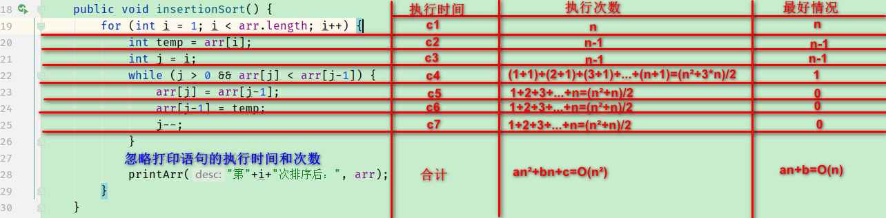
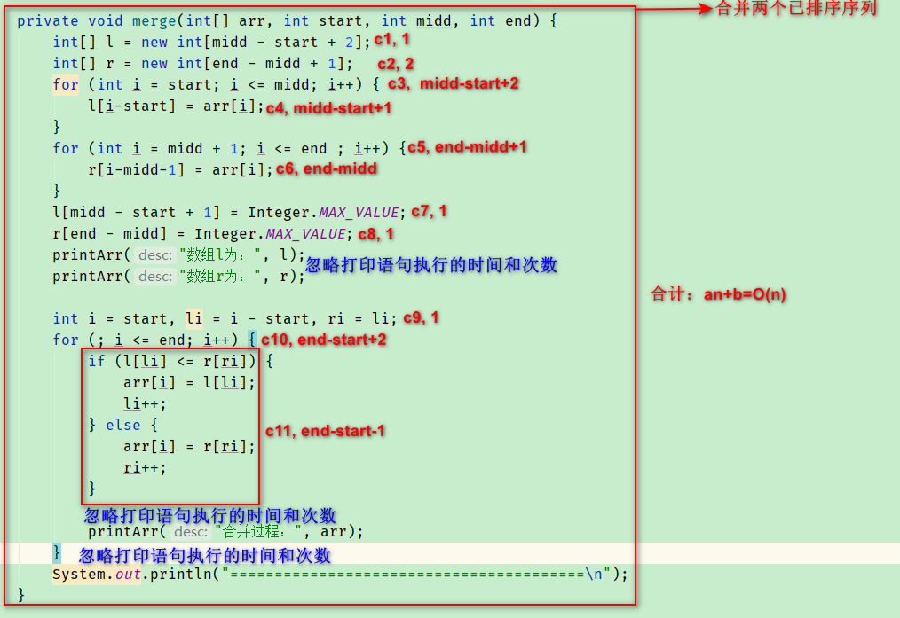

# 20 排序算法

## 20.1 排序算法概述

> 衡量排序算法的优劣

- <front style="background: yellow">时间复杂度</front>：分析关键字的比较次数和记录的移动次数
- <front style="background: yellow">空间复杂度</front>：分析算法中需要多少辅助内存
- <front style="background: yellow">稳定性</front>：若两个记录A和B的关键字值相等，但排序后A、B的先后次序保持不变，则称这种算法是稳定的

> 排序算法分类

- <front style="background: yellow">内部排序</front>：整个排序过程不需要借助外部存储器（如磁盘等），所有排序操作都在内存中完成。
- <front style="background: yellow">外部排序</front>：参与排序的数据非常多，数据量非常大，计算机无法把整个排序过程放在内存中完成，必须借助外部存储器（如磁盘）等。外部排序最常见的算法有<span style="color:red">多路归并排序</span>。可以认为外部排序是由多次内部排序组成的。

> 十大排序算法

- <front style="background: yellow">选择排序</front>

  将待排序的元素分为已排序（初始为空）和未排序两组，依次将未排序的元素中值最小的元素放入已排序的组中。

  - <front style="background: yellow">简单选择排序</front>
  - <front style="background: yellow">堆排序</front>

- 交换排序

  - 冒泡排序
  - 快速排序

- 插入排序

  - 直接插入排序
  - 折半插入排序
  - 希尔排序

- 归并排序

- 桶式排序

- 基数排序

> 算法5大特性

- <front style="background: yellow">输入</front>：有0个或多个输入数据，这些输入必须有清楚的描述和定义
- <front style="background: yellow">输出</front>：至少有1个或多个输出结果，不可以没有输出
- <front style="background: yellow">有穷性（有限性）</front>：算法可以在有限的步骤之后会自动结束而不是无线循环，并且每一个步骤可以在可接受的时间内完成
- <front style="background: yellow">确定性（明确性）</front>：算法中的每一步都有确定的含义，不会出现二义性
- <front style="background: yellow">可行性（有效性）</front>：算法的每一步骤都是清楚且可行的，能让用户用纸笔计算而求出答案

## 20.2 选择排序

### 20.2.1 简单选择排序

> 基本过程

- 在一组元素R[i]到R[n]中选择最小的元素
- 如果他不是这组元素中的第一个元素，则将其与该组元素中的第一个元素交换
- 除去具有最小关键字的元素，在剩下的元素中重复以上两步骤，直到元素只有一个为止

> 效率分析

- <span style="color:red">比较次数</span>：$(n-1)+(n-2)+...+2+1=n(n-1)/2$

  无论初始状况如何，在第i趟排序中选择最小元素的时候，都需要做$(n-i)$次比较

- <span style="color:red">交换次数</span>：

  - 最好情况：0次

    序列恰好为正序时，需要交换0次

  - 最差情况：${(n-1)}$次

    如将数组[${5,1,2,3,4}$]按照有小到大的顺序排列，需要移动4次

综上，简单选择排序的<front style="background: yellow">时间复杂度为$O(n^{2})$</front>

>稳定性

<front style="background: yellow">不稳定</front>

由于在直接选择排序中存在不相邻元素的交换，因此它是一个不稳定的排序方法。

比如给定数组[$3,7,3',2,1$]，按照有小到大的顺序排列后的结果为[$1,2,3',3,7$]

>示例代码

```java
int[] arr = {49,38,65,97,76,13,24,49};
// 开始排序
// 说明1：循环条件是 i < arr.length - 1，而不是i < arr.length的原因：最后一个数无需和自身进行比较、交换
for (int i = 0; i < arr.length - 1; i++) {
    int index = i; // 记录最小值的下标
    // 循环找到数组中的最小值对应的下标
    for (int j = i + 1; j < arr.length; j++) {
        if (arr[index] > arr[j]) {
            index = j;
        }
    }
    // 将最小值和无序数组中的第一个元素进行交换（当最小值下标和当前下标不相等的时候再交换）
    if (i != index) {
        int temp = arr[i];
    	arr[i] = arr[index];
    	arr[index] = temp;
    }
}
// 排序完成
// 打印
for (int i = 0; i < arr.length; i++) {
    System.out.print(arr[i]+"\t");
}
```

### 20.2.2 堆排序

## 20.3 交换排序

### 20.3.1 冒泡排序

> 基本思想

对待排序序列从前往后，依次比较相邻元素排序码，如果逆序则交换，使排序码较大的元素逐渐从前往后移动。

>效率分析

- <span style="color:red">比较次数</span>：

  - 最好情况：$n-1$次

    此时待排序序列恰好是按照要求的顺序进行排序

  - 最坏情况：$(n-1)+(n-2)+...+2+1=n(n-1)/2$次

    此时待排序序列恰好是按照要求的顺序的逆序进行排序

- <span style="color:red">交换次数</span>：

  - 最好情况：0次

    此时待排序序列恰好是按照要求的顺序进行排序

  - 最坏情况：$(n-1)+(n-2)+...+2+1=n(n-1)/2$

> 稳定性

> 示例代码

```java
int[] arr = {49,38,65,97,76,13,27,49};
// 开始排序
// 说明1：循环条件是 i < arr.length - 1，而不是i < arr.length的原因：最后一个数无需和自身进行比较、交换
for (int i = 0; i < arr.length - 1; i++) {
    // 说明2：循环条件是arr.length - 1 - i的原因：每完成一次排序，最后（i+1）个数都已完成排序，不需要再进行比较、交换
    for (int j = 0; j < arr.length - i - 1; j++) {
        if (arr[j] > arr[j+1]) {
            int temp = arr[j];
            arr[j] = arr[j+1];
            arr[j+1] = temp;
        }
    }
}
// 排序完成
// 打印
for (int i = 0; i < arr.length; i++) {
    System.out.print(arr[i]+"\t");
}
```

### 20.3.2 快速排序

## 20.4 插入排序

### 20.4.1 直接插入排序

> 基本过程

- 视R[m]为有序序列
- 比较R[m+1]和R[m]大小，如果R[m+1] >= R[m]，继续下一循环。否则，进入下一步。
- 如果R[m+1] < R[m]，比较R[m+1]与R[m]中的元素，将R[m+1]插入合适位置

> 效率分析



- <span style="color:red">最好情况</span>：输入的数组已经排好序

  <front style="background: yellow">时间复杂度为$O(n)$</front>

- <span style="color:red">最坏情况</span>：输入的数组恰好是倒序排序

  <front style="background: yellow">时间复杂度为$O(n^{2})$</front>

- <span style="color:red">平均情况</span>：数组A[1...j]中,一般元素大于A[j],一般元素小于A[j]，计算起来时间复杂度和最坏请款一致

  <front style="background: yellow">时间复杂度为$O(n^{2})$</front>

  

>稳定性

<p><front style="background: yellow">稳定</front></p>

>示例代码

```java
/**
 * 插入排序--直接插入排序
 */
public void insertionSort(int[] arr) {
    for (int i = 1; i < arr.length; i++) {
        int temp = arr[i];
        int j = i;
        while (j > 0 && arr[j] < arr[j-1]) {
            arr[j] = arr[j-1];
            arr[j-1] = temp;
            j--;
        }
    }
}
```

### 20.4.2 折半插入排序

### 20.4.3 希尔排序

## 20.5 归并排序

> 基本过程

<p><front style="background: yellow">归并排序算法完全遵循分治模式</front>，步骤如下：</p>

- **分解**：分解待排序的n个元素序列成各有n/2个元素的子序列
- **解决**：使用归并排序递归的排列两个子列
- **合并**：合并两个已排序的子列以产生已排序的答案

> 效率分析--合并步骤的时间复杂度



合并步骤的时间复杂度：<front style="background: yellow">O(n)</front>

> 效率分析--归并排序时间复杂度

<p><front style="background: yellow">归并排序算法完全遵循分治模式</front>，其中分治模式算法的时间复杂度公式为：</p>
$$
T(n) = 
\begin{cases}
O(1), & \text {$n\leq c$}\\
aT(n/b)+D(n)+C(n), & \text {$n > c$}
\end{cases}
$$

- 当归并排序**一个元素**（一个元素为最小输入）时需要的时间为常量时间。

- 当$n\geq 1$时，分析运行时间如下：

  - **分解**：分解步骤仅仅计算子数组的中间位置，需要常量时间，因此D(n)=O(1)
  - **解决**：递归算法中是递归的求解将原问题分为2个规模为n/2的子问题，即a=2，b=2
  - **合并**：在【效率分析--合并步骤的时间复杂度】中已知，合并所需的时间C(n)=O(n)

- 综上，归并排序算法最坏情况下时间复杂度公式为

  （注：分解时间D(n)=O(1)，可以忽略）
  $$
  T(n) = 
  \begin{cases}
  O(1), & \text {$n\leq 1$}\\
  2T(n/2)+O(n), & \text {$n > 1$}
  \end{cases}
  $$

经求解，<front style="background: yellow">归并排序算法<span style="color:red">最坏情况</span>下的时间复杂度为O(nlgn)</front>

> 稳定性

<p><front style="background: yellow">稳定</front></p>

> 示例代码

```java
/**
 * 归并排序
 * @param arr
 * @param start
 * @param end
 */
private void mergeSort(int[] arr, int start, int end) {
    if (start < end) {
        int midd = (int) Math.floor((start + end) / 2);
        mergeSort(arr, start, midd);
        mergeSort(arr, midd + 1, end);
        merge(arr, start, midd, end); // 合并
    }
}

/**
 * 将两个有序数组合并成一个有序数组（使用哨兵的方式）
 * @param arr
 * @param start
 * @param midd
 * @param end
 */
private void merge(int[] arr, int start, int midd, int end) {
    int[] l = new int[midd - start + 2];
    int[] r = new int[end - midd + 1];
    for (int i = start; i <= midd; i++) {
        l[i-start] = arr[i];
    }
    for (int i = midd + 1; i <= end ; i++) {
        r[i-midd-1] = arr[i];
    }
    l[midd - start + 1] = Integer.MAX_VALUE; // 哨兵
    r[end - midd] = Integer.MAX_VALUE; // 哨兵

    int i = start, li = i - start, ri = li;
    for (; i <= end; i++) {
        if (l[li] <= r[ri]) {
            arr[i] = l[li];
            li++;
        } else {
            arr[i] = r[ri];
            ri++;
        }
    }
}
```

## 20.6 桶式排序

## 20.7 基数排序

## 20.8 算法设计

### 20.8.1 分治模式

> 使用场景

适用于递归算法中

> 思想

将原问题分解为几个规模较小但类似于原问题的子问题，递归地求解这些子问题，然后再合并这些子问题的解来建立原问题的解

> 步骤

<p><front style="background: yellow">分治模式在每层递归时都有三个步骤：</front></p>

- **分解**原问题为若干子问题，这些子问题都是原问题的规模较小的实例
- **解决**这些子问题，递归的求解各个子问题。当子问题规模足够小时，可以直接求解
- **合并**这些子问题的解成原问题的解、

> 分析分治算法的时间复杂度

当一个算法包含自身的递归调用时，可以使用**递归方程**或**递归式**来描述其运行时间，该方程根据在**最小输入上的运行时间**来描述在规模n问题上的总运行时间。然后，通过数学工具来求解递归式并给出算法性能的**界**。

<p><front style="background: yellow">步骤如下：</front></p>

①假设T(n)是规模为n的一个问题的运行时间。

②如果问题足够小(假设对于常量c，n<=c)，则直接求解需要常量时间，记为O(1)。

③当问题比较大时，将原问题分解为a个子问题，每个子问题的规模是原问题的1/b，即子问题的规模为n/b。那么规模为n的问题的运行时间T(n)可以写成：T(n) =  a*T(n/b)。

④假设分解大问题为小问题所需时间为D(n)，小问题的解合并成大问题的解所需时间C(n)，那么，便可以得到递归式：
$$
T(n) = 
\begin{cases}
O(1), & \text {$n\leq c$}\\
aT(n/b)+D(n)+C(n), & \text {$n > c$}
\end{cases}
$$
⑤对该递归式求解，即可得到该算法的时间复杂度