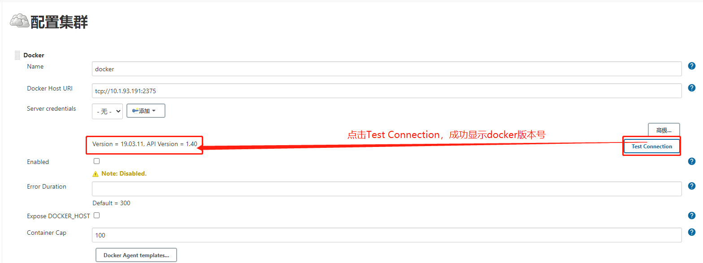

# 自动部署
# 1.插件准备

在jenkins管理界面，点击`Manage Jenkins`，选择`Manage Plugins`，点击`可选插件`，搜索`GitLab Plugin`、`Docker Plugin`，直接安装。


# 2.服务器环境配置

## 2.1安装git

因是每次git上项目有更新，都会自动制作镜像、升级服务镜像，故装有jenkins的服务器需要安装git用来下载gitlab上的项目。

## 2.2安装docker

制作镜像的时候，需要用到docker，因此装有jenkins的服务器需要安装docker来实现镜像的制作与推送等操作。

# 3.jenkins全局工具配置

在jenkins管理界面，点击`Manage Jenkins`，选择`Global Tool Configuration`，点击`可选插件`，搜索`GitLab Plugin`、`Docker Plugin`，直接安装。

## 3.1配置git

在jenkins管理界面，点击`Manage Jenkins`，选择`Global Tool Configuration`，找到`Git`，点击`Add Git`，对git进行配置。


## 3.2配置docker

### 3.2.1docker基本配置


### 3.2.2docker配置失败的解决方法

如果点击【Test Connection】按钮报如下错误，可按照以下步骤解决。

报错如下：


解决步骤：

**Step1.输入`systemctl status docker`查看docker端口号**


**Step2. 修改docker tcp端口号**

```shell
vim /usr/lib/systemd/system/docker.service
```


**Step3.重启docker**

```shell
systemctl daemon-reload
systemctl restart docker
```


**Step4.jenkins测试是否连接成功**



# 4.创建项目

## 4.1 新建Item


## 4.2项目源码设置


## 4.3 构建触发器


## 4.4编写构建脚本


```shell
#!/bin/bash

pro_version=$(git log | awk '{print $1}' | awk '{print $2}' | sort | uniq -c | sort -k1,1nr)
pro_image=10.1.93.164:5000/python-test:v${pro_version// /}
docker build -t ${pro_image} .
echo "-------------------------镜像build成功？" $?
if [ $? = 0 ]
then
    docker push ${pro_image}
    echo "-------------------------镜像push成功？" $?
    if [ $? = 0 ]
    then
        update_image_cmd="kubectl patch deployment test1 -n tth-test --patch '{\"spec\": {\"template\": {\"spec\": {\"containers\": [{\"name\": \"test1-c\",\"image\":\"${pro_image}\"}]}}}}'"
        echo 
        ssh root@10.1.93.160 ${update_image_cmd}
        echo "-------------------------服务升级成功？" $?
    fi
fi
```

## 4.5保存项目信息

项目信息编写完成后，点击【保存】按钮即可。


# 5.部署项目

## 5.1 运行


## 5.2查看项目构建日志

