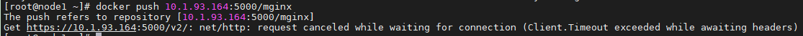
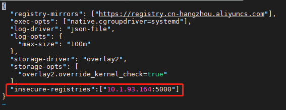

# 无法推送镜像
https://blog.csdn.net/haodiaoer/article/details/94835649

# 错误信息：

**Get https://10.1.93.164:5000/v2/: net/http: request canceled while waiting for connection (Client.Timeout exceeded while awaiting headers)**



# 错误原因：

docker私有仓库服务器，**默认是基于https传输的**，所以我们需要在客户端做相关设置，不使用https传输

# 解决步骤：

## step1.编辑/etc/docker/daemon.json文件

```linux
vi /etc/docker/daemon.json
```

## step2.将下面的代码放进去保存并退出

```linux
"insecure-registries":["镜像服务器IP:镜像容器端口号"]
```

结果如下：



## step3.重新启动docker

```linux
systemctl daemon-reload
systemctl restart docker
```

