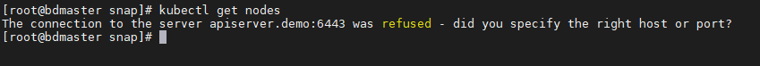

# 6443_connect-refused
# 错误信息

The connection to the server 192.168.100.170:6443 was refused



# 解决步骤

参考文档：https://www.jianshu.com/p/6edc9f171df1

## step1. 查看6443端口是否正常或者是否开启防火墙

```shell
netstat -pnlt | grep 6443

# 如果提示 netstat： 
yum install net-tools
```

运行之后什么都没有返回，也就是说 **APIServer 完全没有提供服务**，那我们就去查看一下 kubelet 的日志，大家都知道使用 kubeadm 搭建的 k8s集群里，APIServer 都是在 docker 里运行的，这里我们先找到对应的容器，记得加 `-a`，因为该容器可能已经处于非正常状态了。

## step2.查看APIServer 

```shell
docker ps -a | grep apiserver

# 输出
f40d97ee2be6        40a63db91ef8                                                    "kube-apiserver --au…"   2 minutes ago        Exited (255) 2 minutes ago                            k8s_kube-apiserver_kube-apiserver-master1_kube-system_7beef975d93d634ecee05282d3d3a9ac_718
4b866fe71e33        registry.cn-hangzhou.aliyuncs.com/google_containers/pause:3.1   "/pause"                 2 days ago           Up 2 days                                             k8s_POD_kube-apiserver-master1_kube-system_7beef975d93d634ecee05282d3d3a9ac_0
```

这里能看到两个容器，可以看到 **容器的状态已经是 `Exited` 了**，注意下面的`pause`容器，这个只是用来引导 APIServer 的，并不是服务的实际运行容器，所以看不到日志，所以查看日志时不要输错容器 id 了。接下来查看 APIServer 的日志。

## Step3.查看APIServer 的日志

```shell
docker logs -f f40d97ee2be6

# 输出
I1230 01:39:42.942786       1 server.go:557] external host was not specified, using 192.168.100.171
I1230 01:39:42.942924       1 server.go:146] Version: v1.13.1
I1230 01:39:43.325424       1 plugins.go:158] Loaded 8 mutating admission controller(s) successfully in the following order: NamespaceLifecycle,LimitRanger,ServiceAccount,NodeRestriction,Priority,DefaultTolerationSeconds,DefaultStorageClass,MutatingAdmissionWebhook.
I1230 01:39:43.325451       1 plugins.go:161] Loaded 6 validating admission controller(s) successfully in the following order: LimitRanger,ServiceAccount,Priority,PersistentVolumeClaimResize,ValidatingAdmissionWebhook,ResourceQuota.
I1230 01:39:43.326327       1 plugins.go:158] Loaded 8 mutating admission controller(s) successfully in the following order: NamespaceLifecycle,LimitRanger,ServiceAccount,NodeRestriction,Priority,DefaultTolerationSeconds,DefaultStorageClass,MutatingAdmissionWebhook.
I1230 01:39:43.326340       1 plugins.go:161] Loaded 6 validating admission controller(s) successfully in the following order: LimitRanger,ServiceAccount,Priority,PersistentVolumeClaimResize,ValidatingAdmissionWebhook,ResourceQuota.
F1230 01:40:03.328865       1 storage_decorator.go:57] Unable to create storage backend: config (&{ /registry [https://127.0.0.1:2379] /etc/kubernetes/pki/apiserver-etcd-client.key /etc/kubernetes/pki/apiserver-etcd-client.crt /etc/kubernetes/pki/etcd/ca.crt true 0xc0004bd440 <nil> 5m0s 1m0s}), err (dial tcp 127.0.0.1:2379: connect: connection refused)
```

 从最后一行可以看到，是 APIServer 在尝试创建存储时出现了问题，导致无法正确启动服务，由于 k8s 是使用 etcd 作为存储的，所以我们再来查看 etcd 的日志 。

## Step4.查看etcd日志

```shell
# 查看 etcd 容器，注意 etcd 也有对应的 pause 容器
docker ps -a | grep etcd

# 输出
1b8b522ee4e8        3cab8e1b9802                                                    "etcd --advertise-cl…"   7 minutes ago        Exited (2) 6 minutes ago                              k8s_etcd_etcd-master1_kube-system_1051dec0649f2b816946cb1fea184325_942
c9440543462e        registry.cn-hangzhou.aliyuncs.com/google_containers/pause:3.1   "/pause"                 2 days ago           Up 2 days                                             k8s_POD_etcd-master1_kube-system_1051dec0649f2b816946cb1fea184325_0


# 查看 etcd 日志
docker logs -f 1b8b522ee4e8

# 输出
...
2021-03-24 03:10:27.339748 I | embed: initial advertise peer URLs = https://10.1.93.160:2380
2021-03-24 03:10:27.339752 I | embed: initial cluster =
2021-03-24 03:10:27.339927 W | pkg/fileutil: check file permission: directory "/var/lib/etcd/member/snap" exist, but the permission is "drwxr-xr-x". The recommendedo the data.
2021-03-24 03:10:27.950522 I | etcdserver: recovered store from snapshot at index 11841307
2021-03-24 03:10:27.951270 I | mvcc: restore compact to 11013220
2021-03-24 03:10:27.958062 E | wal: failed to allocate space when creating new wal file (no space left on device)
2021-03-24 03:10:28.111238 C | etcdserver: read wal error (no space left on device) and cannot be repaired
```

从最后一行可以看出，`no space left on device`，表示磁盘空间不够了。解决方法，要么是删掉虚拟机中无用文件，要么是给虚拟机增加内存。