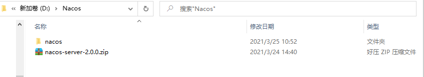
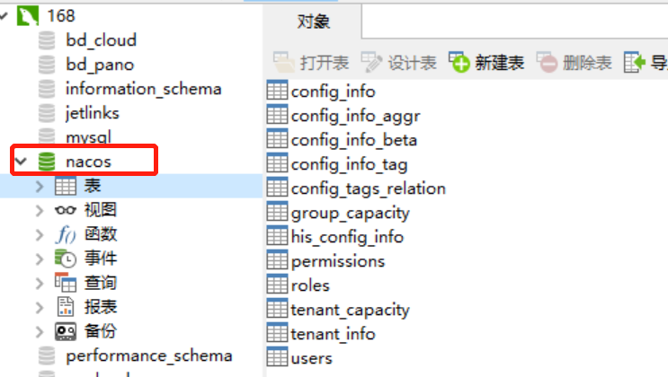
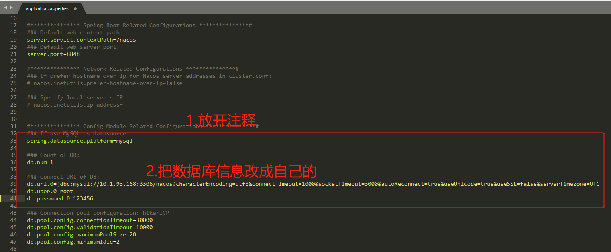
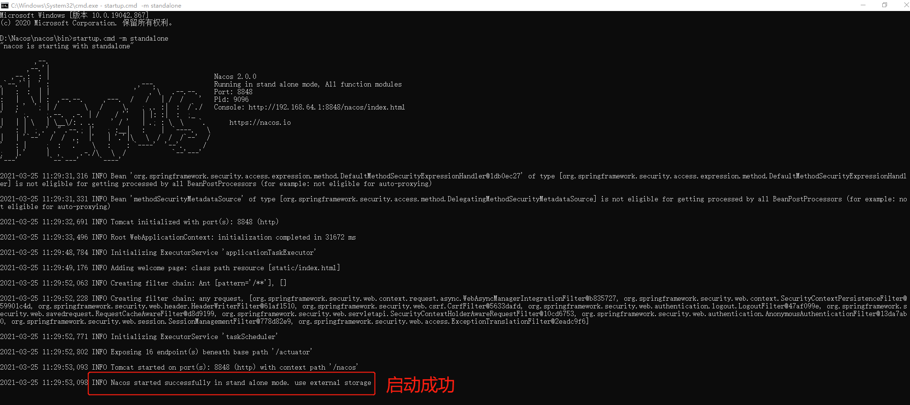
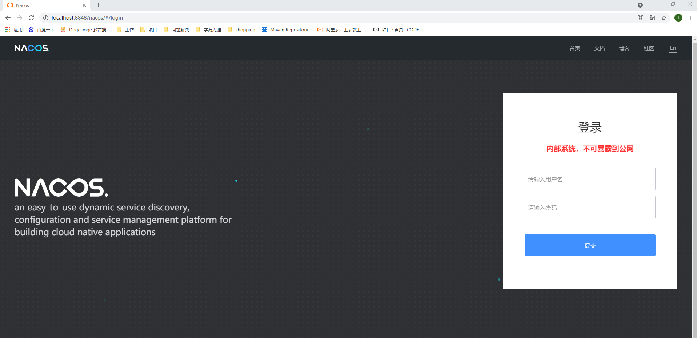

# Nacos的使用

Nacos官方文档：https://nacos.io/zh-cn/docs/quick-start.html

# 1.windows环境启动Nacos

- 环境准备： 64 bit JDK 1.8+ 、 Maven 3.2.x+ 
- Nacos有两种启动方式。一种是下载源码，进行编译后再启动；另一种是直接下载`nacos-server-$version.zip`解压后再启动。本文介绍使用下载zip文件的方式进行启动。
- 目前稳定版本是1.4.1，推荐使用该版本，下载地址：https://github.com/alibaba/nacos/releases/download/1.4.1/nacos-server-1.4.1.zip。我这里使用的是最新版2.0.0。

## 1.1解压



## 1.2创建数据库

在mysql中创建nacos数据库，导入`D:\Nacos\nacos\conf\nacos-mysql.sql`:



## 1.3修改配置文件

用记事本打开`D:\Nacos\nacos\conf\application.properties`文件进行修改。



## 1.4启动

cmd进入`D:\Nacos\nacos\bin`路径，执行`startup.cmd -m standalone`命令。



## 1.5访问

浏览器输入http://localhost:8848/nacos/ 进行访问。登录账号/密码为：nacos/nacos



# 2.云平台部署Nacos

一个yaml文件搞定~

```yaml
---
apiVersion: v1
kind: Service
metadata:
  name: nacos
  namespace: pano-dev # 此处改成自己的namespace
  labels:
    app: nacos
spec:
  type: NodePort
  ports:
    - port: 8848
      name: nacos-server
      targetPort: 8848
      protocol: TCP
  selector:
    app: nacos
---
apiVersion: v1
kind: ConfigMap
metadata:
  name: nacos-cm
  namespace: pano-dev # 此处改成自己的namespace
data: # 根据自己的数据库信息进行配置
  mysql.db.name: "ry-config"
  mysql.port: "3306"
  mysql.user: "root"
  mysql.password: "bd@20!Cloud#123"
  mysql.host: "10.1.93.168"
---
apiVersion: apps/v1
kind: StatefulSet
metadata:
  name: nacos
  namespace: pano-dev # 此处改成自己的namespace
spec:
  serviceName: nacos
  replicas: 1
  template:
    metadata:
      labels:
        app: nacos
      annotations:
        pod.alpha.kubernetes.io/initialized: "true"
    spec:
      affinity:
        podAntiAffinity:
          requiredDuringSchedulingIgnoredDuringExecution:
            - labelSelector:
                matchExpressions:
                  - key: "app"
                    operator: In
                    values:
                      - nacos
              topologyKey: "kubernetes.io/hostname"
      containers:
        - name: k8snacos
          imagePullPolicy: IfNotPresent
          image: nacos/nacos-server:latest
          ports:
            - containerPort: 8848
              name: client
          env:
            - name: NACOS_REPLICAS
              value: "1"
            - name: MYSQL_SERVICE_DB_NAME
              valueFrom:
                configMapKeyRef:
                  name: nacos-cm
                  key: mysql.db.name
            - name: MYSQL_SERVICE_PORT
              valueFrom:
                configMapKeyRef:
                  name: nacos-cm
                  key: mysql.port
            - name: MYSQL_SERVICE_USER
              valueFrom:
                configMapKeyRef:
                  name: nacos-cm
                  key: mysql.user
            - name: MYSQL_SERVICE_PASSWORD
              valueFrom:
                configMapKeyRef:
                  name: nacos-cm
                  key: mysql.password
            - name: MYSQL_SERVICE_HOST
              valueFrom:
                configMapKeyRef:
                  name: nacos-cm
                  key: mysql.host
            - name: NACOS_SERVER_PORT
              value: "8848"
            - name: NACOS_APPLICATION_PORT
              value: "8848"
            - name: PREFER_HOST_MODE
              value: "hostname"
            - name: NACOS_SERVERS
              value: "nacos-0.nacos-headless.default.svc.cluster.local:8848"
  selector:
    matchLabels:
      app: nacos
```

 

```shell
kubectl apply -f nacos.yaml
```

访问的话，需要去查询service的端口号进行访问：http://IP:端口号/nacos。