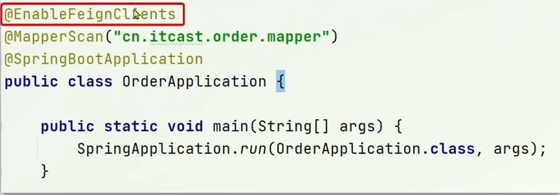

# 微服务学习
# 1.认识微服务

## 1.1 分布式架构

> 定义

根据业务功能对系统进行拆分，每个业务模块的作为独立项目开发，成为一个服务。

> 优点

- 降低服务耦合
- 有利于服务扩展

> 分布式架构要考虑的问题

- 服务拆分粒度？
- 服务集群地址如何维护？
- 服务之间如何实现远程调用？
- 服务健康状态如何感知？

## 1.2 微服务

> 定义

微服务是一种经过良好架构设计的**分布式**架构方案。

> 特征

- ==单一职责==：微服务拆分粒度更小，每一个服务对应唯一的业务能力，做到单一职责，避免业务重复开发
- ==面向对象==：微服务对外暴露接口
- ==自治==：团队独立、技术独立、数据独立、部署独立
- ==隔离性强==：服务调用做好隔离、容错、降级，避免出现隔离问题

> 微服务技术对比

|                | Dubbo               | SpringCloud              | SpringCloudAlibaba       |
| -------------- | ------------------- | ------------------------ | ------------------------ |
| 注册中心       | zookeeper、Redis    | Eureka、Consul           | Nacos、Eureka            |
| 服务远程调用   | Dobbo协议           | Feign（http协议）        | Dubbo、Feign             |
| 配置中心       | 无                  | SpringCloudConfig        | SpringCloudConfig、Nacos |
| 服务网关       | 无                  | SpringCloudGateway、Zuul | SpringCloudGateway、Zuul |
| 服务监控和保护 | dubbo-admin，功能弱 | Hystrix                  | Sentinel                 |

## 1.3 SpringCloud

目前使用最广泛的微服务架构。

# 2.服务拆分及远程调用

## 2.1 服务拆分注意事项

- 不同微服务，不要重复开发相同业务。
- 微服务数据独立，不要访问其他微服务的数据库。
- 微服务可以将自己的业务暴露为接口，供其他服务使用。

## 2.2 服务调用关系

- ==服务提供者==：一次业务中，被其他微服务调用的服务。

- ==服务消费者==：一次业务中，低啊用其他微服务的服务。

  ==**提供者与消费者的角色是相对而言的**==：一个服务既可以是消费者，又可以是提供者

## 2.3 Eureka注册中心

Eureka架构中,微服务角色有两类:

- EurekaServer：服务端，注册中心
  - 作用：记录服务信息，监控客户端心跳

- EurekaClient：客户端
  - Provider：服务提供者
    - 启动时，注册自己的信息到EurekaServer
    - 每隔30s向EurekaServer发送心跳
  - Consumer：服务消费者
    - 根据服务名称从EurekaServer拉取服务列表
    - 基于服务列表做负载均衡，选中一个微服务后发起调用。

## 2.4 Ribbon负载均衡

> Ribbon负载均衡流程


> 负载均衡策略

==Ribbon的负载均衡规则是一个叫IRule的接口来定义的，每一个子接口都是一种规则。==


| 内置负载均衡规则类        | 规则描述                                                                                                                                                                              |
| ------------------------- |-----------------------------------------------------------------------------------------------------------------------------------------------------------------------------------|
| RoundRobinRule            | 轮询。Ribbon默认的负载均衡。                                                                                                                                                                 |
| AvailabilityFilteringRule | 对以下两种服务器忽略: <br/>1.“短路”的服务器。默认情况下，如果一台服务器3次连接失败，就会被设置为“短路”状态。短路状态将持续30s，如果再次连接失败，短路状态持续时间几何级增加。<br/> 2.并发数过高的服务器。可以由`<clientName>.<clientConfigNameSpace>.ActiveConnectionsLimit`配置。 |
| WeightedResponseTimeRule  | 为每一个服务器赋予一个权重值。服务器响应时间越长，其权重值越小。这个规则会随机选择服务器，权重值会影响服务器的选择。                                                                                                                        |
| ZoneAvoidanceRule         | 以区域可用的服务器为基础进行服务器的选择。使用Zone对服务器进行分类，Zone可以理解为一个机房、一个机架等。而后再对Zone内的多个服务做轮询。                                                                                                        |
| BestAvailableRule         | 忽略短路服务器，并选择并发数较低的服务器。                                                                                                                                                             |
| RandomRule                | 随机选择一个可用的服务器。                                                                                                                                                                     |
| RetryRule                 | 重试机制的选择逻辑。                                                                                                                                                                        |
| RandomRule                | 随机选择。                                                                                                                                                                             |

> 负载均衡两种配置方式

- 在消费者服务的启动类里注入IRule

  ```java
  @Bean
  public IRule randomRule() {
      return new RendomRule();
  }
  ```

- 在消费者服务的yaml文件里添加规则

  ```yaml
  userservice: # 服务提供者的服务名
      ribbon:
         NFLoadBalancerRuleClassName: com.netflix.loadbalancer.RandomRule # 负载均衡规则
  ```

==以上二者的区别==：

​	第一种是所有服务的负载均衡策略都是RandomRule；第二种是只有指定服务名（userservice）的服务的负载均衡策略是RandomRule。

> Ribbon 策略--饥饿加载

Ribbon默认使用的是**懒加载**。

==开启饥饿加载==

```yaml
ribbon:
  eager-load:
      enable: true # 开启饥饿加载
      clients: userservice # 只对单个服务开启饥饿加载
#--------------------------------------------------------------------------------------------      
ribbon:
  eager-load:
      enable: true # 开启饥饿加载
      clients: 
        - userservice # 对多个服务开启饥饿加载
           goodservice
```

## 2.5 Nacos注册中心

# 7.Feign(HTTP客户端)

## 7.1 Feign替代RestTemplate

>Feign定义

Feign是一个声明式的http客户端，作用是帮助我们优雅的实现http请求的发现，帮助实现各个微服务内部之间的调用。

> 使用

Step1. 引入依赖


Step2. 启动类添加Feign启动注解



Step3. 编写Feign客户端


Step4. 测试使用


## 7.2 自定义配置

>概念


> 使用配置文件配置Feign日志


>使用注解配置Feign日志


## 7.3 Feign使用优化

> Feign底层客户端实现

- URLConnection：默认实现，不支持连接池，性能较差
- Apache HttpClient：支持连接池
- OKHttp：支持连接池

> 优化策略

- 使用连接池代替默认URLConnection
- 日志级别，最好使用basic或none

> Feign性能优化-连接池配置


## 7.4 最佳实践

> 方式一--继承（耦合度比较高）


> 方式二--抽取（如果FeignAPI功能比较多，包比较大，orderservice只用到一两个方法，就造成了浪费）


方式2的实现难点

>当定义的FeignClient不在SpringBootApplication的扫描包范围时，这些FeignClient无法使用，解决方法如下：


# 8.统一网关Gateway

## 8.1 为什么需要网关

> 网关功能

- 对用户请求做身份认证和权限校验
- 将用户请求路由到微服务，并实现负载均衡
- 对要不过户请求做限流

> 网关的技术实现

- gateway
- zuul

==对比==：zuul是基于servlet实现，属于阻塞式变成。gateway是基于SPring5中提供的WebFlux，属于响应式变成，具备更好的性能。

## 8.2 gateway快速入门

> 搭建步骤


> 请求流程


> 总结->路由可以配置的内容包括以下几点：

- 路由id：路由唯一标识
- 路由目标（uri）：路由的目标地址，http代表固定地址，lb代表根据服务名称做负载均衡
- 路由断言（predicates）：判断路由规则
- 路由过滤器（filters）：对请求或响应做处理

## 8.3 断言工厂

> 作用

读取用户在配置文件中编写的断言规则，将他们解析出来，并且对请求做出判断

> Spring提供的11中基本的Predicate工厂


> After断言工厂的使用


==当前是2022年，不符合路由规则，此时访问会报404==

## 8.4 过滤器工厂

### 8.4.1 路由过滤器GatewayFilter

GatewayFilter是网关中提供的一种过滤器，可以对进入网关的请求和微服务返回的响应做处理：


### 8.4.2 路由过滤器工厂

> 过滤器的作用

- 对路由的请求或响应做加工处理，比如添加请求头
- 配置在路由下的过滤器只对当前路由的请求生效（==如果想对所有路由都生效，可以使用defaultFilter==）

一共30多种。使用时可以参考官网。


> 例子：给所有进入userservice的请求加一个请求头：Truth=Itcast is freeking awesome！


> 优化：给所有请求都加上请求头：Truth=Itcast is freeking awesome！


## 8.5 全局过滤器GlobalFilter

> 作用

处理一切进入网关的请求和微服务响应，和GatewayFilter的作用一样。==区别==在于GatewayFilter通过配置定义，处理逻辑是固定的；但是GlobalFilter的逻辑需要自己写代码实现。

> 实现方式

**实现GlobalFilter接口。**


> 案例：编写一个拦截器，获取请求中的authorization参数。如果用户是admin，放行，否则就拦截。


## 8.6 过滤器执行顺序

- order值越小，执行顺序越靠前
- order值相等时，安装defaultFilter>路由过滤器>GlobalFilter的顺序执行。

## 8.7 跨域问题

> 定义

浏览器禁止请求的发起者与服务端发生跨域ajax请求，请求被浏览器拦截的问题。

> 解决方案

CORS

> 实现


# 9.Docker

## 9.1 初识Docker

### 9.1.1 概念

> Docker如何解决大型项目依赖关系复杂、不同组件依赖兼容性的问题？

- Docker允许开发中将应用、依赖、函数库、配置一起**打包**，形成可移植镜像。
- Docker应用运行在容器中，使用沙箱机制，相互**隔离**

> Docker如何解决开发、测试、生产环境有差异的问题？

Docker镜像中包含完整的运行环境，包括系统函数库，仅依赖系统的Linux内核，因此可以在任意Linux操作系统上运行。

### 9.1.2 Docker与虚拟机的区别

- Docker是一个系统进程；虚拟机是在操作系统中的操作系统
- Docker体积小，启动速度快，性能好；虚拟机体积大，启动速度慢，性能较差。


### 9.1.3 Docker架构


## 9.2 数据卷


## 9.3 目录挂载

命令和数据卷挂载一致。

> 目录挂载和数据卷挂载的区别


## 9.4 镜像

> 定义

镜像是将**应用程序**及其需要的**系统函数库**、**环境**、**配置**、依赖打包而成。

> 镜像结构

==镜像是分层结构，每一层称为一个Layer==


## 9.5 DockerCompose

> 概念

- DockerCompose基于Compose文件实现快速部署分布式应用。

- Compose文件是一个文本文件，通过指令定义急群众的每个容器如何运行。

  

# 10.  服务异步通讯RabbitMQ

## 10.1 初始MQ

### 10.1.1 同步通讯

==微服务间基于Feign的调用就属于同步方式。==

> 优点

时效性强，能够立即得到结果

> 同步调用的问题

- **耦合度高**：每次加入新需求，都要改原来的代码
- **性能下降**：调用者需要等待提供者响应。如果调用链过程则响应时间等于每次调用的时间之和
- **资源浪费**：调用链中的每个服务在等待响应过程中，不能释放请求占用的资源，高并发场景下极度浪费系统资源
- **级联失败**：如果提供者出现问题，所有调用方法都会跟着出问题，如同多米诺骨牌，迅速导致整个微服务群故障

### 10.1.2 异步通讯

==异步调用常见实现就是事件驱动模式。==


> 优势

- 服务解耦
- 性能提升，吞吐量提高
- 服务没有强依赖，不担心级联失败问题
- 流量削峰

> 缺点

- 依赖于Broker的可靠性、安全性、吞吐能力
- 架构复杂了，业务没有明显的流程线，不好追踪管理

### 10.1.3 MQ常见框架

> MQ定义

MQ（MessageQueue），存放消息的队列，即时间驱动架构中的Broker。

> MQ常见框架对比


## 10.2 RabbitMQ快速入门

### 10.2.1 概述

==RabbitMQ最擅长的是消息的可靠性、稳定性，以及系统的高可用==

官网：[Messaging that just works — RabbitMQ](https://www.rabbitmq.com/)

#### 10.2.1.1 单机部署MQ

Step1. 下载RabbitMQ镜像

```shell
docker pull rabbitmq:3-management
```

Step2. 运行MQ容器

```shell
docker run \
  -e RABBITMQ_DEFAULT_USER=itcast \
  -e RABBITMQ_DEFAULT_PASS=123456 \
  --name mq \
  --hostname mq1 \ # 配置主机名，单机的话可以不设置，但是集群部署必须设置
  -p 15672:15672 \   # mq管理平台的端口，提供一个UI界面
  -p 5672:5672 \   # 消息接收与发送端口
  -d \
  rabbitmq:3-management
```

### 10.2.2 RabbitMQ概念和结构

> 概念

- channel：操作MQ的工具
- exchange：路由消息到队列中
- queue：缓存消息
- virtual host：虚拟主机，是对queue、exchange等资源的逻辑分组

> 结构


## 10.3 常见消息模型


> Hello World 实践


## 10.4 SpringAMQP

### 10.4.1 概念

> AMQP

**A**dvanced **M**essage **Q**ueuing **P**rotocol，用于在应用程序之间传递业务消息的开放标准。该协议与平台无关，更符合微服务中独立性要求。

> Spring AMQP

Spring AMQP是基于AMQP协议定义的一套API规范，提供了模板来发送和接收消息。包含两部分，其中spring-amqp是基础抽象，spring-rabbit是底层的默认实现。

==特征==

- 侦听器容器，用于异步处理入栈消息
- 支持用于发送和接收消息的RabbitTemplate
- 支持RabbitAdmin自动声明队列、交换、绑定

### 10.4.2 案例

> 利用SpringAMQP实现HelloWorld中的基础消息队列功能

流程如下：

