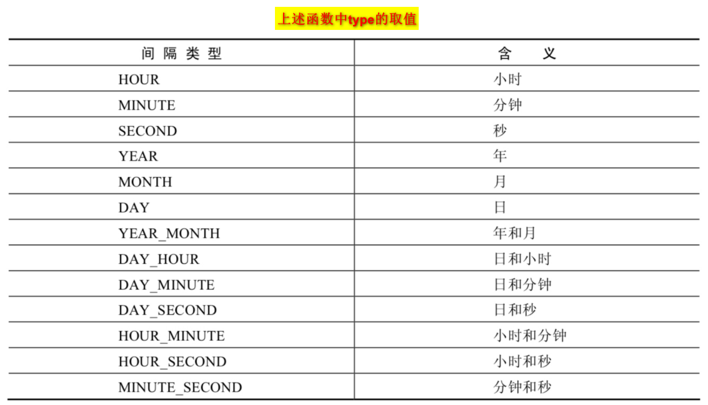
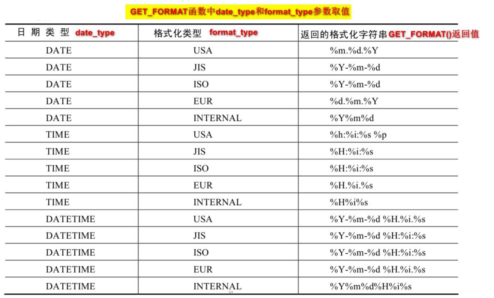

# 8 MySQL函数

## 8.1 单行函数

### 8.1.1 数值函数

| 函数                       | 用法                                       |
|--------------------------|------------------------------------------|
| `SIGN(X) `               | 返回X的符号。正数返回1，负数返回-1，0返回0                 |
| `CEIL(x)`，`CEILING(x) `  | 对x向上取整                                   |
| `FLOOR(x)`               | 对x向下取整                                   |
| `LEAST(e1,e2,e3…)`       | 返回列表中的最小值                                |
| `GREATEST(e1,e2,e3…) `   | 返回列表中的最大值                                |
| `RAND() `                | 返回0~1的随机数                                |
| `RAND(x)`                | 返回0~1的随机数。x是种子，相同的x值会产生相同的随机数            |
| `ROUND(x) `              | 对x四舍五入，得到一个整数                            |
| `ROUND(x,y)`             | 对x进行四舍五入，并保留y位小数                         |
| `TRUNCATE(x,y) `         | 对x截断，保留y位小数                              |
| `SQRT(x)`                | 返回x的平方根。当X的值为负数时，返回NULL                  |
| `POW(x,y)`，`POWER(X,Y) ` | 返回x的y次方                                  |
| `EXP(X) `                | 返回e的x次方                                  |
| `CONV(x,f1,f2) `         | 将x由f1进制数转为f2进制数。f1指明当前x是什么进制，f2指明想转成什么进制 |
| ...                      | ...                                      |

### 8.1.2 字符串函数

<p><front style="background: yellow">MySQL中，字符串的位置是从1开始的</front></p>

| 函数                                                                  | 用法                                                   |
|---------------------------------------------------------------------|------------------------------------------------------|
| `CHAR_LENGTH(s) `,`与CHARACTER_LENGTH(s)`                            | 返回字符串s的字符数。                                          |
| `LENGTH(s)`                                                         | 返回字符串s的字节数，和字符集有关                                    |
| `CONCAT(s1,s2,......,sn) `                                          | 连接s1,s2,......,sn为一个字符串                              |
| `CONCAT_WS(x, s1,s2,......,sn)`                                     | 同CONCAT(s1,s2,...)函数，但是每个字符串之间要加上x                   |
| `INSERT(str, idx, len, replacestr)`                                 | 将字符串str从第idx位置开始，len个字符长的子串替换为字符串replacestr          |
| `REPLACE(str, a, b)`                                                | 用字符串b替换字符串str中所有出现的字符串a                              |
| `UPPER(s)` ，` UCASE(s)`                                             | 将字符串s的所有字母转成大写字母                                     |
| ` LOWER(s)` ，`LCASE(s)`                                             | 将字符串s的所有字母转成小写字母                                     |
| `LEFT(str,n)`或`RIGHT(str,n)`                                        | 返回字符串str最左边或最右边的n个字符                                 |
| `LPAD(str, len, pad)`或`RPAD(str ,len, pad)`                         | 用字符串pad对str最左边或最右边进行填充，直到str的长度为len个字符               |
| `LTRIM(s)`或`RTRIM(s) `                                              | 去掉字符串s左侧或右的空格                                        |
| `TRIM(s)`                                                           | 去掉字符串s开始与结尾的空格                                       |
| `TRIM(s1 FROM s)`                                                   | 去掉字符串s开始与结尾的s1                                       |
| `TRIM(LEADING s1 FROM s)`                                           | 去掉字符串s开始处的s1                                         |
| `TRIM(TRAILING s1 FROM s)`                                          | 去掉字符串s结尾处的s1                                         |
| `REPEAT(str, n)`                                                    | 返回str重复n次的结果                                         |
| `SPACE(n)`                                                          | 返回n个空格                                               |
| `STRCMP(s1,s2)`                                                     | 比较字符串s1,s2的ASCII码值的大小                                |
| `SUBSTR(s,index,len)`,`SUBSTRING(s,n,len)`,`MID(s,n,len)`           | 返回从字符串s的index位置其len个字符                               |
| ` LOCATE(substr,str)`,`POSITION(substr IN str)`,`INSTR(str,substr)` | 返回字符串substr在字符串str中首次出现的位置。未找到，返回0                   |
| `ELT(m,s1,s2,…,sn)`                                                 | 返回指定位置的字符串。如 果m=n，则返回sn                              |
| `FIELD(s,s1,s2,…,sn) `                                              | 返回字符串s在字符串列表中第一次出现的位置                                |
| `FIND_IN_SET(s1,s2)`                                                | 返回字符串s1在字符串s2中出现的位置。其中，字符串s2是一个以逗号分 隔的字符串。完全匹配不是模糊匹配 |
| `REVERSE(s) `                                                       | 反转s                                                  |
| `NULLIF(value1,value2)`                                             | 比较两个字符串，如果value1与value2相等，则返回NULL，否则返回 value1        |

### 8.1.3 日期和时间

> 获取日期、时间

| 函数                                                                           | 用法               |
|------------------------------------------------------------------------------|------------------|
| `CURDATE()` ，`CURRENT_DATE()`                                                | 返回当前日期，只包含年、 月、日 |
| `CURTIME()` ，` CURRENT_TIME()`                                               | 返回当前时间，只包含时、 分、秒 |
| `NOW()`,`SYSDATE()`,`CURRENT_TIMESTAMP()`, `LOCALTIME()`, `LOCALTIMESTAMP()` | 返回当前系统日期和时间      |

> 日期与时间戳的转换

| 函数                         | 用法                   |
|----------------------------|----------------------|
| `UNIX_TIMESTAMP()`         | 将当前时间以UNIX时间戳的形式返回   |
| `UNIX_TIMESTAMP(date)`     | 将时间date以UNIX时间戳的形式返回 |
| `FROM_UNIXTIME(timestamp)` | 将UNIX时间戳转换为普通格式的时间   |

> 日期的操作函数

| 函数                        | 用法                                |
|---------------------------|-----------------------------------|
| `EXTRACT(type FROM date)` | 返回指定日期中特定的部分，type指定返回的值，其取值与含义见下图 |

```mysql
mysql> SELECT now() curr, EXTRACT(MINUTE FROM NOW()) curr_minute, EXTRACT( WEEK FROM NOW()) curr_week, EXTRACT( QUARTER FROM NOW()) curr_quarter, EXTRACT( MINUTE_SECOND FROM NOW()) curr_minute_second;

+---------------------+-------------+-----------+--------------+--------------------+
| curr                | curr_minute | curr_week | curr_quarter | curr_minute_second |
+---------------------+-------------+-----------+--------------+--------------------+
| 2023-01-13 15:54:35 |          54 |         2 |            1 |               5435 |
+---------------------+-------------+-----------+--------------+--------------------+
1 row in set (0.00 sec)
```


> 计算日期和时间的函数--第1组

| 函数                                       | 用法                                |
|------------------------------------------|-----------------------------------|
| `DATE_ADD(datetime, INTERVAL expr type)` | 在当前日期或时间上增加expr对应的时间（时间格式由type指定） |
| `DATE_SUB(datetime,INTERVAL expr type)`  | 在当前日期或时间上减去expr对应的时间（时间格式由type指定） |

```mysql
mysql> SELECT NOW() `now`,
    -> DATE_ADD(NOW(), INTERVAL 1 DAY) AS add_1_day,
    -> DATE_ADD(NOW(),INTERVAL 1 SECOND) AS add_1_second,
    -> DATE_ADD(NOW(),INTERVAL '1_1' MINUTE_SECOND) AS add_1_minute_1_second,
    -> DATE_ADD(NOW(), INTERVAL -1 YEAR) AS sub_1_year #可以是负数，相当于减
    -> ;
    
+---------------------+---------------------+---------------------+-----------------------+---------------------+
| now                 | add_1_day           | add_1_second        | add_1_minute_1_second | sub_1_year          |
+---------------------+---------------------+---------------------+-----------------------+---------------------+
| 2023-01-13 16:11:58 | 2023-01-14 16:11:58 | 2023-01-13 16:11:59 | 2023-01-13 16:12:59   | 2022-01-13 16:11:58 |
+---------------------+---------------------+---------------------+-----------------------+---------------------+
1 row in set (0.00 sec)
```



> 计算日期和时间的函数--第2组

| 函数                                             | 用法                                                   |
|------------------------------------------------|------------------------------------------------------|
| `ADDTIME(time1,time2)`或`SUBTIME(time1,time2) ` | 返回time1加上或减掉time2后的时间。当time2为一个数字时，代表的是 **秒** ，可以为负数 |
| `DATEDIFF(date1,date2)`                        | 返回date1 - date2的日期间隔天数                               |
| ` TIMEDIFF(time1, time2)`                      | 返回time1 - time2的时间间隔                                 |
| `FROM_DAYS(N)`                                 | 返回从0000年1月1日起，N天以后的日期                                |
| ` TO_DAYS(date) `                              | 返回日期date距离0000年1月1日的天数                               |
| `LAST_DAY(date)`                               | 返回date所在月份的最后一天的日期                                   |
| `MAKEDATE(year,n) `                            | 针对给定年份与所在年份中的天数返回一个日期                                |
| `MAKETIME(hour,minute,second)`                 | 将给定的小时、分钟和秒组合成时间并返回                                  |
| `PERIOD_ADD(time,n)`                           | 返回time加上n个月后的时间。**其中time为YYMM或者YYYYMM**              |

```mysql
mysql> SELECT NOW() `now`,
    -> ADDTIME(NOW(),20) add_20_second,
    -> SUBTIME(NOW(),'1:1:3') sub_1h_1m_3s,
    -> DATEDIFF(NOW(),'2021-10-01') diff_date,
    -> TIMEDIFF(NOW(),'2021-10-25 22:10:10') diff_time
    -> ;
+---------------------+---------------------+---------------------+-----------+-----------+
| now                 | add_20_second       | sub_1h_1m_3s        | diff_date | diff_time |
+---------------------+---------------------+---------------------+-----------+-----------+
| 2023-01-13 16:36:13 | 2023-01-13 16:36:33 | 2023-01-13 15:35:10 |       469 | 838:59:59 |
+---------------------+---------------------+---------------------+-----------+-----------+
1 row in set, 1 warning (0.00 sec)

```

```mysql
mysql> SELECT NOW() `now`,
    -> FROM_DAYS(368) 368_date,
    -> TO_DAYS('0000-12-25') to_days,
    -> LAST_DAY(NOW()) curr_month_last_day,
    -> MAKEDATE(YEAR(NOW()),369) make_date,
    -> MAKETIME(52,21,23) make_time
    -> ;
+---------------------+------------+---------+---------------------+------------+-----------+
| now                 | 368_date   | to_days | curr_month_last_day | make_date  | make_time |
+---------------------+------------+---------+---------------------+------------+-----------+
| 2023-01-13 16:36:36 | 0001-01-03 |     359 | 2023-01-31          | 2024-01-04 | 52:21:23  |
+---------------------+------------+---------+---------------------+------------+-----------+
1 row in set (0.00 sec)
```

```mysql
mysql> SELECT PERIOD_ADD(201703, 5) ;
+-----------------------+
| PERIOD_ADD(201703, 5) |
+-----------------------+
|                201708 |
+-----------------------+
1 row in set (0.00 sec)
```

> 日期的格式化与解析

| 函数                                  | 用法                       |
|-------------------------------------|--------------------------|
| `DATE_FORMAT(date,fmt)`             | 按照字符串fmt格式化日期date        |
| `TIME_FORMAT(time,fmt) `            | 按照字符串fmt格式化时间time        |
| `GET_FORMAT(date_type,format_type)` | 返回日期字符串的显示格式             |
| `STR_TO_DATE(str, fmt)`             | 按照字符串fmt对str进行解析，解析为一个日期 |



### 8.1.4 流程控制函数

| 函数                                                                 | 用法                                  |
|--------------------------------------------------------------------|-------------------------------------|
| `IF(value,value1,value2) `                                         | 如果value的值为TRUE，返回value1， 否则返回value2 |
| `IFNULL(value1, value2) `                                          | 如果value1不为NULL，返回value1，否 则返回value2 |
| `CASE WHEN 条件1 THEN 结果1 WHEN 条件2 THEN 结果2 .... [ELSE resultn] END` | 相当于Java的if...else if...else...      |
| `CASE expr WHEN 常量值1 THEN 值1 WHEN 常量值1 THEN 值1 .... [ELSE 值n] END` | 相当于Java的switch...case...            |

### 8.1.5 加密与解密函数

| 函数                             | 用法                                                                                           |
|--------------------------------|----------------------------------------------------------------------------------------------|
| `PASSWORD(str) `               | 用户密码加密。加密结果**不可逆** ，常用于用户的密码加密 。<front style="background: yellow">MySQL8.0中已移除该方法</front>    |
| `MD5(str) `                    | MD5加密。若参数为 NULL，则会返回NULL                                                                     |
| `SHA(str) `                    | SHA加密。当参数为 NULL时，返回NULL。 SHA加密算法比MD5更加安全 。                                                   |
| `ENCODE(value,password_seed)`  | 返回使用password_seed作为加密密码**加密**value <front style="background: yellow">MySQL8.0中已移除该方法</front> |
| `DECODE(value,password_seed) ` | 返回使用password_seed作为加密密码**解密**value<front style="background: yellow">MySQL8.0中已移除该方法</front>  |

### 8.1.6 MySQL信息函数

| 函数                                                          | 用法                                |
|-------------------------------------------------------------|-----------------------------------|
| `VERSION() `                                                | 返回当前MySQL的版本号                     |
| `CONNECTION_ID() `                                          | 返回当前MySQL服务器的连接数                  |
| ` DATABASE()`，`SCHEMA()`                                    | 返回MySQL命令行当前所在的数据库                |
| `USER()`，`CURRENT_USER()`、`SYSTEM_USER()`， `SESSION_USER()` | 返回当前连接MySQL的用户名，返回结果格式为 “主机名@用户名” |
| `CHARSET(value) `                                           | 返回字符串value自变量的字符集                 |
| `COLLATION(value)`                                          | 返回字符串value的比较规则                   |

```mysql
mysql> SELECT CHARSET('ABC'), COLLATION('ABC');

+----------------+--------------------+
| CHARSET('ABC') | COLLATION('ABC')   |
+----------------+--------------------+
| utf8mb4        | utf8mb4_0900_ai_ci |
+----------------+--------------------+
1 row in set (0.00 sec)
```

### 8.1.7 其他函数

| 函数                                | 用法                                           |
|-----------------------------------|----------------------------------------------|
| `FORMAT(value,n)`                 | 返回对数字value进行格式化后的结果数据。n表示 **四舍五入** 后保留 到小数位数 |
| `INET_ATON(ipvalue)  `            | 将以点分隔的IP地址转化为一个数字                            |
| `INET_NTOA(value) `               | 将数字形式的IP地址转化为以点分隔的IP地址                       |
| `BENCHMARK(n,expr) `              | 将表达式expr重复执行n次。用于测试MySQL处理expr表达式所耗费的时间      |
| `CONVERT(value USING char_code) ` | 将value所使用的字符编码修改为char_code                   |

```mysql
SELECT CHARSET('mysql'), CHARSET(CONVERT('mysql' USING 'utf8'));

+------------------+----------------------------------------+
| CHARSET('mysql') | CHARSET(CONVERT('mysql' USING 'utf8')) |
+------------------+----------------------------------------+
| utf8mb4          | utf8                                   |
+------------------+----------------------------------------+
1 row in set, 1 warning (0.00 sec)
```

## 8.2 聚合函数

> 聚合函数类型

- `AVG()`：AVG(column)求column列的平均值。只能对**数值型数据**使用

- `SUM()`：SUM(column)求column列的和。只能对**数值型数据**使用

- `MAX()`：MAX(column)求column列的最大值。可以对**任意数据类型**的数据使用

- `MIN()`：MIN(column)求column列的最小值。可以对**任意数据类型**的数据使用

- `COUNT()`：返回表中记录总数。可以对**任意数据类型**的数据使用

    - <front style="background: yellow">用count(*)，count(1)，count(列名)谁好呢?</front>

      `答：`对于**MyISAM引擎**的表是没有区别的。这种引擎内部有一计数器在维护着行数。 **Innodb引擎**的表用count(*),count(1)
      直接读行数，复杂度是O(n)，因为innodb真的要去数一遍。但好于具体的count(列名)。

    - <front style="background: yellow">能不能使用count(列名)替换count(*)?</front>

      `答：`不要使用 count(列名)来替代 count(\*) 。**count(*)会统计值为 NULL 的行，而 count(列名)不会统计此列为 NULL 值的行
      **。

> 语法

<p><front style="background: yellow">用在select子句中</front></p>

```mysql
SELECT column, 聚合函数(column)
FROM table
[WHERE condition]
[GROUP BY group_by_expression]
[ORDER BY column];
```

> 注意

- <front style="background: yellow">聚合函数不能嵌套使用</front>
- <front style="background: yellow">不能在where语句中使用聚合函数</front>

## 8.3 GROUP BY

> 语法

<p><front style="background: yellow">用在where后order by前</front></p>

```mysql
SELECT column, group_function(column)
FROM table
[WHERE condition]
[GROUP BY group_by_expression]
[ORDER BY column];
```

> 注意事项

<p><front style="background: yellow">在SELECT列表中所有未包含在组函数中的列都应该包含在 GROUP BY子句中</front>，
但是包含在 GROUP BY 子句中的列不必包含在SELECT 列表中</p>

> GROUP BY中使用WITH ROLLUP

- 使用 `WITH ROLLUP` 关键字之后，在所有查询出的分组记录之后**增加一条记录**，该记录用来求全部数据的sum、avg、count等
- 当使用ROLLUP时，不能同时使用ORDER BY子句进行结果排序，即**ROLLUP和ORDER BY是互相排斥 的**

```mysql
mysql> SELECT department_id, SUM(salary),AVG(salary),count(*)
    -> FROM employee
    -> GROUP BY department_id WITH ROLLUP;
    
+---------------+-------------+-------------+----------+
| department_id | SUM(salary) | AVG(salary) | count(*) |
+---------------+-------------+-------------+----------+
|             1 |    19600.00 | 9800.000000 |        2 |
|             2 |     3433.00 | 3433.000000 |        1 |
|          NULL |    23033.00 | 7677.666667 |        3 |
+---------------+-------------+-------------+----------+
3 rows in set (0.00 sec)
```

## 8.4 HAVING

> 作用

过滤分组

> 语法

- 使用时，确保行已被分组
- <front style="background: yellow">使用了聚合函数</front>
- <front style="background: yellow">和GROUP BY搭配使用，用在GROUP BY后order by前</front>

```mysql
SELECT column, group_function(column)
FROM table
[WHERE condition]
[GROUP BY group_by_expression]
[HAVING group_condition]
[ORDER BY column];
```

> 例子

```mysql
mysql> SELECT department_id, MAX(salary)
    -> FROM employee
    -> GROUP BY department_id
    -> HAVING MAX(salary) > 2222
    -> ORDER BY department_id desc;
    
    
+---------------+-------------+
| department_id | MAX(salary) |
+---------------+-------------+
|             2 |     3433.00 |
|             1 |    10000.00 |
+---------------+-------------+
2 rows in set (0.00 sec)
```

## 8.5 SELECT执行过程

> SELECT语句的结构

```mysql
SELECT ...,....,...
FROM ...[, ..., ...]
[INNER / LEFT / RIGHT] JOIN ... ON ...多表的连接条件
WHERE 不包含组函数的过滤条件 [AND / OR 不包含组函数的过滤条件]
GROUP BY ...,...
HAVING 包含组函数的过滤条件
ORDER BY ..., ..., ... ASC / DESC
LIMIT ...,...
```

> SELECT语句的执行顺序

FROM （---> ON ---> JOIN ）---> WHERE ---> GROUP BY ---> HAVING ---> SELECT ---> DISTINCT ---> ORDER BY ---> LIMIT

> SELECT执行原理

- **执行FROM子句**，生成虚拟表**vt1**。如果是多表联查，还会经历如下几个步骤：
    - 先**求两个表的笛卡尔积**，生成虚拟表**vt1.1**
    - **执行ON语句**，对表vt1的数据进行筛选，生成表**vt1.2**
    - 如果是外连接（左连接/右连接/全连接），则对表vt1.2**添加外部行**，生成虚拟表**vt1.3**
- **执行WHERE语句**，对FROM语句中生成的虚拟表进行筛选，生成虚拟表**vt2**
- **执行GROUP BY语句**，对表vt2中的数据进行分组，生成虚拟表**vt3**
- **执行HAVING语句**，对表vt3中的数据再次进行筛选，生成虚拟表**vt4**。<front style="background: yellow">
  HAVING语句中可以使用SELECT语句中的列以及列的别名</front>
- **执行SELECT语句**，在表vt4中选取需要的列，生成虚拟表**vt5**。
- **执行DISTINCT语句**，对表vt5中的数据去重，生成虚拟表**vt6**。
- **执行ORDER BY语句**，对表vt6中的数据进行排序，生成虚拟表**vt7**。<front style="background: yellow">ORDER
  BY语句中可以使用SELECT语句中的列以及列的别名</front>
- **执行LIMIT语句**，在表vt7中取出指定的行记录，生成虚拟表**vt8**。