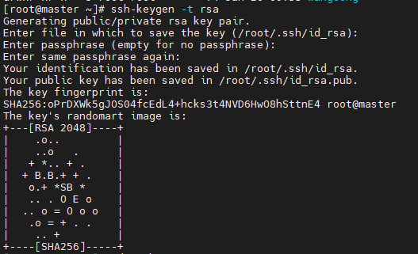
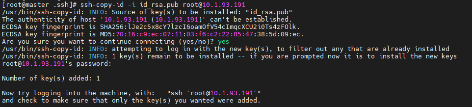
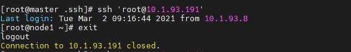

# CentOS7root
**本笔记实现的是在服务器A上使用ssh免密登录到服务器B。**

# 1.在服务器A上生成密钥文件

```shell
ssh-keygen -t rsa
```

执行过程中一路回车即可。



执行完成后，会在`/root`下生成`.ssh`文件夹，该文件夹下会生成`id_rsa`和`id_rsa.pub`文件。

# 2.在服务器A上将密钥发送到服务器B上

```shell
cd ~/.ssh
ssh-copy-id -i id_rsa.pub root@10.1.93.191
```



# 3.修改服务器B上的文件权限

**修改服务器B上的`/root/.ssh`文件夹和`/root/.ssh/authorized_keys`文件权限分别为`700`、`600`**

# 4.在服务器A上实现免密登录服务器B



