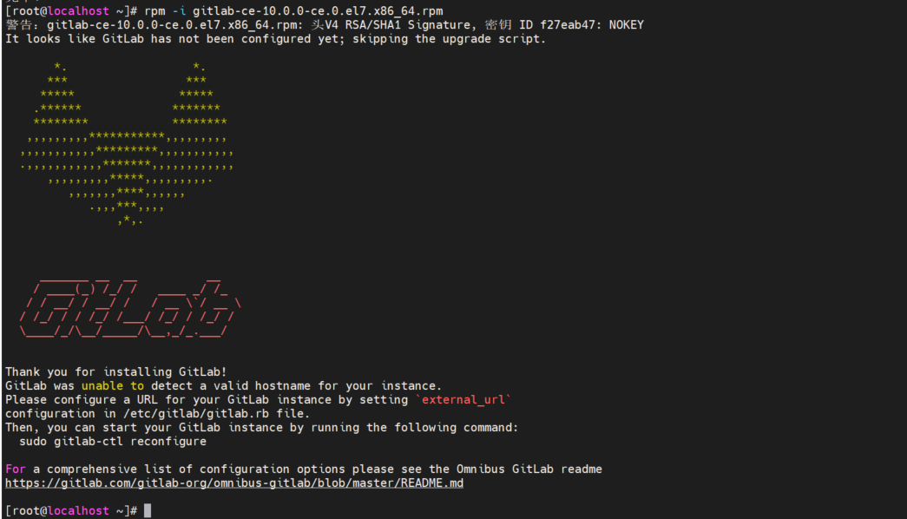
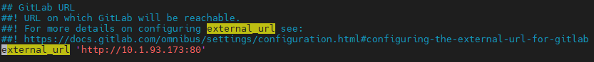
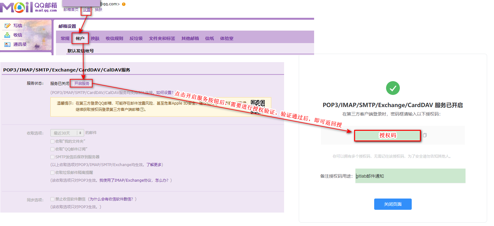
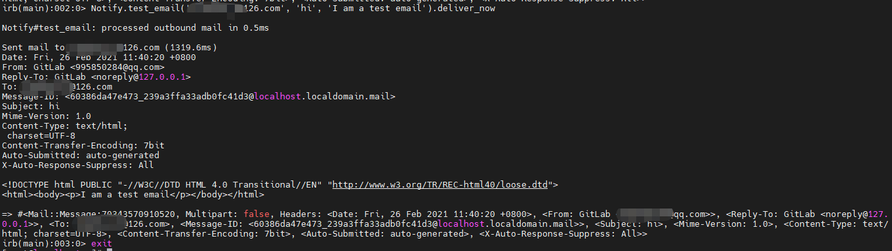
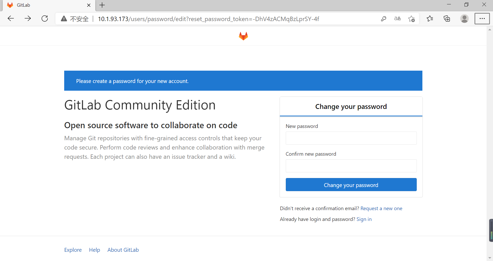

# CentOS7安装GitLab

**本教程中，防火墙是关闭的。**

## 1 安装ssh


```shell
# 检查是否安装了ssh服务
systemctl status ssh

# 如果没安装，则安装；安装的话，跳过该命令
yum install -y curl policycoreutils-pythonopenssh-server

# 设置ssh开机自启
systemctl enable sshd

# 启动ssh
systemctl start sshd
```

## 2 安装 Postfix 

Postfix 是用来发送通知邮件的。

```shell
# 检查是否安装了postfix服务
systemctl status postfix

# 如果没安装，则安装；安装的话，跳过该命令
yum install -y postfix

# 设置postfix开机自启
systemctl enable postfix

# 启动postfix
systemctl start postfix
```

## 3 安装 policycoreutils-python 

policycoreutils-python 是gitlab的一个依赖。

```shell
yum install policycoreutils-python
```

## 4 安装GitLab

```shell
# 添加gitlab镜像源
wget https://mirrors.tuna.tsinghua.edu.cn/gitlab-ce/yum/el7/gitlab-ce-12.3.5-ce.0.el7.x86_64.rpm

# 安装
rpm -i gitlab-ce-12.3.5-ce.0.el7.x86_64.rpm
```

 安装过程需要些时间，如果出现下图，则说明安装成功。 



## 5 配置GitLab

 GitLab相关参数配置都在 `/etc/gitlab/gitlab.rb` 文件里，每次配置完成之后需要执行`gitlab-ctl reconfigure`，重新配置才能生效。 

### 5.1 配置 external_url  

 修改 external_url ‘[http://ip:address]‘为真实的服务器IP和端口。



### 5.2 配置邮件服务

以qq邮箱向外发送gitlab的相关邮件为例。

#### 5.2.1 开启qq邮箱的STMP服务



#### 5.2.2 修改gitlab配置

```shell
# 进入配置文件
vim /etc/gitlab/gitlab.rb

# 可以在文件中查找这些内容进行修改，由于这些内容是注释的，也可以直接添加
gitlab_rails['smtp_enable'] = true
gitlab_rails['smtp_address'] = "smtp.qq.com"
gitlab_rails['smtp_port'] = 465
gitlab_rails['smtp_user_name'] = "邮箱@qq.com"
gitlab_rails['smtp_password'] = "开通smtp时返回的授权码"
gitlab_rails['smtp_domain'] = "qq.com"
gitlab_rails['smtp_authentication'] = "login"
gitlab_rails['smtp_enable_starttls_auto'] = true
gitlab_rails['smtp_tls'] = true

user['git_user_email'] = "邮箱@qq.com"
gitlab_rails['gitlab_email_from'] = '邮箱@qq.com'
```

### 5.3 重启gitlab

```shell
# 使修改的配置生效
gitlab-ctl reconfigure

# 重启
gitlab-ctl restart
```

**`gitlab-ctl reconfigure`（等待时间较长） 若安装过程遇到`“ ruby_block[wait for redis service socket] action run”`处卡住，可通过`ctrl+c`退出，并执行`systemctl restart gitlab-runsvdir`，再继续执行g`itlab-ctl reconfigure`，如安装过程遇到报错信息，可重复执行`gitlab-ctl reconfigure`。**

### 5.4 测试邮件是否生效

```shell
# 打开gitlab控制台
gitlab-rails console

# 发送邮件
Notify.test_email('接收方邮件地址','邮件标题','邮件内容').deliver_now
```



### 5.5 设置root账号密码

打开浏览器，输入gitlab的ip+端口号，如果未设置root账号的密码，会自动跳转到如下界面，在该界面里便可设置root账号密码。




## 6 gitlab的迁移

### 6.1 gitlab版本的升级

gitlab迁移，需要保证两台服务器gitlab版本一致。

```shell
# 查看gitlab版本号
cat /opt/gitlab/embedded/service/gitlab-rails/VERSION
```

如果版本号不一致，则需要对gitlab进行升级。

```shell
# 在带有低版本gitlab的服务器上下载相应高版本的镜像源
wget https://mirrors.tuna.tsinghua.edu.cn/gitlab-ce/yum/el7/gitlab-ce-12.3.5-ce.0.el7.x86_64.rpm

# 关闭部分gitlab服务
gitlab-ctl stop unicorn
gitlab-ctl stop sidekiq
gitlab-ctl stop nginx

# 升级
rpm -Uvh gitlab-ce-12.3.5-ce.0.el7.x86_64.rpm

# 重新加载gitlab配置
gitlab-ctl reconfigure

# 重启gitlab
gitlab-ctl restart
```

### 6.2 开始迁移

```shell
# 备份就数据库数据
gitlab-rake gitlab:backup:create

# 使用scp命令从本地旧服务器复制文件到新服务器
scp /var/opt/gitlab/backups/1614564759_2021_02_28_12.3.5_gitlab_backup.tar root@xxx.xxx.xxx.xxx:/var/opt/gitlab/backups/


# 新服务器恢复GitLab
# 将备份文件权限修改为777，避免出现权限不够的问题
cd /var/opt/gitlab/backups
chomd 777 1614564759_2021_02_28_12.3.5_gitlab_backup.tar 

# 停止数据连接服务
gitlab-ctl stop unicorn
gitlab-ctl stop sidekiq

# 恢复备份文件到GitLab
gitlab-rake gitlab:backup:restore BACKUP=备份文件编号
#例如：备份文件名为1614564759_2021_02_28_12.3.5_gitlab_backup.tar，则编号为1614564759_2021_02_28_12.3.5。在提示中敲入“yes”继续。

# 启动
gitlab-ctl start
```

## 7 卸载gitlab

**如不需要，可不操作**

```shell
# 停止gitlab
gitlab-ctl stop

# 卸载
rpm -e gitlab-ce

# 查看gitlab进程
ps aux | grep gitlab

# 杀掉第一个进程（就是带有好多.............的进程）
kill -9 XXXXX

# 删除所有包含gitlab文件
find / -name gitlab | xargs rm -rf
```

