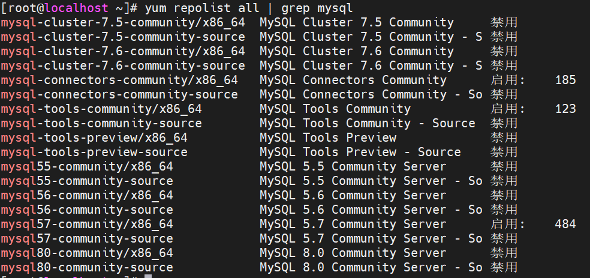
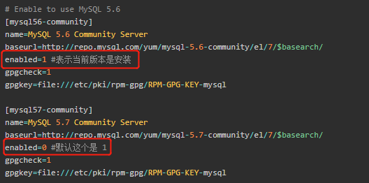
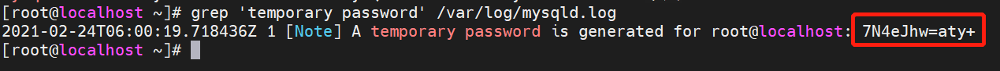

# 使用yum源安装MySQL5.7 CentOS7安装mysql5.7

## 1.配置yum源

### 1.1下载yum源

```shell
wget 'https://dev.mysql.com/get/mysql57-community-release-el7-11.noarch.rpm'
```

### 1.2安装yum源

```shell
rpm -Uvh mysql57-community-release-el7-11.noarch.rpm
```

### 1.3查看mysql版本

```shell
yum repolist all | grep mysql
```



## 2.安装

如果安装5.7.x版本，直接安装即可；如果安装5.6.x版本，需要先修改mysql的repo文件。

### 2.1 安装5.7.x版本

```shell
yum install mysql-community-server
```

### 2.2安装5.6.x版本

修改文件 `/etc/yum.repos.d/mysql-community.repo` ，如下图所示



## 3.启动mysql

```shell
systemctl start mysqld
```


## 4.登录mysql

### 4.1查看mysql初始密码

```shell
grep 'temporary password' /var/log/mysqld.log
```



### 4.2登录

```shell
mysql -uroot -p7N4eJhw=aty+
```

### 4.3 修改密码

```shell
SET PASSWORD = PASSWORD('Tang123456!');
# 设置密码永不过期
ALTER USER 'root'@'localhost' PASSWORD EXPIRE NEVER;
flush privileges;
```

### 4.4设置mysql允许远程访问

```shell
GRANT ALL PRIVILEGES ON *.* TO 'root'@'%' IDENTIFIED BY 'Tang123456!' WITH GRANT OPTION;
flush privileges;
```

