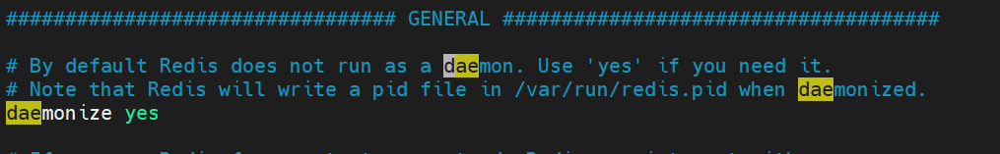

# CentOS7安装redis

# 1.安装gcc

```shell
yum -y install gcc
```

# 2.创建/usr/local/redis文件夹

```shell
mkdir /usr/local/redis
```

# 3.下载redis安装包并解压

```shell
cd /usr/local/redis
wget http://download.redis.io/releases/redis-4.0.6.tar.gz
tar -zxvf redis-4.0.6.tar.gz
```


# 4.开始安装

```shell
cd redis-4.0.6/
make
cd src
make install
```

**如果执行make的时候报错**： `redis编译报致命错误：jemalloc/jemalloc.h：没有那个文件或目录`
，将make命令改为`make MALLOC=libc`

# 5.设置后台启动redis


将`redis-4.0.6/redis.conf`文件中的`daemonize`改为`yes`，如下图



**启动命令为：**

```shell
src/redis-server  redis.conf
```

# 6.设置密码


将`redis-4.0.6/redis.conf`文件中的`requirepass`的注释取消，并设置密码，如下图：


**启动命令为：**

```shell
src/redis-server  redis.conf
```

# 7.设置远程访问

将`redis-4.0.6/redis.conf`文件中的`bind 127.0.0.1`的注释掉，并将`protected-mode`值改为`no`，如下图：


# 8.将redis添加为服务

## 8.1复制redis脚本

将脚本文件 `redis_init_script` 复制到`/etc/rc.d/init.d/`，并改名为`redis`:

```shell
cp utils/redis_init_script /etc/rc.d/init.d/redis
```


## 8.2更改redis脚本

```shell
vim /etc/rc.d/init.d/redis
```


## 8.3复制redis配置文件

```shell
mkdir /etc/redis
cp redis.conf /etc/redis/6379.conf
```

## 8.4注册服务

```shell
chkconfig --add redis
```

## 8.5启动服务

```shell
# 刷新服务单元
systemctl daemon-reload
# 启动redis
systemctl start redis
```

## 8.6可能遇到的问题

使用systemctl start redis启动redis时，可能遇到如下问题:


解决方法：直接删掉`/var/run/redis_6379.pid`即可。

```shell
rm -f /var/run/redis_6379.pid
```

