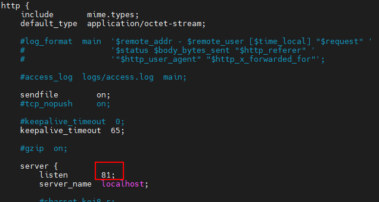

# CentOS7平滑升级nginx
> 准备：

下载并上传`nginx-1.14.2.tar.gz`、`nginx-1.22.0.tar.gz`到`/usr/tth/`路径。

```sh
[root@iZ2zear1vazpz6ydchstjnZ tth]# pwd
/usr/tth
[root@iZ2zear1vazpz6ydchstjnZ tth]# ll
total 2044
-rw-r--r-- 1 root root 1015384 Oct 18 11:13 nginx-1.14.2.tar.gz
-rw-r--r-- 1 root root 1073322 Oct 18 11:13 nginx-1.22.0.tar.gz
```

> 说明

本教程是将nginx从1.14.2版本平滑升级到1.22.0版本。首先介绍1.14.2版本的nginx的安装，然后再进行平滑升级。
如果已有低版本的nginx，可以跳过<span style="background-color: orange;padding: 0 5px;border-radius: 5px;margin: 0 5px">1 安装旧版本nginx</span>部分。

## 1 安装旧版本nginx

### 1.1 解压 nginx-1.14.2.tar.gz

  ```sh
  # 进入/usr/tth/目录
  [root@iZ2zear1vazpz6ydchstjnZ tth]# cd /usr/tth/
  # 解压
  [root@iZ2zear1vazpz6ydchstjnZ tth]# tar zxf nginx-1.14.2.tar.gz
  # 查看解压结果
  [root@iZ2zear1vazpz6ydchstjnZ tth]# ll
  total 2044
  drwxr-xr-x 8 1001 1001     158 Dec  4  2018 nginx-1.14.2 # 新增nginx-1.14.2文件夹
  -rw-r--r-- 1 root root 1015384 Oct 18 11:13 nginx-1.14.2.tar.gz
  -rw-r--r-- 1 root root 1073322 Oct 18 11:13 nginx-1.22.0.tar.gz
  
  ```

### 1.2 准备nginx安装路径

  创建`/usr/local/nginx/1.14.2/`文件夹，作为nginx-1.14.2的安装目录

### 1.3 编译安装

  ```sh
  # 进入/usr/tth/nginx-1.14.2/目录
  [root@iZ2zear1vazpz6ydchstjnZ tth]# cd /usr/tth/nginx-1.14.2/
  
  # 配置nginx
  [root@iZ2zear1vazpz6ydchstjnZ nginx-1.14.2]# ./configure --prefix=/usr/local/nginx/1.14.2
  
  # 编译并安装
  [root@iZ2zear1vazpz6ydchstjnZ nginx-1.14.2]# make && make install
  
  # 查看安装结果
  [root@iZ2zear1vazpz6ydchstjnZ nginx-1.14.2]# ll /usr/local/nginx/1.14.2/
  total 0
  drwxr-xr-x 2 root root 333 Oct 18 15:43 conf
  drwxr-xr-x 2 root root  40 Oct 18 15:43 html
  drwxr-xr-x 2 root root   6 Oct 18 15:43 logs
  drwxr-xr-x 2 root root  19 Oct 18 15:43 sbin
  
  ```

### 1.4 修改nginx端口

  将nginx端口，由80改为81（此步骤可省，用80也行。此处是为了确保在升级时，旧版本的配置仍旧生效）

  ```sh
  vim /usr/local/nginx/1.14.2/conf/nginx.conf
  ```

  

### 1.5 运行

  ```sh
  # 测试配置文件是否正确（输出内容为ok、successful，表示正确。否则需要修改配置文件）
  [root@iZ2zear1vazpz6ydchstjnZ nginx-1.14.2]# /usr/local/nginx/1.14.2/sbin/nginx -t
  nginx: the configuration file /usr/local/nginx/1.14.2/conf/nginx.conf syntax is ok
  nginx: configuration file /usr/local/nginx/1.14.2/conf/nginx.conf test is successful
  
  # 运行
  [root@iZ2zear1vazpz6ydchstjnZ nginx-1.14.2]# /usr/local/nginx/1.14.2/sbin/nginx
  
  # 查看进程
  [root@iZ2zear1vazpz6ydchstjnZ nginx-1.14.2]# ps -ef | grep nginx
  root     2837549       1  0 15:50 ?        00:00:00 nginx: master process /usr/local/nginx/1.14.2/sbin/nginx
  nobody   2837550 2837549  0 15:50 ?        00:00:00 nginx: worker process
  root     2837555 2834706  0 15:52 pts/2    00:00:00 grep --color=auto nginx
  
  #访问测试（访问成功）
  [root@iZ2zear1vazpz6ydchstjnZ nginx-1.14.2]# curl http://localhost:81
  <!DOCTYPE html>
  <html>
  <head>
  <title>Welcome to nginx!</title>
  <style>
      body {
          width: 35em;
          margin: 0 auto;
          font-family: Tahoma, Verdana, Arial, sans-serif;
      }
  </style>
  </head>
  <body>
  <h1>Welcome to nginx!</h1>
  <p>If you see this page, the nginx web server is successfully installed and
  working. Further configuration is required.</p>
  
  <p>For online documentation and support please refer to
  <a href="http://nginx.org/">nginx.org</a>.<br/>
  Commercial support is available at
  <a href="http://nginx.com/">nginx.com</a>.</p>
  
  <p><em>Thank you for using nginx.</em></p>
  </body>
  </html>
  ```

### 1.6 查看nginx版本号

  ```sh
  [root@iZ2zear1vazpz6ydchstjnZ tth]#  /usr/local/nginx/1.14.2/sbin/nginx -v
  nginx version: nginx/1.14.2
  ```

## 2 安装新版本nginx

### 2.1 解压nginx-1.22.0

  ```sh
  # 进入/usr/tth/目录
  [root@iZ2zear1vazpz6ydchstjnZ tth]# cd /usr/tth/
  
  # 解压
  [root@iZ2zear1vazpz6ydchstjnZ tth]# tar zxf nginx-1.22.0.tar.gz
  
  # 查看解压结果
  [root@iZ2zear1vazpz6ydchstjnZ tth]# ll
  total 2044
  drwxr-xr-x 9 1001 1001     186 Oct 18 15:35 nginx-1.14.2
  -rw-r--r-- 1 root root 1015384 Oct 18 11:13 nginx-1.14.2.tar.gz
  drwxr-xr-x 8 1001 1001     158 May 24 07:59 nginx-1.22.0
  -rw-r--r-- 1 root root 1073322 Oct 18 11:13 nginx-1.22.0.tar.gz
  ```

### 2.2 查看旧版本配置

  新版本在执行`./config`命令时，需要用到旧版本的配置参数。

  ```sh
  [root@iZ2zear1vazpz6ydchstjnZ tth]# /usr/local/nginx/1.14.2/sbin/nginx -V
  nginx version: nginx/1.14.2
  built by gcc 8.5.0 20210514 (Red Hat 8.5.0-4) (GCC)
  configure arguments: --prefix=/usr/local/nginx/1.14.2 # 旧版本配置参数
  
  ```

### 2.3 编译

  注意：此处只编译，不安装。执行完`make`命令之后，`/usr/tth/nginx-1.22.0/`会多出一个文件夹

  ```sh
  # 进入/usr/tth/nginx-1.22.0目录
  [root@iZ2zear1vazpz6ydchstjnZ tth]# cd nginx-1.22.0/
  
  # 配置nginx（需要用到上一步中的nginx配置信息）
  [root@iZ2zear1vazpz6ydchstjnZ nginx-1.22.0]# ./configure --prefix=/usr/local/nginx/1.14.2
  # 此时，/usr/tth/nginx-1.22.0路径下会多出objs文件夹
  
  # 编译
  [root@iZ2zear1vazpz6ydchstjnZ nginx-1.22.0]# make
  # 此时/usr/tth/nginx-1.22.0/objs/文件夹下会多出nginx文件，下面会用到
  ```
## 3 升级

### 3.1 备份旧版本，用新版本替换

  ```sh
  # 备份旧版本
  [root@iZ2zear1vazpz6ydchstjnZ nginx-1.22.0]# mv /usr/local/nginx/1.14.2/sbin/nginx /usr/local/nginx/1.14.2/sbin/nginx_1.14.2
  
  # 查看备份结果
  [root@iZ2zear1vazpz6ydchstjnZ nginx-1.22.0]# ll /usr/local/nginx/1.14.2/sbin
  total 4888
  -rwxr-xr-x 1 root root 5001856 Oct 18 15:43 nginx_1.14.2
  
  # 复制新版本nginx到/usr/local/nginx/1.14.2/sbin路径下
  [root@iZ2zear1vazpz6ydchstjnZ nginx-1.22.0]# cp /usr/tth/nginx-1.22.0/objs/nginx /usr/local/nginx/1.14.2/sbin/
  
  # 查看复制结果
  [root@iZ2zear1vazpz6ydchstjnZ nginx-1.22.0]# ll /usr/local/nginx/1.14.2/sbin
  total 9828
  -rwxr-xr-x 1 root root 5056008 Oct 18 16:13 nginx
  -rwxr-xr-x 1 root root 5001856 Oct 18 15:43 nginx_1.14.2
  [root@iZ2zear1vazpz6ydchstjnZ nginx-1.22.0]#
  ```


### 3.2 测试配置文件是否正确

```sh
[root@iZ2zear1vazpz6ydchstjnZ nginx-1.22.0]# /usr/local/nginx/1.14.2/sbin/nginx -t
nginx: the configuration file /usr/local/nginx/1.14.2/conf/nginx.conf syntax is ok
nginx: configuration file /usr/local/nginx/1.14.2/conf/nginx.conf test is successful
```

### 3.3 查看nginx进程

```sh
[root@iZ2zear1vazpz6ydchstjnZ nginx-1.22.0]# ps -ef | grep nginx
root     2837549       1  0 15:50 ?        00:00:00 nginx: master process /usr/local/nginx/1.14.2/sbin/nginx
nobody   2837550 2837549  0 15:50 ?        00:00:00 nginx: worker process
root     2840201 2837586  0 16:17 pts/4    00:00:00 grep --color=auto nginx
```

### 3.4 发送USR2信号

向主进程（master）发送usr2信号，nginx会启动一个新的版本的master进程和对应工作进程，和旧版本一起处理请求。

```sh
[root@iZ2zear1vazpz6ydchstjnZ nginx-1.22.0]# kill -USR2 2837549
```

### 3.5 查看nginx进程

如下，多了两个新的进程，说明USR2信号发送成功。

此时，新旧两个版本的nginx都处于可用状态

```sh
[root@iZ2zear1vazpz6ydchstjnZ nginx-1.22.0]# ps -ef | grep nginx
root     2837549       1  0 15:50 ?        00:00:00 nginx: master process /usr/local/nginx/1.14.2/sbin/nginx # 旧的nginx
nobody   2837550 2837549  0 15:50 ?        00:00:00 nginx: worker process
root     2840202 2837549  0 16:17 ?        00:00:00 nginx: master process /usr/local/nginx/1.14.2/sbin/nginx # 新的nginx
nobody   2840203 2840202  0 16:17 ?        00:00:00 nginx: worker process
root     2840205 2837586  0 16:17 pts/4    00:00:00 grep --color=auto nginx
```

### 3.6 发送WINCH信号

让旧版本的nginx的进程逐步退出。

```sh
# 发送WINCH信号
[root@iZ2zear1vazpz6ydchstjnZ nginx-1.22.0]# kill -WINCH 2837549

# 查看nginx进程
[root@iZ2zear1vazpz6ydchstjnZ nginx-1.22.0]# ps aux |grep nginx
root     2837549  0.0  0.1  34328  2232 ?        Ss   15:50   0:00 nginx: master process /usr/local/nginx/1.14.2/sbin/nginx
root     2840202  0.0  0.1  34436  2940 ?        S    16:17   0:00 nginx: master process /usr/local/nginx/1.14.2/sbin/nginx
nobody   2840203  0.0  0.2  66608  4520 ?        S    16:17   0:00 nginx: worker process
root     2840222  0.0  0.0  12132  1152 pts/4    S+   16:31   0:00 grep --color=auto nginx
```

### 3.7 访问验证

```sh
[root@iZ2zear1vazpz6ydchstjnZ nginx-1.22.0]# curl http://localhost:81
<!DOCTYPE html>
<html>
<head>
<title>Welcome to nginx!</title>
<style>
  body {
      width: 35em;
      margin: 0 auto;
      font-family: Tahoma, Verdana, Arial, sans-serif;
  }
</style>
</head>
<body>
<h1>Welcome to nginx!</h1>
<p>If you see this page, the nginx web server is successfully installed and
working. Further configuration is required.</p>

<p>For online documentation and support please refer to
<a href="http://nginx.org/">nginx.org</a>.<br/>
Commercial support is available at
<a href="http://nginx.com/">nginx.com</a>.</p>

<p><em>Thank you for using nginx.</em></p>
</body>
</html>
```

### 3.8 发送HUP信号（如果需要回滚的话）

注意：此步骤是回滚步骤。如果不需要回滚，直接跳过该步骤

如果这时需要回退继续使用旧版本，可向旧的Nginx主进程发送HUP信号，它会重新启动工作进程，仍使用旧版配置文件。然后可以将新版Nginx进程杀死（使用QUIT、TERM  、或者KILL）

```sh
kill -HUP 2837549
  ```

### 3.9 发送QUIT信号

```sh
# 发送QUIT信号
[root@iZ2zear1vazpz6ydchstjnZ nginx-1.22.0]# kill -QUIT 2837549

# 查看nginx进程（旧版本进程消失）
[root@iZ2zear1vazpz6ydchstjnZ nginx-1.22.0]# ps aux |grep nginx
root     2840202  0.0  0.1  34436  2940 ?        S    16:17   0:00 nginx: master process /usr/local/nginx/1.14.2/sbin/nginx
nobody   2840203  0.0  0.2  66608  4520 ?        S    16:17   0:00 nginx: worker process
root     2840231  0.0  0.0  12132  1124 pts/4    R+   16:38   0:00 grep --color=auto nginx
```

### 3.10 验证nginx版本号，并进行访问测试

```sh
# 查看版本号
[root@iZ2zear1vazpz6ydchstjnZ nginx-1.22.0]# /usr/local/nginx/1.14.2/sbin/nginx -v
nginx version: nginx/1.22.0


# 访问测试
[root@iZ2zear1vazpz6ydchstjnZ nginx-1.22.0]# curl http://localhost:81
<!DOCTYPE html>
<html>
<head>
<title>Welcome to nginx!</title>
<style>
  body {
      width: 35em;
      margin: 0 auto;
      font-family: Tahoma, Verdana, Arial, sans-serif;
  }
</style>
</head>
<body>
<h1>Welcome to nginx!</h1>
<p>If you see this page, the nginx web server is successfully installed and
working. Further configuration is required.</p>

<p>For online documentation and support please refer to
<a href="http://nginx.org/">nginx.org</a>.<br/>
Commercial support is available at
<a href="http://nginx.com/">nginx.com</a>.</p>

<p><em>Thank you for using nginx.</em></p>
</body>
</html>
```