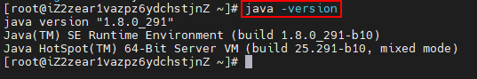
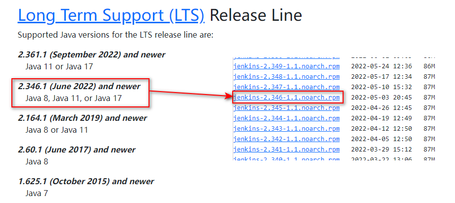
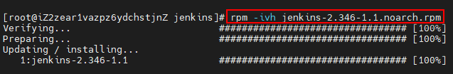
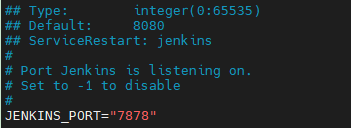
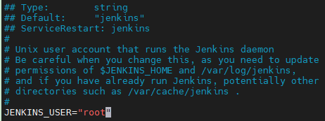
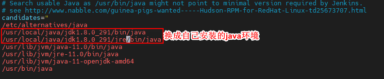

# CentOS7InstallJenkins

## 1 检查jdk是否安装

```shell
java -version
```



未安装的话，需要安装jdk。

## 2 下载安装包

安装jenkins时，需要匹配jdk的版本，可在[Jenkins官网](https://mirrors.jenkins-ci.org/redhat/)中查看。
因为我的jdk版本是1.8，所以我选择`jenkins-2.346-1.1.noarch.rpm`版本。



```shell
# 在usr下新建jenkins文件夹，并进入
cd /usr/jenkins/

# 下载安装包
wget https://mirrors.jenkins-ci.org/redhat/jenkins-2.346-1.1.noarch.rpm

# 更新密钥签名
rpm --import https://pkg.jenkins.io/redhat/jenkins.io-2023.key
```

## 3 安装

```shell

rpm -ivh jenkins-2.346-1.1.noarch.rpm
```



## 4 修改jenkins配置文件

jenkins相关配置都在文件`/etc/sysconfig/jenkins`中

### 4.1 修改jenkins端口

进入`/etc/sysconfig/jenkins`文件中，将`JENKINS_PORT`改为自己想要的即可。

```shell
vim /etc/sysconfig/jenkins
```



### 4.2修改jenkins默认的操作用户

linux下jenkins默认使用`jenkins`用户进行脚本和文件的操作。如果不修改，在部署项目时需要调整涉及到的文件和目录的操作权限。

为避免操作权限不足问题，可以调整jenkins配置文件，将用户修改为root用户。即将`JENKINS_USER="jenkins"`调整为`JENKINS_USER=“root”`。当然也可以忽略此步骤



## 5 配置jdk

```shell
vim /etc/rc.d/init.d/jenkins
```



## 6 运行

```shell
# 重新加载jenkins配置
systemctl daemon-reload

# 启动
systemctl start jenkins

# 停止
systemctl stop jenkins

# 重启
systemctl restart jenkins
```


## 7 打开

在浏览器中输入`ip+端口号`，即可打开jenkins界面。首次登录需要按照页面提示获取登录密码。

[//]: # ( ![1]&#40;..\image\sever-install-jenkins-6.png&#41; )

## 8 jenkin设置

### 8.1 选择安装插件

第一个为默认安装，第二个为手动安装。选择第一个即可。

[//]: # (![]&#40;..\image\sever-install-jenkins-7.png&#41;)

### 8.2设置管理员账号

[//]: # (![1614567062540]&#40;..\image\sever-install-jenkins-8.png&#41;)