# 记一次小程序接口的发布

## 0 前言

本文是记录某个小程序后台接口的部署全过程。

因为小程序需要使用https的域名，所以，本文内容包括域名的申请、域名的解析、免费https证书的申请与配置。

## 1 申请域名

本文是在阿里云申请的域名，具体操作如下：

> Step1. 进入域名注册页面

在阿里云官网搜索“域名”，在弹出框的下拉列表中点击“域名注册”，跳转到域名注册页面。

或者，直接通过网址进入[域名注册](https://wanwang.aliyun.com/domain?spm=5176.28055625.J_3207526240.11.1d01154acqHumI&scm=20140722.S_function@@product@@999997._.ID_function@@product@@999997-RL_%E5%9F%9F%E5%90%8D-LOC_bar-OR_ser-V_2-P0_0)页面。

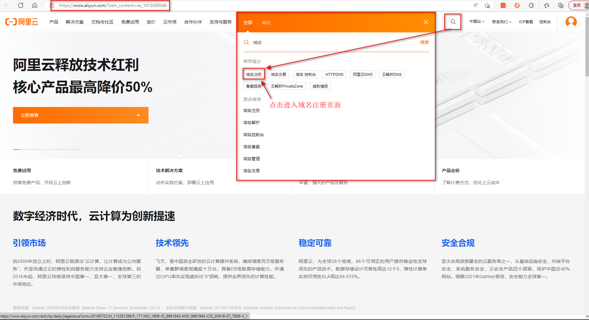

> Step2. 选择域名，进行购买

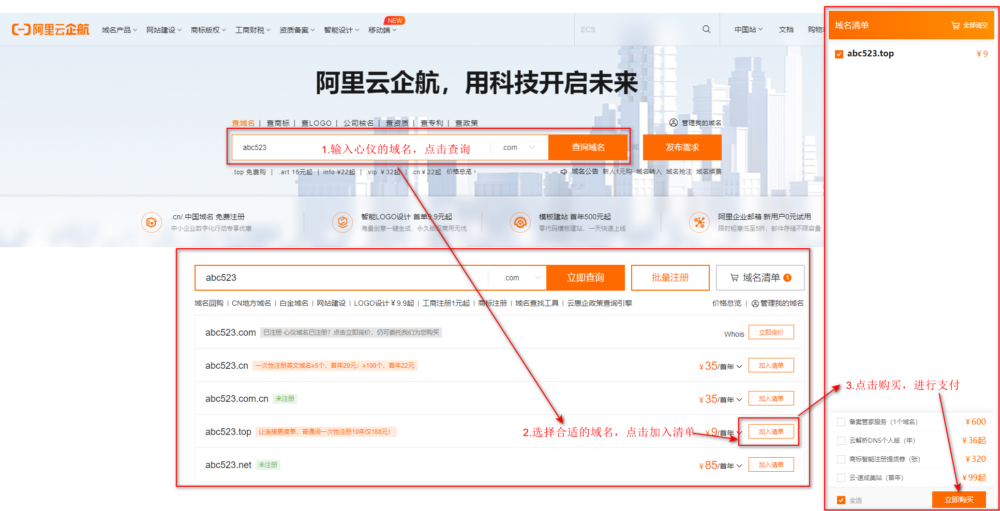

> Step3. 查看已购买的域名

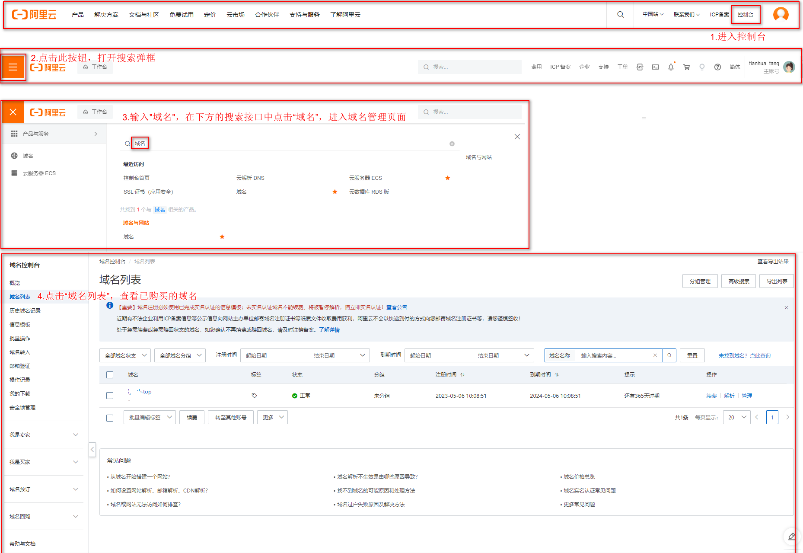

## 2 域名备案

因为我的域名和服务器都是阿里云的，所以在阿里云上备案，备案地址为：[阿里云网站备案](https://beian.aliyun.com/?spm=a2cmq.17630005.icp_beian.1.1fa579feAWYL4C)

具体操作按照按照网页上的表单填写即可。

## 3 域名解析

> Step1. 在域名列表页面，点击“解析”，进入域名解析页面

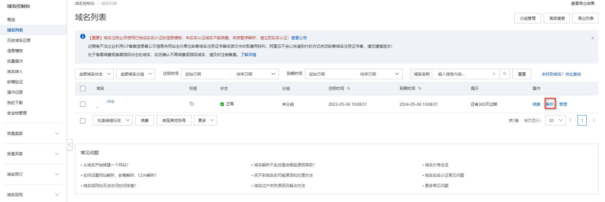

> Step2. 解析域名

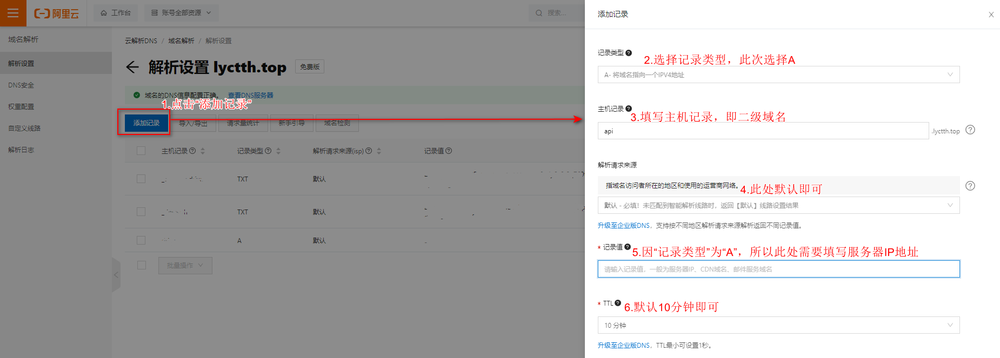

## 4 申请免费https证书

**说明：** 免费证书一般仅用于个人网站或测试使用，不建议业务成熟的企业类型网站使用。

每个经过实名认证的阿里云账号（主账号），在每一个自然年内，可以通过数字证书管理服务的免费证书购买页，免费获取20个DV单域名证书【免费试用】（[参考文档](https://help.aliyun.com/document_detail/205510.html?spm=a2c4g.365559.0.i1)）。

因此，申请免费https证书，需要先申请20个DV单域名证书，然后在“数字证书管理服务”中创建证书、申请证书、下载证书等。

> Step1. 申请DV单域名证书

[申请DV单域名证书链接](https://common-buy.aliyun.com/?spm=a2c4g.205510.0.0.15edae8aJJkb83&commodityCode=cas_dv_public_cn&request=%7B%22product%22%3A%22free_product%22%7D)

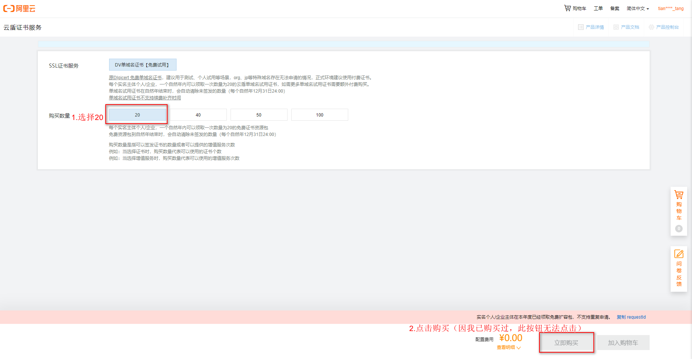

> Step2. 创建证书

在【数字证书管理服务】-【SSL证书】-【免费证书】标签中，创建证书。

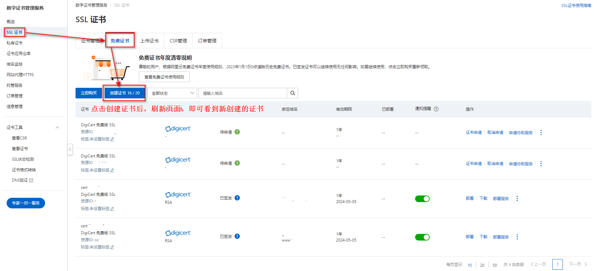

> Step3. 证书申请

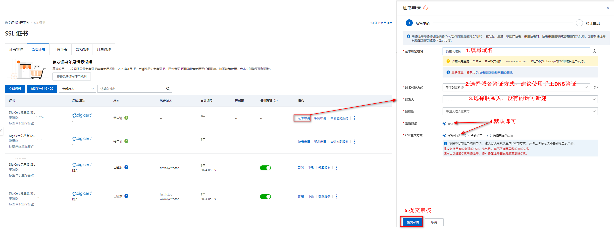

> Step4. 证书审核

官方说，证书审核需要1~2个工作日，但是我申请的两个10分钟之内就通过了，所以可以稍微耐心等待下。审核通过之后会有短信和邮件通知。


## 5 配置https证书

### 5.1 配置Tomcat类型服务器的证书

**说明：** 因为小程序接口是SpringBoot项目，所以尝试配置一次Tomcat类型服务器的证书。

> Step1. 下载Tomcat服务器对应的证书

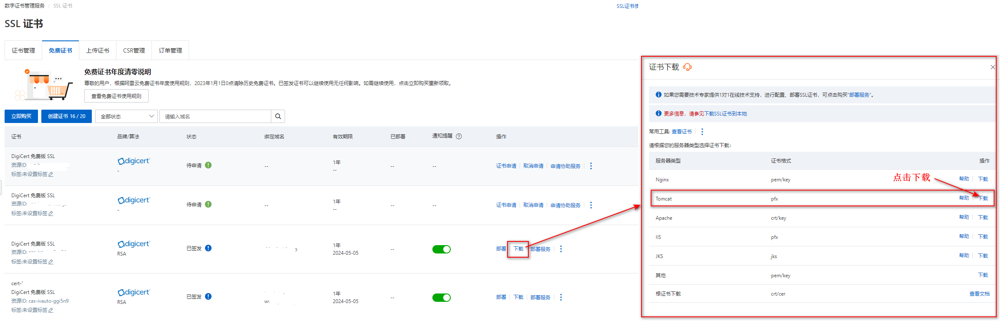

> Step2. 将证书放到项目的resources文件夹下

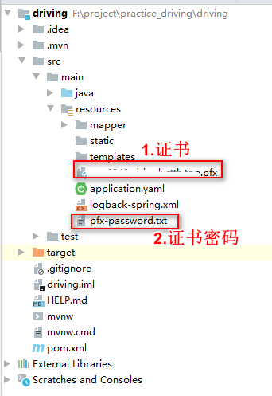

> Step3. 在项目的application.yaml配置文件中，添加如下配置

```yml
server:
  port: 7878 # 项目端口号
  ssl:
    key-alias: alias #证书别名
    key-store-password: 6es4fnd2 #证书密码，可以在pfx-password.txt文件中查看
    key-store-type: PKCS12
    key-store: classpath:<your domain>.pfx # 证书文件
  servlet:
    context-path: /drive
```

**证书别名查看命令**

```sh
# 进入jre\\lib\\security文件夹
cd D:\\soft\\java8\\jre\\lib\\security
# 查看证书别名
keytool -list -v -keystore 证书所在文件夹\\证书名.pfx -storepass 6es4fnd2
```

> Step4. 项目启动与测试

将项目打包，上传至服务器并运行。项目运行成功后，浏览器访问 【 https://域名 】 。如果能有应答，表示https设置完成。

### 5.2 配置nginx类型服务器的证书

> Step1. 下载Nginx服务器对应的证书

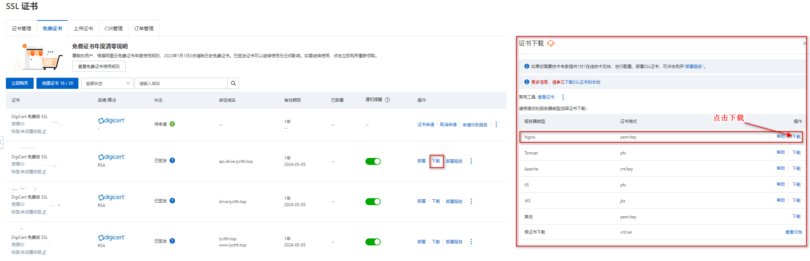

> Step2. 上传nginx证书到服务器

在nginx安装路径下，新建cert文件夹，将nginx证书上传至该文件夹

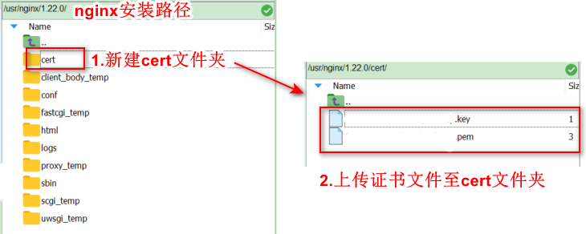

> Step3. 配置nginx

我的nginx版本号是1.22.0。低于1.15.0版本号的，需要将`listen 443 ssl;`替换成`listen 443; ssl on;`。

```conf
server {
        listen       80;
        server_name api.drive.lyctth.top;
        #将所有HTTP请求通过rewrite指令重定向到HTTPS。
        rewrite ^(.*)$ https://$host$1 permanent;
    }

    server {
        listen       443 ssl;
        server_name  api.drive.lyctth.top;

        ssl_certificate  /usr/nginx/1.22.0/cert/证书.pem;
        ssl_certificate_key /usr/nginx/1.22.0/cert/证书.key;

        ssl_session_cache    shared:SSL:1m;
        ssl_session_timeout  5m;

        ssl_ciphers  HIGH:!aNULL:!MD5;
        ssl_prefer_server_ciphers  on;

        location /drive/ {
          proxy_pass http://127.0.0.1:7878/drive/;
          proxy_http_version 1.1;
    			proxy_set_header Upgrade $http_upgrade;
    			proxy_set_header Connection "upgrade";
      }
    }
```

> Step4. 测试

启动nginx，浏览器访问 【 https://域名 】 。如果能有应答，表示https设置完成


## 附：nginx的安装

> Step1. 下载nginx安装包

[nginx下载地址](https://nginx.org/en/download.html)

> Step2. 上传nginx安装包到服务器并解压

```sh
# 解压命令
tar -zxvf nginx-1.22.0.tar.gz
```

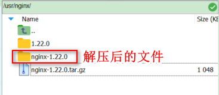

> Step3. 创建文件夹，作为nginx的安装路径

```sh
mkdir /usr/nginx/1.22.0
```

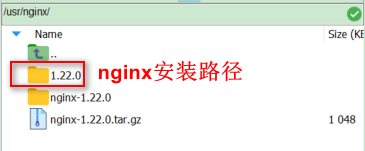

>Step4. 安装

```sh
# 进入/usr/tth/nginx-1.14.2/目录
cd /usr/nginx/nginx-1.22.0/

# 配置nginx
# 注意：一定要加上--with-http_ssl_module选项，否则在配置https时，nginx配置文件校验不通过
./configure --prefix=/usr/nginx/1.22.0 --with-http_ssl_module

# 编译并安装
make && make install
```

>Step5. 查看nginx安装结果

```sh
# 注意：V大写。小写的v只能查看nginx版本号
/usr/nginx/1.22.0/sbin/nginx -V
```

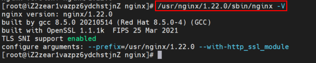

>Step6. 启动nginx，并访问

```sh
/usr/nginx/1.22.0/sbin/nginx
```

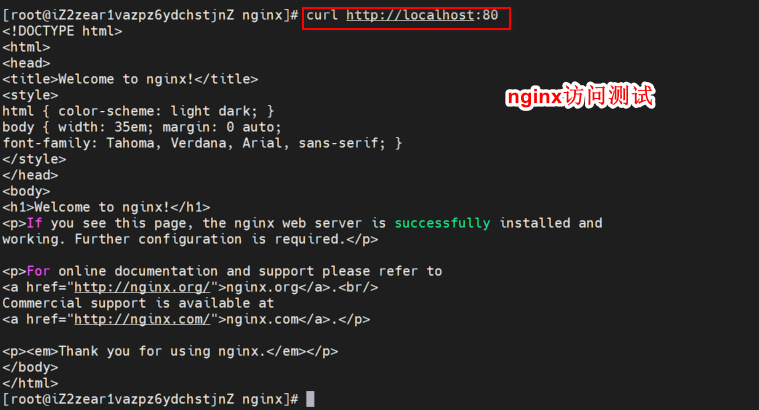


>Step7. nginx常用命令

```sh
# nginx 配置文件修改后，可以使用-t命令校验配置文件是否正确(test is successful说明配置正确)
/usr/nginx/1.22.0/sbin/nginx -t

# 启动nginx
/usr/nginx/1.22.0/sbin/nginx

# 启动nginx时指定配置文件
/usr/nginx/1.22.0/sbin/nginx -c /usr/local/nginx/conf/nginx.conf

# 强制停止nginx
/usr/nginx/1.22.0/sbin/nginx -s stop

# 处理完请求后停止nginx
/usr/nginx/1.22.0/sbin/nginx -s quit

# 重新加载nginx配置文件
/usr/nginx/1.22.0/sbin/nginx -s reload
```
